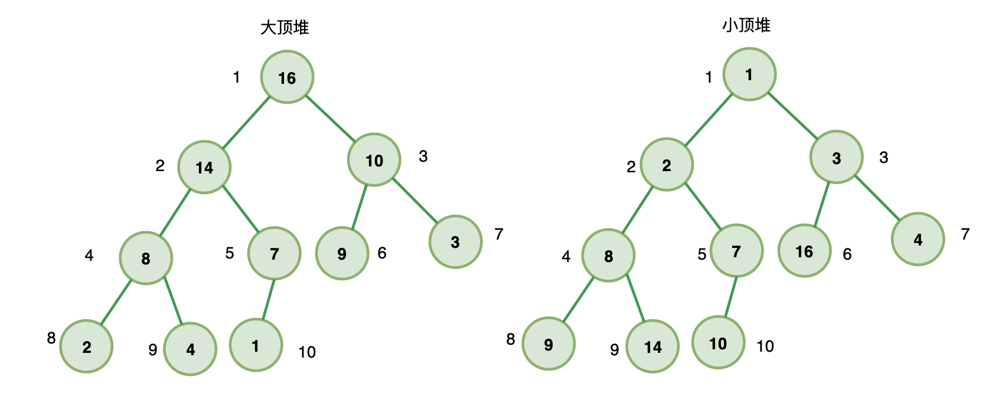

# 堆和堆的经典场景

## 1. 堆

堆是一个可以被看作是**完全二叉树**的特殊**数组**对象，满足以下条件：

1. 堆是一颗完全二叉树
2. 堆上的任意节点都必须 **大于等于（大顶堆）** 或者 **小于等于（小顶堆）** 其左右子节点的值

> 堆到底是树还是数组？
>
> 堆是数组，但是拥有完全二叉树的特性。可以**将堆看作是从上到下、从左到右遍历一颗完全二叉树，将每个节点的值组成的一个数组。**

堆有一个非常重要的特性：

**给定一个节点的下标`i(i从1开始)`，那么它父节点一定为`A[i/2]`，左子节点一定为`A[2*i]`，右子节点一定为`A[2*i+1]`。**




### 1.1 构建堆-堆化

假设有一个数组：

```javascript
const arr = [1, 9, 2, 8, 3, 7, 4, 6, 5]
```

工具方法：

```javascript
const swap = (arr,i,j)=>{
  const temp = arr[i];
  arr[i] = arr[j];
  arr[j] = temp;
}
```

实现代码：

```javascript
const siftUp = (heap,i) => {
  while(true){
    const node = heap[i];
    const parentIndex = (i-1) >>> 1;
    const parent = heap[parentIndex];
    if(node < parent){
      swap(heap, i, parentIndex);
      i = parentIndex;
    }else{
      return;
    }
  }
}

const buildHeap = (arr)=>{
  const len = arr.length;
  for(let i=1; i<len; i++){
    siftUp(arr, i);
  }
  return arr;
}
```

算法的时间复杂度为**O(nlogn)**，最差情况。

### 1.2 堆结构的优势

上面算法中可以看出，将一个普通数组转化成堆是一个时间复杂度不小的操作。但是**堆的优势在于动态新增或者删除堆中的元素时，重组一个新堆的时间复杂度是比较小的，只要`O(logn)`**。因此对于某些**动态修改的数组**求取`top K`是非常有优势的。


## 2. 堆的经典应用场景

堆的经典使用场景有：

1. 堆排序
2. `top k`问题
3. 中位数问题


### 2.1 堆排序

#### 2.1.1 堆排序的实现思路

以从小到大排序为例

1. 先将数组堆化成一个**大顶堆**
2. 将`index===0`位置的元素和`index===n`的元素交换位置，如此最大的元素就已经放到了最后面。
3. 对数组的前`n-1`个元素进行堆化，重复第一步。

#### 2.1.2 代码实现

```javascript
// 从下到上寻找位置插入
const siftUp = (heap,i) => {
  while(true){
    const node = heap[i];
    const parentIndex = (i-1) >>> 1;
    const parent = heap[parentIndex];
    if(node > parent){
      swap(heap, i, parentIndex);
      i = parentIndex;
    }else{
      return;
    }
  }
}

// 从上到下寻找位置插入
const siftDown=(heap,i,lastIndex)=>{
  while(true){
    const leftIndex = (i + 1) * 2 -1;
    const left = heap[leftIndex];
    const rightIndex = leftIndex + 1;
    const right = heap[rightIndex];
    const node = heap[i];
    let newIndex = i;
    if(node < left){
      if(left < right){
        newIndex = rightIndex;
      }else{
        newIndex = leftIndex;
      }
    }else if (node < right){
      newIndex = rightIndex;
    }else{
      return;
    }
    if(newIndex <= lastIndex){
      swap(heap,i,newIndex);
      i = newIndex;
    }else{
      return;
    }
  }
}

const buildHeap = (arr)=>{
  const len = arr.length;
  for(let i=1; i<len; i++){
    siftUp(arr, i);
  }
  return arr;
}

const heapSort=(arr)=>{
  const len = arr.length;
  arr = buildHeap(arr);
  for(let i=len-1; i>=1; i--){
    swap(arr,0,i);
    const lastIndex = i-1;
    lastIndex > 0 && siftDown(arr,0,i-1);
  }
  return arr;
}
```

时间复杂度为`O(nlogn)`，空间复杂度为`O(1)`

> 第二次及以后的堆化过程都是**在前面堆的基础上**，替换某一个元素来进行的，时间复杂度比较理想，只要`O(logn)`.


### 2.2 Top K 问题

#### 2.2.1 实现思路

还是开始的那个数组，求前`K`个最小的数。

1. 获取数组前`K`个元素，组成一个**大顶堆**
2. 从第`K+1`个元素开始遍历，**如果当前元素大于第一个元素，则不做任何处理；如果小于第一个元素，则将两个元素交换位置，回到第一步**。

#### 2.2.2 代码实现

```javascript
const swap = (arr,i,j)=>{
  const temp = arr[i];
  arr[i] = arr[j];
  arr[j] = temp;
}

const arr = [1, 9, 2, 8, 3, 7, 4, 6, 5];

const siftUp = (heap,i) => {
  while(true){
    const node = heap[i];
    const parentIndex = (i-1) >>> 1;
    const parent = heap[parentIndex];
    if(node > parent){
      swap(heap, i, parentIndex);
      i = parentIndex;
    }else{
      return;
    }
  }
}

const siftDown=(heap,i,lastIndex)=>{
  while(true){
    const leftIndex = (i + 1) * 2 -1;
    const left = heap[leftIndex];
    const rightIndex = leftIndex + 1;
    const right = heap[rightIndex];
    const node = heap[i];
    let newIndex = i;
    if(node < left){
      if(left < right){
        newIndex = rightIndex;
      }else{
        newIndex = leftIndex;
      }
    }else if (node < right){
      newIndex = rightIndex;
    }else{
      return;
    }
    if(newIndex <= lastIndex){
      swap(heap,i,newIndex);
      i = newIndex;
    }else{
      return;
    }
  }
}

const buildHeap = (arr,lastIndex)=>{
  const len = arr.length;
  for(let i=1; i<len; i++){
    if(lastIndex >= i){
      siftUp(arr, i);
    }else{
      break;
    }
  }
  return arr;
}

const getTopK=(arr,k)=>{
  const len = arr.length;
  if(k >= len) return arr;
  if(k < 1) return [];
  buildHeap(arr,k-1);
  for(let i=k;i<len;i++){
    const node = arr[i];
    if(node < arr[0]){
      swap(arr,0,i);
      siftDown(arr,0,k-1);
    }
  }
  return arr.slice(0,k);
}
```

