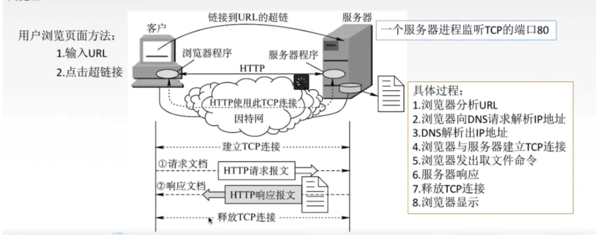
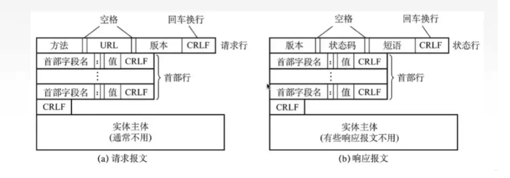

# 谈谈http协议

http协议是一种**应用层**的协议。

在浏览器中，浏览器就是使用http或者https协议来向服务端请求资源，然后拿到返回的资源展示在页面上。

## 1. 浏览器使用http协议向服务端请求数据的过程

## 2. http请求和响应报文的组成

### 2.1 http请求报文的组成

1. url：表示资源在服务器中的位置
2. method：表示请求这个资源的方法
3. requestHeader：表示请求的头部信息，定义当前请求的一些特性
4. requestBody：表示请求的内容，需要传给服务器的内容，由服务器接收处理

### 2.2 http响应报文的组成

1. 状态码：表示当前请求处理之后的状态，有可能成功，有可能失败，是一个三位数字
2. 状态短语：用语言的方式描述当前的状态码
3. responseHeader：表示该请求响应的头部信息，定义当前响应的一些特性
4. responseBody：表示服务端响应的数据

### 2.3 http报文的头部分析

http协议是面向文本的，因此在报文中的每一个字段都是一个ASCll码串

http报文中的头部分成：请求头部和响应头部

## 参考文章

1. [前端需要了解的计算机网络知识， 这一篇就够了](https://juejin.im/post/5e51febde51d4526c932b390?utm_source=gold_browser_extension#heading-51)

