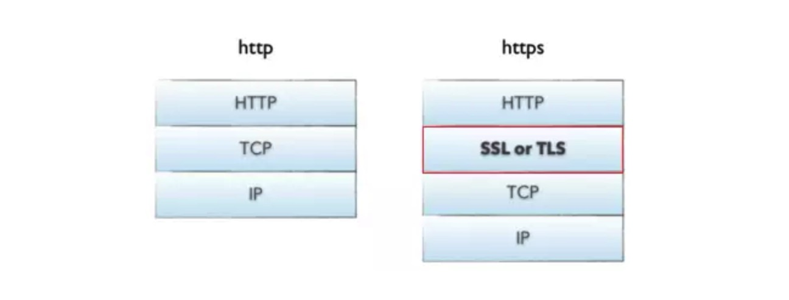

# http与https之间的对比

https = http + 加密 + 认证 + 完整性保护

**http协议中采用的是明文传输，存在信心窃听、信息劫持修改的风险。https协议就是为了解决http协议中的不安全传输的问题。**

## 1. https协议

https协议一种应用层的安全传输协议，它的内部实现中，==在http协议的基础上，增加一层TLS/SSL协议来加密和解密数据，来解决http协议明文传输的风险。==

https协议的主要作用：

1. **对数据进行加密**，并建立一个信息安全通道，来保证传输过程中的数据安全
2. **对网站服务器进行真实身份认证**

### 2.1 http 和https之间的不同

由上面的图可以看出，https比https协议的经历了一个TLS/SSL协议，来对数据进行加密

## 2. TLS / SSL协议

**TLS/SSL协议全称是安全传输层协议，是一种在应用层之下，在传输层之上的一层安全协议。用来对象https传输的数据进行加密和解密。**

在协议中，存在两种加密算法：

1. 对称加密
2. 非对称加密

### 2.1 对称加密

**相同的秘钥可以用于信息的加密和解密，服务端和客户端应该都要知道这个秘钥才能在需要的时候进行信息的加密和解密**

如何让两端都知道这个秘钥呢？

如果通过网络传输数据的方式，是容易被拦截的，也就是说加密是没有意义的

### 2.2 非对称加密

**有公钥和私钥之分，公钥用来加密数据，私钥用来解密数据。私钥只有分发公钥的一方才知道**

之前的对称加密中，有一个秘钥传输的问题，这个问题可以使用非对称加密来解决。

**假设两端都要使用对称加密，可以使用非对称加密的方式来传输秘钥。**

1. 首先**服务端使用非对称加密**，生成一对公钥和私钥。服务端将公钥传递给客户端
2. **客户端使用对称加密算法**，生成一个秘钥，然后将秘钥使用公钥加密之后，传递给服务端
3. 然后服务端就可以使用私钥来解密，得到对称加密的秘钥，然后就可以使用秘钥来加密解密数据。

## 参考问斩

1. [HTTP 及 TLS](https://juejin.im/book/5bdc715fe51d454e755f75ef/section/5bdc72abe51d45051c44add3)

2. [HTTP和HTTPS详解](https://juejin.im/post/5af557a3f265da0b9265a498#heading-28)

