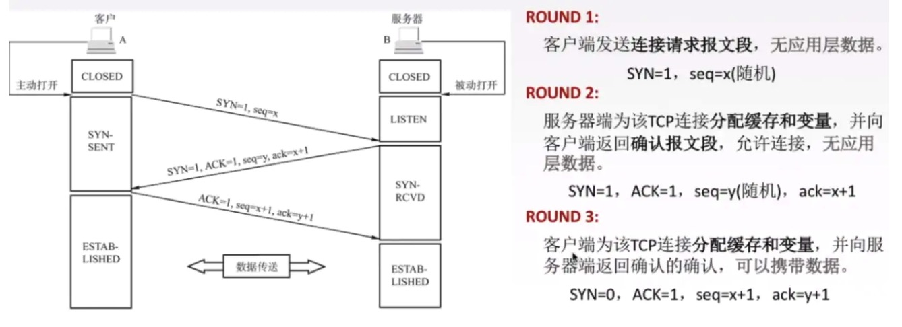

# 谈谈TCP协议

## 1. OSI七层模型

OSI是国际上定义的网络互连的七层模型。通俗来讲数据从一段传到另一端的时候，需要经过这七层模型来进行转换和传输。

七层模型：

自下而上划分：

- 1，2，3层主要是由物理链路组成，负责数据的传递。比如光纤、路由器
- 5，6，7层是软件控制的，可以统称为应用层，负责数据的处理。比如http协议，就是一个应用层的协议，用来处理数据
- 第4层是传输层，是只有计算机才有的层次。主要负责进程之前的逻辑通信和数据传输。**TCP协议就是传输层中的协议**

## 2. TCP协议

TCP协议是一种位于传输层的，**面向连接的、可靠的、基于字节流的通信协议**。应用层的数据传输到传输层的时候，会建立一个TCP连接。并且会将应用层传来的数据进行加工，变成字节流的形式发送。类似于node中的buffer

### 2.1 TCP报文的格式

- TCP报文的头部固定20个字节

- TCP报文是一段一段的传输的，称为报文段

- 源端口指的是发送方应用程序的端口，目的端口指的是接收方应用程序的端口

- 一个TCP连接中传送的字节流中每个字节都按照顺序编号，**这里的序号字段表示的是本报文段中发送数据的第一个字节的序号**

- **确认号**指的是期望下一个报文段中第一个数据字节的序号。若确认号为n，这表示之前的n-1的数据都已经接收到了

- 数据偏移指的是TCP报文段的数据起始处距离TCP报文段的起始处有多远

- 6个控制位

  | 控制位 | 作用                                                         |
  | ------ | ------------------------------------------------------------ |
  | ACK    | 置1时表示确认号合法，为0的时候表示数据段不包含确认信息，确认号被忽略 |
  | PSH    | 置1时请求的数据段在接收方得到后就可直接送到应用程序，而不必等到缓冲区满时才传送 |
  | RST    | 置1时重建连接。如果接收到RST位时候，通常发生了某些错         |
  | SYN    | 置1时用来发起一个连接                                        |
  | FIN    | 置1时表示发端完成发送任务。用来释放连接，表明发送方已经没有数据发送了 |
  | URG    | 紧急指针，告诉接收TCP模块紧要指针域指着紧要数据              |

### 2.2 三次握手

在建立TCP连接的时候，客户端和服务端会有三次通信过程，简称为“三次握手”

- 首先是客户端发送一个数据包告诉服务器需要建立tcp连接，根据上面控制位信息可以看出，**建立连接需要设置`SYN=1`，seq是一个随机产生的序号。然后客户端变成 `SYN-SENT` 状态**
- 服务端在接收到客户端的连接请求之后，会为TCP连接**分配缓存和变量**，缓存指的是一个字节流队列。（发送方和接收方都有这个队列，而且如果双方需要互相通信，那么双方都会有发送缓存和接收缓存）然后会返回一个确认报文到客户端，其中`SYN = 1`表示的是允许建立连接；`ACK=1`表示确认收到了发送方的包；seq也表示一个随机产生的序号；**小写的ack表示确认号，也就是接下来期望接收到的报文序号**。此时服务端变成了`SYN-RCVD`状态
- 客户端在接收到服务端的确认报文之后，也会发送一个确认报文到服务端，表示自己接收到了确认报文。其中`SYN = 0` 表示这个不是建立连接的请求；`ACK=1`表示接收到了服务端的确认请求；**`seq=x=1`表示这个数据包的序号，要和之前的ack保持一致**；`ack = y+1`表示期望服务端返回数据的序号。**客户端在发送出确认报文之后就进入`ESTABLISHED`的状态，服务端在接收到客户端的确认报文之后，也会变成`ESTABLISHED`状态，然后就可以开始传递数据**

#### 2.2.1 为什么需要三次握手，能不能改成两次？

TCP协议是一个全双工的协议，客户端和服务端都是可以传递数据和接收数据的。也就是说服务端和客户端在建立连接的时候，**客户端和服务端都要确认对方同时具有发送数据和接收数据的能力。**

- 第一次握手：客户端发到服务端，服务端接收到数据，**表明客户端具有发送数据的能力**
- 第二次握手：服务端到客户端，客户端接收到确认信息，**表明服务端有发送和接收数据的能力**
- 第三次握手：客户端到服务端，**表示客户端有接收数据的能力**

**如果改成两次握手的话，会导致服务端无法确认客户端有没有接收数据的能力**。如此会导致一些异常情况

1. 如果采用两次握手，客户端发送一次请求之后，服务端就会变成`ESTABLISHED`状态，并且会分配相应的资源。如果某一个连接请求由于网络堵塞的原因迟迟到不了服务端，客户端就会启动超时重传，然后建立连接开始通信，完成之后释放连接。**但是某一个时刻，那个被延时的连接请求到了服务端，由于两次握手的关系，服务端会变成`ESTABLISHED`状态，但是客户端一直是`CLOSED`状态，所以会导致服务端资源的浪费**
2. 客户端和服务端的三次握手中，后面两次会带有确认号，**如果没有第三次握手，相当于客户端没有对服务端数据段的起始序号做确认，不能保证服务端到客户端数据的可靠性**

#### 2.2.2 建立TCP连接之后，如果客户端突然出现故障怎么办？内部是如何处理的

TCP内部有一个**保活计数器**，每次客户端发送请求数据到服务端的时候，都会重置这个计数器。如果2小时内没有收到客户端任何数据时，会每隔75s向客户端发送一个探测报文，若连续发10个探测报文，客户端还是没有反应，则认为客户端故障，关闭连接。

#### 2.2.3 什么是SYN洪泛攻击（SYN FLOOD）

SYN FLOOD利用的就是TCP连接的三次握手

- **攻击者发送TCP连接的第一个握手的请求，也就是SYN。当服务端返回ACK确认的时候，攻击者并不接收和处理，如此这个TCP连接就会处于半连接状态，服务器接收不到确认消息，就会重复发送ACK给攻击者，这样会浪费服务器的资源**
- 如果攻击者发送大量的SYN到服务端，每一个连接都无法完成三次握手，都处于半连接的状态，会导致大量的内部和CPU消耗，设置会导致服务器崩溃

#### 2.2.4 第一次握手可以带真实数据吗？

是不可以的。因为如果第一次可以带数据过去，则服务端需要接收这个数据并保存起来，需要占用一定的空间。如果攻击者发动**SYN FLOOD**攻击时携带大量的真实数据，那么势必会造成服务器资源的严重消耗，会使服务器崩溃提前。

但是**在第三次握手是可以携带真实数据的**。因为此时客户端已经处于`ESTABLISHED`状态，而且服务端的接收和发送能力都是正常的，所以是可以提前携带真实数据过去的。

### 2.3 四次挥手

在断开TCP连接的时候，客户端和服务端会发生4次通信，简称“四次挥手”

- 客户端确认没有数据需要发送的时候，会向服务端发送一个关闭TCP连接的请求。`FIN = 1`表示需要释放连接，seq=u表示的是最后一次从服务端发送过来的确认号是u。此时客户端处于`FINWAIT-1`的状态
- 服务端在接收到客户端的关闭请求之后，返回确认信息。`ACK = 1 seq = v ack=u+1` ，客户端在接收到这个确认数据包之后，会进入`FINWAIT-2`的状态，**只能接收数据，不能发送数据，这个期间如果服务端还有数据要发到客户端，还是可以正常发送的**。服务端进入`CLOSEWAIT`状态。这个的seq=v，v的取值取决于上一次客户端发送服务端的确认号是多少。
- 当服务端也没有可以传的信息之后，会发送一个请求结束的报文给客户端。`FIN=1 ACK =1 seq=w ack =u+1`，这里的w和上一次中的v是一个意思，**但是为什么不都是v呢？因为这一步和上一步之间有可能服务端还在往客户端发数据，所以seq是有可能发生改变的**。服务端发送出这个数据包之后变成`LASTACK`状态
- 客户端在接收到服务端的结束报文之后，会返回一个确认报文。`ACK=1 seq = u+1 ack = w+1`，发送之后客户端进入`TIMEWAIT`状态，**等待2MSL之后关闭客户端**。服务端在接收到确认报文的时候，就会进入CLOSE状态

#### 2.3.1 为什么客户端之后需要再等待2MSL的时间才关闭？

因为客户端最后一个确认报文是有可能丢失的，如果服务器在一段时间内没有接收到这个报文，服务器就是超时重传上面的FIN关闭报文。然后客户端接收到之后再次发一个ACK确认报文来关闭。

**如果没有等待2MSL，那么服务器重传的消息就不会被客户端接收到，就会导致服务器接收不到客户端的确认消息而无法正常关闭。**

#### 2.3.2 为什么关闭时需要4次挥手，而不是像连接时那样3次挥手？

**因为服务端在接收到客户端的关闭请求之后，返回确认报文的时候，无法向客户端同时发起关闭的请求。因为此时服务端的数据有可能没有发送完成。所以将服务端的确认报文和请求关闭报文分开了两次发送**，这一点和连接的时候相反，所以会多一次。

### 2.4 TCP协议如何保证传输可靠性

1. 序号：在TCP的报文格式中，有一个序号字段。这个序号字段可以保证数据有序的传输在应用层
2. 确认号：在发送方收到接收方的确认包之后，才能开始下一次的传递。而且确认包中还包含一个**确认号字段**，用来规定下一次数据包的序号，防止序号错乱
3. 超时重传：**TCP的发送方在一定时间内没有接收到确认就会重新发送这个报文段**，也就是超时重传的机制。超时的时间是动态设定的，根据的是RTTS(加权平均往返时间)

### 2.5 TCP的流量控制 - 接收方的控制

由于TCP协议中为了保证传输的可靠性，每次收到确认包之后才能发送下一个包。但是这种方式是**比较低效**的，吞吐量比较小

#### 2.5.1 如何提高吞吐量

如上图所示，可以采用**多个包一起发送和一起确认的方式**来提高传输的吞吐量。但是这种方式也存在一个问题，就是如果发送方的速度非常快，但是接受方接受的速度非常慢，这种情况下就会导致严重的**丢包**情况。

TCP内部采用滑动窗口的机制来优化这个问题，实现流量的控制

#### 2.5.2 滑动窗口的优化

**滑动窗口中的窗口指的是接收方用来接收数据的缓存区域。发送方可以根据窗口剩余空间的大小来判断下一次能够发送包的个数。**

上面提高吞吐量的方法中，存在可以优化的点。

当包1和2发送过去之后，上面方法中需要等到确认包1和2都拿到之后才能发送后面的包。但是实际上确认包的接收也是有时间差异的，所以**可以在确认包1回来之后，发送包3过去。而不是等到确认包2也回来之后再发**。如此边形成了“滑动窗口”的效果。

在窗口有剩余空间时，也就是接收方缓存区域有空位时，才继续发下一个数据包。

**滑动串口中的丢包情况**

上图中可以可以看出，包5的ACK包一直没有返回，所以会一直等待下去，**如果滑动窗口还有空间，还是会发送新的包。一旦滑动窗口没有其他空间的时候，就不会再发新的包了。**可以有效的控制流量，减少包的丢失。

**确认包的是按照顺序返回的，也就是说，上图中必须等待包5的确认包发送回去才会发送后面的确认包，如此才能够是窗口慢慢滑动**。这其中有可能会有超时重传发生。

> 也就是说，TCP协议本身就存在**对头阻塞**

### 2.6 TCP的拥塞控制 - 发送方的控制

#### 2.6.1 如何判断网络出现拥塞

**当某一个包发送之后，没有及时的返回确认包，从而触发了超时重传的机制。这是内部就会认为出现了网络拥塞**，从而需要控制发送方发包的速率。

#### 2.6.2 TCP中提供了四个算法来控制拥塞

首先来了解一下几个状态值

1. 拥塞窗口(cwnd)：表示的是**当前传输轮次发送方一次可以发送多少个报文段**。
2. 慢开始门限(ssthresh)：表示的是**由慢开始算法转化为拥塞避免算法的阈值**。当小于这个阈值的时候，采用慢开始算法，大于的时候采用拥塞避免算法

**慢开始算法和拥塞避免算法**：

1. 慢开始算法：最开始cwnd=1，发送方只能发一个报文段，当前接收到确认报文的时候，会将**cwmd*2**，因此后面能发送的报文段个数为：2，4，8，16...。拥塞窗口的大小指数增加
2. 拥塞避免算法：当cwnd增加到大于或者等于慢开始门限的时候，会开始采用拥塞避免算法，**每次cwnd只增加1**

当出现超时重传的时候，即出现了拥塞情况，会使 `ssthresh = cwnd/2 cwnd = 1`，然后开始下一轮的慢开始算法。

但是**使用是否出现超时重传判断是否出现拥塞是不准确的，有一些情况下并不是因为拥塞才出现丢包现象**。所以TCP后面采用了快重传和快恢复来优化着各种情况

**快重传和快恢复**

3. 快重传：在发生丢包的情况的时候，比如接收方在接收到M1,M2之后收到的是M4，然后会**判断是没有按照顺序的，于是会发送M2的确认报文回去**。**如果在发送方连续接到三个M2的确认包，就判断M3包发生了丢失，就会重传M3包。而不会等待超时触发超时重传**。
4. 快恢复：在执行快重传之后，立马执行快恢复，**`ssthresh = cwnd/2; cwnd = ssthresh`**，然后后面就开始执行**拥塞避免**算法

#### 2.6.3 完整的拥塞控制过程

## 3. 参考文章

1. [前端需要了解的计算机网络知识， 这一篇就够了！(图文并茂，万字长文，点赞收藏哦！)](https://juejin.im/post/5e51febde51d4526c932b390?utm_source=gold_browser_extension#heading-39)
2. [一篇带你读懂TCP之“滑动窗口”协议](https://juejin.im/post/5c9f1dd651882567b4339bce)
3. [计算机网络微课堂第069讲 TCP的拥塞控制](https://www.bilibili.com/video/av83688722?from=search&seid=15487015846130335760)

