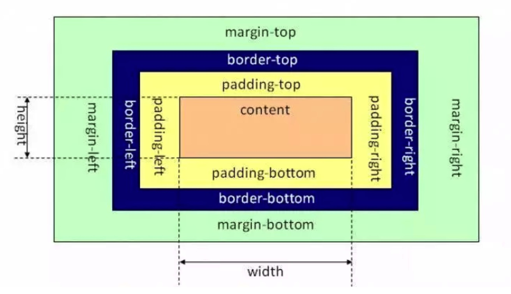
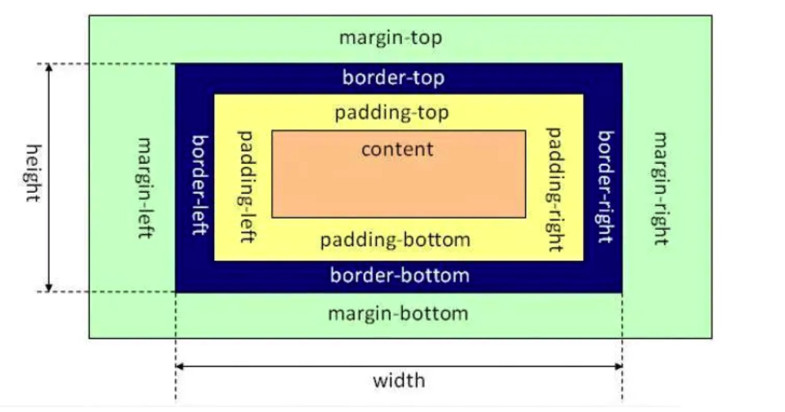

## CSS盒模型
**在对文档元素进行布局的时候，渲染引擎会将每个元素都渲染成一个矩形盒子**，由CSS来决定盒子的大小、位置等等这些属性。

### CSS盒子的组成

从图中可以看出，CSS盒子有4个部分组成：
1. Content
2. Padding
3. Border
4. Margin

### CSS盒模型的类型
盒模型可以分成两个类型：
1. W3C标准盒模型
2. IE标准盒模型

**现代的大多数浏览器采用的都是W3C盒模型，只有IE浏览器采用的是IE盒模型。**

**怪异模式下，可能会导致元素使用IE盒模型来解析。当html文件中不声明doctype的时候，会产生怪异模式。**

### W3C盒模型 VS IE盒模型
在默认情况下，也就是**不设置box-sizing属性的时候**。

#### W3C盒模型

由图中看出，W3C盒模型的特点
1. width = content width
2. height = content height

#### IE盒模型

由图中看出，IE盒模型的特点
1. width = border width + padding width + content width
2. height = border height + padding height + content height

### box-sizing属性
这个属性**定义了渲染引擎如何来计算一个元素的总宽度和总高度**。
1. **content-box** : w3c盒模型的默认值，width和height属性表示的只是盒模型中content区域的宽高。盒子的总宽高还需要加上padding、border和margin。
2. **border-box** : IE盒模型的默认值，width和height属性表示的是盒模型中border+padding+content区域的值。盒子的总宽高加上margin就好。

在现实使用中，可以通过定义 box-sizing 来改变盒模型的类型。

### 参考文章
1.  [CSS中的盒模型分类](https://blog.csdn.net/jingtian678/article/details/75452444)

