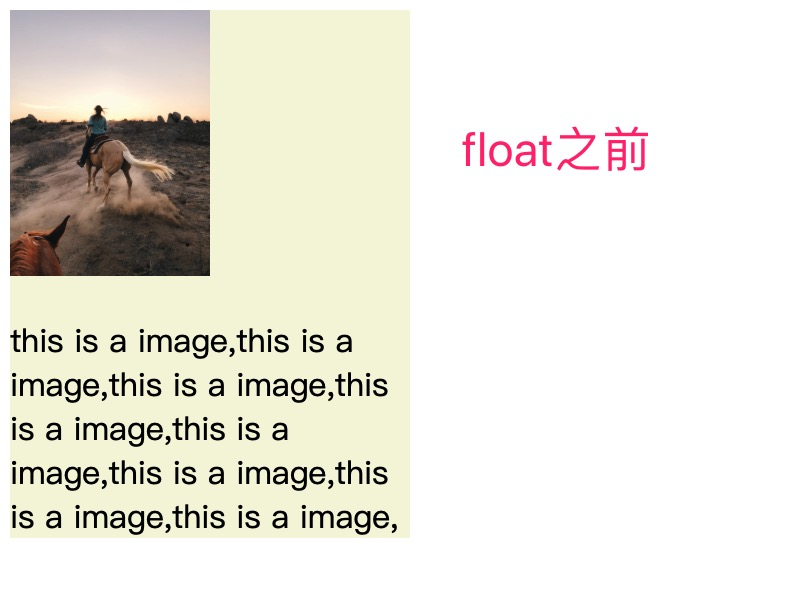

## float布局详细分析
### float布局的特点
1. 文字环绕
2. 包裹性
3. 破坏性

### 1.文字环绕
文字环绕效果是只有float布局才能够实现的一种特殊的布局样式。看下图


```html
<div style="width: 200px;background-color: beige;">
  
  <p>this is a image,this is a image,this is a image,this is a image,this is a image,this is a image,this is a image,this is a image,</p>
</div>
```


```html
<div style="width: 200px;background-color: beige;">
  
  <p>this is a image,this is a image,this is a image,this is a image,this is a image,this is a image,this is a image,this is a image,</p>
</div>
```
float布局之所以能实现这种特殊的布局样式，就是因为float布局的不完全脱离文档流。

#### 不完全脱离文档流
元素被设置成float的时候，这个元素看起来脱离文档流，不在当前文档流占据位置，**别的元素在布局的时候会无视这个元素。但是其他元素中的文本依然会为它让出位置**，形成一个文字环绕的特殊样式。

`position:absolute`的元素是真正的脱离了文档流。


```html
<div style="width: 200px;background-color: beige;">
  
  <p>
    <div style="width: 20px;height: 20px;background-color: chartreuse;"></div>
    this is a image,this is a image,this is a image,this is a image,this is a image,this is a image,this is a image,this is a image,</p>
</div>
```

### 2.包裹性
**当一个元素被设置成float的时候，不管是块级元素还是行内元素，都会自动加上一个块级框，在表现上和块级行内元素（inline-block）一样的。**

默认由内容撑开，左右水平排列，可以设置宽高

#### 设置float之前


```html
<div style="background-color: aqua;">
  this is a box
</div>
<span style="background-color:bisque;width: 200px">
  this is a span
</span>
```

#### 设置float


```html
<div style="background-color: aqua;float:left;width:200px">
  this is a box
</div>
<span style="background-color:bisque;width: 200px;float:left">
  this is a span
</span>
```

### 3.破坏性
float元素破坏性的原因是因为float元素不在文档流中占据位置，会导致父元素高度塌陷。

#### 高度塌陷


```html
<div style="background-color:cadetblue;">
  <div>this is a float box</div>
  <div>this is a float box</div>
</div>
```


```html
<div style="background-color:cadetblue;">
  <div style="float:left">this is a float box</div>
  <div style="float:left">this is a float box</div>
</div>
```

#### 清除浮动
为了解决高度塌陷的问题，需要清除浮动，使得父元素占据应有的高度。

从清除浮动的原理上可以分成两类：
1. 使用 clear 属性清除
2. 使用 BFC 原理来清除浮动

清除浮动之后的效果


##### 1.clear属性——添加空白元素
```hmtl
<div style="background-color:cadetblue;">
  <div style="float:left">this is a float box</div>
  <div style="float:left">this is a float box</div>
  <div style="clear:both"></div>
</div>
```

##### 2.clear属性——使用伪类
```html
<div style="background-color:cadetblue;" class="clear">
  <div style="float:left">this is a float box</div>
  <div style="float:left">this is a float box</div>
</div>

//css
.clear:after{
  content:"";
  display:block;
  height: 0px;
  visibility: hidden;
  clear:both;
}
```

##### 3.BFC——BFC容器的高度会包含float子元素的高度
父元素设置overflow: hidden可以新建一个BFC。BFC的详细内容后面文章有说明
```html
<div style="background-color:cadetblue;overflow: hidden;">
  <div style="float:left">this is a float box</div>
  <div style="float:left">this is a float box</div>
</div>
```

### 参考文章
1. [完全理解float之“不完全脱离文档流”](https://blog.csdn.net/qq_22855325/article/details/78015502)


