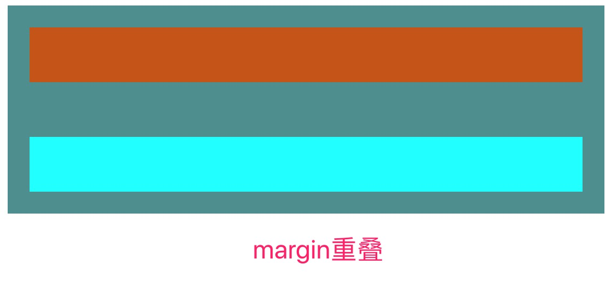
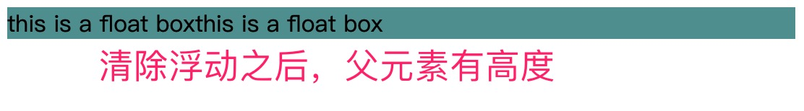
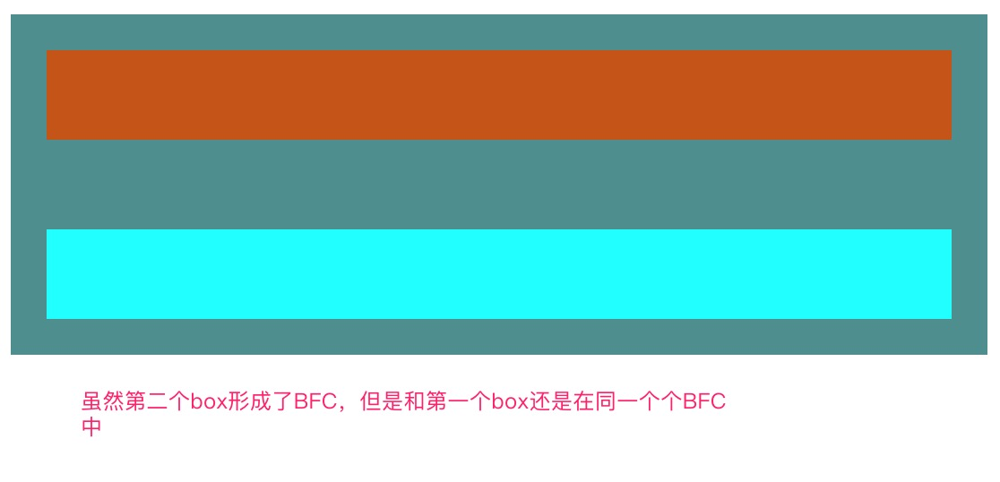
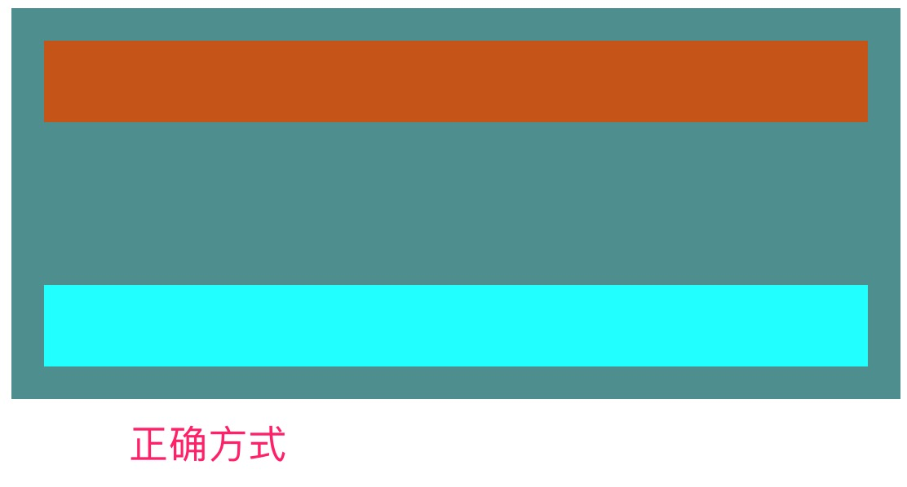

## 块级格式化上下文（BFC）是什么？有什么作用？
### BFC的定义
BFC(Block Formatting Context) —— 块级格式化上下文，是**页面中的一个独立的渲染区域，并且定义了内部Block-level box的布局规则。BFC内部元素的布局和外面的元素无关，是一块独立的布局区域**。

**BFC规定的规则是针对内部的Block-level box，对于Inline-level box是无效的**。

FC(Formatting Context) —— **格式化上下文，也页面渲染区域的单位，是页面中一个独立的渲染区域和布局区域。定义了内部子元素的布局规则。**按照子元素的类型的不同，可以分为BFC，IFC（行级格式化上下文）,FFC（自适应格式化上下文），GFC（网格布局格式化上下文）

### 触发BFC的条件（条件很多，只列举常用的）
1. 根元素，即html元素
2. overflow不为visible
3. float不为none
4. position属性为absolute或fixed
5. display为inline-block、table-cell、table-aption
6. 弹性元素（display:flex），网格元素(display:grid)

### BFC定义的规则
1. BFC是页面布局中的一个独立区域，内部元素的布局不会影响到外部元素，反之亦然。
2. 内部的Block-level box会在垂直方向上一个一个放置。
3. 属于同一个BFC中的两个相邻的box的margin会发生重叠
4. BFC内部的子元素不会超过它的包含块
5. BFC的区域不会和float区域发生重叠
6. BFC区域在计算高度的时候，会包含其中的float元素的高度




### BFC规则的运用
#### 1.清除浮动 —— 运用第六条规则
```html
<div style="background-color:cadetblue;overflow: hidden;">
  <div style="float:left">this is a float box</div>
  <div style="float:left">this is a float box</div>
</div>
```



#### 2.避免margin重叠 —— 运用第1和3条规则
margin重叠的情况可以参考[MDN](https://developer.mozilla.org/zh-CN/docs/Web/CSS/CSS_Box_Model/Mastering_margin_collapsing)
避免产生margin重叠可以使两个box不属于同一个BFC,分别属于两个BFC

##### 错误方式

```html
<div style="background-color:cadetblue;overflow: hidden;padding: 20px">
  <div style="height:50px;margin-bottom:50px;background-color: chocolate"></div>
  <div style="height:50px;margin-top:50px;background-color:cyan;overflow: hidden;"></div>
</div>
```

##### 正确方式


```html
<div style="background-color:cadetblue;overflow: hidden;padding: 20px">
  <div style="height:50px;margin-bottom:50px;background-color: chocolate"></div>
  <div style="overflow: hidden;">
    <div style="height:50px;margin-top:50px;background-color:cyan;"></div>
  </div>
</div>
```

#### 3.两栏自使用布局 —— 运用第5条规则
在实际工作中，两栏自适应布局会经常使用到，这里可以使用BFC来轻松达到想要的效果


```html
<body>
  <div style="background-color:cyan;width:150px;height:100%;float:left"></div>
  <div style="background-color:darkgoldenrod;height:100%;overflow:hidden"></div>
</body>
```

### 参考文章
1. [[布局概念] 关于CSS-BFC深入理解](https://juejin.im/post/5909db2fda2f60005d2093db)
2. [MDN](https://developer.mozilla.org/zh-CN/docs/Web/Guide/CSS/Block_formatting_context)


