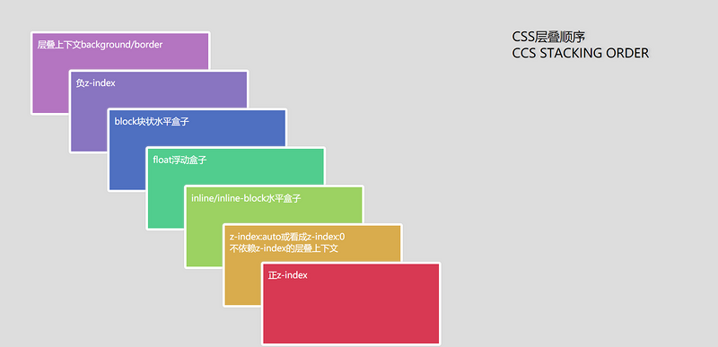
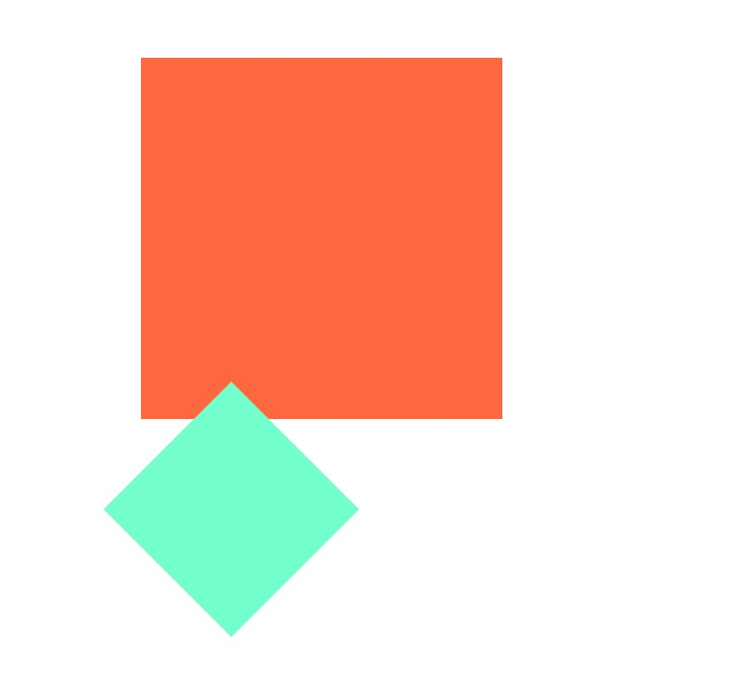
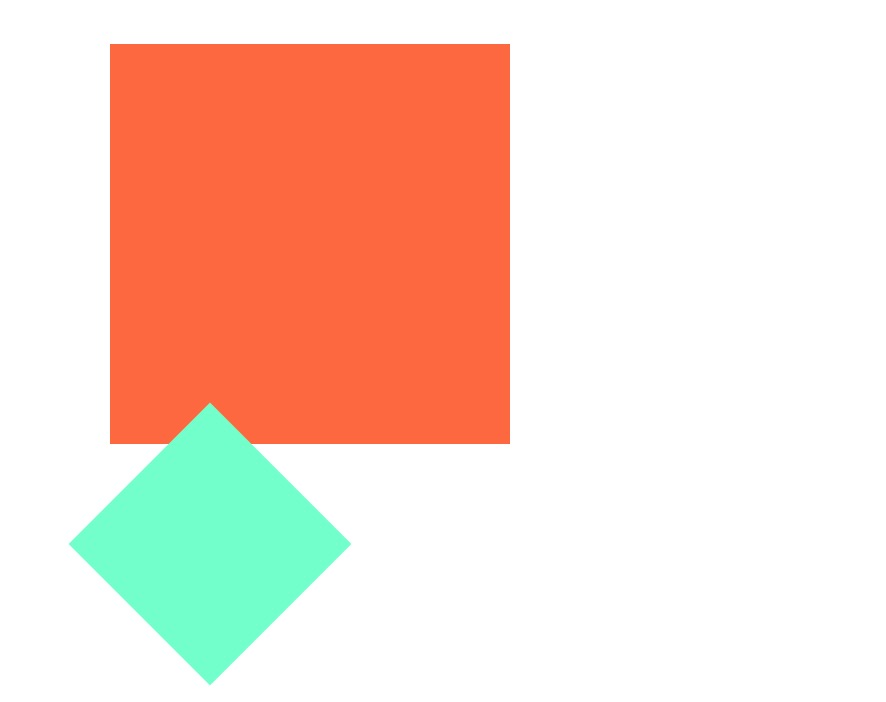
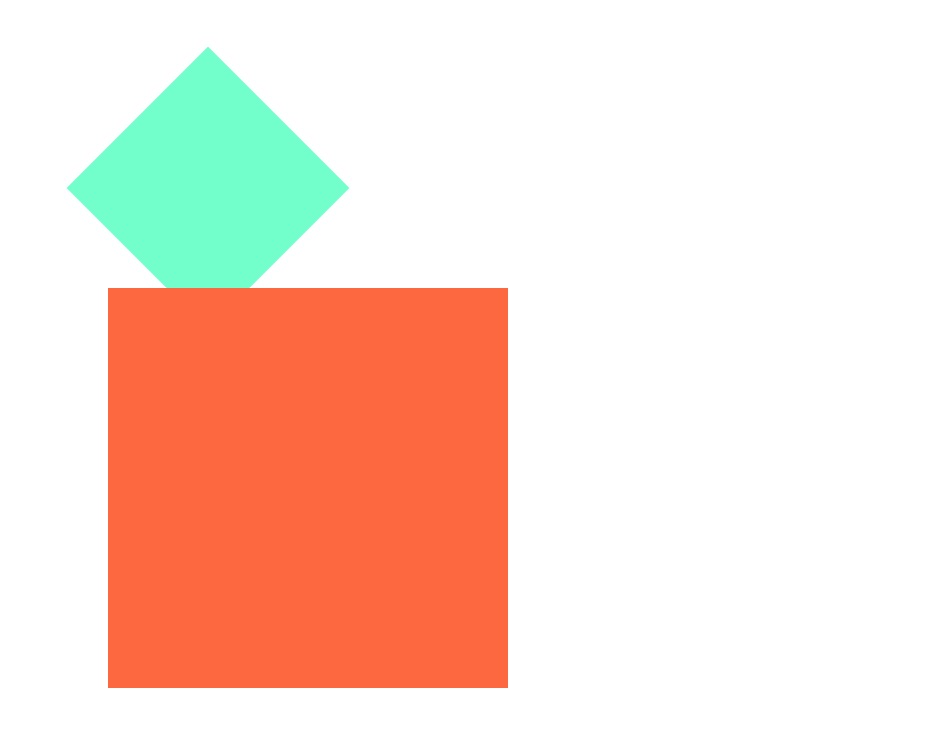

## 层叠上下文和z-index
从CSS2.1开始，所有的盒模型元素都处于**三维坐标系**中，也就是说**渲染引擎在渲染页面的时，构建的是一个三维的坐标系，允许层叠的摆放盒模型。**除了常用的X轴和Y轴，盒模型还可以沿着Z轴层叠摆放，当产生覆盖的时候，Z轴上的顺序就变得十分重要。

最开始的时候，以为元素在Z轴的顺序是由z-index属性控制的。但是实际上并不是这样的，z-index只是其中很小的一个点。

想要完全理解清楚，需要了解层叠上下文、层叠水平和层叠顺序是什么。

### 1.层叠上下文
层叠上下文和BFC一样，是一个比较抽象的概念。代表的是**页面中一个独立的区域，内部子元素的层叠顺序和外面元素无关，由该层叠上下文控制。**

**形成层叠上下文的元素称为层叠上下文元素。**

张鑫旭老师为了将概念具象化，将层叠上下文类比成做官，蛮有意思的，可以参考理解一下。

#### 1.创建层叠上下文的方法
创建层叠上下文有三种方式：
##### 1.文档根元素html，默认创建层叠上下文

##### 2.需要配合z-index属性来创建
- position值为absolute或者relative且z-index值不为auto的元素
- position值为fixed或者sticky的元素，不需要配合z-index
- flex盒子的子元素，且z-index不为auto。值得注意的是，这个是**flex的子元素形成层叠上下文**
- grid容器的子元素，且z-inde不为auto

##### 3.不需要配合z-index使用来创建（常用）
- 元素opacity小于1
- 元素transform不为none
- 元素filter不为none
- 更多方式可以查看[MDN](https://developer.mozilla.org/zh-CN/docs/Web/Guide/CSS/Understanding_z_index/The_stacking_context)

#### 2.层叠上下文的特性
1. 层叠上下文的层叠水平高于普通元素
2. 层叠上下文内部可以嵌套其他层叠上下文，但是内部元素的层叠顺序受制于外部的层叠上下文
3. 层叠上下文和兄弟元素独立，当处理层叠的时候只需要考虑子元素
4. 每个层叠上下文是自成体系的，当元素发生层叠的时候，整个元素被认为是在父层叠上下文的层叠顺序中


### 2.层叠水平
**层叠水平也叫层叠等级（stacking level），用来描述元素在Z轴上的摆放顺序**。每个元素都有层叠水平这个属性，但是层叠水平的比较有一定的规则：
1. **处于同一个层叠上下文中的两个元素，层叠水平越高的元素，在Z轴上的位置越高。**
2. **处于不同层叠上下文的元素，层叠水平由其所在的层叠上下文元素的层叠水平决定，处于不同层叠上下文的元素比较层叠水平是没有意义的。**

需要注意的是，**不要将层叠水平和z-index属性混为一谈**。这两者是是不同的概念，虽然z-index的值在某些情况下可以影响层叠水平，但是仅限于z-index生效的元素；但是层叠水平是所有元素都有的。

#### 2.1 z-index生效的元素
1. 定位元素 —— position属性不为static的元素
2. flex盒子的子元素
3. z-index的默认值为auto


### 3.层叠顺序
层叠顺序（stacking order）指的是元素在发生重叠的时候，按照特定的规则在Z轴上垂直显示。层叠上下文和层叠水平表示的是概念，层叠顺序表示的是一种规则。


- 左上角"层叠上下文background/border"指的是层叠上下文元素的背景和边框。
- 第二层中的"不依赖z-index的层叠上下文"值的是**不依赖z-index形成层叠上下文的层叠上下文元素**。也就是说层叠上下文元素和z-index：auto的定位元素的层叠水平一样的。

**层叠顺序描述的是同一个层叠上下文中的元素在Z轴的摆放规则。**不同层叠上下文的元素无法直接比较。

#### 内联元素的层叠顺序比块级元素和float元素的层叠顺序高？
因为块级元素和float元素常常用来布局，而内联元素常常用来展示内容，而网页中最重要的内容，所以要尽量保证内联元素不被覆盖。


### 3.层叠关系判断准则（*）
当元素发生层叠时，判断其覆盖顺序就是判断元素的层叠水平，能够准确得知谁在上，谁在下。
1. **如果两个元素在同一个层叠上下文中，谁的层叠水平大谁就在上面。此时层叠水平可以根据层叠顺序图来判断**。
2. **如果两个元素不在同一个层叠上下文中，就比较元素所在的层叠上下文的层叠水平**
3. **如果元素的层叠水平和层叠顺序都相同，在DOM树结构后面的元素会覆盖前面的元素**。

### 4.层叠上下文的现象和使用

#### 4.1 层叠上下文元素的层叠顺序比普通元素（不包括定位元素）高


```html
<body>
  <div style="background-color: coral;width: 200px;height: 200px;"></div>
  <div style="background-color:aquamarine;width: 100px;height: 100px;transform:rotate(45deg)"></div>
</body>
```  
这里第二个div通过tranform属性创建层叠上下文，图中可以看出层叠水平大于普通元素

#### 4.2 不支持z-index的层叠上下文元素和定位元素的层叠水平一样，都是z-index：auto级别


```html
<body>
  <div style="background-color: coral;width: 200px;height: 200px; position: relative;"></div>
  <div style="background-color:aquamarine;width: 100px;height: 100px;transform: rotate(45deg);"></div>
</body>
```  



```html
<body>
  <div style="background-color:aquamarine;width: 100px;height: 100px;transform: rotate(45deg);"></div>
  <div style="background-color: coral;width: 200px;height: 200px; position: relative;"></div>
</body>
```  

可以上面两个div就是顺序不同，展示的堵盖情况也不同，都是后面的div覆盖前面的div。**大的div是一个定位元素，z-index为auto，并没有形成层叠上下文。小的div形成了层叠上下文，不支持z-index。两个div的层叠水平是一样的，都是z-index:auto的水平。**


#### 4.3 不同层叠上下文的元素覆盖时，比较的元素所在的层叠上下文的层叠水平


```html
<body>
  <div style="position: relative; z-index: 1;">
    <div style="background-color:aquamarine;width: 100px;height: 100px;position: absolute;top: 0px;z-index: 20;"></div>
  </div>
  <div style="position: relative; z-index: 1">
    <div style="background-color: coral;width: 100px;height: 100px; position: absolute; top: 50px; z-index: 1"></div>
  </div>
</body>
```  
可以看出绿色div本身的z-index虽然很大，但是两个div所在的层叠上下文的z-index是一样，而黄色在后面，所以黄色的层叠水平更高

### 参考文章
1. [深入理解CSS中的层叠上下文和层叠顺序](https://www.zhangxinxu.com/wordpress/2016/01/understand-css-stacking-context-order-z-index/?shrink=1)
2. [彻底搞懂CSS层叠上下文、层叠等级、层叠顺序、z-index](https://juejin.im/post/5b876f86518825431079ddd6#heading-4)
3. [MDN](https://developer.mozilla.org/zh-CN/docs/Web/Guide/CSS/Understanding_z_index/The_stacking_context)


