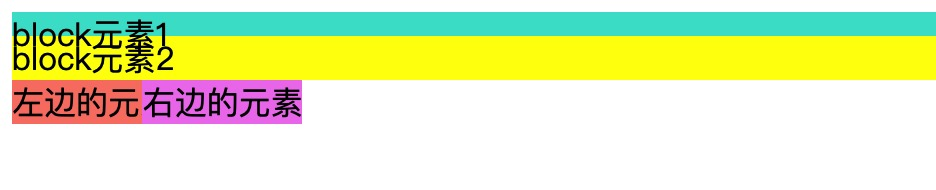
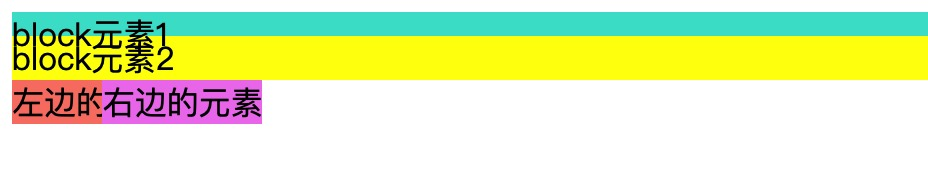
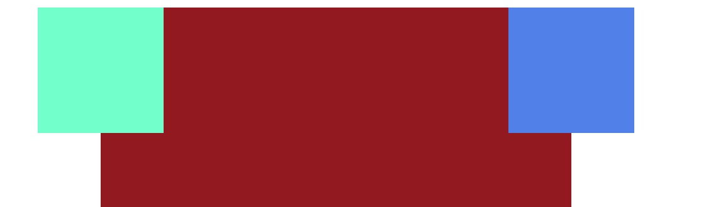
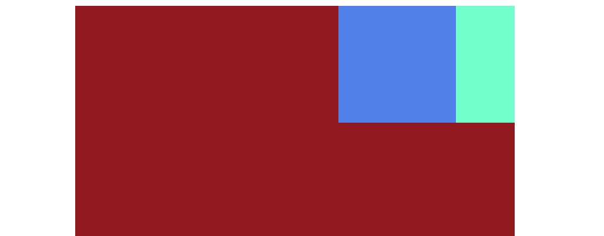
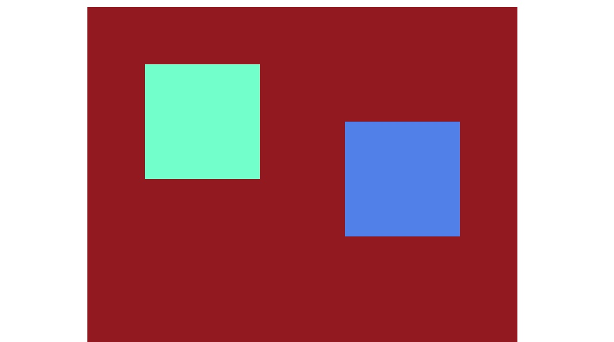
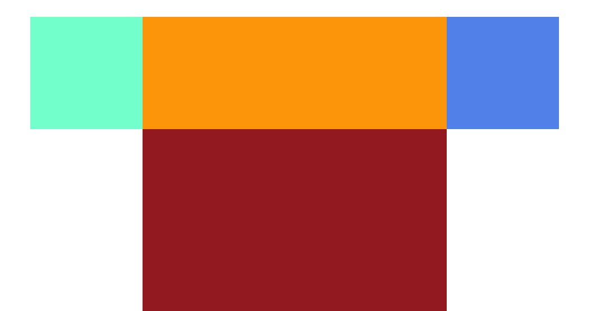

## 负margin值的应用：圣杯布局和双飞翼布局
在CSS中，负margin是一个比较少用的元素的定位方法，只有在很少数情况下会使用负margin来解决一些其他方式无法解决的问题。所以负margin看起来是一种“hack”的方式，但是实际上**负margin是一种合理且正统的定位方法**。

## 负margin在不同布局模型下有不同的规则
### 流动模型
对于流动模型中的元素设置负margin的规则：
#### 1. 如果设置的是margin-left或者margin-top
**当元素margin的left或者top方向设置负值，元素会按照设置的方向移动元素相应的距离。如果元素前面有其他元素，则会覆盖在其他元素之上。**


```js
//html
<div class="test1">block元素</div>
<div class="test4">block元素2</div>
<span class="test2">左边的元素</span>
<span class="test3">右边的元素</span>

//css
.test1{
  background-color: turquoise;
}
.test2{
  background-color: salmon;
}
.test3{
  background-color: violet;
  display: inline-block;
  margin-top: -10px;
  margin-left: -20px;
}
.test4{
  background-color: yellow;
  margin-top: -10px;
}
```
注意：从图中可以看出，**块级元素在覆盖的时候，其中的文本并不会覆盖。**

#### 2.如果设置的是margin-right或者margin-bottom
**如果margin的right或者bottom方向设置的是负值，元素本身不会移动，元素后面的元素会往该元素的方向移动相应的距离**。


```js
//html
<div class="test1">block元素</div>
<div class="test4">block元素2</div>
<span class="test2">左边的元素</span>
<span class="test3">右边的元素</span>

//css
.test1{
  background-color: turquoise;
  margin-bottom: -10px;
}
.test2{
  background-color: salmon;
  margin-right: -40px;
}
.test3{
  background-color: violet;
  display: inline-block;
}
.test4{
  background-color: yellow;
}
```

#### 3.特殊情况：当块级元素不设置宽度的时候，设置margin-left或margin-right为负值的时候会增加元素的宽度，效果类似于padding。


```js
//html
<div class="container">
  <div class="demo"></div>
</div>

//css
.container {
  background-color: brown;
  height: 100%;
}
.demo {
  background-color: blueviolet;
  height: 100px;
  margin-left: -50px;
  margin-right: -50px;
}
```


这种特殊的情况只会产生在块级元素上，行内元素和块级行内元素不会产生，因为后者的宽度默认是靠内容撑开的。

#### 4.总结
**负margin不会使元素脱离文档流**，但是会使元素在文档流中的位置发生偏移，这种偏移不同于相对定位中的偏移，相对定位偏移的时候元素占据的空间并不会发生变化，但是**负margin会使元素在文档流中的位置也发生偏移，其他的元素可以乘虚而入，但是元素本身的尺寸是不会变化的（除了第三种特殊情况）**。

### 浮动模型
对于浮动元素设置负margin的规则：
#### 1.如果设置的负margin的方向和浮动方向相同，元素会往对应的方向移动相应的距离，上下方向和流动模型中的元素表现一样


```js
//html
<div class="container">
  <div class="left"></div>
  <div class="right"></div>
</div>

//css
.container {
  background-color: brown;
  height: 100%;
}
.left {
  background-color: aquamarine;
  float: left;
  width: 100px;
  height: 100px;
  margin-left: -50px;
}
.right {
  background-color: cornflowerblue;
  float: right;
  width: 100px;
  height: 100px;
  margin-right: -50px;
}
```

#### 2.如果设置的负margin的方向与浮动的方向相反，那么元素本身不动，元素后面的元素会向该元素方向移动相应的距离

```js
//html
<div class="container">
  <div class="left"></div>
  <div class="right"></div>
</div>

//css
.container {
  background-color: brown;
  height: 100%;
}
.left {
  background-color: aquamarine;
  float: right;
  width: 100px;
  height: 100px;
  margin-left: -50px;
}
.right {
  background-color: cornflowerblue;
  float: right;
  width: 100px;
  height: 100px;
}
```

#### 3.特殊情况：当浮动元素的负margin值大于等于元素本身的宽度的时候，这时浮动元素在文档流中占据的实际宽度就为0了，可能会改变浮动元素的垂直位置
##### 设置负margin之前


```js
//html
<div class="container">
  <div class="center"></div>
  <div class="left"></div>
  <div class="right"></div>
</div>

//css
.container {
  background-color: brown;
  height: 100%;
}
.center {
  width: 100%;
  background-color: orange;
  float: left;
  height: 100px;
}
.left {
  background-color: aquamarine;
  float: left;
  width: 100px;
  height: 100px;
}
.right {
  background-color: cornflowerblue;
  float: left;
  width: 100px;
  height: 100px;
}
```

##### 设置负margin之后


```js
//html
<div class="container">
  <div class="center"></div>
  <div class="left"></div>
  <div class="right"></div>
</div>

//css
.container {
  background-color: brown;
  height: 100%;
}
.center {
  width: 100%;
  background-color: orange;
  float: left;
  height: 100px;
}
.left {
  background-color: aquamarine;
  float: left;
  width: 100px;
  height: 100px;
  margin-left: -100px;
}
.right {
  background-color: cornflowerblue;
  float: left;
  width: 100px;
  height: 100px;
}
```

从两个例子可以看出，**当left元素设置margin-left: -100px时，元素在文档流实际占据的位置为0，left元素会浮动到center元素的后面，改变了垂直方向上的位置**。这也是圣杯布局和双飞翼布局的原理。

### 层模型
当position为relative的时候，负margin的情况和流动模型中的元素一样，只是元素的覆盖关系上不同，这是因为定位元素的z-index默认为auto，是符合层叠规则的。

这里分析的是position为absolute的情况

#### 1.当负margin设置的方向和绝对定位元素的偏移方法一致，那么元素会向当前方向偏移相应的距离


```js
//html
<div class="container">
  <div class="left"></div>
  <div class="right"></div>
</div>

//css
.container {
  background-color: brown;
  height: 100%;
  position: relative;
}
.left {
  background-color: aquamarine;
  position: absolute;
  width: 100px;
  height: 100px;
  left: 100px;
  top: 100px;
  margin-left: -50px;
  margin-top: -50px;
}
.right {
  background-color: cornflowerblue;
  position: absolute;
  width: 100px;
  height: 100px;
  right: 100px;
  top: 100px;
  margin-right: -50px;
}
```

#### 2.当负margin的方向和绝对定位的偏移方向是相反的的时候，没有任何影响，因为元素已经完全脱离了文档流，不会影响其他的元素。

#### 3.特殊情况：当绝对定位元素没有设置宽度的时候，且同时设置了left和right偏移量，这时和流动模型中没有设置width的块级元素一样，设置负margin-left或者margin-right会增加元素的宽度。

#### 4.position为fixed的情况和absolute是一致的

## 负margin的应用场景
### 圣杯布局(padding)
圣杯就是三栏布局，左右两个部分宽度固定，中间部分响应式变化。而且中间部分需要在dom结构的前面（首先加载出来？）。


```js
//html
<div class="container">
  <div class="center"></div>
  <div class="left"></div>
  <div class="right"></div>
</div>

//css
.container {
  background-color: brown;
  height: 100%;
  position: relative;
  padding: 30px 150px;
}
.center {
  width: 100%;
  background-color: orange;
  float: left;
  height: 100px;
}
.left {
  background-color: aquamarine;
  width: 100px;
  height: 100px;
  float: left;
  margin-left: -100%;
  position: relative;
  left: -100px;
}
.right {
  background-color: cornflowerblue;
  width: 100px;
  height: 100px;
  float: right;
  margin-right: -100px;
}
```
#### 圣杯布局的问题
圣杯布局虽然巧妙，但是也是有缺陷的。**当容器宽度小于left盒子的宽度时，-100%的值小于left盒子自身宽度，就会出现left盒子无法浮上去，从而布局错乱。**（margin的百分比值是相对于负容器的宽度）

### 双飞翼布局（margin）
双飞翼布局和圣杯布局要解决的问题是一样的，但是圣杯布局的缺陷很明显，双飞翼就是用来解决这个问题的。

```js
//html
<div class="container">
  <div class="center">
    <div class="inner"></div>
  </div>
  <div class="left"></div>
  <div class="right"></div>
</div>

//css
.container{
  height: 100%;
}
.center{
  float: left;
  width: 100%;
  height: 200px;
  background-color: yellow;
}
.inner{
  margin: 0 200px;
}
.left{
  float: left;
  width: 200px;
  height: 200px;
  background-color: violet;
  margin-left: -100%;
}
.right{
  float: left;
  width: 200px;
  height: 200px;
  background-color: turquoise;
  margin-left: -200px;
}
```
虽然双飞翼中也是用-100%，但是容器的宽度更大，需要缩小到比较极致的情况才会出现布局紊乱。

### 其他的三栏布局
虽然圣杯布局和双飞翼布局比较巧妙的实现三栏自使适应布局，但是现在还有更简单更安全的方式实现。

#### 1.BFC+float
```js
// html
<div class="container">
  <div class="left"></div>
  <div class="right"></div>
  <div class="center">
    中间的自适应中间的自适应中间的自适应中间的自适应中间的自适应中间的自适应中间的自适应中间的自适应中间的自适应中间的自适应中间的自适应
  </div>
</div>

// CSS
.container {
  width: 100%;
  padding: 0 100px;
  overflow: hidden;
  box-sizing: border-box;
}
.center {
  background-color: tomato;
  height: 200px;
  overflow: hidden; //形成一个BFC
}
.left {
  width: 100px;
  height: 200px;
  background-color: aqua;
  float: left;
}
.right {
  width: 100px;
  height: 200px;
  background-color: blueviolet;
  float: right;
}

```


#### 2.absolute
```js
// html
<div class="container">
  <div class="center">
    中间的自适应中间的自适应中间的自适应中间的自适应中间的自适应中间的自适应中间的自适应中间的自适应中间的自适应中间的自适应中间的自适应
  </div>
  <div class="left"></div>
  <div class="right"></div>
</div>

// css
.container {
  width: 100%;
  overflow: hidden;
  box-sizing: border-box;
  min-height: 200px;
  position: relative;
}
.container div {
  position: absolute;
}
.center {
  background-color: tomato;
  height: 200px;
  left: 100px;
  right: 100px;
}
.left {
  width: 100px;
  height: 200px;
  background-color: aqua;
  left: 0;
}
.right {
  width: 100px;
  height: 200px;
  background-color: blueviolet;
  right: 0;
}


```


### 参考文章
1. [CSS布局奇淫巧计之-强大的负边距](https://www.cnblogs.com/2050/archive/2012/08/13/2636467.html#2457812)
2. [理解并运用 CSS 的负 margin 值](https://segmentfault.com/a/1190000007184954)
3. [负margin用法权威指南](https://www.w3cplus.com/css/the-definitive-guide-to-using-negative-margins.html)


