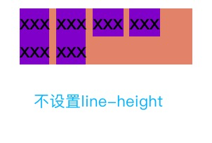

## 深入理解line-height和vertical-align
在实际的布局中，line-height和vertical-align这两个属性很容易发生比较怪异的情况，原因就是没有深入理解这两个属性内部的工作原理是什么。

之所以要将line-height和vertical-align拿出来一起分析，虽然这两个属性看起来没有关系，但是实际上这两个属性内部的工作原理是很相似的，都是**基于line-box来工作**的。

### 1.line-box深度分析
元素内容中的每一行都会形成一个line-box，每一个line-box都有4条关键的线，类似于小写的英文作业本。直接看下图


图中可以看出：
1. 相邻两个line-box中baseline的距离就是line-height。
2. 上一行的bottom到下一行的top之间的距离就是**行距**，行距会平分到上下两个line-box中
3. **line-box中top到bottom之间的距离，是当前font-famliy和font-size下能容纳所有文字的最小高度。这个高度与line-height无关，只有font-famliy和font-size有关**
4. **假设小写x字母的高度是xHeight，中线与基线之间的距离是1/2*xHeight**（后面会解释）
5. 假设top到bottom之间的距离是X，则可以得出公式：行距=lineHieght - X

### 2.行内元素内容框的组成分析


从图中可以看出,元素内容框可以分成4个盒子，按照从里到外的顺序依次分为：
1. content area：**content area就是紧紧包裹文字内容的盒子，line-box中可以看出，line-box中的top和bottom之间的区域就是content area。**这个区域高度只受font-famliy和font-size的影响。很多文章说，content area就是选中文字时背景颜色的区域，实际上不准确的，chrome中是不成立的。
2. inline box：每个inline元素（**不包含display:inline-block**）都会形成一个inline box，多个inline box会并排显示。**块级盒子中不被行内标签包含的文字称为裸露文字，也会形成一个inline box，成为匿名inline box**。**inline box默认的高度基本上和content area是一样的，但是设置了padding之后，inline box会包含padding的高度，但是都和line-height没有关系。**
3. line box：一行即为一个line box，由多个inline box组成，默认line box的高度由内部最高的inline box的高度决定（**display：inline元素的上下padding无法撑起父元素的高度**）。**line-height属性设置的就是line-box的高度**。
4. containing box：包裹所有line box的各自就叫containing box，其实就是元素盒子的内容区域。

### 3.line-height属性
line-height属性设置的是line box的高度。**对于非替换的inline元素，line-height设置的就是当前line box的高度。而对于块级元素的来说，line-height设置的是line box的最小高度。**

#### 1.line-height的取值
1. normal：默认值。合适的line-height，尽可能占据最小的高度。
2. length：px/em为单位，设置确定的值。em相对于当前元素的font-size
3. number：没有单位的数字。此数字会与**当前元素**的font-size相乘得到line-height
4. 百分比：基于当前字体大小的百分比设置line-height
5. inherit：继承父元素的line-height

#### 2.line-height值的继承
1. 当父元素的line-height为number时，**子元素继承的是这个数字**。
2. 当父元素的line-height是百分比和em的时候，**子元素继承的是最终计算好的值**。

```js
//html
<div class="contianer">
   <div style="background-color:deepskyblue">xxxx</div>
   <div style="background-color:fuchsia">yyyy</div>
</div>

//css
.contianer {
  line-height: 1.5em;
  /* line-height: 1.5; */
  /* line-height: 100%; */
  font-size: 14px;
}
.contianer div {
  line-height: inherit;
  font-size: 30px;
}
```  


#### 3.line-height的特点
1. **line-height决定的line box的高度**，而不是由内部的内容撑开
2. line-height属性对inline元素有**垂直居中性**，**因为line box中content area始终垂直居中放置，line-height改变的时候，改变的是行间距**。

#### 4.line box的高度只由line-height决定
```js
//html
<div class="contianer">xxxxxx</div>

//css
.contianer {
  font-size: 30px;
  background-color: hotpink;
}
```  


#### 5.line-height的垂直居中性
在日常工作中，我们常用一下代码来设置容器内部的inline元素垂直居中：
```js
.middle{
  height: 40px;
  line-height: 40px;
}
```  
但是实际上只需要设置line-height就能够是内部的文本垂直居中，同时也能达到撑起父元素的效果。

line-height不会修改content area，修改的是line box之间的行间距。
```js
//html
<div style="background-color:darksalmon;line-height: 40px">
  <span style="background-color:darkviolet;">xxx</span>
  <span style="background-color:darkviolet;">xxx</span>
  <span style="background-color:darkviolet;">xxx</span>
  <span style="background-color:darkviolet;">xxx</span>
  <span style="background-color:darkviolet;">xxx</span>
  <span style="background-color:darkviolet;">xxx</span>
</div>
```  



### vertical-align属性
设置元素在当前父元素中的垂直对齐方式，**该属性设置在子元素上，而不是设置在父元素上**。
#### 1.作用范围
1. 行内元素 —— display: inline 和 display: inline-block
2. 表格单元格 —— display: table-cell

作用在块级元素上是无效的

#### 2.取值
1. baseline：**默认值**。使**元素的基线**和父元素的基线对齐。
2. middle: 使**元素的垂直中心线**和父元素的基线上方二分之一x-height部位对齐
3. text-top: 使元素的顶部和父元素中文本的top对齐（也就是content area的上边），对照line box图
4. text-bottom: 使元素的底部和父元素中文本的bottom对齐（content area的下边）
5. top: 使元素及其后代元素的顶部与整行的顶部对齐。
6. bottom：使元素及其后代元素的底部与整行的底部对齐。
7. [length]: 使元素的基线对齐到父元素的基线之上的给定长度。可以是负数。
8. [percentage]: 使元素的基线对齐到父元素的基线之上的给定百分比，该百分比是line-height属性的百分比。可以是负数。

这里列出的常用的取值，还要一些取值平时没有怎么见到。参考[MDN](https://developer.mozilla.org/zh-CN/docs/Web/CSS/vertical-align)

可以看出，要想弄清楚vertical-align如何使用，先得找到父元素和子元素的基线。

#### 3.如何寻找元素的基线：x
CSS中一个公认的公理：**元素中小写字符x的下边缘线就是当前元素的基线**。对于任何元素都是生效的。所以可以通过这个方法找到元素的基线

##### x-height和单位ex
**x-height就是小写字母x的高度。middle线就在基线向上1/2*x-height的位置，大致就是x交叉点的位置。**

**ex是css中的长度单位，1ex = x-height。**


#### 4.各种元素的基线
**行内元素（inline）的基线都是内部x字母的下边缘线**。

块级元素的基线：
1. 如果内部没有vertical-align:baseline的inline-block，则元素的基线就是x字母的下边缘
2. **如果内部有vertical-align:baseline的inline-block，其基线就是高度最高的inline-block盒子的基线。**

重点关注一下inline-block的基线，不借助x字母：
1. **正常情况下，inline-block的基线就是内部最后一个line box的基线**
2. **如果inline-block内部没有inline box或者其overflow属性不是visible，那边元素的基线就是margin bottom的下边缘。**


#### 4.幽冥空白节点 —— （张鑫旭命名）
先看一个奇怪的例子


```js
//html
<div class="contianer">
  <div class="div1"></div>
  <span>qwertyuiopasdfghjklzxcvbnmxxx</span>
</div>

// css
.contianer {
  background-color: blanchedalmond;
}
.div1 {
  display: inline-block;
  width: 100px;
  height: 100px;
  background-color: royalblue;
}
```  
看代码可知，外面div的高度是由内部div高度撑起来的，不应该会出现间隙。但是事实上就是会出现这种怪异的情况。

这个是**因为每个行框盒子在开始的位置都有一个与之行高相同、字体大小一致而且宽度为0的inline盒子。这个节点被称为幽冥空白节点**

##### 4.1 图中现象分析
首先这个inline-block盒子里面没有内容，所以它的基线就是下边缘。而幽冥空白节点的基线是x字母的下边缘，inline-block盒子中vertical-align取默认值baseline，所以这两个节点是baseline对齐。而**幽冥空白节点中content area下边和x的下边缘是有距离的(baseline和bottom之间的距离)**，所以才会产生间隙。

##### 4.2 解决方法
1. **将字体大小设置为0，这是幽冥空白节点中的所有线都合成了一条，baseline和bottom之间没有距离。**
```css
.contianer {
  background-color: blanchedalmond;
  font-size: 0px;
}
```  

2. 设置内部inline-block盒子的vertical-align属性不为baseline
```css
.div1 {
  display: inline-block;
  width: 100px;
  height: 100px;
  background-color: royalblue;
  vertical-align: middle;
}
```  

#### 5.vertical-align的典型问题分析
##### 1.vertical-align:middle是近似垂直居中，并不准确


```js
//html
<div class="contianer">
  <div class="div1"></div>
  x
</div>

//css
.contianer {
  background-color: blanchedalmond;
  font-size: 80px;
  height: 200px;
  line-height: 200px;
}
.div1 {
  display: inline-block;
  width: 100px;
  height: 100px;
  background-color: royalblue;
  vertical-align: middle;
}
```  
出现这种现象是因为**文字下沉性**。**就是文字的垂直中心点并没有和当前行框的垂直中心点对齐，而是会偏下一点，所以会出现这种情况。平常使用中字体比较小，这种差异基本是可以忽略的。文字越大，这种差异越明显。**

##### 2.使用vertical-align: middle居中无效


```js
//html
<div class="contianer">
  <div class="div1"></div>
  <div class="div2"></div>
  <div class="div3">xxx</div>
</div>

//css
.contianer {
  background-color: blanchedalmond;
  height: 300px;
}
.div1 {
  display: inline-block;
  width: 100px;
  height: 100px;
  background-color: royalblue;
  vertical-align: middle;
}
.div2 {
  display: inline-block;
  width: 100px;
  height: 200px;
  background-color: chocolate;
  vertical-align: middle;
}
.div3 {
  display: inline-block;
  width: 100px;
  height: 80px;
  background-color: crimson;
  vertical-align: middle;
}
```  
原因分析：**出现这种原因的本质就是当前行的行高不足，当前行框的高度小于容器的高度，元素只在当前行框中垂直居中**。**因为line box的高度取决于内部最高的盒子的高度**，所以要解决这个问题，就得将当前行框的高度设置成和容器的高度一样。
1. 利用伪元素，将行框的高度撑到与容器的高度一样，然后也需要设置vertical-align: middle
```css
.contianer::after {
  height: 100%;
  content: "";
  display: inline-block;
  vertical-align: middle;
}
```  
2. 使用line-height属性来设置行高
```css
.contianer {
  background-color: blanchedalmond;
  height: 300px;
  line-height: 300px;
}
```  

### 参考文章
1. [彻底搞定vertical-align垂直居中不起作用疑难杂症](https://juejin.im/post/5a7d6b886fb9a06349129463#heading-1)
2. [字母’x’在CSS世界中的角色和故事](https://www.zhangxinxu.com/wordpress/2015/06/about-letter-x-of-css/)
3. [浅谈line-height和vertical-align](https://juejin.im/post/5d03436f6fb9a07eee5eca25#heading-10)
4. [【前端Talkking】CSS系列——CSS深入理解之line-height](https://juejin.im/post/5b19cf71f265da6e54151bf4)


