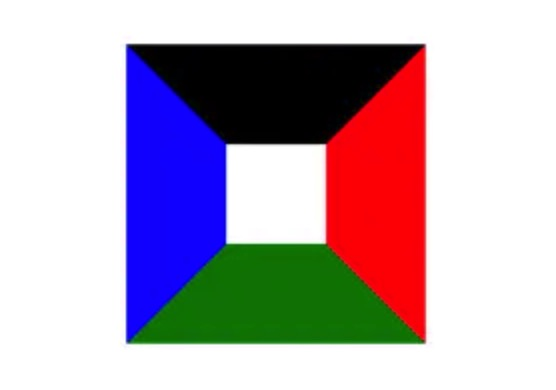
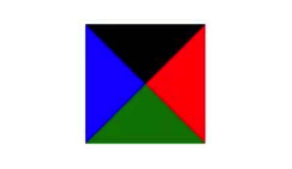
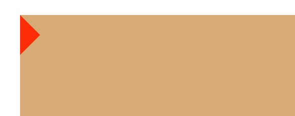

## CSS实现一个三角形和自适应正方形

### CSS实现三角形
实现的原理是利用盒模型的border。其实盒模型中border区域的每一边都是一个梯形


当盒模型中content区域的大小为0的时候，这时候盒模型就会变成这样


由图中可以看出，这时border的每一个边都是一个三角形，只要将其他三边透明化处理就可以得到一个三角形。

#### 实现代码


```js
//html
<div class="demo"></div>

//css
.demo {
  width: 0px;
  height: 0px;
  border: 20px solid orangered;
  border-top-color: transparent;
  border-right-color: transparent;
  border-bottom-color: transparent;
}
```


### CSS实现自适应正方形
自适应正方形是指元素的宽高随着页面的大小变化而变化，但是元素始终是一个正方形

#### 1.使用vw单位,相对于可视区域百分比的长度单位
```js
//html
<div class="demo"></div>

//css
.demo {
  width: 10vw;
  height: 10vw;
  background-color: red;
}
```
这种方法很简单，缺点就是可能会有兼容性问题。

#### 2.使用margin/padding
对于margin和padding的长度中有一点很重要：**那就是margin和pading的百分比值相对于的是父元素content区域的width**。而不是top,bottom相对于父元素的height，left,right相对于父元素的width。

下面两个方法都是根据这个原理来实现的。

##### 1.padding-bottom撑开高度
```css
.demo{
  width: 20%;
  padding-bottom: 20%;
  background-color: red;
  height: 0;
}
```
缺点：
1. 正方形区域内部的内容都会溢出来，一旦设置overflow: hidden的话，内容就看不到了
2. **由于height始终是0，对于设置的max-height就会永远不生效，因为max-height限制的是盒子content区域的高度。**


##### 2.margin + 伪元素
为了解决上一种方法中无法对max-height生效的缺点，才产生了这种方式。

**这种方式是利用伪元素将高度撑起来，从而会对max-height生效。**

```css
.demo {
  width: 20%;
  background-color: red;
  overflow: hidden;
}
.demo:after {
  display: block;
  margin-top: 100%;
  content: "";
}
```
这里父元素一定要新建一个BFC，不然会产生高度塌陷。产生高度塌陷的条件[MDN](https://developer.mozilla.org/zh-CN/docs/Web/CSS/CSS_Box_Model/Mastering_margin_collapsing)

缺点：**如果正方体元素内部有内容，会将高度撑高。所以如果需要在内部添加内容，需要使用的绝对定位。**

### 参考文章
1. [纯 CSS 实现自适应正方形](https://segmentfault.com/a/1190000009476303)


