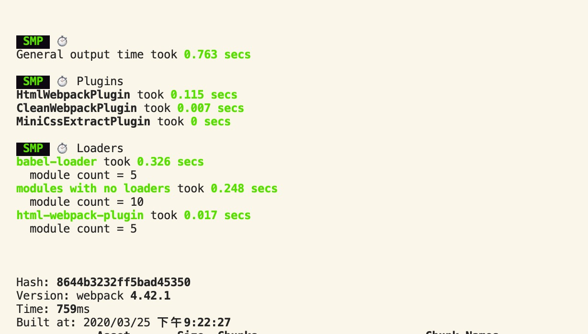
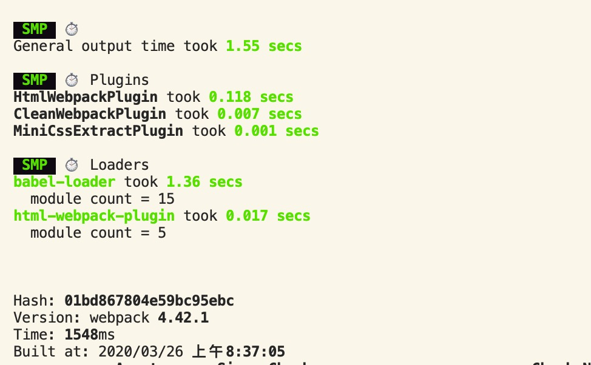
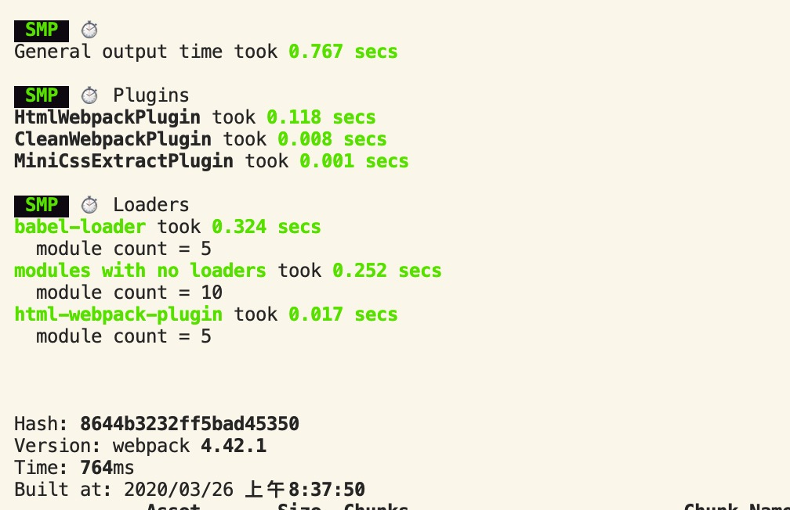
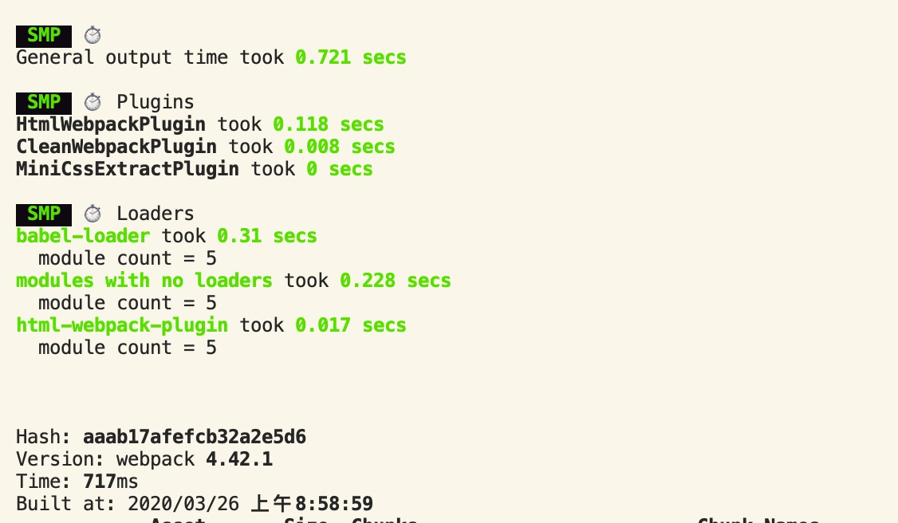
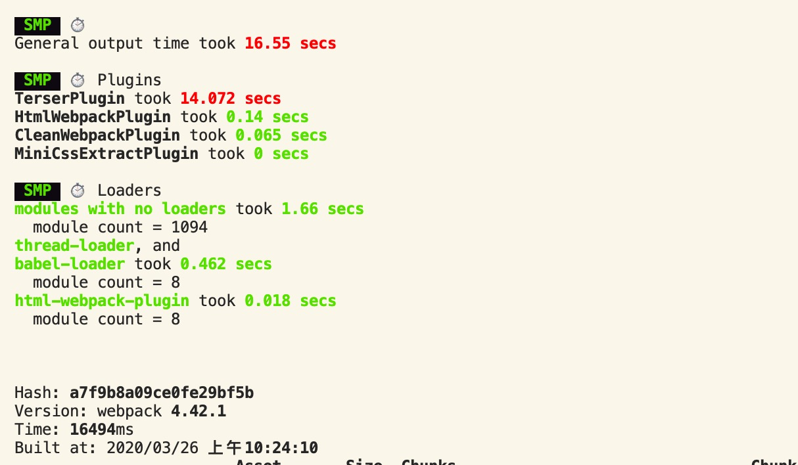
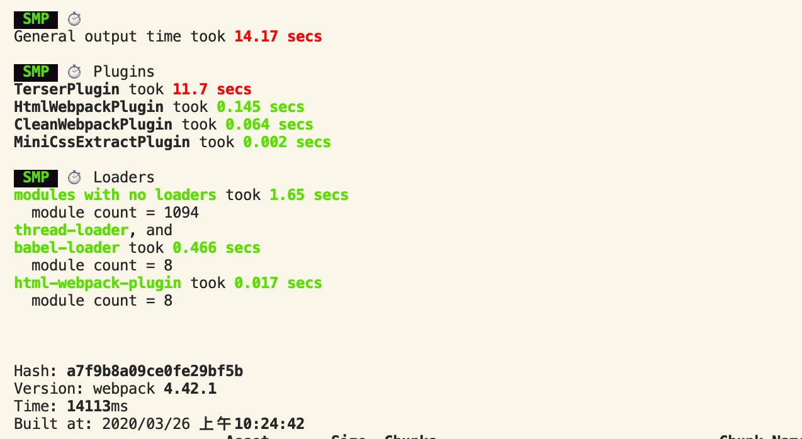
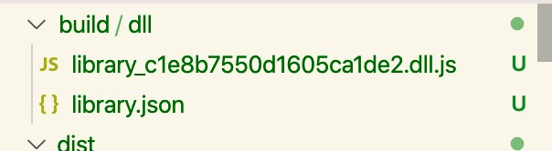
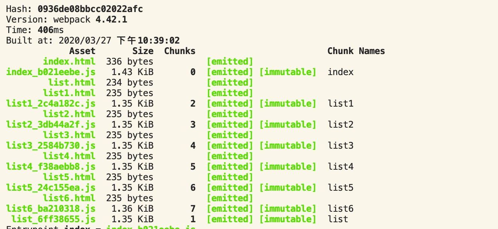

# 打包速度的优化策略

在实际的项目中，随着项目复杂度不断增大，使用webpack打包时候会出现越来越慢的情况。这个时候就需要对打包的速度做一定的优化

## 1. 如何测量各模块打包的速度

可以使用 `speed-measure-webpack-plugin` 插件来测量本次打包中各个loader和pugin的打包速度，从而得到哪些点需要优化

```js
const SpeedMeasureWebpackPlugin = require('speed-measure-webpack-plugin');
const smp = new SpeedMeasureWebpackPlugin();

module.exports=smp.wrap({
  entry:...
});
```

输出的结果：



## 2. 优化打包速度的方案

打包速度的优化方案可以从以下几个方面来考虑：

- 模块的搜索范围和路径
- 并行打包
- 生产环境中并行压缩代码
- 使用缓存，提高第二次构建的速度
- 预编译模块

### 2.1 使用高版本的Node和Webpack

这种方案是最简单的，Node和Webpack在不断的迭代过程中，内部会进行很多的优化。比如内部使用一些更高效的js方法来实现

### 2.2 缩小模块的打包范围和搜索路径

在代码中我们常常会引入一些第三方的包，比如react，但是这些包本身就已经通过babel转化，所以在查找分析的时候是不需要再去分析这些包的。

**1. 在rules中可以使用 `include/exclude` 属性来缩小构建的分析范围**

以js文件为例

```js
{
    test:/\.js$/,
  include:path.resolve('src'),
  loader: 'babel-loader'
}
```

没有使用include:



使用include:



可以看到速度的提升还是很明显的。

**2. 使用resolve属性来缩短查找的关键路径**

```js
resolve:{
  modules:[path.resolve(__dirname, 'node_modules')], //减少模块搜索的层级，默认情况下会一层层向上去node_modules中查找
  extensions:[.js], //准确匹配文件后缀，确保没有后缀的模块是js文件
  mainFields:['main'], //匹配第三包时，只搜索其中的main.js文件。默认情况下会有多个匹配方案
  alias:{
    react: path.resolve(__dirname, './node_modules/react/umd/react.production.min.js'),
    'react-dom': path.resolve(__dirname, './node_modules/react-dom/umd/react-dom.production.min.js')
  } //alias直接指定某个包的文件路径，不需要一层一层去搜索
}
```

优化结果：



### 2.3 并行打包

**并行打包使用的是多进程的方式来打包。内部会创建一个线程池，然后将当前类型模块的打包操作分配到多个线程中打包，打包完成之后合并到主线程中。**

并行打包的实现方案有两种：

1. webpack3中常用的是 `HappyPack` 插件
2. webapck4中官方提供了支持，使用`thread-loader`

#### 2.3.1 HappyPack

```js
const HappyPack = require('happypack');

// rules
{
    test:/\.js$/,
  include:path.resolve('src'),
  loader: 'babel-loader'
}

//plugins
plugins: [
    ...
  new HappyPack({
    loaders:['babel-loader'],
    threads:4
  }),
  ...
]
```

#### 2.3.1 thread-loader

```js
{
    test:/\.js$/,
  include:path.resolve('src'),
  use:[
    {
      loader:'thread-loader',
      options:{
        workers:3
      }
    },
    'bable-loader'
  ]
}
```

### 2.4 并行压缩

在production环境中，webpack会自动将打包出来的代码进行压缩。这个压缩代码的过程是一个非常耗时的过程，生产环境构建的瓶颈往往就在这里。

在最新的webapck中（v4.42），webpack内部会模式使用**`terser-webpack-plugin`**来压缩代码，同时使用这个插件可以开启并行压缩

```js
optimization:{
    minimize:true,
    minimizer:[
      new TerserPlugin({
        cache:false,
        parallel:3
      })
    ]
}
```

没有开启parallel之前：



开启之后：



速度上还是有所提升的

### 2.5 使用缓存，提高二次构建的速度

开启缓存之后，默认会在node_modules文件夹下创建一个**`.cache`**目录，用来存放缓存数据。通常开启缓存的地方有三个：

1. babel-loader 开启缓存：提高二次解析js的速度
   
   ```js
   {
       test:/\.js$/,
     include:path.resolve('src'),
     use:[
       'bable-loader?cacheDirectory=true'
     ]
   }
   //js代码比较少的时候，不是很明显
   ```

2. terser-webpack-plugin 开启缓存：提高第二次压缩代码的速度（webpack生产环境中会默认打开）
   
   ```js
   optimization:{
       minimize:true,
       minimizer:[
         new TerserPlugin({
           cache:true
         })
       ]
   }
   
   //生产环境下，效果非常明显
   // 第一次打包：TerserPlugin took 14.33 secs
   // 第二次打包：TerserPlugin took 0.227 secs
   ```

3. cache-loader和hard-source-webpack-plugin：缓存webpack内部模块处理的中间结果，提高二次模块转化速度
   
   ```js
   {
       test:/\.js$/,
     include:path.resolve('src'),
     use:[
       'cache-loader',
       'bable-loader?cacheDirectory=true'
     ]
   }
   ```
   
   ```js
   const HardSourceWebpackPlugin = require('hard-source-webpack-plugin');
   
   plugins: [
       ...
     new HardSourceWebpackPlugin(),
     ...
   ]
   
   //效果特别明显
   ```
   
   > **补充：**
   > 
   > - cache-loader用来缓存对应loader处理之后的产物，存放在磁盘中
   > - hard-source-webpack-plugin用来为模块提供中间缓存，缓存的东西更多，对于第二次构建速度的提升也更大。但是第一次打包时的时间也更长

### 2.6 预编译基础资源

在实际的项目中，常常引用一些第三方的基础包，比如react，react-dom。但是这些框架级别的基础包往往都很大，如果整个打包到bundle文件里面，不仅打包的体积很大，而且打包的速度也会很慢。

但是实际上这些包并不是频繁变化的，基本都是在版本升级的时候才会变化。所以可以将这些包单独提出来打成一个单独的包，然后在bundle中动态链接的方式引入。

**可以理解为需要打两次包，一次是打基础包，一次是bundle**

webpack提供了`DllPlugin`和`DLLReferencePlugin`插件，来实现包的分拆和引入

- `DllPlugin`负责生成基础包的描述文件
- `DLLReferencePlugin`负责在bundle打包中引用基础包的描述文件，建立两者之间的关系
1. 通常会建立一个webpack.config.dll.js文件来打包基础包，并使用`DllPlugin`生成一个描述文件

```js
const path = require('path');
const webpack = require('webpack');
const { CleanWebpackPlugin } = require('clean-webpack-plugin');

module.exports = {
  entry: {
    library: [
      'react',
      'react-dom',
      'lodash',
      'antd/lib'
    ]
  },
  output: {
    filename: '[name]_[hash].dll.js',
    path: path.join(__dirname, 'build/dll'),
    // 暴露在全局环境中的属性名，window对象中会存在一个library_dll属性
    library: '[name]_dll' 
  },

  plugins: [
    new CleanWebpackPlugin(),
    new webpack.DllPlugin({
      context: __dirname,
      // 这个需要和library保持一致，建立引用关系
      name: '[name]_dll', 
      path: path.join(__dirname, 'build/dll/[name].json')
    }),
  ]
}
```

打包出来之后：



2. 在bundle打包文件中使用`DLLReferencePlugin`来引用基础包的描述文件

```js
new webpack.DllReferencePlugin({
   manifest: require('./build/dll/library.json')
}),
```

3. **还需要在html文件中引入基础包**

```html
<script type="text/javascript" src="../build/dll/library_c1e8b7550d1605ca1de2.dll.js"></script>
```

手动引入的方式会有点麻烦，也可以使用`add-asset-html-webpack-plugin`或者`html-webpack-tags-plugin`插件来自动在html文件中引入基础包

优化的结果，bundle文件的打包



可以看出，打包的速度和包的体积都有了很大的提升

## 3. 示例项目

[webpack_test](https://github.com/careyke/webpack-test)
