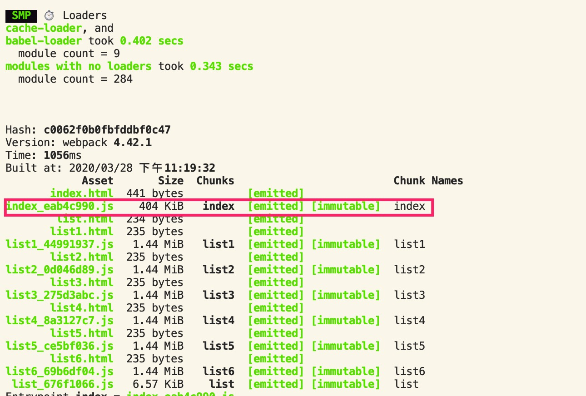
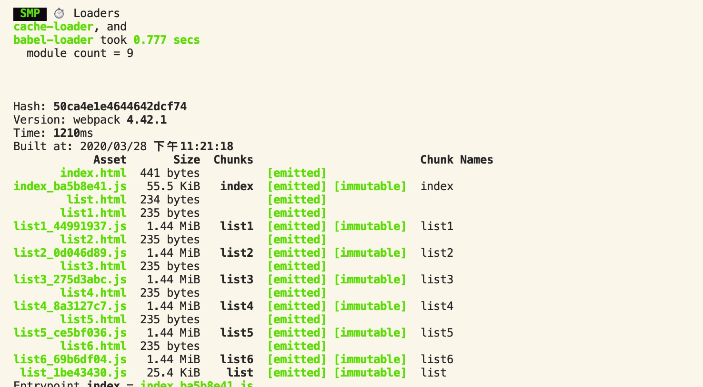

# 体积优化策略

实际的项目中，如果webpack打包出来的bundle文件特别大的话，浏览器下载这个js文件会比较慢，有可能会造成页面加载比较慢或者白屏的现象。所以对于bundle文件的体积优化也是很有必要的

## 1. 体积分析工具

可以使用`webpack-bundle-analyzer`插件来分析bundle文件的体积以及内部各个模块的占比，可以分析出哪些模块需要被优化

```js
const { BundleAnalyzerPlugin } = require('webpack-bundle-analyzer');

// plugins
plugins:[
  new BundleAnalyzerPlugin()
]
```


## 2. 体积优化的方案

体积优化的方案可以从下面一个方面来考虑

1. tree shaking
2. scope hoisting
3. 提取公共的模块
4. 压缩图片资源
5. babel优化
6. 使用动态的polyfill


### 2.1 tree shaking

Tree shaking是webpack内部针对生产环境做的一种体积优化。==会在编译的时候，对代码进行静态分析，标记一些无用的死代码，然后再压缩代码的时候，会去除掉这些死代码。==

**tree shaking的生效条件**：

1. **模块之间的引入方式是ES Module的时候才能生效，CommonJS无法生效**

**tree shaking的开启条件**：

1. mode为production
2. babel转化代码的时候，不能将ES Module转化成CommonJS

```js
mode:'development'

//.babelrc
"presets": [
	["@babel/env",{
    "modules":false
  }],
  	"@babel/react"
],
```

a.js中：

```js
export function add(a,b){
  console.log('useless');
  return a+b;
}
export function min(a,b){
  return Math.min(a,b);
}
```

index.js

```js
import {min} from './a.js'
console.log(min(1,2));
```

此时在打包之后的代码中，并不会引入add这个方法相关的代码。

#### 2.1.1 css代码的tree shaking

使用`purgecss-webpack-plugin`和`mini-css-extract-plugin`来实现css样式规则的tree shaking。注意，`purgecss-webpack-plugin`是不能单独使用的。

```js
const PurgecssPlugin = require('purgecss-webpack-plugin')
const SRC = path.join(__dirname,'src');

new PurgecssPlugin({
  paths:glob.sync(`${SRC}/**/*`,{nodir:true})  //指定当前插件分析的范围
})
```


### 2.2 scope hoisting

在webpack内部中，有实现一套自己的模块机制。**类似于Node.js中CommonJS的实现方式，webpack打包之后也会在每个模块外面包裹一层函数，注入一些模块导入导出相关的参数。**

**一旦模块很多的时候，会创建很多的函数作用域和闭包，会导致包的体积增加，也会加大内存的消耗。**

webpack3中提出了scope hoisting的概念，==静态分析模块之间的引用顺序，将所有模块的代码按照代码引用顺序放在一个函数作用域中，然后适当的重命名一些变量来防止命名冲突==。可以有效的减少函数作用域和闭包，缩小包的体积和内部的消耗

scope hoisting实际上就是将多个模块合并成一个模块，一般对于一些只被一个模块引用的模块可以使用。

==Scope hoisting的特点：==

1. production中默认会使用，也可以使用`ModuleConcatenationPlugin`插件来实现
2. 也只能使用ES Module的语法，CommonJS的语法不支持，因为CommonJS是动态引入的

#### 2.2.1 scope hoisting的效果

a.js

```js
export function add(a,b){
  console.log('useless');
  return a+b;
}
```

Index.js

```js
import { add } from './tree_shaking';
const sum = add(1,2);
export {sum}
```

如果没有配置scope hoisting

```js
{

/***/ "./src/index/index.js":
/*!****************************!*\
  !*** ./src/index/index.js ***!
  \****************************/
/*! exports provided: sum */
/***/ (function(module, __webpack_exports__, __webpack_require__) {

"use strict";
__webpack_require__.r(__webpack_exports__);
/* harmony export (binding) */ __webpack_require__.d(__webpack_exports__, "sum", function() { return sum; });
/* harmony import */ var _tree_shaking__WEBPACK_IMPORTED_MODULE_0__ = __webpack_require__(/*! ./tree_shaking */ "./src/index/tree_shaking.js");

var sum = Object(_tree_shaking__WEBPACK_IMPORTED_MODULE_0__["add"])(1, 2);


/***/ }),

/***/ "./src/index/tree_shaking.js":
/*!***********************************!*\
  !*** ./src/index/tree_shaking.js ***!
  \***********************************/
/*! exports provided: add */
/***/ (function(module, __webpack_exports__, __webpack_require__) {

"use strict";
__webpack_require__.r(__webpack_exports__);
/* harmony export (binding) */ __webpack_require__.d(__webpack_exports__, "add", function() { return add; });
function add(a, b) {
  console.log('useless');
  return a + b;
}

/***/ })

/******/ }
```

可以看到，这两个模块是没有合并在一起的，而是每个模块都包裹了一层函数作用域

**使用scope hoisting**

```js
{

/***/ "./src/index/index.js":
/*!****************************************!*\
  !*** ./src/index/index.js + 1 modules ***!
  \****************************************/
/*! exports provided: sum */
/***/ (function(module, __webpack_exports__, __webpack_require__) {

"use strict";
// ESM COMPAT FLAG
__webpack_require__.r(__webpack_exports__);

// EXPORTS
__webpack_require__.d(__webpack_exports__, "sum", function() { return /* binding */ sum; });

// CONCATENATED MODULE: ./src/index/tree_shaking.js
function add(a, b) {
  console.log('useless');
  return a + b;
}
var sum = add(1, 2);


/***/ })

/******/ }
```

可以看到，打包之后原来两个模块合并成了一个模块，而且bundle的体积也是有减少的。


### 2.3 提取公共资源(多页面)

在多页面应用中，多个页面之间往往都会涉及到一些共用的基础资源，如果每个页面打包都将这些基础资源打进去，会造成代码的冗余。

可以选择**将这些共用的基础包打成一个单独的包，然后在每个html页面中引用，这样公共的基础包只需要下载一次，避免了重复下载。**

#### 2.3.1 使用`html-webpack-externals-plugin`提供公共资源

使用这个插件可以将一些公共基础库分离出来，不打入bundle中去，使用cdn的方法引入到页面中

```js
const HtmlWebpackExternalsPlugin = require('html-webpack-externals-plugin');

new HtmlWebpackExternalsPlugin({
      externals:[
        {
          module:'react',
          entry:'https://unpkg.com/react@16/umd/react.production.min.js',
          global:'React'
        },
        {
          module:'react-dom',
          entry:'https://unpkg.com/react-dom@16/umd/react-dom.production.min.js',
          global:'ReactDOM'
        }
      ]
})
```

html文件：

```html
<script crossorigin src="https://unpkg.com/react@16/umd/react.production.min.js"></script>
<script crossorigin src="https://unpkg.com/react-dom@16/umd/react-dom.production.min.js"></script>
```

应该也可以使用一些插件将这地第三方包的资源自动加入html文件中

#### 2.3.2 使用SplitChunksPlugin来提取页面公共资源

这个插件是一个webpack4内置的插件，==不仅可以用来分离公共基础包，还可以将多个chunk中多次使用的片段代码打成一个公共包==。

##### 2.3.2.1 提取公共基础包

```js
optimization: {
  splitChunks:{
    cacheGroups:{
      commons:{
        test:/(react|react-dom)/,
        name:'vendors',
        chunks:'all'
      }
    }
  }
}

//将在html中引入公共包
new HtmlWebpackPlugin({
      template: path.join(__dirname, `src/${fileName}/index.html`),
      filename: `${fileName}.html`,
      chunks: ['vendors',fileName],  // 引入这个chunks
      inject: true,
      minify: {
        html5: true,
        collapseWhitespace: true,
        preserveLineBreaks: false,
        minifyCSS: true,
        minifyJS: true,
        removeComments: false
      }
    })
```

这个的公共包是以JSONP的方式引入的

##### 2.3.2.2 提取页面公共代码

将多个页面中多次使用的代码片段，提供打出一个公共包

```js
optimization: {
  splitChunks:{
    cacheGroups:{
      vendors:{
        test:/(react|react-dom)/,
        name:'vendors',
        chunks:'all',
        priority: 1 //设置抽离优先级，有时候模块会同时命中多个chunks,谁优先级高就放在哪个chunk
      },
      commons:{
        name:'commons',
        chunks:'all',
        minSize: 0, //是否抽取包的最小阈值，单位是字节
        minChunks: 2 //至少被两个chunk使用的代码才能被抽出去
      }
    }
  }
}

// 和上面一样，需要将抽取出来的chunks引入带html文件中
```


### 2.4 压缩图片资源

现在的页面中，图片资源占了很重要的一个部分，而且也很容易造成页面的加载卡顿。所以压缩图片是一个十分必要的操作

之前可能需要自己手动去压缩工具上压缩图片，现在借助webpack可以自动地将图片进行压缩。

**可以使用`image-webpack-loader`这个库来压缩图片，内部是基于Node中的imagemin来实现的**

```js
{
    test: /\.(gif|png|jpe?g|svg)$/,
    use: [
        {
            loader: 'file-loader',
            options: {
                name: '[name]_[hash:8].[ext]'
            }
          },
        {
            loader: 'image-webpack-loader',
            options: {
                mozjpeg: {
                    progressive: true,
                    quality: 65
                },
                // optipng.enabled: false will disable optipng
                optipng: {
                    enabled: false,
                },
                pngquant: {
                    quality: [0.65, 0.90],
                    speed: 4
                },
                gifsicle: {
                    interlaced: false,
                },
                // the webp option will enable WEBP
                webp: {
                    quality: 75
                }
            }
          }
        ]
}
```


### 2.5 babel优化 - 提取公共方法

babel在编译js代码的过程中，会创建很多的辅助函数来实现类似于`_createClass`等公共方法。默认情况下，它会插入到每一个js文件中

dog.js:

```js
class Dog{
  constructor(name){
    this.name = name;
  }
  say(){
    console.log('wang');
  }
}

export default Dog;
```

index.js

```js
import Dog from './dog';

class Cat{
  constructor(name){
    this.name = name;
    this.dog = new Dog('hehe');
  }
  say(){
    console.log('miao');
  }
}
```

打包出来的文件：

```js
{

/***/ "./src/list/dog.js":
/*!*************************!*\
  !*** ./src/list/dog.js ***!
  \*************************/
/*! exports provided: default */
/***/ (function(module, __webpack_exports__, __webpack_require__) {

"use strict";
__webpack_require__.r(__webpack_exports__);
function _classCallCheck(instance, Constructor) { if (!(instance instanceof Constructor)) { throw new TypeError("Cannot call a class as a function"); } }

function _defineProperties(target, props) { for (var i = 0; i < props.length; i++) { var descriptor = props[i]; descriptor.enumerable = descriptor.enumerable || false; descriptor.configurable = true; if ("value" in descriptor) descriptor.writable = true; Object.defineProperty(target, descriptor.key, descriptor); } }

function _createClass(Constructor, protoProps, staticProps) { if (protoProps) _defineProperties(Constructor.prototype, protoProps); if (staticProps) _defineProperties(Constructor, staticProps); return Constructor; }

var Dog = /*#__PURE__*/function () {
  function Dog(name) {
    _classCallCheck(this, Dog);

    this.name = name;
  }

  _createClass(Dog, [{
    key: "say",
    value: function say() {
      console.log('wang');
    }
  }]);

  return Dog;
}();

/* harmony default export */ __webpack_exports__["default"] = (Dog);

/***/ }),

/***/ "./src/list/index.js":
/*!***************************!*\
  !*** ./src/list/index.js ***!
  \***************************/
/*! no exports provided */
/***/ (function(module, __webpack_exports__, __webpack_require__) {

"use strict";
__webpack_require__.r(__webpack_exports__);
/* harmony import */ var _dog__WEBPACK_IMPORTED_MODULE_0__ = __webpack_require__(/*! ./dog */ "./src/list/dog.js");
function _classCallCheck(instance, Constructor) { if (!(instance instanceof Constructor)) { throw new TypeError("Cannot call a class as a function"); } }

function _defineProperties(target, props) { for (var i = 0; i < props.length; i++) { var descriptor = props[i]; descriptor.enumerable = descriptor.enumerable || false; descriptor.configurable = true; if ("value" in descriptor) descriptor.writable = true; Object.defineProperty(target, descriptor.key, descriptor); } }

function _createClass(Constructor, protoProps, staticProps) { if (protoProps) _defineProperties(Constructor.prototype, protoProps); if (staticProps) _defineProperties(Constructor, staticProps); return Constructor; }

var Cat = /*#__PURE__*/function () {
  function Cat(name) {
    _classCallCheck(this, Cat);

    this.name = name;
    this.dog = new _dog__WEBPACK_IMPORTED_MODULE_0__["default"]('hehe');
  }

  _createClass(Cat, [{
    key: "say",
    value: function say() {
      console.log('miao');
    }
  }]);

  return Cat;
}();

/***/ })

/******/ }
```

可以看出，每一个使用class的模块中，都会定义`_classCallCheck`、`_defineProperties`和`_createClass`等方法，这样**会造成包体积的增大，和代码的冗余**。

==babel中提供`@babel/plugin-transform-runtime`插件来解决这个问题。`@babel/plugin-transform-runtime`是一个可以重复使用的babel注入的帮助函数库，用来避免帮助函数的重复定义，减少包的体积。==

注意：`@babel/plugin-transform-runtime`需要依赖`@babel/runtime`

使用`@babel/plugin-transform-runtime`之后的结果

```js
{

/***/ "./node_modules/@babel/runtime/helpers/classCallCheck.js":
/*!***************************************************************!*\
  !*** ./node_modules/@babel/runtime/helpers/classCallCheck.js ***!
  \***************************************************************/
/*! no static exports found */
/***/ (function(module, exports) {

function _classCallCheck(instance, Constructor) {
  if (!(instance instanceof Constructor)) {
    throw new TypeError("Cannot call a class as a function");
  }
}

module.exports = _classCallCheck;

/***/ }),

/***/ "./node_modules/@babel/runtime/helpers/createClass.js":
/*!************************************************************!*\
  !*** ./node_modules/@babel/runtime/helpers/createClass.js ***!
  \************************************************************/
/*! no static exports found */
/***/ (function(module, exports) {

function _defineProperties(target, props) {
  for (var i = 0; i < props.length; i++) {
    var descriptor = props[i];
    descriptor.enumerable = descriptor.enumerable || false;
    descriptor.configurable = true;
    if ("value" in descriptor) descriptor.writable = true;
    Object.defineProperty(target, descriptor.key, descriptor);
  }
}

function _createClass(Constructor, protoProps, staticProps) {
  if (protoProps) _defineProperties(Constructor.prototype, protoProps);
  if (staticProps) _defineProperties(Constructor, staticProps);
  return Constructor;
}

module.exports = _createClass;

/***/ }),

/***/ "./src/list/dog.js":
/*!*************************!*\
  !*** ./src/list/dog.js ***!
  \*************************/
/*! exports provided: default */
/***/ (function(module, __webpack_exports__, __webpack_require__) {

"use strict";
__webpack_require__.r(__webpack_exports__);
/* harmony import */ var _babel_runtime_helpers_classCallCheck__WEBPACK_IMPORTED_MODULE_0__ = __webpack_require__(/*! @babel/runtime/helpers/classCallCheck */ "./node_modules/@babel/runtime/helpers/classCallCheck.js");
/* harmony import */ var _babel_runtime_helpers_classCallCheck__WEBPACK_IMPORTED_MODULE_0___default = /*#__PURE__*/__webpack_require__.n(_babel_runtime_helpers_classCallCheck__WEBPACK_IMPORTED_MODULE_0__);
/* harmony import */ var _babel_runtime_helpers_createClass__WEBPACK_IMPORTED_MODULE_1__ = __webpack_require__(/*! @babel/runtime/helpers/createClass */ "./node_modules/@babel/runtime/helpers/createClass.js");
/* harmony import */ var _babel_runtime_helpers_createClass__WEBPACK_IMPORTED_MODULE_1___default = /*#__PURE__*/__webpack_require__.n(_babel_runtime_helpers_createClass__WEBPACK_IMPORTED_MODULE_1__);


var Dog = /*#__PURE__*/function () {
  function Dog(name) {
    _babel_runtime_helpers_classCallCheck__WEBPACK_IMPORTED_MODULE_0___default()(this, Dog);

    this.name = name;
  }

  _babel_runtime_helpers_createClass__WEBPACK_IMPORTED_MODULE_1___default()(Dog, [{
    key: "say",
    value: function say() {
      console.log('wang');
    }
  }]);

  return Dog;
}();

/* harmony default export */ __webpack_exports__["default"] = (Dog);

/***/ }),

/***/ "./src/list/index.js":
/*!***************************!*\
  !*** ./src/list/index.js ***!
  \***************************/
/*! no exports provided */
/***/ (function(module, __webpack_exports__, __webpack_require__) {

"use strict";
__webpack_require__.r(__webpack_exports__);
/* harmony import */ var _babel_runtime_helpers_classCallCheck__WEBPACK_IMPORTED_MODULE_0__ = __webpack_require__(/*! @babel/runtime/helpers/classCallCheck */ "./node_modules/@babel/runtime/helpers/classCallCheck.js");
/* harmony import */ var _babel_runtime_helpers_classCallCheck__WEBPACK_IMPORTED_MODULE_0___default = /*#__PURE__*/__webpack_require__.n(_babel_runtime_helpers_classCallCheck__WEBPACK_IMPORTED_MODULE_0__);
/* harmony import */ var _babel_runtime_helpers_createClass__WEBPACK_IMPORTED_MODULE_1__ = __webpack_require__(/*! @babel/runtime/helpers/createClass */ "./node_modules/@babel/runtime/helpers/createClass.js");
/* harmony import */ var _babel_runtime_helpers_createClass__WEBPACK_IMPORTED_MODULE_1___default = /*#__PURE__*/__webpack_require__.n(_babel_runtime_helpers_createClass__WEBPACK_IMPORTED_MODULE_1__);
/* harmony import */ var _dog__WEBPACK_IMPORTED_MODULE_2__ = __webpack_require__(/*! ./dog */ "./src/list/dog.js");

var Cat = /*#__PURE__*/function () {
  function Cat(name) {
    _babel_runtime_helpers_classCallCheck__WEBPACK_IMPORTED_MODULE_0___default()(this, Cat);

    this.name = name;
    this.dog = new _dog__WEBPACK_IMPORTED_MODULE_2__["default"]('hehe');
  }

  _babel_runtime_helpers_createClass__WEBPACK_IMPORTED_MODULE_1___default()(Cat, [{
    key: "say",
    value: function say() {
      console.log('miao');
    }
  }]);

  return Cat;
}();

/***/ })

/******/ }
```

可以看出，有**将公共的方法提出来单独当做一个模块来使用**。

### 2.6 babel优化 - polyfill

polyfill是垫脚片的意思，顾名思义就是用来弥补浏览器之间的差异的工具。不同种类和不同版本的浏览器都存在着不小的差异，如果需要一套代码用在多个浏览器中，就需要解决浏览器之间的差异。这个工作babel帮你做了。

babel中有一个`@babel/polyfill`模块，专门解决浏览器之间的差异，需要直接引入在页面中。

但是实际上随着浏览器的发展，现在很多的浏览器已经支持了很多的特性，polyfill中真正能用的上的就很少了，如果一股脑的直接把整个polyfill模块都加入到页面上，会导致bundle的体积增大。

**babel中在`@babel/preset-env`中提供了一个`useBuiltIns`参数，设置值为 `usage` 时，就只会包含代码需要的 polyfill。**（==是根据当前代码中是否使用来判断是否需要某个属性的polyfill，而不是判断浏览器是否支持==）

有一点需要注意：配置此参数的值为 `usage` ，必须要同时设置 `corejs` (如果不设置，会给出警告，默认使用的是"corejs": 2) 。这里建议使用 `core-js@3`，因为core-js@2不会再添加新特性，新特性都会加在core-js@3中

index.js

```js
import '@babel/polyfill';
new Promise((resolve, reject)=>{
  setTimeout(()=>{
    resolve(123)
  },1000)
})
```

没有使用useBuiltIns参数的时候，打包出来的体积



使用useBuiltIns的时候




### 2.7 使用动态的polyfill服务

上面的polyfill优化方案中还是存在一些问题，就是上面的方法中，判断是否需要引入某个属性的polyfill是根据后面代码是否有引用来判断的。而不是根据js宿主环境的版本来判断的。

**如果代码中使用到了Promise这个特性，就会将这个特性对应的polyfill引入进去，但是实际上很多浏览器是一家支持了Promise的，所以在很多的情况下，也会造成无意义的引入。**

==动态的polyfill指的就是根据当前的浏览器UA动态请求需要的polyfill特性。==

Polyfill.io官方提供的服务

```html
<script src="https://cdn.polyfill.io/v2/polyfill.min.js"></script>
```


## 3. 参考文章

1. [带你深度解锁Webpack系列(优化篇)](https://juejin.im/post/5e6cfdc85188254913107c1f#heading-17)

2. [不容错过的 Babel7 知识](https://juejin.im/post/5ddff3abe51d4502d56bd143#heading-6)

3. [测试项目](https://github.com/careyke/webpack-test)

