# 详细分析页面首次渲染和JS、CSS资源的关系

页面首次渲染时和JS、CSS资源之间的关系是一个困惑笔者很久的问题。看过了很多的文章，但是感觉分析得都比较粗略，其中的很多细节还是没有讲清楚。在这篇文章中，笔者会结合一些具体的实例来详细的解读其中的关系。


## 1. 页面渲染的完整流程（***）

在分析页面渲染和静态资源之间的关系之前，我们先要来分析**一个HTML文件从下载到最终内容呈现到页面上**这其中经历了哪些过程。

可以理解为是**一个完整的渲染周期**：

1. 渲染进程将`HTML`内容转化成能够读懂的**`DOM 树`**结构（**Parse HTML**）
2. 渲染引擎将`CSS`样式表转化成浏览器可以理解的**`StyleSheets`**，计算出`DOM`节点的样式（**Parse Stylesheet 、Recalculate Style**）

3. 创建**布局树**，并计算布局信息（**Layout**）
4. 对布局树进行分层，并生成**分层树**（**Update Layer Tree**）
5. 为每个图层生成**绘制列表**，并将其提交给**合成线程**（**Paint**）
6. 合成线程将图层分成**图块**，并在**光栅化线程池**中将图块转化成**位图**（**Composite Layers**）
7. 合成线程发送绘制图块的命令 **`DrawQuad`** 给浏览器进程
8. 浏览器进程根据 `DrawQuad` 消息**生成页面**，并显示在显示器上

上面渲染的步骤中，后面括号中标注的是**每个步骤对应的`Performance`中的任务**。其中6、7、8三步可以理解为对应的任务都是`Composite Layers`。

**这里列出的是一个完整的任务链，在实际的渲染中，浏览器会做出相应的优化，不一定每次渲染都会执行所有的任务**。

> 这里针对`Recalculate Style`需要说明一下：
>
> 这个任务主要做的工作是**从`StyleSheets`中计算每个`DOM`节点的样式信息**，这个任务执行的时机有以下几种：
>
> 1. 发生在`Parse HTML`阶段。比如`CSS和JS`文件都在head中引入，此时`StyleSheets`已经生成，可以再创建DOM时计算对应的样式
> 2. 单独执行。比如当`Parse HTML`完成之后，css文件才下载完成，会先执行`Parse StyleSheet`，然后再执行`Recalculate Style`
>
> 主要是想说**这个任务是一个灵活的任务，可以和其他任务合并执行。**

> 页面渲染流程的详细分析可以看[这里](https://time.geekbang.org/column/article/118205)，李兵老师在极客时间开的课程，推荐！


上面流程中可以看到，**只有`Composite Layers`任务执行完成之后，对应的内容才会显示到浏览器中**。后面分析中我们可以通过这个任务来判断页面首次渲染的时机。

> 在具体的测试过程中，极少场景中`Composite Layers`任务执行完也不一定会显示到浏览器中，但是多刷新几次有可能还是会。
>
> 这里笔者猜测是浏览器的一个优化行为，具体是否需要渲染到显示器中要具体看当前的资源调度情况。
>
> 但是这个并不影响分析，我们还是可以将`Composite Layers`任务看做是页面渲染的信号。


## 2. 页面渲染和静态资源之间的关系

### 2.1 分析页面渲染情况的工具

前面我们也提到过，分析页面的渲染过程使用的`Performance`，这个工具会**将页面渲染期间主线程的各个任务都标注出来**，方便分析。

这里还有几个实用的技巧：

1. 可以适当降低网速，延长文件的下载时间，方便分析
2. 可以适当降低CPU的性能，延长每个任务的时间，方便分析
3. 可以在`network`页签中关掉资源的缓存


### 2.2 分析的例子

后续的分析都是以下面这个例子为基础来分析的，针对不同的场景，JS、CSS资源的引入位置会发生变化。

```html
<!DOCTYPE html>
<html lang="en">
<head>
  <meta charset="UTF-8">
  <meta http-equiv="X-UA-Compatible" content="IE=edge">
  <meta name="viewport" content="width=device-width, initial-scale=1.0">
  <title>Document</title>
  
  <link rel="stylesheet" href="https://cdn.jsdelivr.net/npm/bootstrap@4.6.0/dist/css/bootstrap.min.css">
  <script type="text/javascript" src="https://cdn.jsdelivr.net/npm/bootstrap@4.6.0/dist/js/bootstrap.min.js"></script>
</head>
<body>
    <div>1</div>
    <div>2</div>
    <div>3</div>
</body>
</html>
```

> 后续的分析中会以**外链资源**为例来分析

> Chrome的版本：91.0.4472.77


### 2.3 head中的静态资源

#### 2.3.1 当head中只存在CSS资源

```html
<!DOCTYPE html>
<html lang="en">
<head>
  <meta charset="UTF-8">
  <meta http-equiv="X-UA-Compatible" content="IE=edge">
  <meta name="viewport" content="width=device-width, initial-scale=1.0">
  <title>Document</title>
  
  <link rel="stylesheet" href="https://cdn.jsdelivr.net/npm/bootstrap@4.6.0/dist/css/bootstrap.min.css">
</head>
<body>
    <div>1</div>
    <div>2</div>
    <div>3</div>
</body>
</html>
```

对应的`Performance`中的执行截图如下：


从上面两张图中可以看出：**head中CSS文件的下载并不会阻塞DOM树的构建，但是`Parse Stylesheet`任务会阻塞`Layout`任务，也就是阻塞页面的渲染。**

> 对应内联的样式来说，也就是通过`style`标签引入的样式，没有对应的`Parse Stylesheet`任务，感觉是在`Parse HTML`时解析到`style`标签时，做了相应的操作。


#### 2.3.2 当head中只存在JS资源

```html
<!DOCTYPE html>
<html lang="en">
<head>
  <meta charset="UTF-8">
  <meta http-equiv="X-UA-Compatible" content="IE=edge">
  <meta name="viewport" content="width=device-width, initial-scale=1.0">
  <title>Document</title>
  
  <script type="text/javascript" src="https://cdn.jsdelivr.net/npm/bootstrap@4.6.0/dist/js/bootstrap.min.js"></script>
</head>
<body>
    <div>1</div>
    <div>2</div>
    <div>3</div>
</body>
</html>
```

对应的Performance中的执行截图如下：


上面图中可以看到，**head中JS文件的下载和执行都会阻塞DOM树的构建**

> 这里有一个细节需要注意一下：
>
> 当页面没有样式文件时，`Recalculate Style`和`Layout`都是发生在`Parse HTML`过程中


#### 2.3.3 当head中CSS在JS之前引入

```html
<!DOCTYPE html>
<html lang="en">
<head>
  <meta charset="UTF-8">
  <meta http-equiv="X-UA-Compatible" content="IE=edge">
  <meta name="viewport" content="width=device-width, initial-scale=1.0">
  <title>Document</title>
  
  <link rel="stylesheet" href="https://cdn.jsdelivr.net/npm/bootstrap@4.6.0/dist/css/bootstrap.min.css">
  <script type="text/javascript" src="https://cdn.jsdelivr.net/npm/bootstrap@4.6.0/dist/js/bootstrap.min.js"></script>
</head>
<body>
    <div>1</div>
    <div>2</div>
    <div>3</div>
</body>
</html>
```

对应的Performance中的执行截图如下：


从上面的截图中可以看到：**在head标签中，当CSS在JS之前时，JS和CSS并行下载，但是JS的执行需要等到`Parse Stylesheet`任务完成。**

也就是说，**CSS的执行阻塞了JS文件的执行，间接的阻塞了DOM树的解析**。


#### 2.3.4 当head中JS在CSS之前引入

```html
<!DOCTYPE html>
<html lang="en">
<head>
  <meta charset="UTF-8">
  <meta http-equiv="X-UA-Compatible" content="IE=edge">
  <meta name="viewport" content="width=device-width, initial-scale=1.0">
  <title>Document</title>
  
  <script type="text/javascript" src="https://cdn.jsdelivr.net/npm/bootstrap@4.6.0/dist/js/bootstrap.min.js"></script>
  <link rel="stylesheet" href="https://cdn.jsdelivr.net/npm/bootstrap@4.6.0/dist/css/bootstrap.min.css">
</head>
<body>
    <div>1</div>
    <div>2</div>
    <div>3</div>
</body>
</html>
```

对应的Performance中的执行截图如下


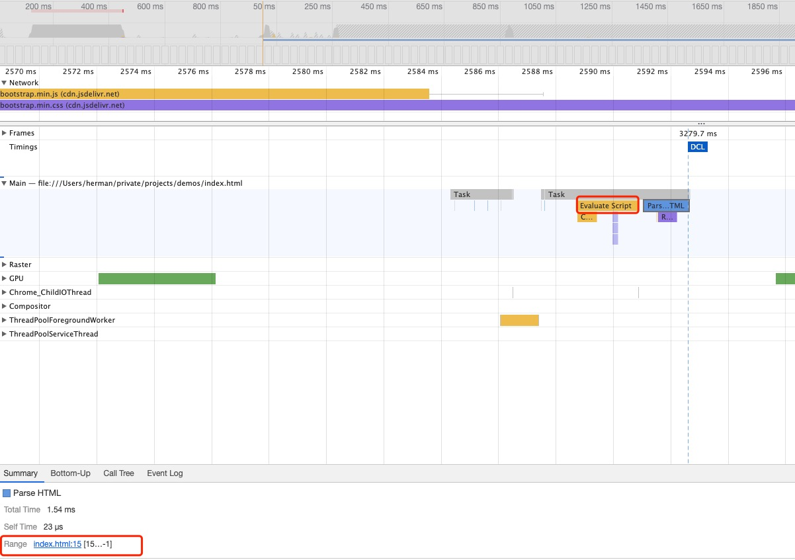


从上面截图可以看出：**在head中，当JS文件在CSS文件之前引入时，JS文件的执行不需要等待后面CSS文件的执行完成，CSS文件不阻塞DOM树的构建，但是会阻塞页面首次渲染。**


这里还有一种情况：**当JS文件很大，CSS文件很小时**

```html
<!DOCTYPE html>
<html lang="en">
<head>
  <meta charset="UTF-8">
  <meta http-equiv="X-UA-Compatible" content="IE=edge">
  <meta name="viewport" content="width=device-width, initial-scale=1.0">
  <title>Document</title>
  
  <script type="text/javascript" src="https://cdn.jsdelivr.net/npm/bootstrap@4.6.0/dist/js/bootstrap.min.js"></script>
  <link rel="stylesheet" href="./index.css">
</head>
<body>
    <div>1</div>
    <div>2</div>
    <div>3</div>
</body>
</html>

// index.css
#test{
  background-color: yellow;
}
```

对应的`Performance`截图


从上面图片中可以看出：**当CSS文件在JS文件之后引入时，JS文件的下载和执行也会阻塞CSS文件的执行，但是CSS文件的执行不会阻塞DOM树的构建**。


#### 2.3.5 总结（*）

**当静态资源（JS和CSS）在`head`标签内部引入时**：

1. CSS文件的下载和执行不会阻塞DOM树的构建，但是会阻塞页面的首次渲染
2. JS文件的下载和执行都会阻塞DOM树的构建，也会阻塞首次渲染
3. 当CSS在JS文件**之前**引入时，JS文件中可能会涉及到对应样式的操作，所以需要**等待前面所有的CSS文件下载并执行完成之后才能执行JS代码**，所以这种情况下，CSS文件的下载和执行也间接的阻塞了DOM树的构建。
4. 当CSS文件在JS文件**之后**引入时，JS并不会等待CSS文件执行完成，而且**JS的下载和执行也会阻塞后面CSS文件的执行**。（可以理解阻塞CSSOM的构建）

可以看到，**在`head`标签内引入的静态资源都会阻塞页面的首次渲染**


### 2.4 body中的静态资源

body标签内部的内容最终需要渲染到页面上，所以在针对body内的静态资源进行分析时需要区分更多的情况。

#### 2.4.1 当body中只有CSS资源

```html
<!DOCTYPE html>
<html lang="en">
<head>
  <meta charset="UTF-8">
  <meta http-equiv="X-UA-Compatible" content="IE=edge">
  <meta name="viewport" content="width=device-width, initial-scale=1.0">
  <title>Document</title>
</head>
<body>
    <div>1</div>
    <div>2</div>
  	<link rel="stylesheet" href="https://cdn.jsdelivr.net/npm/bootstrap@4.6.0/dist/css/bootstrap.min.css">
    <div>3</div>
</body>
</html>
```

对应的Performance中的执行截图：


从上面的图中可以看出：当CSS文件在body中引入时，整个HTML文件渲染完成总共更新了三次页面

1. 第一次是在`Parse HTML`阶段，当解析到`link`标签时，暂停DOM树的解析，就会发起请求并根据之前构建好的DOM树渲染一次页面
2. 第二次是在CSS文件下载并执行完成之后，会执行一次页面渲染
3. 继续解析HTML中后续的部分，解析完成之后执行一次页面渲染

这里有几个细节需要说一下：

1. **第二次渲染和第三次渲染不一定都会存在**，浏览器会根据当时的资源来做合理的调度，当CSS资源比较小时，有可能会合并第二和第三步。
2. 当解析到`body`中的第一个`link`标签时，也不一定会中断`Parse HTML`并渲染一次页面。但是**大部分场景下都会中断DOM树的构建并渲染一次页面**。当CSS文件较小时，也可能不会渲染一次页面

3. 对于`body`中添加的内联样式`style`，不会提前渲染一次页面


也就是说：**body中引入CSS文件时，CSS文件的下载和执行会阻塞DOM树的渲染，但是不会阻塞首屏渲染。当解析到`link`标签时，会将之前构建的DOM树和样式渲染到页面上。**

> 对于大部分外链的CSS文件来说


#### 2.4.2 当body中只有JS资源

```html
<!DOCTYPE html>
<html lang="en">
<head>
  <meta charset="UTF-8">
  <meta http-equiv="X-UA-Compatible" content="IE=edge">
  <meta name="viewport" content="width=device-width, initial-scale=1.0">
  <title>Document</title>
</head>
<body>
    <div>1</div>
    <div>2</div>
  	<script type="text/javascript" src="https://cdn.jsdelivr.net/npm/bootstrap@4.6.0/dist/js/bootstrap.min.js"></script>
    <div>3</div>
</body>
</html>
```

对应的Performance的执行截图：


上面图中可以看到：当在body中引入JS文件时

1. 当解析到`script`标签时，会下载JS文件并根据当前的DOM树渲染一次页面
2. JS文件下载并执行完成之后，继续构建DOM树，构建完成之后再执行一次渲染


**当包含多个JS文件的时候**

1. 当第一个JS文件**小于**第二个JS文件

   ```html
   <!DOCTYPE html>
   <html lang="en">
   <head>
     <meta charset="UTF-8">
     <meta http-equiv="X-UA-Compatible" content="IE=edge">
     <meta name="viewport" content="width=device-width, initial-scale=1.0">
     <title>Document</title>
   </head>
   <body>
     	<script type="text/javascript" src="./index.js"></script>
       <div>1</div>
       <div>2</div>
     	<script type="text/javascript" src="https://cdn.jsdelivr.net/npm/bootstrap@4.6.0/dist/js/bootstrap.min.js"></script>
       <div>3</div>
   </body>
   </html>
   
   // index.js
   const p = document.querySelector('#test');
   p.style.backgroundColor = 'green';
   ```

   此时`bootstrap.min.js` 比 `index.js`要大得多，`index.js`请求回来之后，`bootstrap.min.js`肯定还没有回来，此时会是这种情况

   

   可以看到，这里解析到index.js时并没有先渲染一次，而是继续解析html资源，等到解析到`bootstrap.min.js`时才渲染页面。

   这里应该是属于浏览器的一个**优化**操作，对于**下载速度非常快的JS文件，可以合并渲染。**CSS文件也是一样的


2. 当第一个JS文件**大于**第二个JS文件

   ```html
   <!DOCTYPE html>
   <html lang="en">
   <head>
     <meta charset="UTF-8">
     <meta http-equiv="X-UA-Compatible" content="IE=edge">
     <meta name="viewport" content="width=device-width, initial-scale=1.0">
     <title>Document</title>
   </head>
   <body>
     	<script type="text/javascript" src="https://cdn.jsdelivr.net/npm/bootstrap@4.6.0/dist/js/bootstrap.min.js"></script>
       <div>1</div>
       <div>2</div>
     	<script type="text/javascript" src="./index.js"></script>
       <div>3</div>
   </body>
   </html>
   
   // index.js
   const p = document.querySelector('#test');
   p.style.backgroundColor = 'green';
   ```

   对应的截图

   

   这里也是浏览器的一个优化操作。**浏览器并不是解析到某个`script`标签或者`link`标签才去请求资源**。这里浏览器做了一个**预解析操作**，当渲染引擎收到字节流之后，会开始一个预解析线程，用来分析HTML文件中包含哪些需要请求的资源，会提前发起请求。

   上面正是因为预解析操作，`index.js`也在一开始就发起请求，等到`bootstrap.min.js`请求完成时，此时`index.js`已经下载完成，所以不需要再次中断`Parse HTML`，在`Parse HTML`任务中执行这个JS文件即可


也就是说，对于body中引入的JS文件来说，**当解析到`script`标签时，会渲染一次页面并中断DOM树的构建，等到`JS`文件下载并执行完成之后才会继续构建DOM树**。按道理来说对于每个script标签都是这个执行步骤，但是浏览器采用预解析操作，根据文件下来的速度进行了一些优化，减少了页面渲染的次数。


#### 2.4.3 当body中CSS在JS之前引入

```html
<!DOCTYPE html>
<html lang="en">
<head>
  <meta charset="UTF-8">
  <meta http-equiv="X-UA-Compatible" content="IE=edge">
  <meta name="viewport" content="width=device-width, initial-scale=1.0">
  <title>Document</title>
</head>
<body>
    <div>1</div>
  	<link rel="stylesheet" href="https://cdn.jsdelivr.net/npm/bootstrap@4.6.0/dist/css/bootstrap.min.css">
    <div>2</div>
  	<script type="text/javascript" src="https://cdn.jsdelivr.net/npm/bootstrap@4.6.0/dist/js/bootstrap.min.js"></script>
    <div>3</div>
</body>
</html>
```

对应的Performance执行截图


上面图中有一个现象，当CSS文件在下载的时候，并没有继续去解析DOM树，而是等到CSS文件下载并执行完成之后才会继续构建DOM树。

也就是说，**body中引入的CSS文件其下载和执行也会阻塞DOM树的构建。**（这个和很多文章中说的不一样）

上图中当解析到`script`标签时，对应的JS文件已经下载好，浏览器进行了优化操作，将`Parse HTML`和`Evaluate Script`合并一个任务执行。

> **注意**
>
> 这里JS文件的执行也是等到前面的CSS文件执行完成之后才执行的，但是实现的方式有很大的差别。


#### 2.4.4 当body中JS在CSS之前引入

```html
<!DOCTYPE html>
<html lang="en">
<head>
  <meta charset="UTF-8">
  <meta http-equiv="X-UA-Compatible" content="IE=edge">
  <meta name="viewport" content="width=device-width, initial-scale=1.0">
  <title>Document</title>
</head>
<body>
    <div>1</div>
  	<script type="text/javascript" src="https://cdn.jsdelivr.net/npm/bootstrap@4.6.0/dist/js/bootstrap.min.js"></script>
    <div>2</div>
  	<link rel="stylesheet" href="https://cdn.jsdelivr.net/npm/bootstrap@4.6.0/dist/css/bootstrap.min.css">
    <div>3</div>
</body>
</html>
```

对应的Performance执行截图

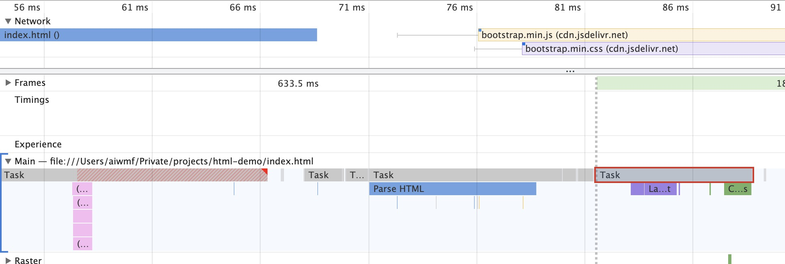


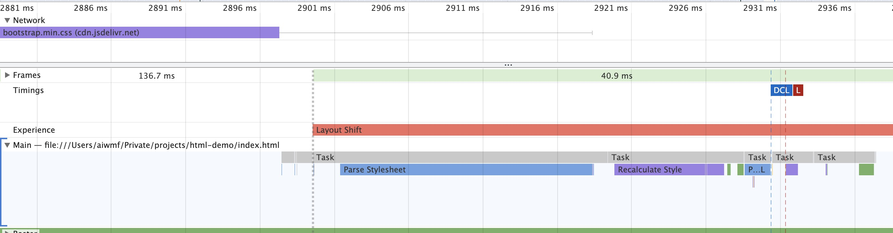

上面图中可以看出，**body中JS文件的执行和后置的CSS文件没有关系，下载完就会执行，下载和执行的过程中会阻塞DOM树的构建**。

上面第三个截图中，此时JS文件以及执行完成，CSS文件在下载，但是此时并没有继续解析DOM，而是等到CSS文件下载并执行完成之后才继续解析DOM。由此我们可以认为**body中引入的CSS文件其下载和执行也会阻塞DOM树的构建**。

> 当CSS文件比较小时，比JS文件提前下载完成，这是浏览器会进行优化，将`Parse HTML`和`Parse Stylesheet`合并操作，减少渲染次数。


#### 2.4.5 总结

根据上面对于body中引入资源的分析，我们可以得出以下结论：

1. **在DOM构建的过程中，当解析到body中的外链资源时，当前资源如果不是特别小，都会在当前DOM树的基础上触发一次页面渲染。也就是首屏渲染。**

2. **body中的JS文件的下载和执行的过程会阻塞DOM树的构建**，这和head中是一样的
3. **body中的CSS文件的下载和执行也会阻塞DOM树的构建**，这个和head中是不一样的
4. 浏览器实现了**预解析操作**，会提前分析HTML文件中引入了哪些资源，**提前并行发出请求**
5. 渲染进程在页面的渲染过程中，**根据当前引入文件的大小和请求响应的快慢，对页面的渲染做出了一下优化，目的是减少资源引入的过程中页面渲染的次数**。（这里的渲染是指渲染到显示屏上）


### 2.5 静态资源分别在head和body中

#### 2.5.1 CSS在head中，JS在body中

```html
<!DOCTYPE html>
<html lang="en">
<head>
  <meta charset="UTF-8">
  <meta http-equiv="X-UA-Compatible" content="IE=edge">
  <meta name="viewport" content="width=device-width, initial-scale=1.0">
  <title>Document</title>
  <link rel="stylesheet" href="https://cdn.jsdelivr.net/npm/bootstrap@4.6.0/dist/css/bootstrap.min.css">
</head>
<body>
    <div>1</div>
  	<script type="text/javascript" src="https://cdn.jsdelivr.net/npm/bootstrap@4.6.0/dist/js/bootstrap.min.js"></script>
    <div>2</div>
    <div>3</div>
</body>
</html>
```

对应的Performance的执行截图：

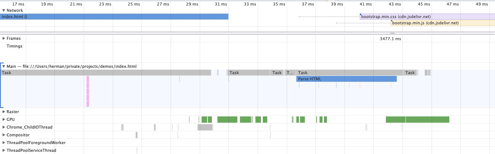

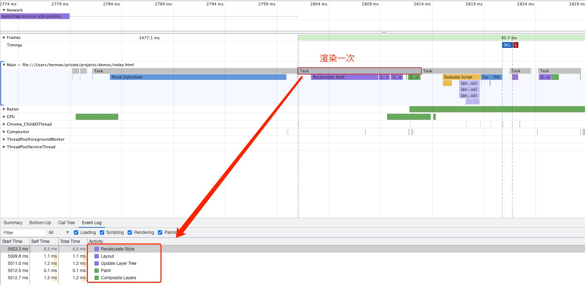

上面图中可以看到：**当解析到body中的`script`标签执行首次渲染的时候，需要等到head中的CSS文件下载并执行完成**。也就是说**head中的CSS文件会阻塞首屏渲染。**


#### 2.5.2 JS在head中，CSS在body中

```html
<!DOCTYPE html>
<html lang="en">
<head>
  <meta charset="UTF-8">
  <meta http-equiv="X-UA-Compatible" content="IE=edge">
  <meta name="viewport" content="width=device-width, initial-scale=1.0">
  <title>Document</title>
  <script type="text/javascript" src="https://cdn.jsdelivr.net/npm/bootstrap@4.6.0/dist/js/bootstrap.min.js"></script>
</head>
<body>
    <div>1</div>
  	<link rel="stylesheet" href="https://cdn.jsdelivr.net/npm/bootstrap@4.6.0/dist/css/bootstrap.min.css">
    <div>2</div>
    <div>3</div>
</body>
</html>
```

对应的Performance的执行截图：

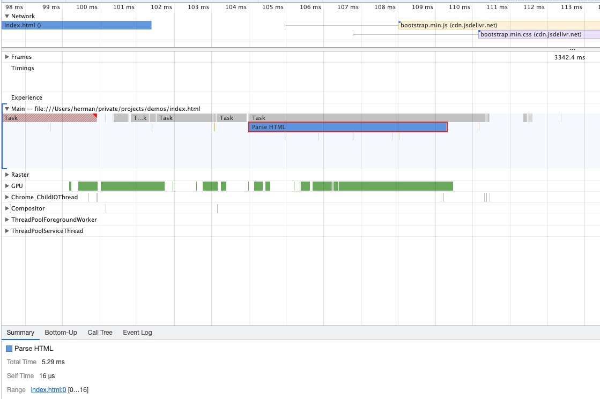

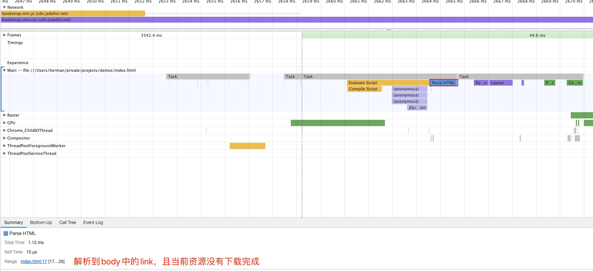

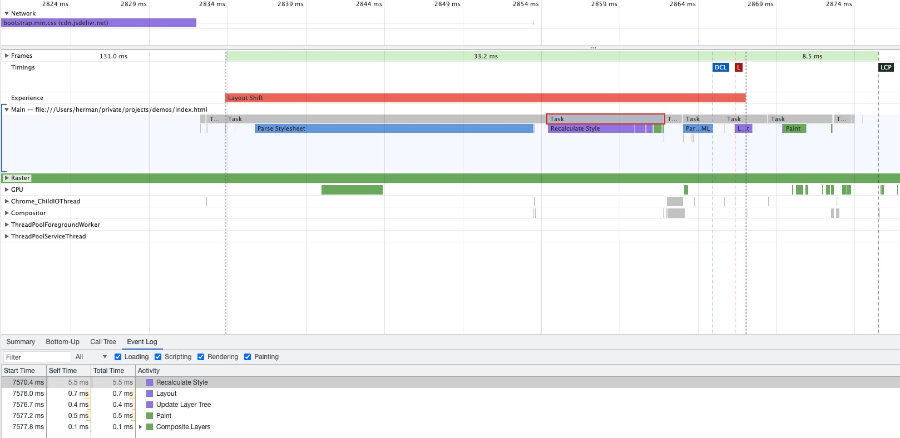

上面流程可以看到：**当解析到body中的link标签时，由于此时CSS资源还没有下载完成，所以会触发一次渲染，也就是首次渲染。**


### 2.6 总结（***）

#### 2.6.1 静态资源的下载和执行

在前面的分析中，我们穿插着提到了一些资源的下载和执行的时机，下面来总结一下：

1. **下载**：由于浏览器提供了**预解析操作**，会提前解析HTML中有哪些资源需要下载。**这些资源会提前下载，可以认为是同步发起下载请求**。并不是解析到对应的script或者link标签才请求。
2. **执行**：**一般来说是解析到对应的标签时会执行，如果此时资源没有下载完，会暂停解析等待**。但是也有例外的情况，head中的CSS文件下载和执行不会阻塞DOM树的构建，所以`Parse HTML`任务没有暂停等待CSS文件下载执行完。


#### 2.6.2 静态资源和页面渲染的关系

通过上面针对各种场景的分析，**同步引入的外链静态资源**与页面渲染的关系可以总结如下：

1. 对于head中引入的静态资源

   - CSS：CSS文件的下载和执行不会阻塞DOM树的构建，但是会阻塞首次渲染
   - JS：JS文件的下载和执行都会阻塞DOM树的构建，而且会阻塞首次渲染。
   - 如果JS前面有引入CSS文件，JS文件的执行需要等待前面的CSS文件下载并执行完成，然后才开始执行。因为JS中有可能修改DOM树中节点的样式

2. 对于body中引入的静态资源

   - **当解析到body中的`link或者script`标签时，如果此时对应的资源还没有下载完成（这里可能有一个buffer时间），会触发一次页面渲染。如果资源已经下载完成，不会触发页面渲染，资源的执行会发生在`Parse HTML`任务中，减少渲染次数**。

   - CSS：CSS文件的下载和执行会阻塞DOM树的构建，不会阻塞首屏渲染。
   - JS：JS文件的下载和执行也会阻塞DOM树的构建，不会阻塞首屏渲染。这里JS仍然需要等到前面的CSS文件下载执行完成之后才会执行，但是和head中实现原理不一样。**body中因为CSS文件的下载和执行本身就会阻塞DOM树的构建。**

3. 对于同时在head和body中引入静态资源，对应的资源也会遵守上面总结的规则。
   - head中引入的CSS文件不会阻塞DOM构建，但是会阻塞页面首次渲染。
   - body中引入的JS文件需要等到head中的CSS文件下载并执行完成之后才会执行。这里的原因和上面两种也不一样，这里是**因为body中的`script`会触发一次页面渲染，而且head中的CSS文件下载和执行刚好会阻塞页面的渲染。**

> 所以说：**JS文件的执行需要等到前面引入的CSS文件下载并执行完成之后才能开始执行。**


#### 2.6.3 浏览器在渲染过程做的优化

1. **预解析操作，并行下载**
2. **合并任务，减少渲染**：当解析到body中的`link或script`标签时，如果该资源已经下载完成，不会触发渲染


#### 2.6.4 为什么CSS要在head中，JS要放在body的最后？

在雅虎军规中，有一条规则是CSS资源要放在head中，JS资源要放在body的最后，这样要能够提高页面的渲染体验。那么为什么能够提高体验呢？这里我们结合上面总结的规则来分析一下。

首先要想提高渲染的体验，要满足以下两点：

1. **页面渲染足够快**

   基于这一点，JS文件不能放在head中，因为JS文件会head中会阻塞DOM构建，而且不会触发一次渲染。所以JS文件只能放在body中。

2. **页面首屏内容要有样式而且尽可能完整**，否则页面内容会抖动

   基于这一点，CSS文件不能放在body中，因为在body中CSS不仅会阻塞DOM树的构建，还会触发一次渲染，而且没有样式信息。所以CSS文件需要放在head中，不会阻塞DOM树的构建。

   还有就是script应该放在body的最后面，可以在首次渲染时尽可能渲染完整页面


### 2.7 异步JS资源

#### 2.7.1 async

```html
<!DOCTYPE html>
<html lang="en">
<head>
  <meta charset="UTF-8">
  <meta http-equiv="X-UA-Compatible" content="IE=edge">
  <meta name="viewport" content="width=device-width, initial-scale=1.0">
  <title>Document</title>
  <script async type="text/javascript" src="./index.js"></script>
  <script async type="text/javascript" src="https://unpkg.com/react@17/umd/react.development.js"></script>
</head>
<body>
    <div>1</div>
    <div>2</div>
    <div>3</div>
  	<script type="text/javascript" src="https://cdn.jsdelivr.net/npm/bootstrap@4.6.0/dist/js/bootstrap.min.js"></script>
</body>
</html>
```

对应的Performance的执行截图：

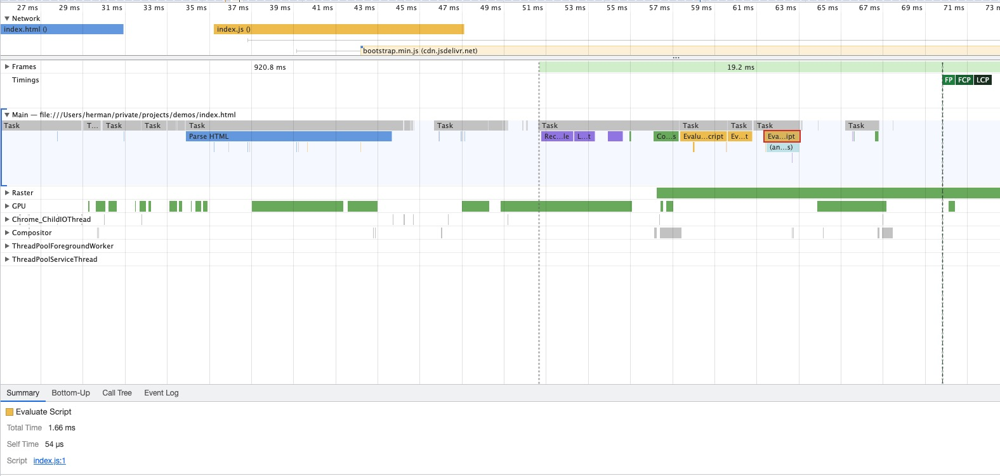

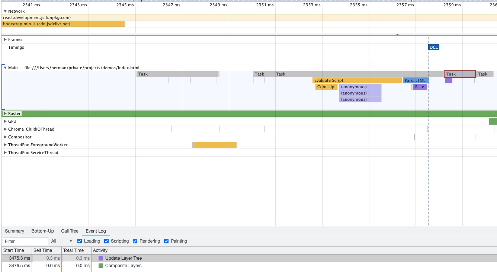

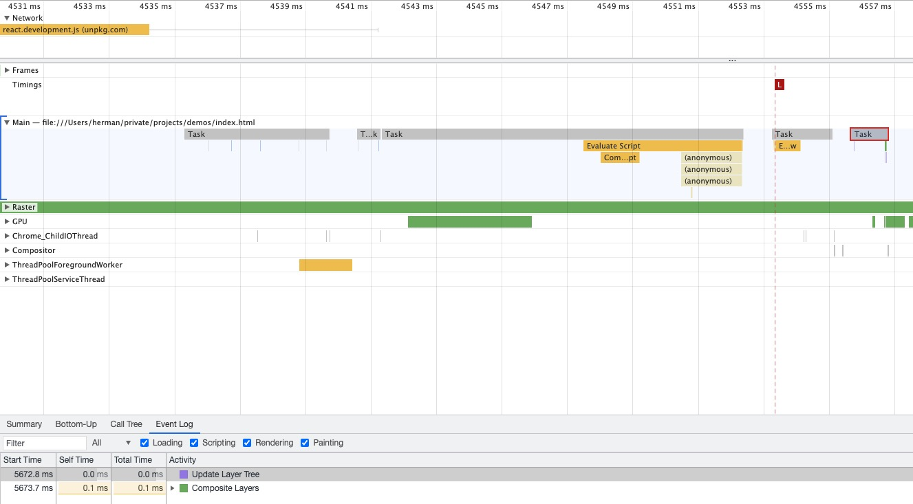

上面可以async的JS的一些特点：

1. **async的JS下载和执行过程不会阻塞DOM树的构建和首屏渲染**
2. **async的JS在下载完成之后就会执行，执行时机和`DOMContentLoaded Event`没有必然关系**
3. async的JS不保证执行顺序


> **补充说明**
>
> 这里其实不确定async的JS文件**执行**一定不阻塞DOM树的构建，因为一般的例子中，JS文件没有下载完，Parse HTML就已经执行完成了。在极端的例子下，如果`Parse HTML`还没有完成，感觉还是可能会阻塞DOM树的构建。
>
> 所以可以认为：**在绝大部分情况下，async的JS的下载和执行都是不阻塞DOM树的构建和首屏渲染的。**


#### 2.7.2 defer

```html
<!DOCTYPE html>
<html lang="en">
<head>
  <meta charset="UTF-8">
  <meta http-equiv="X-UA-Compatible" content="IE=edge">
  <meta name="viewport" content="width=device-width, initial-scale=1.0">
  <title>Document</title>
  <script defer type="text/javascript" src="https://unpkg.com/react@17/umd/react.development.js"></script>
  <script defer type="text/javascript" src="./index.js"></script>
</head>
<body>
    <div>1</div>
    <div>2</div>
    <div>3</div>
  	<script type="text/javascript" src="https://cdn.jsdelivr.net/npm/bootstrap@4.6.0/dist/js/bootstrap.min.js"></script>
</body>
</html>
```

对应Performance中的执行截图

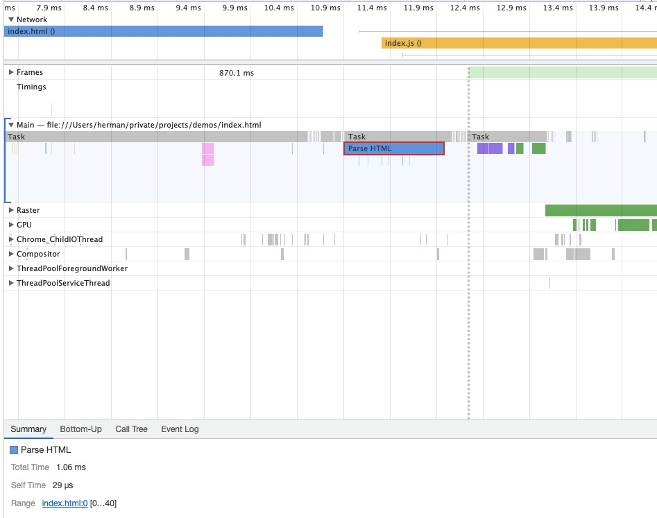

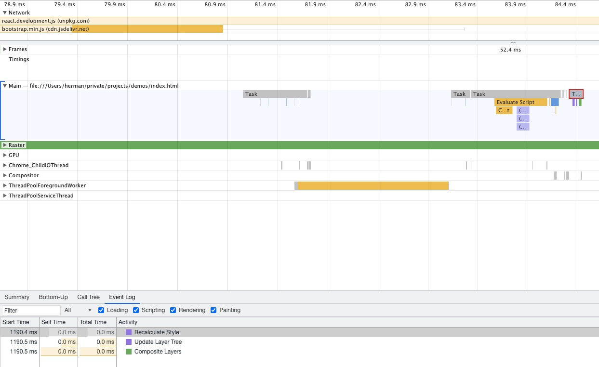

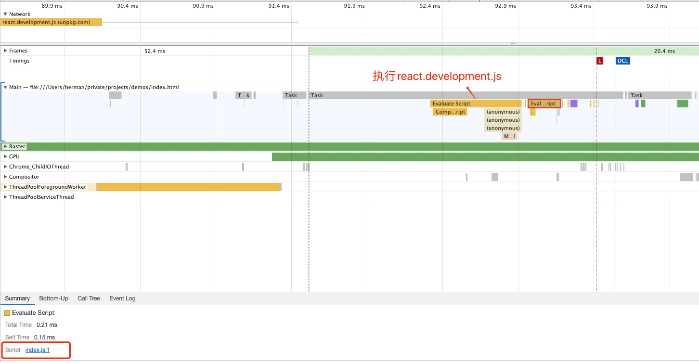

从上面图中可以看出defer的JS的特点：

1. **defer的JS下载和执行都不阻塞DOM树的构建和首屏渲染**
2. **defer的JS会在同步JS执行完成之后，在`DOMContentLoaded Event`事件触发之前执行**
3. defer的JS执行时是保证顺序的


### 2.8 DOMContentLoaded VS Load

1. **`DOMContentLoaded`事件是在`Parse HTML`任务完成而且所有的`defer的JS`下载执行完成之后才会触发**。body内部同步引入的JS和CSS文件都有可能会影响`Parse HTML`任务的执行，从而影响`DOMContentLoaded`事件的触发
2. **`Load`事件是在页面所依赖的所有脚本资源和图片资源都加载完成之后才会触发**。视频和音频资源不包括


## 3. 参考资料

1. [Chrome的First Paint触发的时机探究](https://cloud.tencent.com/developer/article/1124484)

2. [再谈 load 与 DOMContentLoaded](https://juejin.cn/post/6844903623583891469#heading-9)

