# V8引擎中的垃圾回收机制

由于内存的空间大小是有限的，所以当变量没有被使用的时候，需要及时去释放对应的内存资源，否则可能会导致内存空间不足的问题。

和C++不同的是，V8引擎中提供了垃圾回收的机制，是一种自动回收的机制，没有给开发者提供接口去手动控制整个垃圾回收的过程。**V8引擎来自动分配内部和内存清理**


## 1. 为什么会有垃圾

不管哪一种语言，在代码执行的时候，都会频繁的创建数据，这些数据会保存在堆和栈中。也就是在内存中创建一块空间，使用这块空间，然后在不需要的时候回收这块空间。

比如下面这个例子：

``````js
window.test = new Object()
window.test.a = new Uint16Array(100)
``````

当 JS 引擎执行到这段代码的时候，会先为 window 对象添加一个 test 属性，并在堆中创建了一个空对象，并将该对象的地址指向了 window.test 属性。然后在堆内存中创建一个长度为 100 的数组，并将地址指向 window.test.a 属性。

此时内存布局图如下：

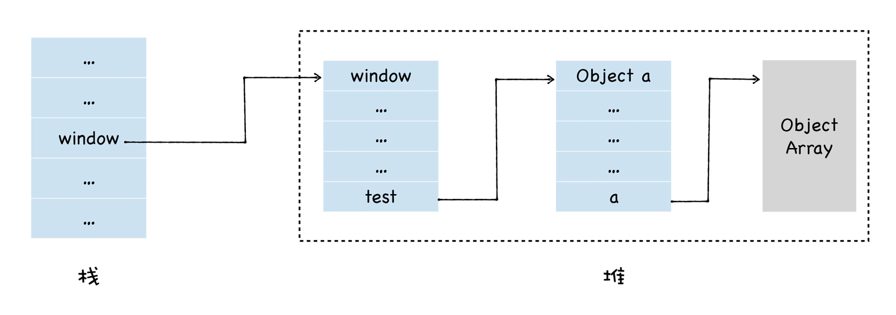

我们可以看到，栈中保存了指向 window 对象的指针，通过栈中 window 的地址，我们可以到达 window 对象，通过 window 对象可以到达 test 对象，通过 test 对象还可以到达 a 对象。

如果此时我们将另一个对象赋值给 a 属性

``````js
window.test.a = new Object()
``````

那么此时的内存布局如下所示：

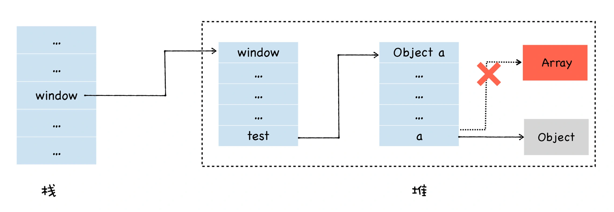

我们可以看到，a 属性之前是指向堆中数组对象的，现在已经指向了另外一个空对象，那么此时堆中的数组对象就成为了垃圾数据，因为我们**无法从一个根对象遍历到这个 Array 对象**。


## 2. 代际假说

代际假说是垃圾回收领域中一个重要的术语，它有以下两个特点：

- 大部分对象都是**“朝生夕死”**的，也就是说大部分对象在内存中存活的时间很短，比如函数内部声明的变量，或者块级作用域中的变量，当函数或者代码块执行结束时，作用域中定义的变量就会被销毁。**因此这一类对象一经分配内存，很快就变得不可访问**。
- 第二个是**不死**的对象，会活得更久，比如全局的 window、DOM、Web API 等对象。

V8的垃圾回收策略就是基于这个假说来实现的。

> 其实这两个特点不仅仅适用于 JavaScript，同样适用于大多数的编程语言，如 Java、Python 等


## 3. V8 的内存结构

在V8引擎的堆结构组成中，其实除了**新生代**和**老生代**外，还包含其他几个部分：

- **新生代（new_space）**：大多数的对象开始都会被分配在这里，这个区域相对较小但是垃圾回收特别频繁，该区域被分为两半，一半用来分配内存，另一半用于在垃圾回收时将需要保留的对象复制过来。
- **老生代（old_space）**：**新生代中的对象在存活一段时间后就会被转移到老生代内存区，相对于新生代该内存区域的垃圾回收频率较低**。老生代又分为**老生代指针区**和**老生代数据区**，前者包含大多数可能存在指向其他对象的指针的对象，后者只保存原始数据对象，这些对象没有指向其他对象的指针。
- 大对象区（large_object_space）：存放体积超越其他区域大小的对象，每个对象都会有自己的内存，垃圾回收不会移动大对象区。
- 代码区（code_space）：代码对象，会被分配在这里，唯一拥有执行权限的内存区域
- map区（map_space）：存放Cell和Map，每个区域都是存放相同大小的元素，结构简单。

垃圾回收的过程主要出现在新生代和老生代，其他部分暂时不涉及。

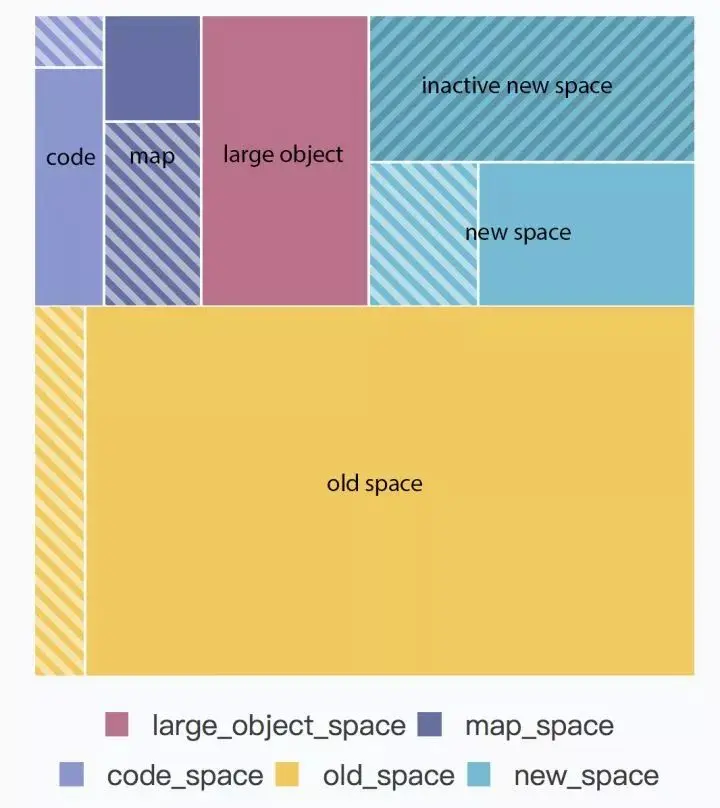

> 上图中的带斜纹的区域代表暂未使用的内存。


### 3.1 内存大小

由于V8引擎最开始是给浏览器执行 js 脚本来用的，所以在设置v8能够申请的最大内存的时候，并没有将值设置得很大：

1. 32位系统下，最大能使用的内存大约是700MB。
2. 64为系统下，最大能使用的内存大约是1.4GB。

> 为什么没有将最大的内存值设置得很大？
>
> **v8 能够使用的内存空间越大，那么就意味着能够容纳的变量也就越多，那么GC一次的时间也会更长。然而JS引擎是单线程的，而且和渲染引擎是互斥的，所以在执行GC的时候，会导致页面长时间的卡顿**。所以不宜将V8的内存值设置得很大。


## 4. V8 的垃圾回收实现

### 4.1 垃圾回收的流程

V8 垃圾回收的整体流程如下：

1. 第一步：**通过 GC Root 标记空间中活动对象和非活动对象**。

2. 第二步：**回收非活动对象所占据的内存**。其实就是在所有的标记完成之后，统一清理内存中所有被标记为可回收的对象。

3. 第三步：**做内存整理**。

   一般来说，频繁回收对象后，内存中就会存在大量不连续空间，我们把这些不连续的内存空间称为内存碎片。当内存中出现了大量的内存碎片之后，如果需要分配较大的连续内存时，就有可能出现内存不足的情况，所以最后一步需要整理这些内存碎片。但这步其实是可选的，因为有的垃圾回收器不会产生内存碎片，比如接下来我们要介绍的副垃圾回收器。

> 这里分析的垃圾回收实现都是针对**堆内存**的。
>
> 栈内存的垃圾回收比较简单，移动栈顶指针即可。


#### 4.1.1 如何分辨活动对象和非活动对象

目前 V8 采用的**可访问性（reachability）算法**来判断堆中的对象是否是活动对象。具体地讲，这个算法是将一些 GC Root 作为初始存活的对象的集合，从 GC Roots 对象出发，依次遍历 GC Root 中的所有对象及其属性。

- 通过 GC Root 遍历到的对象，我们就认为该对象是**可访问的（reachable）**，那么必须保证这些对象应该在内存中保留，我们也称可访问的对象为**活动对象**。
- 通过 GC Roots 没有遍历到的对象，则是**不可访问的（unreachable）**，那么这些不可访问的对象就可能被回收，我们称不可访问的对象为**非活动对象**。

#### 4.1.2 GC Root

GC Root 可以理解为是当前环境存在的顶层对象，一般在程序整个生命周期中都存在。

在浏览器环境中，GC Root 有很多，通常包括了以下几种 (但是不止于这几种)：

- 全局的 window 对象（位于每个 iframe 中）。
- 文档 DOM 树，由可以通过遍历文档到达的所有原生 DOM 节点组成。
- 存放栈上变量。


### 4.2 垃圾回收的策略

V8的垃圾回收实现受到代际假说的影响，把堆分成新生代和老生代两个区域（其他区域暂时不考虑）：

- **新生代**：存放的是生存时间短的对象。
- **老生代**：存放生存时间久的对象。

同时定义了两种垃圾回收器：

- **主垃圾回收器 - Major GC**：主要负责老生代的垃圾回收
- **副垃圾回收器 - Minor GC (Scavenger)**：主要负责新生代的垃圾回收。


#### 4.2.1 副垃圾回收器

副垃圾回收器主要负责新生代的垃圾回收。新生代区域的特点：

- **新生代区域空间不大**。通常只有 1~8MB。
- **垃圾回收比较频繁**。因为新生代区域存放生存时间短的对象。

新生代中的垃圾数据用 **Scavenge 算法**来处理。所谓 Scavenge 算法，是把新生代空间对半划分为两个区域，一半是**对象区域 (from-space)**，一半是**空闲区域 (to-space)**，如下图所示：

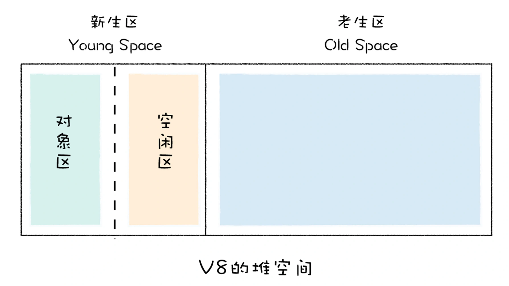

新加入的对象都会存放到对象区域，当对象区域快被写满时，就需要执行一次垃圾清理操作。

##### 4.2.1.1 Scavenge 算法

1. **标记**：首先要对对象区域中的垃圾做标记。

2. **清除&整理**：副垃圾回收器会把这些存活的对象复制到空闲区域中，同时它还会把这些对象**有序地排列**起来，所以这个复制过程，也就相当于完成了内存整理操作，复制后空闲区域就没有内存碎片了。

   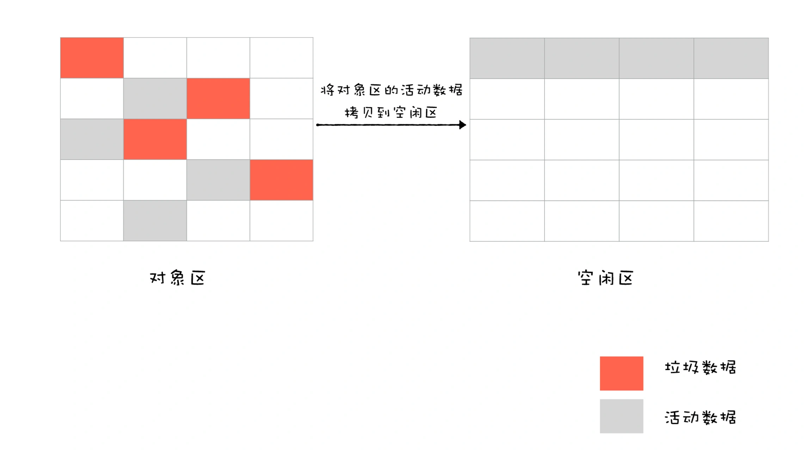

3. **角色替换**：完成复制后，对象区域与空闲区域进行角色翻转，也就是原来的对象区域变成空闲区域，原来的空闲区域变成了对象区域。

   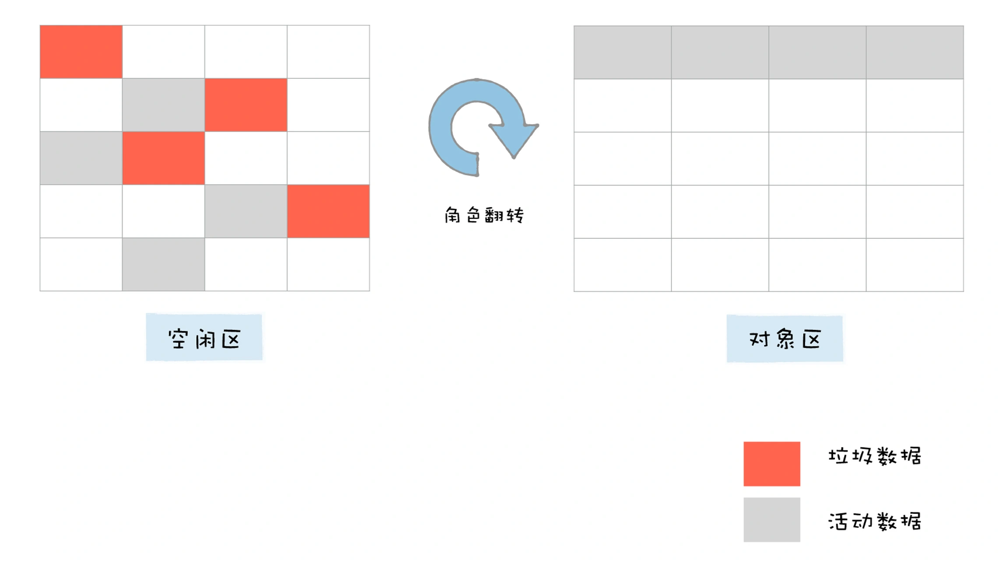

副垃圾回收器每次执行清理操作时，都需要将存活的对象从对象区域复制到空闲区域，复制操作需要时间成本，如果新生区空间设置得太大了，那么每次清理的时间就会过久，所以**为了执行效率，一般新生区的空间会被设置得比较小**。


#### 4.2.2 对象晋升策略

当一个对象在经过多次复制之后依旧存活，那么它会被认为是一个生命周期较长的对象，在下一次进行垃圾回收时，该对象会被直接转移到老生代中。这个过程就叫做**对象晋升**。

对象晋升的条件：

- 经过两次垃圾回收依然还存活的对象
- **To** 空间的内存占比是否已经超过**25%**


#### 4.2.3 主垃圾回收器

主垃圾回收器主要负责老生代中的垃圾回收。除了新生代中晋升的对象，**一些大的对象会直接被分配到老生代里**。因此，老生代中的对象有两个特点：

- 对象占用空间大。
- 对象存活时间长。

由于老生代的对象比较大，若要在老生代中使用 Scavenge 算法进行垃圾回收，复制这些大的对象将会花费比较多的时间，从而导致回收执行效率不高，同时还会浪费一半的空间。所以，主垃圾回收器是采用 **标记 - 清除（Mark-Sweep）/ 标记-整理（Mark-Compact）**的算法进行垃圾回收的。

##### 4.2.2.1 标记-清除（Mark-Sweep）

- **标记**。标记阶段就是从一组根元素开始，递归遍历这组根元素，在这个遍历过程中，能到达的元素称为活动对象，没有到达的元素就可以判断为垃圾数据。

- **清除**。它和副垃圾回收器的垃圾清除过程完全不同，主垃圾回收器会直接将标记为垃圾的数据清理掉。

  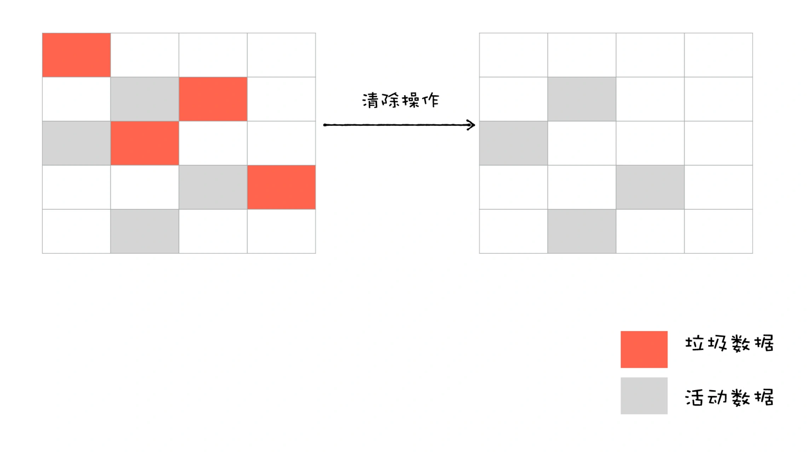

对一块内存多次执行**标记-清除**算法后，会产生大量不连续的内存碎片。而碎片过多会导致大对象无法分配到足够的连续内存，于是又引入了另外一种算法——标记 - 整理（Mark-Compact）。

##### 4.2.2.2 标记-整理（Mark-Compact）

- **标记**。标记过程仍然与标记 - 清除算法里的是一样的，先标记可回收对象。

- **整理**。让所有存活的对象都向一端移动，然后直接清理掉这一端之外的内存。和直接清理不同

  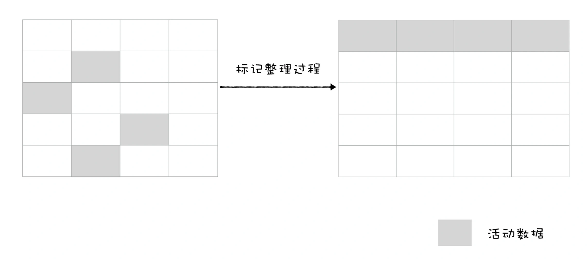

## 5. V8 垃圾回收性能优化

由于 JavaScript 是运行在主线程之上的，因此，一旦执行垃圾回收算法，都需要将正在执行的 JavaScript 脚本暂停下来，待垃圾回收完毕后再恢复脚本执行。我们把这种行为叫做**全停顿（Stop-The-World）**。

一次完整的垃圾回收分为标记和清理两个阶段，垃圾数据标记之后，V8 会继续执行清理和整理操作，虽然主垃圾回收器和副垃圾回收器的处理方式稍微有些不同，但它们**都是主线程上执行**的，执行垃圾回收过程中，会暂停主线程上的其他任务，具体全停顿的执行效果如下图所示：

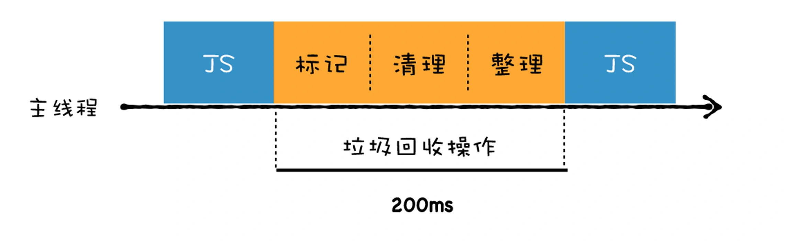

可以看到，执行垃圾回收时会占用主线程的时间，如果在执行垃圾回收的过程中，垃圾回收器占用主线程时间过久，会导致页面卡顿。

为了解决全停顿的问题，V8的垃圾回收算法做了以下优化措施：

- 并行回收
- 增量回收
- 并发回收

### 5.1 并行回收

**在执行垃圾回收时，引入多个辅助线程来并行处理。**


副垃圾回收器所采用的就是并行策略，它在执行垃圾回收的过程中，启动了多个线程来负责新生代中的垃圾清理操作，这些线程同时将对象空间中的数据移动到空闲区域。由于数据的地址发生了改变，所以**还需要同步更新引用这些对象的指针**。


### 5.2 增量回收

虽然并行策略能增加垃圾回收的效率，能够很好地优化副垃圾回收器，但是这仍然是一种**全停顿的垃圾回收方式**，在主线程执行回收工作的时候才会开启辅助线程，这依然还会存在效率问题。所以后来 V8 引入时增量回收的方式。

所谓增量式垃圾回收，是指垃圾回收器将标记工作分解为更小的块，并且穿插在主线程不同的任务之间执行。采用增量垃圾回收时，垃圾回收器没有必要一次执行完整的垃圾回收过程，每次执行的只是整个垃圾回收过程中的一小部分工作，具体流程你可以参看下图：

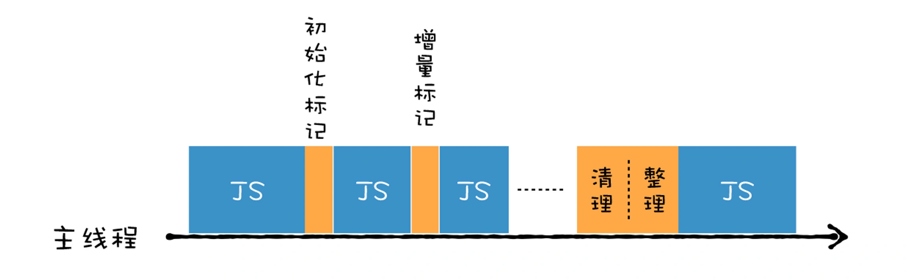

增量回收有点类似于 React Fiber 中的时间分片功能。

### 5.3 并发回收

虽然增量回收可以有效的优化垃圾回收的执行效率，但是所有的任务碎片仍然是在主线程中执行的，如果主线程繁忙的时候，这个回收任务仍然会阻塞整个主线程。于是 V8 进行了进一步的优化，实现了并发回收。

**所谓并发回收，是指主线程在执行 JavaScript 的过程中，辅助线程能够在后台完成执行垃圾回收的操作**。

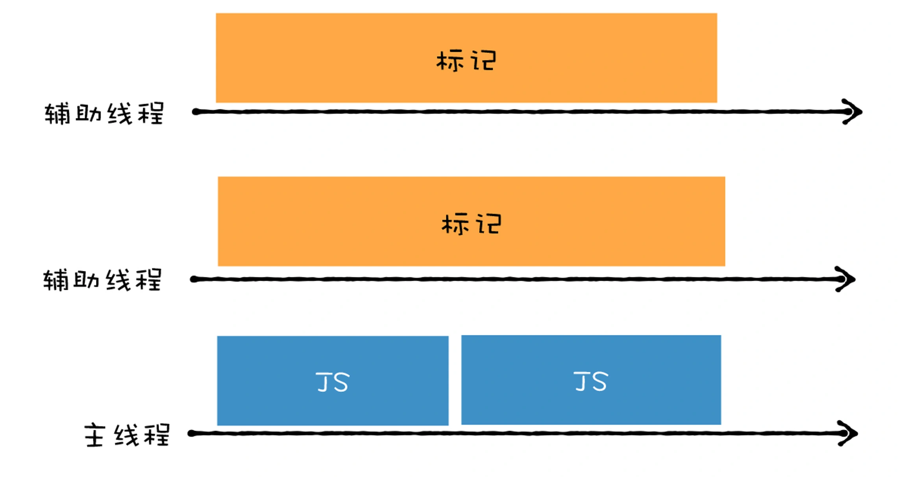

并发回收的优势非常明显，主线程不会被挂起，JavaScript 可以自由地执行 ，在执行的同时，辅助线程可以执行垃圾回收操作。

但是并发回收却是这三种技术中最难的一种，这主要由以下两个原因导致的：

- 第一，当主线程执行 JavaScript 时，堆中的内容随时都有可能发生变化，从而使得辅助线程之前做的工作完全无效；
- 第二，主线程和辅助线程极有可能在同一时间去更改同一个对象，这就需要额外实现读写锁的一些功能了。


### 5.4 优化应用

这三种优化方式各有利弊，在实际应用中，并不是单独的存在，通常会将其融合在一起使用。

V8 的主垃圾回收器就融合了这三种机制，来实现垃圾回收。如下图

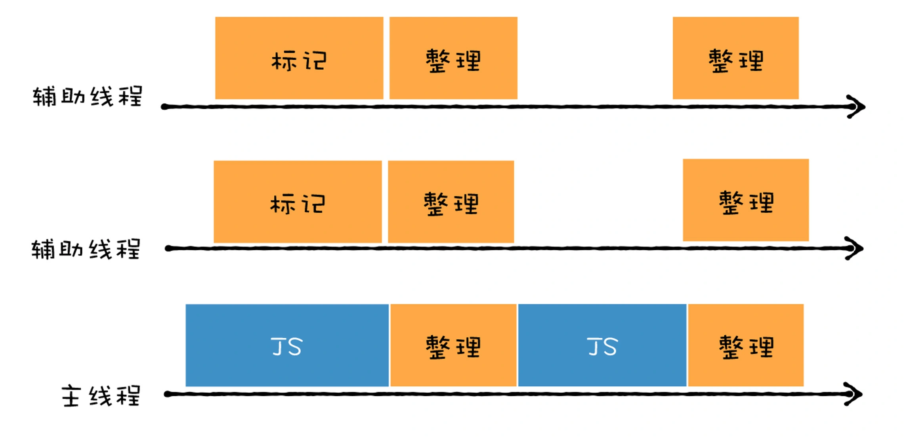

- 首先主垃圾回收器主要使用**并发标记**，我们可以看到，在主线程执行 JavaScript，辅助线程就开始执行标记操作了，所以说标记是在辅助线程中完成的。
- 标记完成之后，再执行并行清理操作。主线程在执行清理操作时，多个辅助线程也在执行清理操作。（并行清理）
- 主垃圾回收器还采用了**增量标记**的方式，清理的任务会穿插在各种 JavaScript 任务之间执行。


## 6.参考

1. [垃圾回收（一）：V8的两个垃圾回收器是如何工作的？](https://time.geekbang.org/column/article/230845)

2. [一文搞懂V8引擎的垃圾回收](https://juejin.cn/post/6844904016325902344)
