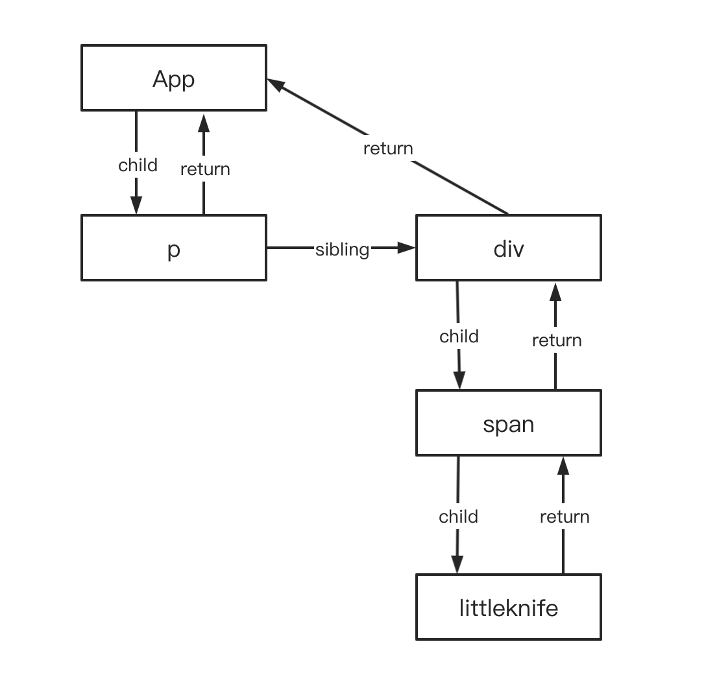
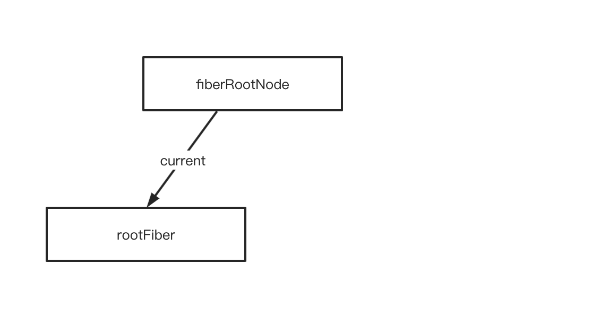
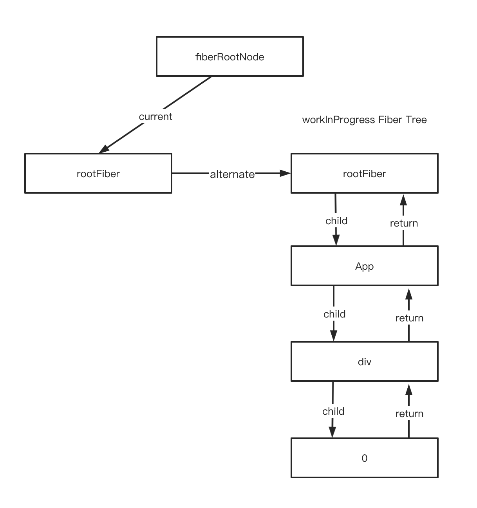
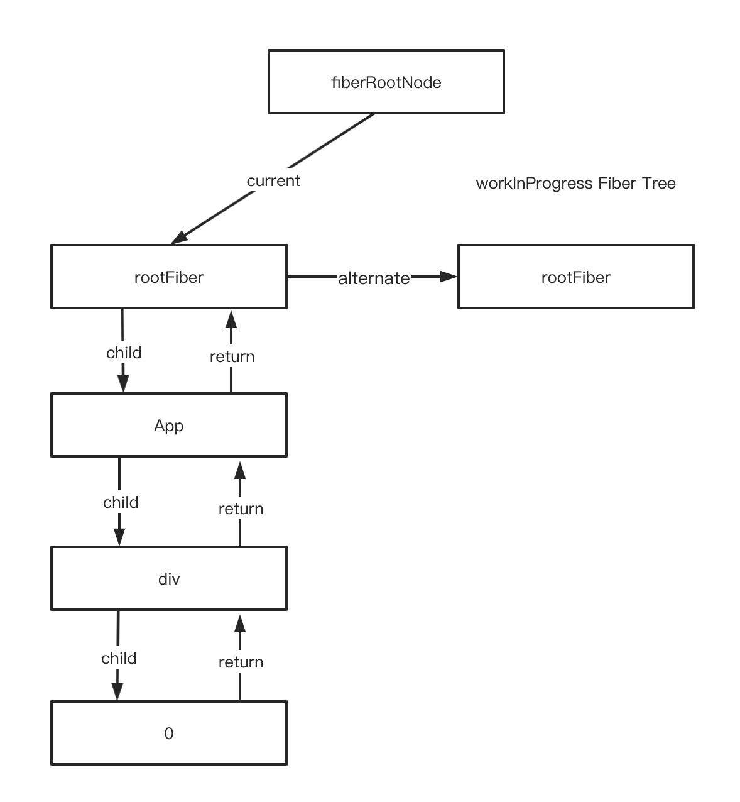
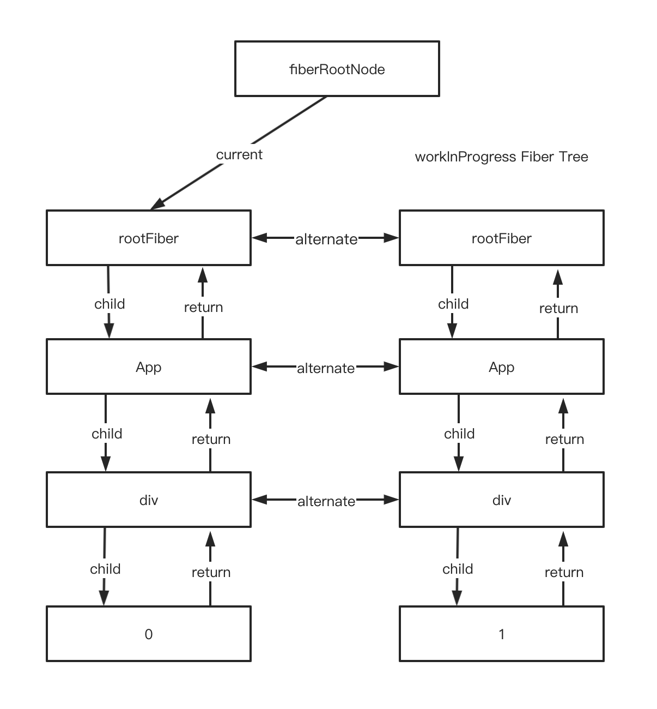
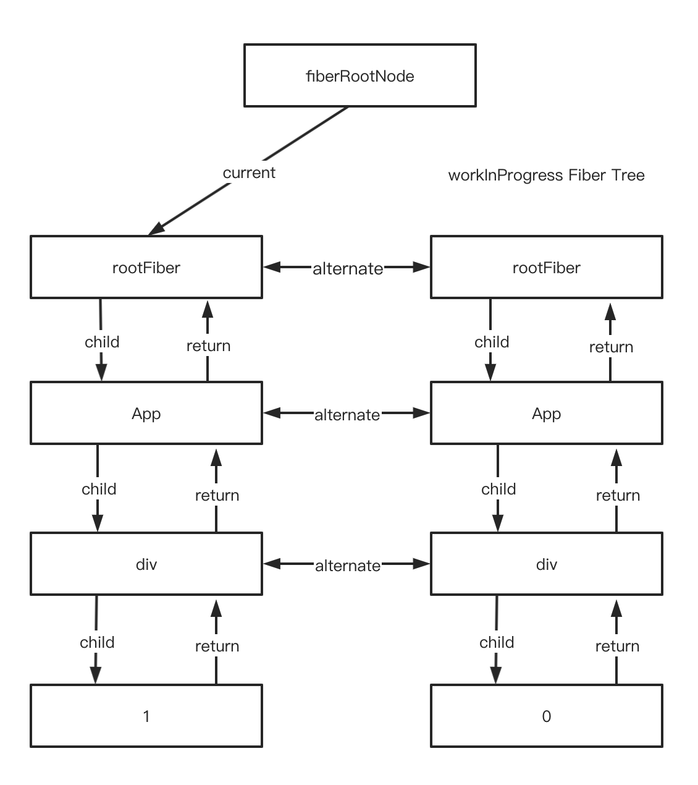

# Fiber架构的实现原理

对于开发者来说，**React最直观的作用就是将 `ReactElement Tree` 转化成 `DOM Tree`**，然而如果每次更新都是全量的重新创建新的DOM节点来更新，显然性能会非常差，所以需要使用**增量更新**。要实现增量的对比，就需要一个**载体**来记录和描述当前节点的信息。当产生更新的时候，新生成的载体和旧的载体进行对比，收集增量的变化。

在Stack架构中，这个载体叫做**虚拟DOM节点**。而在Fiber架构中，这个载体叫做 **Fiber 节点**，每个`ReactElement`都会生成一个对应的`Fiber`节点。

> 思考：这里之所以不直接使用ReactElement作为载体，感觉是因为ReactElement是直接面向使用者的，不宜放置很多使用者不需要看到的信息


> **备注**
>
> 本系列文章中的源码都是来自最新的**`master`**代码，React17.0.1版本之后，最新一次提交编号是（#20254）
>
> 也可以直接查看笔者当时fork的[代码](https://github.com/careyke/react)
>
> 调试使用的实验版本是`0.0.0-experimental-4ead6b530`，这个版本的代码和笔者`fork`的源码基本是一致的，只有一些细小的差别，不影响分析。


**几个概念先说明一下**：

除去Scheduler之外，React的工作可以分成两个阶段：

1. **`render`阶段**：Reconciler作用的阶段。因为会调用组件的`render`方法
2. **`commit`阶段**：Renderer作用的阶段。就像你完成一个需求的编码后执行`git commit`提交代码到分支上一样。`commit`阶段会把`render`阶段提交的信息渲染在页面上


## 1. Fiber节点的数据结构

可以这里看到[Fiber节点的数据结构](https://github.com/facebook/react/blob/1fb18e22ae66fdb1dc127347e169e73948778e5a/packages/react-reconciler/src/ReactFiber.new.js#L117)

```javascript
function FiberNode(
  tag: WorkTag,
  pendingProps: mixed,
  key: null | string,
  mode: TypeOfMode,
) {
  // 基本属性
  this.tag = tag;
  this.key = key;
  this.elementType = null;
  this.type = null;
  this.stateNode = null;

  // 作用在Fiber Tree中的属性，用来描述自己的位置
  this.return = null;
  this.child = null;
  this.sibling = null;
  this.index = 0;

  this.ref = null;

  // 作为动态工作单元的属性
  this.pendingProps = pendingProps;
  this.memoizedProps = null;
  this.updateQueue = null;
  this.memoizedState = null;
  this.dependencies = null;

  this.mode = mode;

  this.flags = NoFlags;
  this.subtreeTag = NoSubtreeEffect;
  this.deletions = null;
  this.nextEffect = null;

  this.firstEffect = null;
  this.lastEffect = null;

  // 优先级调度相关
  this.lanes = NoLanes;
  this.childLanes = NoLanes;

  // 双缓存属性，指向另一次更新时该节点对应的Fiber节点
  this.alternate = null;
}
```

可以看出，**Fiber节点作为Fiber架构的最小工作单位**，其中包含的属性是非常多的。下面根据作用不同分成几类来进行解释

### 1.1 Fiber节点的基本属性

Fiber节点作为连接 `ReactElement` 和真实DOM节点的载体，其中包含了双方的信息，确保能够一一对应。

```javascript
// 大部分情况下表示当前节点对应的React Component的类型，FunctionComponent、ClassComponent或者HostComponent...
// 也有特殊情况，比如RootFiber节点没有对应的React Component
this.tag = tag;

// React Element中的key属性
this.key = key;

// 大部分情况下和type是一样的，某些情况不同，比如使用React.Mome()包裹的组件
this.elementType = null;

// 表示对应ReactElemet的type。对于FunctionComponent，指的是函数本身；对于ClassComponent，指的是对应的Class
// 对于HostComponent 指的是对应的真实DOM的tagName
this.type = null;

// 表示当前React Element对应的真实节点。对于FunctionComponent，值为null；
// 对于ClassComponent，指的是对应React Component的实例,(不是React Element)
// 对于HostComponent，指的是对应的真实的DOM节点
// 对于RootFiber，指的是React应用的根节点FiberRootNode
this.stateNode = null;
```

**Fiber节点的tag属性是根据type属性来生成的。不同tag的Fiber节点对应的工作内容是不同的**。React中定义了很多种类的tag，可以查看[这里](https://github.com/facebook/react/blob/1fb18e22ae/packages/react-reconciler/src/ReactWorkTags.js)

这里介绍4种常用的类型：

1. `ClassComponent` —— 表示当前Fiber节点对应的是使用Class关键字创建的组件生成的ReactElement。
2. `FunctionComponent` —— 表示当前Fiber节点对应的是使用Function关键字创建的组件生成的ReactElement。
3. `HostComponent` —— **表示当前Fiber节点对应的是生成真实DOM节点的ReactElement，DOM节点的类型是对应type属性**。
4. `HostRoot` —— **表示当前Fiber节点是RootFiber节点，也就是当前Fiber树的根节点，没有对应的ReactElement节点**。

### 1.2 Fiber节点的位置属性

每个ReactElement所对应的Fiber节点最终也会组成一颗Fiber树。Fiber通过以下属性来确定自己在树中的位置。

```javascript
// 当前Fiber节点的父节点
this.return = null;

// 当前Fiber节点的第一个子节点
this.child = null;

// 当前Fiber节点的右边兄弟节点
this.sibling = null;

// 当前Fiber节点在兄弟节点中的位置索引
this.index = 0;
```

举个例子，如下的组件结构

```react
<App>
	<p></p>
  <div>
  	<span>littleknife</span>
  </div>
</App>
```

对应的Fiber树结构：



> 这里子节点指向父节点的指针名字为什么叫做`return`，而没有叫做`parent`或者`father`？是因为Fiber节点作为一个工作单元，`return`表示当前节点执行完 `completeWork` （后面章节会介绍）之后返回的下一个节点。子节点及其兄弟节点完成工作之后都会返回其父节点，所以用`return`表示父节点

### 1.3 Fiber节点的工作单元属性

Fiber节点作为Fiber架构中的最小工作单元，**更新的时候负责对比和收集对应`ReactElement`节点更新前后的变化，然后在`commit`阶段将这些变化渲染到真实的DOM中**。

所以Fiber节点中保存了和本次更新相关的信息。

```javascript
// 表示本次更新中对应ReactElement接收到的最新Props
// 设置这个属性的时候，组件的更新流程还没有开始
this.pendingProps = pendingProps;

// 表示对应ReactElement当前的Props
this.memoizedProps = null;

// 表示本次更新中，对应组件的更新操作，是一个链表结构。后面更新流程时会详细说明
this.updateQueue = null;

// 表示组件当前的state，FunctionComponent中是一个链表结构,ClassComponent是一个对象
this.memoizedState = null;

// 表示当前组件依赖的context，后续讲上下文的时候会详细介绍
this.dependencies = null;

this.mode = mode;

// 标识当前节点在本次更新需要做的操作，通常有Placement,Update和Deletion
// 也就是对应DOM节点需要做的操作
this.flags = NoFlags;
this.subtreeTag = NoSubtreeEffect;
this.deletions = null;

// 在render阶段之后，所有需要更新的Fiber节点会组成一个链表
// 方便commit阶段更新所有节点
// 下面三个属性就是遍历这个链表的属性
this.nextEffect = null;
this.firstEffect = null;
this.lastEffect = null;
```

### 1.4 Fiber节点优先级相关属性

```javascript
this.lanes = NoLanes;
this.childLanes = NoLanes;
```

会在后续分析Scheduler的时候详细介绍

### 1.5 Fiber节点双缓存属性

```javascript
// 指向另一颗Fiber树对应的Fiber节点
this.alternate = null;
```

为了实现双缓存，Fiber架构内部构建了两棵Fiber树。后面会详细介绍


## 2. Fiber架构的工作原理

之前我们说过React本质就是`ReactElement Tree` 转化成真实的`DOM Tree`，大致的流程的这样的：

```javascript
ReactElement Tree --> Fiber Tree --> DOM Tree
```

其中的实现过程用到了**双缓存**的技术。

### 2.1 什么是双缓存

当我们用`canvas`绘制动画，每一帧绘制前都会调用`ctx.clearRect`清除上一帧的画面。

如果当前帧画面计算量比较大，导致清除上一帧画面到绘制当前帧画面之间有较长间隙，就会出现白屏。

为了解决这个问题，我们可以在内存中绘制当前帧动画，绘制完毕后直接用当前帧替换上一帧画面，由于省去了两帧替换间的计算时间，不会出现从白屏到出现画面的闪烁情况。

这种**在内存中直接构建并替换**的技术叫做**双缓存**。

React内部使用双缓存的技术来完成**Fiber树的创建和替换**——对应着**DOM树的创建和更新**。

### 2.2 双缓存Fiber树

使用的双缓存的概念，在`React`同时会存在两颗Fiber树。当前屏幕展示的内容对应的Fiber树称为 **`current Fiber Tree`**，其中的节点称为**`current fiber`**；更新产生之后正在内存中构建的Fiber树称为 **`workInProgress Fiber Tree`**，其中的节点称为**`workInProgress fiber`**。

`current fiber`和对应的`workInProgress fiber`之间通过 **`alternate`** 属性链接。

```javascript
currentFiber.alternate === workInProgressFiber;
workInProgressFiber.alternate === currentFiber
```

使用双缓存的好处：

**假设React内部只维护一棵Fiber树**：

1. 当涉及到节点的新增和删除的操作时，需要在当前树上操作很多节点，极大的增大了树操作的复杂度。
2. 节点更新的时候，对比之后的更新信息势必要挂在Fiber节点中，节点的属性会包含更新前后的状态，会增加理解和维护的成本。

**如果使用双缓存**：

1. 每个节点中的属性都是表示同一个时间点节点的状态。数据更简洁好维护
2. Fiber节点更新的时候会生成一个新的节点，挂载在`workInProgress Tree`中，不会在原来的`Fiber Tree`中做任何操作，也不会影响页面的展示
3. 新的`workInProgressFiber`节点创建的时候，可以复用对应`currentFiber`节点，减少内存和GC的开销

### 2.3 Fiber架构的工作流程

#### 2.3.1 fiberRootNode

既然React内部会创建两颗Fiber Tree，那么就需要一个根节点需要管理这两颗树。React内部通过 **`fiberRootNode` **来管理两颗Fiber树的切换。

fiberRootNode就是**React应用的根节点**，它通过**`current`**属性指向当前页面对应的Fiber树，这棵树就是`current Fiber Tree`

```javascript
FiberRootNode.current === currentFiberTree
```

当React应用更新的时候，Reconciler会在内存中创建一颗`workInProgress Fiber Tree`，创建完成之后会交给Renderer渲染到页面上，

然后将`fiberRootNode`的current指针指向`workInProgress Fiber Tree`。此时原来的`workInProgress Fiber Tree` 就变成了 `current Fiber Tree`，两者**互换身份**。

#### 2.3.2 创建fiberRootNode

首次执行ReactDOM.render的时候会创建fiberRootNode（源码中叫fiberRoot），见[这里](https://github.com/facebook/react/blob/8e5adfbd7e605bda9c5e96c10e015b3dc0df688e/packages/react-reconciler/src/ReactFiberRoot.new.js#L83)

```javascript
export function createFiberRoot(
  containerInfo: any,
  tag: RootTag,
  hydrate: boolean,
  hydrationCallbacks: null | SuspenseHydrationCallbacks,
): FiberRoot {
  // containerInfo表示React应用的挂在DOM节点
  // 创建fiberRoot
  const root: FiberRoot = (new FiberRootNode(containerInfo, tag, hydrate): any);
  if (enableSuspenseCallback) {
    root.hydrationCallbacks = hydrationCallbacks;
  }

  // Cyclic construction. This cheats the type system right now because
  // stateNode is any.
  /**
   * 初始化的时候，在创建FiberRootNode的时候，同时创建了一个RootFiber,用来表示当前Fiber树的根节点
   */
  // 创建rootFiber
  const uninitializedFiber = createHostRootFiber(tag);
  root.current = uninitializedFiber;
  uninitializedFiber.stateNode = root;

  initializeUpdateQueue(uninitializedFiber);

  return root;
}
```

可以看到，React在初始化的时候，除了创建fiberRootNode之外，还创建了一个**`rootFiber`**节点，这个节点表示Fiber Tree的根节点。**rootFiber的子节点才是ReactElement Tree的根节点对应的Fiber节点。**

FiberRootNode的数据结构：（常用的属性做出了解释）

```javascript
function FiberRootNode(containerInfo, tag, hydrate) {
  // 表示当前根节点的类型 LegacyRoot、BlockingRoot、ConcurrentRoot
  // 使用ReactDOM.Render创建的应用，默认是LegacyRoot
  this.tag = tag;
  
  // 表示当前React应用挂载的DOM节点
  this.containerInfo = containerInfo;
  this.pendingChildren = null;
  
  // 表示当前页面对应的Fiber Tree
  this.current = null;
  this.pingCache = null;
  this.finishedWork = null;
  this.timeoutHandle = noTimeout;
  this.context = null;
  this.pendingContext = null;
  this.hydrate = hydrate;
  this.callbackNode = null;
  this.callbackPriority = NoLanePriority;
  this.eventTimes = createLaneMap(NoLanes);
  this.expirationTimes = createLaneMap(NoTimestamp);

  // 优先级相关
  this.pendingLanes = NoLanes;
  this.suspendedLanes = NoLanes;
  this.pingedLanes = NoLanes;
  this.expiredLanes = NoLanes;
  this.mutableReadLanes = NoLanes;
  this.finishedLanes = NoLanes;

  this.entangledLanes = NoLanes;
  this.entanglements = createLaneMap(NoLanes);
}
```

> ```javascript
> function legacyRenderSubtreeIntoContainer(
>   parentComponent: ?React$Component<any, any>,
>   children: ReactNodeList,
>   container: Container,
>   forceHydrate: boolean,
>   callback: ?Function,
> ) {
>   // TODO: Without `any` type, Flow says "Property cannot be accessed on any
>   // member of intersection type." Whyyyyyy.
>   let root: RootType = (container._reactRootContainer: any);
>   let fiberRoot;
>   if (!root) {
>     // Initial mount
>     root = container._reactRootContainer = legacyCreateRootFromDOMContainer(
>       container,
>       forceHydrate,
>     );
>     fiberRoot = root._internalRoot;
>     ...
>   } else {
>     fiberRoot = root._internalRoot;
>     ...
>   }
>   return getPublicRootInstance(fiberRoot);
> }
> ```
>
> 在Legacy模式下，可以通过挂载DOM节点的`_reactRootContainer`属性查看当前应用的`FiberRootNode`，而且一个DOM节点最多只能有挂载一个`FiberRootNode`

#### 2.3.3 mount流程

分析参考的例子：

```react
function App(){
  const [num,addNum] = useState(0);
  return (
  	<div onClick={()=>addNum(num+1)}>
    	{num}
    </div>
  );
}
```

1. 调用`ReactDOM.render`之后，创建了fiberRootNode和rootFiber，`fiberRootNode`的`current`指向这个`rootFiber`。



2. 接下来进入`render`阶段，根据ReactElement Tree创建Fiber节点组成一个Fiber Tree，叫做`workInProgress Fiber Tree`。在构建`workInProgress Fiber`的时候会尝试复用对应`current Fiber`的属性。

   

3. 接下来进入`commit`节点，将workInProgress Fiber Tree对应的DOM Tree渲染到页面中。然后调整fiberRootNode中current指针的指向。

   

#### 2.3.4 update流程

1. 当我们点击`div`节点时，会触发一次更新，这会开启一次新的**`render`**阶段，然后创建一颗新的`workInProgress Fiber Tree`。在创建`workInProgress Fiber`节点的时候，会尝试复用current Fiber Tree中对应的节点。（决定是否复用涉及到Diff算法，后面会详细介绍）

   

2. 进入`commit`阶段，将`workInProgress Fiber Tree`渲染到页面中，同时修改`fiberRootNode`中current的指向。

   

> **注意**：React内部对于单个文本的节点做了优化，不会创建Fiber节点。这里标注出来是为了体现出变化。

至此，Fiber架构的工作流程就介绍完了。

