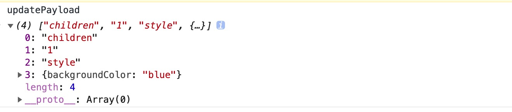
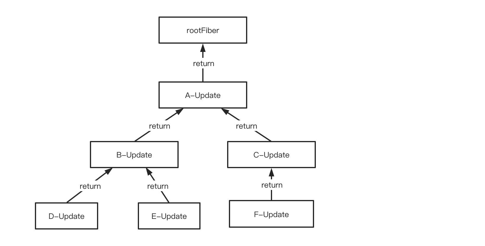

# 结合源码分析render阶段

之所以先分析render阶段，也就是`Reconciler`的工作流程，而不是先分析`Scheduler`，是因为在React当前版本中，默认情况下还是使 `LegacyRoot`，这种模式下`Scheduler`并没有起作用，而`Reconciler`和`Renderer`是不管哪种模式下工作的流程基本都是一样的。后续会话专门的章节来介绍`Scheduler`

> 所以在下面的源码分析中，凡是包含lane的变量都是和优先级调度有关的，可以先不用考虑。

`render`阶段和`commit`阶段的源码分析都是在 `legacy` 模式下进行的。

## 1. 进入render阶段之前的准备工作

上一节中介绍到，React应用在**初始化**的时候，会先创建一个`fiberRootNode`和`current rootFiber`。然后创建一个`update`，开启第一次更新。

```javascript
export function updateContainer(
  element: ReactNodeList,
  container: OpaqueRoot,
  parentComponent: ?React$Component<any, any>,
  callback: ?Function,
): Lane {
  // 这里的container就是fiberRootNode
  const current = container.current;
  const eventTime = requestEventTime();
  const lane = requestUpdateLane(current);
  const context = getContextForSubtree(parentComponent);
  if (container.context === null) {
    container.context = context;
  } else {
    container.pendingContext = context;
  }

  // 这里创建了一个update，并且把当前应用的ReactElement Tree保存在update中
  // 表示这次更新需要渲染整个组件树
  const update = createUpdate(eventTime, lane);
  update.payload = {element};

  callback = callback === undefined ? null : callback;
  if (callback !== null) {
    update.callback = callback;
  }

  enqueueUpdate(current, update);
  
  // 开启一次更新
  scheduleUpdateOnFiber(current, lane, eventTime);

  return lane;
}
```

> 源码对应[这里](https://github.com/facebook/react/blob/8e5adfbd7e605bda9c5e96c10e015b3dc0df688e/packages/react-reconciler/src/ReactFiberReconciler.new.js#L250)

**说明应用mount和update一样，都是先产生一个或多个update，然后再调用`scheduleUpdateOnFiber`开启一次更新操作。**（后面讲update流程的时候会详细讲解）

进入更新操作

1. 如果是**异步更新**，则先**接入`Scheduler`**，然后调用`performConcurrentWorkOnRoot`方法进入`render`阶段；

2. 如果是**同步更新**，则直接调用`performSyncWorkOnRoot`方法进入`render`阶段

## 2. render阶段工作流程

render阶段主要是Reconciler在工作，目的是**将新的`ReactElement`节点和`current Fiber`节点来对比，创建出一个`workInProgress Fiber Tree`**。

遍历树时，一般会使用**递归**算法。但是前面讲Fiber架构的时候有提到，**Fiber架构为了实现时间切片，需要将原来递归的算法修改成循环的算法**。实际场景中，使用循环来替代递归的场景是很常见的，毕竟**递归算法除了无法中断的缺点之外还有爆栈的风险**。

> Fiber节点的数据结构中加入`return`和`sibling`指针就是为了简单的使用循环来实现递归。


render阶段的工作可以分成两个部分：

1. **”递“阶段** —— 从`workInProgress rootFiber`开始向下进行**深度优先遍历**，每遍历一个`Fiber节点`就调用一次`beginWork`方法，该方法会创建该`Fiber节点`的子节点。然后继续向下遍历并创建，直到遇到叶子节点的时候，进入”归“阶段。
2. **”归“节点** —— 对当前节点执行`completeWork`方法，执行完之后如果存在兄弟节点，则会进入兄弟节点的”递“阶段。如果不存在兄弟节点，就会进入父节点的”归“阶段。

可以看出，”递“和”归“是**交错运行**的，直到`rootFiber`的“归”阶段执行完，整个`render`阶段才算完成。

> React内部遍历Fiber Tree使用的算法是深度优先遍历。如果强行使用广度优先遍历，会非常麻烦，sibling指针不适合广度优先遍历

### 2.1 创建workInProgress rootFiber

因为mount的时候，render阶段开始之前并没有`workInProgress Fiber Tree`，所以需要先创建`workInProgress rootFiber`。可以看`renderRootSync`方法

```javascript
function renderRootSync(root: FiberRoot, lanes: Lanes) {
  // ...省略

  // 这里使用内部变量workInProgressRoot来保存上一次更新时的fiberRootNode
  // 如果和本次的fiberRootNode不相等，说明本次更新的是其他React应用树，需要重新创建workInProgress rootFiber
  // 注意：workInProgressRoot在commit阶段会重新设置为null
  if (workInProgressRoot !== root || workInProgressRootRenderLanes !== lanes) {
    // 这个方法中会创建workInProgress rootFiber
    prepareFreshStack(root, lanes);
  }

  do {
    try {
      // 开始循环创建workInProgress Fiber Tree
      workLoopSync();
      break;
    } catch (thrownValue) {
      handleError(root, thrownValue);
    }
  } while (true);
  // ...省略
}

function prepareFreshStack(root: FiberRoot, lanes: Lanes) {
  // ...省略
  /**
   * 创建workInProgress树的RootFiber节点
   */
  workInProgressRoot = root;
  workInProgress = createWorkInProgress(root.current, null);
  // ...省略
}
```

> 对应的源码见[这里](https://github.com/facebook/react/blob/8e5adfbd7e605bda9c5e96c10e015b3dc0df688e/packages/react-reconciler/src/ReactFiberWorkLoop.new.js#L1501)


`root Fiber`创建完成之后，在`workLoopSync`方法中，开始用**循环**的方式遍历树。

```javascript
function workLoopSync() {
  while (workInProgress !== null) {
    performUnitOfWork(workInProgress);
  }
}

function performUnitOfWork(unitOfWork: Fiber): void {
  let next;
  if (enableProfilerTimer && (unitOfWork.mode & ProfileMode) !== NoMode) {
    // “递”过程的主要工作，调用beginWork，创建子节点，并返回child节点（也就是第一个子节点）
    next = beginWork(current, unitOfWork, subtreeRenderLanes);
  } else {
    next = beginWork(current, unitOfWork, subtreeRenderLanes);
  }

	// 子节点创建完成之后，最新的props(pendingProps)就已经被消费完成
	// 可以作为下一次更新的memoizedProps
  unitOfWork.memoizedProps = unitOfWork.pendingProps;
  if (next === null) {
    // 如果是叶子节点，插入一个”归“过程
    completeUnitOfWork(unitOfWork);
  } else {
    // 如果是非叶子节点，开启下一个“递”过程
    workInProgress = next;
  }
}
```

> 源码对应[这里](https://github.com/facebook/react/blob/8e5adfbd7e605bda9c5e96c10e015b3dc0df688e/packages/react-reconciler/src/ReactFiberWorkLoop.new.js#L1569)

可以看出：

1. “递”过程主要是执行`beginWork`
2. “归”过程主要是执行`completeWork`

后面主要是解析这两个方法，看看究竟做了哪些工作。

### 2.2 ”递“过程——beginWork

> 该方法的源码看[这里](https://github.com/facebook/react/blob/8e5adfbd7e605bda9c5e96c10e015b3dc0df688e/packages/react-reconciler/src/ReactFiberBeginWork.new.js#L3077)

```javascript
function beginWork(
  current: Fiber | null,
  workInProgress: Fiber,
  renderLanes: Lanes,
): Fiber | null {
  const updateLanes = workInProgress.lanes;
  
  if (current !== null) {
    // update阶段
  	// 先判断优化路径是否匹配，如果不匹配就是需要新建Fiber节点
    
    const oldProps = current.memoizedProps;
    const newProps = workInProgress.pendingProps;

    if (oldProps !== newProps || hasLegacyContextChanged()) {
      // 通过didReceiveUpdate变量来判断当前节点是否需要更新
      // 判断能否复用currentFiber，不止这一个条件
      didReceiveUpdate = true;
    } else if (!includesSomeLane(renderLanes, updateLanes)) {
      didReceiveUpdate = false;
      // ... 省略
      // 调用该方法，复用currentFiber的子节点
      return bailoutOnAlreadyFinishedWork(current, workInProgress, renderLanes);
    } else {
      // 代码简化
      didReceiveUpdate = false;
    }
  } else {
 		// mount阶段
    didReceiveUpdate = false;
  }
  workInProgress.lanes = NoLanes;

  // 根据tag不同，进入不同的创建流程
  switch (workInProgress.tag) {
    // ... 省略
    case FunctionComponent: 
      // ... 省略
    case ClassComponent: 
      // ... 省略
    case HostRoot:
      // ... 省略
    case HostComponent:
      // ... 省略
    case HostText:
      // ... 省略
    // ... 省略
}
```

#### 2.2.1 入参解读

1. `current `—— 表示当前Fiber节点对应`current Fiber Tree`上的Fiber节点，也就是`workInProgress.alternate`

2. `workInProgress` —— 表示**本次更新**中，当前组件对应的Fiber节点，也就是workInProgress Fiber Tree上的节点
3. `renderLanes` —— 优先级相关的属性，暂时可以不考虑


上面函数体中可以看出，**根据`current === null`可以判断当前组件是处于`mount`阶段还是`update`阶段**，因为对于本次新增的组件，在`current Fiber Tree`上是不存在对应的节点的，所以`currentFiber === null`

可以将beginWork的工作分成**两个部分**：

1. 组件`mount`阶段：直接创建新的子Fiber节点，没有优化流程
2. 组件`update`阶段：判断是否匹配优化路径，如果不满足则需要新创建子`Fiber`节点；如果匹配优化路径，则进入优化流程**复用对应的`currentFiber`**。


#### 2.2.2 更新优化（*）—— 复用currentFiber

前面讲Fiber架构的时候提到过，render阶段的主要工作是根据`current Fiber Tree`和新生成的`ReactElement Tree`来生成`workInProgress Fiber Tree`。但是如果每次更新都重新运行所有组件的`render`方法，生成新的`ReactElement`，然后生成新的`Fiber`节点，**对于没有任何修改的节点这是很冗余的操作**。React内部对这种情况做了相应的优化

##### 2.2.2.1 优化效果

在创建子Fiber节点过程中满足优化条件的节点，都会调用`bailoutOnAlreadyFinishedWork`方法，**复用**之前的子节点。

```javascript
function bailoutOnAlreadyFinishedWork(
  current: Fiber | null,
  workInProgress: Fiber,
  renderLanes: Lanes,
): Fiber | null {
  // ... 省略

  // 判断当前节点的子节点本次是否需要更新（反应在优先级上）
  if (!includesSomeLane(renderLanes, workInProgress.childLanes)) {
    // 如果子节点都不需要更新，本次更新直接跳过所有后代节点
    // 当前节点直接进入“归”过程，后代节点都不需要进入“归”阶段
    // 相当于当前节点的所有后代节点都复用对应的currentFiber，也包括真实DOM
    return null;
  } else {
    // 如果当前节点的后代节点中有节点需要在本次更新
    // 那就只克隆子Fiber节点，然后继续“递”过程
    cloneChildFibers(current, workInProgress);
    return workInProgress.child;
  }
}
```

优化的效果：**进入优化的节点，不需要调用`render`方法生成`ReactElement`，然后再生成对应的子`Fiber`节点。而是直接复用`current Fiber Tree`中的节点。**

> `FunctionComponent`除外，因为`FunctionComponent`可能会先执行render函数，然后来判断是否需要优化


节点复用也分成两种情况：

1. **复用`currentFiber`下的所有子树（subtree）**：当节点的**后代节点本次都不需要更新**的时候，所有的后代节点会直接复用对应`current Fiber Tree`中的节点，后代节点不需要执行`beginWork`。

2. **复用`currentFiber`的子节点（一层）**：当节点的**后代节点本次需要更新**的时候，只能复用`currentFiber`的子节点这一层。子节点仍然需要执行`beginWork`的逻辑。

   > 第二种情况下中的复用指的是**克隆**，并不是直接拿对应的currentFiber来用，而是克隆其中的属性。
   >
   > 对应的方法看[cloneChildFibers](https://github.com/careyke/react/blob/765e89b908206fe62feb10240604db224f38de7d/packages/react-reconciler/src/ReactChildFiber.new.js#L1344)


> 这里需要说明的一点是：**由于在commit阶段中，都会执行`workInProgress = null`这个操作，所以每次更新的时候，都会从rootFiber开始遍历生成新的`workInProgress Fiber Tree`，在遍历的过程中插入优化的环节**。
>
> 通过`currentFiber`来创建`workInProgressFiber`的时候，会执行`workInProgress.child = current.child`，所以才会产生前面复用整个`currentFiber`的情况。（创建函数见[这里](https://github.com/facebook/react/blob/8e5adfbd7e605bda9c5e96c10e015b3dc0df688e/packages/react-reconciler/src/ReactFiber.new.js#L252)）


##### 2.2.2.2 优化路径

回到前面的`beginWork`函数的源码中，我们可以看到整个优化的路径有两条

1. 创建前优化
2. 创建后优化

> 这里是笔者自己总结的称呼，这里的创建是指**进入创建子节点的流程**


###### 2.2.2.2.1 创建前优化

在进入创建子节点的流程之前，如果**同时满足**以下条件，会直接进入优化处理。

1. `oldProps === newProps` — 即更新前后的`props`不变，默认情况下并**没有做对象的浅对比**，所以调用`render`新生成的`Fiber节点`都不满足该条件。
2. `!includesSomeLane(renderLanes, updateLanes)=== true`  — 即表示**当前节点的优先级不够**，不参与本次更新。后面优先级调度的章节再细讲。


###### 2.2.2.2.2 创建后优化

当**创建前优化没有命中**的时候，会进入创建子节点的流程中。在这个过程中，**不同类型的节点会有不同的优化策略**。

这里我们以`FunctionComponent`和`ClassComponent`为例来分析。

**FunctionComponent**：

```javascript
function updateFunctionComponent(
  current,
  workInProgress,
  Component,
  nextProps: any,
  renderLanes,
) {
	// ... 省略
  let nextChildren;
  // 依赖的context如果发生变化，也会修改didReceiveUpdate的值
  prepareToReadContext(workInProgress, renderLanes);
  if (__DEV__) {
  } else {
    nextChildren = renderWithHooks(
      current,
      workInProgress,
      Component,
      nextProps,
      context,
      renderLanes,
    );
  }
  // 对于处于update节点的节点，current不会为null
  if (current !== null && !didReceiveUpdate) {
    // 满足优化条件
    bailoutHooks(current, workInProgress, renderLanes);
    return bailoutOnAlreadyFinishedWork(current, workInProgress, renderLanes);
  }
	// ...省略
}
```

上面代码中可以看到，`FunctionComponent`中命中创建后优化的条件是：**`didReceiveUpdate === false`，也就是 `oldProps === newProps`**

整个流程串起来理解就是：

**当前节点的`前后props`并没有发生变化，但是满足当前的更新优先级**，所以无法命中创建前优化，需要进入创建子节点的流程。在调用`render`方法生成子`ReactElement`的时候，如果节点的**内部状态**没有发生修改，此时会进入**创建后优化**。

> 在执行`render`函数的时候，如果内部有状态变化，会修改`didReceiveUpdate`的值。后面Hooks章节有提到


**ClassComponent：**

和`FunctionComponent`类似，如果创建过程中发现节点的内部状态并没有发生变化，也会进入**创建后优化**。

和`FunctionComponent`不同的是，`ClassComponent`中多了一个`shouldComponentUpdate`生命周期函数，**可以由开发者来指定是否更新**。如果不需要更新，就会命中创建后优化。

> 判断是否需要更新的代码可以看[updateClassInstance](https://github.com/careyke/react/blob/765e89b908206fe62feb10240604db224f38de7d/packages/react-reconciler/src/ReactFiberClassComponent.new.js#L1031)

```javascript
function finishClassComponent(
  current: Fiber | null,
  workInProgress: Fiber,
  Component: any,
  shouldUpdate: boolean,
  hasContext: boolean,
  renderLanes: Lanes,
) {
	// ... 省略
  const didCaptureError = (workInProgress.flags & DidCapture) !== NoFlags;

  if (!shouldUpdate && !didCaptureError) {
    // Context providers should defer to sCU for rendering
    if (hasContext) {
      invalidateContextProvider(workInProgress, Component, false);
    }

    return bailoutOnAlreadyFinishedWork(current, workInProgress, renderLanes);
  }
	// ... 省略
}
```


#### 2.2.3 创建子fiber节点

**在创建子Fiber节点之前，先要获取当前ReactElement最新的子ReactElement**。不同类型的ReactElement生成children的方式不同，这里着重提一下ClassComponent。

ClassComponent在生成子节点的过程中，会**调用对应的生命周期函数**，最后调用`render`方法生成子ReactElement。这个阶段中具体调用了哪些生命周期，可以看[这里](https://github.com/facebook/react/blob/8e5adfbd7e605bda9c5e96c10e015b3dc0df688e/packages/react-reconciler/src/ReactFiberBeginWork.new.js#L852)

最后都是调用`reconcileChildren`方法，进入创建子Fiber节点的流程。

```javascript
export function reconcileChildren(
  current: Fiber | null,
  workInProgress: Fiber,
  nextChildren: any,
  renderLanes: Lanes,
) {
  if (current === null) {
    // mount阶段
    workInProgress.child = mountChildFibers(
      workInProgress,
      null,
      nextChildren,
      renderLanes,
    );
  } else {
    // update阶段
    workInProgress.child = reconcileChildFibers(
      workInProgress,
      current.child,
      nextChildren,
      renderLanes,
    );
  }
}
```

这里之所以要区分mount阶段和update阶段，是为了减少对真实DOM操作的次数。**对于本次更新中新增的子树（subtree），最后只需要执行一次DOM操作就可以了，而不是`subtree`中每个新增的节点都需要进行一次插入操作。也就是说只在当前`subtree`根节点中增加一个`Placement flag`**

其实`mountChildFibers`和`reconcileChildFibers`两个方法的逻辑基本是一样的，唯一不同的是`shouldTrackSideEffects`的取值不同。

优化的关键代码：（这里只分析单一子节点的情况，多子节点的实现相对麻烦，但是结果是一样的）

```javascript
function placeSingleChild(newFiber: Fiber): Fiber {
  if (shouldTrackSideEffects && newFiber.alternate === null) {
    newFiber.flags = Placement;
  }
  return newFiber;
}
```

1. 如果当前节点是mount阶段的时候，`shouldTrackSideEffects===false`，其子节点都不会加上`Placement flags`。
2. 如果当前节点是update阶段，`shouldTrackSideEffects===true`，并且子节点是新增的节点，就在当前子节点上加上`Placement flags`。

如此就达到了优化的效果，对于新增的`subtree`，在commit阶段只进行一次DOM操作。

#### 2.2.4 总结

从上面分析中可以得出“递”节点的主要工作：

1. 根据`currentFiber`和新的`ReactElement`来生成`workInProgressFiber`。
2. 执行`diff`算法，判断节点更新的类型，并给新增和删除的节点打上对应的flag，分别是`Deletion`和`Placement`。
3. 对于执行了render方法的节点，如果**更新之后有副作用操作**，比如`useEffect`、`componentDidMount`等，会给节点打上对应的 `flag`，比如`Update`、 `Snapshot`等

> 后面会专门介绍diff算法的实现


### 2.3 “归”过程——completeWork

> 该方法的源码看[这里](https://github.com/facebook/react/blob/8e5adfbd7e605bda9c5e96c10e015b3dc0df688e/packages/react-reconciler/src/ReactFiberCompleteWork.new.js#L800)

```javascript
function completeWork(
  current: Fiber | null,
  workInProgress: Fiber,
  renderLanes: Lanes,
): Fiber | null {
  // 此时workInProgress.memoizedProps === workInProgress.pendingProps
  // 对于update的节点来说 获取oldProps可以从current.memoizedProps中获取
  const newProps = workInProgress.pendingProps;

  switch (workInProgress.tag) {
    case IndeterminateComponent:
    case LazyComponent:
    case SimpleMemoComponent:
    case FunctionComponent:
    case ForwardRef:
    case Fragment:
    case Mode:
    case Profiler:
    case ContextConsumer:
    case MemoComponent:
      return null;
    case ClassComponent: {
      const Component = workInProgress.type;
      if (isLegacyContextProvider(Component)) {
        popLegacyContext(workInProgress);
      }
      return null;
    }
    case HostRoot: {
      // ...省略
      return null;
    }
    case HostComponent: {
      // ...省略
      return null;
    }
    case HostText: {
      // ...省略
      return null;
    }
    case SuspenseComponent: {
      // ...省略
    }
    case HostPortal:
      // ...省略
    case FundamentalComponent: {
      // ...省略
    }
    case ScopeComponent: {
      // ...省略
    }
    case OffscreenComponent:
    case LegacyHiddenComponent: {
      // ...省略
    }
  }
}
```

上面代码可以看出，对于我们熟悉的`ClassComponent`和`FunctionComponent`类型的节点，并没有执行和渲染相关的操作。所以下面来着重**分析一下`HostComponent`类型**的节点。

```javascript
case HostComponent: {
    popHostContext(workInProgress);
    const rootContainerInstance = getRootHostContainer();
    const type = workInProgress.type;
    if (current !== null && workInProgress.stateNode != null) {
      // update阶段，
      // ...省略
    } else {
      // mount阶段
      // ...省略
    }
    return null;
}
```

和`beginWork`一样，completeWork中也将节点分成两个阶段来处理：`mount`阶段和`update`阶段

#### 2.3.1 mount阶段——HostComponent

```javascript
// 创建当前HostComponent Fiber对应的真实DOM
// 并没有给对应的属性赋值
const instance = createInstance(
    type,
    newProps,
    rootContainerInstance,
    currentHostContext,
    workInProgress,
);

// 将子节点对应的真实DOM拼到当前节点的DOM节点中，行程一颗DOM subtree
// 因为completeWork是从下到上的，所以当前节点的子节点对应的DOM节点此时已经创建好了
appendAllChildren(instance, workInProgress, false, false);

// 将真实DOM节点保存在Fiber中
workInProgress.stateNode = instance;

// 结合HostComponent的props，给对应的真实DOM节点赋值属性，节点初始化
// 当HostComponent的子节点是纯文本时，会在这里将文本设置在真实DOM节点中。

// 初始化事件处理，给autoFocus===true的节点打一个update flag，聚焦需要更新UI页面
if (
    finalizeInitialChildren(
        instance,
        type,
        newProps,
        rootContainerInstance,
        currentHostContext,
    )
) {
    markUpdate(workInProgress);
}
```

对于mount阶段的节点，在`completeWork`的执行过程中，**主要是创建对应的真实的DOM节点，然后在内存中组装成一颗离屏的DOM子树。在commit阶段再将该离屏DOM树插入页面DOM树中。**

#### 2.3.2 update阶段——HostComponent

```javascript
updateHostComponent(
    current,
    workInProgress,
    type,
    newProps,
    rootContainerInstance,
);

updateHostComponent = function (
    current: Fiber,
    workInProgress: Fiber,
    type: Type,
    newProps: Props,
    rootContainerInstance: Container,
) {
    const oldProps = current.memoizedProps;
    if (oldProps === newProps) {
        // 表示当前节点经过了beginWork中的优化，复用了currentFiber
      	// 所以真实DOM没有更新
        return;
    }
    const instance: Instance = workInProgress.stateNode;
    const currentHostContext = getHostContext();
  	// 对比oldProps和newProps，获取更新的部分
    const updatePayload = prepareUpdate(
        instance,
        type,
        oldProps,
        newProps,
        rootContainerInstance,
        currentHostContext,
    );
    // HostComponent类型的Fiber 其updateQueue是对比之后需要更新的Props，在commit阶段将这些变化渲染到DOM上
    workInProgress.updateQueue = (updatePayload: any);
    if (updatePayload) {
      	// 给当前节点打上update flag
        markUpdate(workInProgress);
    }
};
```

**对于`HostComponent`类型的Fiber节点来说，其中的`updateQueue`属性记录的是新旧`props`对比之后需要更新的部分**。

**`updatePayload`的数据结构是一个数组，偶数索引表示变化的属性名`propKey`，基数索引表示变化的属性值`propValue`**



#### 2.3.3 总结

“归”过程主要是**针对`HostComponent`类型的节点**，进行更新DOM之前的准备工作

1. 对于新增的节点，创建对应的离屏`DOM subtree`
2. 对于更新的节点，对比新旧属性，找出需要更新的属性，储存在节点中，并给节点打上`Update flag`

自此`render`阶段的绝大部分工作就已经完成了，`workInProgress Fiber Tree`创建完成，需要更新的节点也已经打上了`flag`，似乎就可以进入`commit`阶段开始渲染对应的更新了。

但是这里有一个问题，commit阶段需要取到所有打了`flag` 的节点，如果重新遍历一次树的话，这样做显然是低效的。为了解决这个问题，React内部建立了一个**`effectList`链表**来解决这个问题。

### 2.4 effectList

在`completeUnitOfWork`方法中，节点执行完`completeWork`之后，会**将当前节点中保存的effect拼接到effectList中，并且将effectList传递到父节点中**。

```javascript
if (returnFiber.firstEffect === null) {
    returnFiber.firstEffect = completedWork.firstEffect;
}
if (completedWork.lastEffect !== null) {
    if (returnFiber.lastEffect !== null) {
      	// 拼接当前节点上以保存的effect，保存的是子代的effect节点
        returnFiber.lastEffect.nextEffect = completedWork.firstEffect;
    }
    returnFiber.lastEffect = completedWork.lastEffect;
}

const flags = completedWork.flags;

if (flags > PerformedWork) {
    if (returnFiber.lastEffect !== null) {
      	// 如果当前节点也有flag，则将当前节点插入effectList后面
        returnFiber.lastEffect.nextEffect = completedWork;
    } else {
        returnFiber.firstEffect = completedWork;
    }
    returnFiber.lastEffect = completedWork;
}
```

> 对于的源代码你可以看[这里](https://github.com/facebook/react/blob/cdfde3ae110844baf068706e7ed3fe97ec15f1d7/packages/react-reconciler/src/ReactFiberWorkLoop.new.js#L1750)，这段代码在v17.0.1中没有，笔者是基于当前的master分析，此时React发版到v17.0.1

从上面的插入逻辑可以看出：

1. effectList中每个节点都是一个**含有`flag`的Fiber节点**。
2. **除去`Deletion flag`的节点，其他含有`flag`的节点插入`effectList`的顺序和执行`completeWork`方法的顺序相同。谁先执行谁先插入**。这个顺序很重要，涉及到后面副作用和生命周期的执行顺序
3. **每个Fiber节点通过`firstEffect`和`lastEffect`来保存后代节点组成的`effectList`片段，所以`rootFiber`中保存了完整的effectList。**

下面通过一个简单的例子来说明



上图中的完整的effectList为：

```javascript
					firstEffect		nextEffect																													lastEffect
rootFiber ----------> D ---------> E ----------> B ----------> F ---------> C ---------> A <---------rootFiber
```

对于`Deletion flag`的节点来说，由于该节点并没有执行`completeUnitOfWork`方法，那么这类节点是怎么加入effectList的呢？

在创建子节点的时候，如果判断有节点需要删除，会执行`deleteChild`方法。

```javascript
function deleteChild(returnFiber: Fiber, childToDelete: Fiber): void {
    if (!shouldTrackSideEffects) {
        return;
    }
    const last = returnFiber.lastEffect;
    if (last !== null) {
      	// 将Deletion的节点插入effectList中
        last.nextEffect = childToDelete;
        returnFiber.lastEffect = childToDelete;
    } else {
        returnFiber.firstEffect = returnFiber.lastEffect = childToDelete;
    }
    childToDelete.nextEffect = null;
    childToDelete.flags = Deletion;
}
```

> 源代码可以看[这里](https://github.com/careyke/react/blob/765e89b908206fe62feb10240604db224f38de7d/packages/react-reconciler/src/ReactChildFiber.new.js#L254)

可以看到，`Deletion flag`的节点就是在执行`deleteChild`方法的时候插入`effectList`中的。

至此，render阶段的工作已经完成了，下面来总结一下

## 3.总结

**render过程中的主要工作**：

1. 在“递”阶段，利用`更新优化`和`diff算法`，根据`current Fiber Tree` 和最新的`ReactElment Tree`来生成`workInProgress Fiber Tree`。

2. 在“归”阶段，提前创建`新增的DOM subtree`和找出需要`增量更新的DOM属性`，保存在Fiber节点中
3. 在整个render过程中，对需要更新的节点，打上相应的`flag`并且组成`effectList`链表。

render阶段收集出了所有的变化，commit阶段来消费这些变化。

