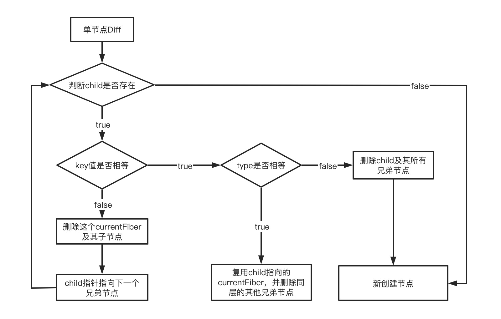

# 结合源码分析Diff算法的实现

上一节中在讲解`beginWork`的时候讲到，在`update`阶段，根据`currentFiber`和最新的`ReactElement`创建`workInProgressFiber`的时候会使用到`Diff`算法，判断是否能够**复用**`currentFiber`。

> `Diff`算法这里的复用指的是**复用currentFiber中的大部分属性（pendingProps除外），目的是为了复用DOM节点，省去销毁和创建DOM的过程消耗**

**如果Diff算法判断不能复用，不仅要创建新的workInProgressFiber，还要销毁和创建对应的真实DOM节点**

下面会详细介绍Diff算法的实现。

## 1. Diff算法的瓶颈和React做出的应对

React文档中有提到，即使在最前沿的算法中，将前后两棵树完全对比的算法时间复杂度为`O(n^3)`，`n`表示树中的节点数。如果使用该算法，那么展示1000个节点的计算量将会达到十亿级别，所以这种做法是及其昂贵的。

为了降低算法的复杂度，React提出了一套**启发式的算法**，时间复杂度为`O(n)`。在对比的过程中，**预设了一些条件**来降低算法的复杂度：

1. **只对同层节点进行`Diff`**。如果一个节点在更新前后改变了层级，React不会去尝试复用这个节点。
2. **不同类型的节点会产生不同的子树**。如果元素由`div`变成了`p`，React会直接销毁`div整个子树`，然后新建`p整个子树`。
3. **开发者可以通过设置`key prop`来暗示哪些元素在不同的渲染中能保持稳定**。


## 2. key的作用

回想一下前面讲到的`update`阶段中创建`workInProgressFiber`节点的步骤：

1. 在`current Fiber Tree`的同层节点中，找到相对应的`currentFiber`
2. 判断`currentFiber`能否复用
   - 如果可以复用，就根据`currentFiber`来生成`workInProgressFiber`，复用大部分属性
   - 如果不能复用，就标记删除老的`Fiber`节点，根据`ReactElement`来新创建`workInProgressFiber`

在这个过程中，最重要的是第一步。

在没有引入`key prop`的时候，寻找对应的currentFiber只能通过当前节点在**数组的索引**来寻找，这种方式对于单一节点或者是更新前后节点位置不变的情况是可行。但是对于**插入节点或者节点位置移动**的情况，这种做法是非常糟糕的。举个例子

```react
// 之前
<div>
	<p>a</p>
  <span>b</span>
  <div>c</div>
</div>

// 之后
<div>
  <div>c</div>
  <p>a</p>
  <span>b</span>
</div>
```

上面例子中，由于没有引入key prop，只能按照索引的方式来找对应的`currentFiber`，结果判断不能复用，会销毁重建对应的Fiber节点和对应的真实DOM。

然而对于开发者来说，他是知道当前只是移动了一个节点的位置，是不需要销毁和重建的。React只是没有正确找到对应的`currentFiber`，所以**开发者需要一种机制来告诉React如果寻找当前节点对应的`currentFiber`，这个机制就是`key prop`。**

同样的例子加上key

```react
// 之前
<div>
	<p key='a'>a</p>
  <span key='b'>b</span>
  <div key='c'>c</div>
</div>

// 之后
<div>
  <div key='c'>c</div>
  <p key='a'>a</p>
  <span key='b'>b</span>
</div>
```

节点可以根据key值精准的找到对应的`currentFiber`，不会产生多余的销毁和重建的过程。

然而**key作为寻找`currentFiber`的唯一标识**，有两点需要注意：

1. 唯一性：同层节点中，key值需要保持唯一。
2. 稳定性：更新前后，同一节点的key值不能变化。所以不推荐使用数组索引或随机数来作为key值

**key值的作用是在`Diff`的过程中，告诉React如何精准找到与当前节点对应的currentFiber**，避免找到错误的`currentFiber`而导致多余的DOM操作。


## 3. Diff算法的具体实现

`Diff`过程发生在`update`阶段，所以可以从入口函数`reconcileChildFibers`看起。

> 对应源代码可以查看[这里](https://github.com/careyke/react/blob/765e89b908206fe62feb10240604db224f38de7d/packages/react-reconciler/src/ReactChildFiber.new.js#L1204)

```javascript
function reconcileChildFibers(
    returnFiber: Fiber,
    currentFirstChild: Fiber | null,
    newChild: any,
    lanes: Lanes,
): Fiber | null {
    const isObject = typeof newChild === 'object' && newChild !== null;

    if (isObject) {
      	// 单节点处理
        switch (newChild.$$typeof) {
            case REACT_ELEMENT_TYPE:
                // ...调用reconcileSingleElement处理
            // ...省略其他case
        }
    }

    // 文本节点处理
    if (typeof newChild === 'string' || typeof newChild === 'number') {
        // ...调用reconcileSingleTextNode处理
    }

    // 多节点处理
    if (isArray(newChild)) {
        // ...调用reconcileChildrenArray处理
    }

    // ...省略其他情况处理

    // 若都没有匹配到，则删除子节点
    return deleteRemainingChildren(returnFiber, currentFirstChild);
}
```

下面会分成两个方面解析`Diff`算法的实现

### 2.1 单节点Diff

单个节点的Diff实现起来比较简单，不存在同层节点移动的问题。直接看`reconcileSingleElement`方法的代码

> 对应源代码看[这里](https://github.com/careyke/react/blob/765e89b908206fe62feb10240604db224f38de7d/packages/react-reconciler/src/ReactChildFiber.new.js#L1092)

```javascript
function reconcileSingleElement(
    returnFiber: Fiber,
    currentFirstChild: Fiber | null,
    element: ReactElement,
    lanes: Lanes,
): Fiber {
    const key = element.key;
    let child = currentFirstChild;
    while (child !== null) {
      	// 判断key值是否相等，单个节点key值一般都是null
        if (child.key === key) {
            switch (child.tag) {
                // ...省略
                default:
                    {
                      	// 判断类型是否相同
                        if (child.elementType === element.type) {
                            deleteRemainingChildren(returnFiber, child.sibling);
                          	// 根据currentFiber来创建workInProgressFiber,复用上一次的fiber中的一些属性，包括stateNode
                            const existing = useFiber(child, element.props); 
                            existing.ref = coerceRef(returnFiber, child, element);
                            existing.return = returnFiber;
                            return existing;
                        }
                        break;
                    }
            }
            // 删除child及其所有兄弟节点
            deleteRemainingChildren(returnFiber, child);
            break;
        } else {
          	// 删除child节点，可能有其他节点key与当前节点对应
            deleteChild(returnFiber, child);
        }
        child = child.sibling;
    }
    if (element.type === REACT_FRAGMENT_TYPE) {
      // ...省略
    } else {
      // 重新创建Fiber节点
      const created = createFiberFromElement(element, returnFiber.mode, lanes);
      created.ref = coerceRef(returnFiber, currentFirstChild, element);
      created.return = returnFiber;
      return created;
    }
}
```

从上面的代码可以看出，**判断能否复用节点的条件有两个**：

1. **`key`值相同**。用来从同层的多个`currentFiber`中找出当前节点对应的`currentFiber`，如果没有找到，则表示没有对应的`currentFiber`，需要新建节点
2. **`type`**相同。判断类型是否相同

两个条件**同时满足**的时候，才能复用对应的currentFiber节点的属性。

**当节点更新前多个子节点，更新之后只有一个子节点时**，也会进入单节点`Diff`。这种情况下有个细节需要关注一下：

1. **当`key`相同，`type`不同的时候**，会执行`deleteRemainingChildren`方法将`child`及其所有兄弟节点全部标记删除。这是因为**React认为已经找到了对应的`currentFiber`节点，但是类型不同无法复用，其他节点也不需要考虑，直接删除同层所有节点**。
2. **仅当key不同的时候**，会执行`deleteChild`方式标记删除当前节点。并不会直接将其兄弟节点也删除，因为**React判断当前并没有找到对应的`currentFiber`，所以只删除当前不匹配的节点，然后遍历其兄弟节点，寻找对应的`currentFiber`**。

单节点Diff的流程：



### 2.2 多节点Diff

多节点的Diff算法实现上存在两个难点：

1. 如何从同层多个`currentFiber`中找到对应的`currentFiber`。
2. 如何判断哪些节点发生了位置移动。

下面分别来分析这两个难点。

#### 2.2.1 寻找currentFiber

在单节点Diff中，由于更新之后只有一个节点，所以可以直接遍历一次`currentFiber链表`就可以轻松到对应的`currentFiber`。然而这种方式在多节点中是不可取的，因为要为每个节点都遍历一次`currentFiber链表`，显然代价有点大。

对于这种情况，一般的做法是采用**空间换时间**的方式，先遍历一次`currentFiber链表`，生成一个**`{key:currentFiber}`的映射表**，然后在遍历`children`的时候根据`key`值从映射表中寻找对应的`currentFiber`。

> 注意：这里生成映射表的时候，需要使用到currentFiber的key，但是有些节点是没有key的，这是可以使用index属性的值作为key。


React在上面做法的基础上，又做了进一步的优化。直接看多节点`Diff`的入口方法`reconcileChildrenArray`

> 对应的源码可以看[这里](https://github.com/careyke/react/blob/765e89b908206fe62feb10240604db224f38de7d/packages/react-reconciler/src/ReactChildFiber.new.js#L728)

```javascript
function reconcileChildrenArray(
    returnFiber: Fiber,
    currentFirstChild: Fiber | null,
    newChildren: Array < * > ,
    lanes: Lanes,
): Fiber | null {
    let resultingFirstChild: Fiber | null = null;
    let previousNewFiber: Fiber | null = null;

    let oldFiber = currentFirstChild;
    // 表示已经找到的currentFiber中，最大的index，也就是最右边的currentFiber的index
    // 用来判断当前节点是否发生移动的关键属性
    let lastPlacedIndex = 0; 
    let newIdx = 0;
    let nextOldFiber = null;
    // 第一次遍历，处理节点更新的情况
    for (; oldFiber !== null && newIdx < newChildren.length; newIdx++) {
        if (oldFiber.index > newIdx) {
            nextOldFiber = oldFiber;
            oldFiber = null;
        } else {
            nextOldFiber = oldFiber.sibling;
        }
        const newFiber = updateSlot(
            returnFiber,
            oldFiber,
            newChildren[newIdx],
            lanes,
        );
        if (newFiber === null) {
          	// 当前索引对应的currentFiber不是child对应的currentFiber
          	// 判断当前有节点发生移动，需要跳出第一次循环，进入节点移动的处理流程
            if (oldFiber === null) {
                oldFiber = nextOldFiber;
            }
            break;
        }
        if (shouldTrackSideEffects) {
            if (oldFiber && newFiber.alternate === null) {
                // 表示key相同，但是type不同，无法复用，需要删除旧节点
                deleteChild(returnFiber, oldFiber);
            }
        }
        lastPlacedIndex = placeChild(newFiber, lastPlacedIndex, newIdx);
        if (previousNewFiber === null) {
            resultingFirstChild = newFiber;
        } else {
            previousNewFiber.sibling = newFiber;
        }
        previousNewFiber = newFiber;
        oldFiber = nextOldFiber;
    }

    // 第一次遍历之后，newChildren已经遍历完成，剩余的currentFiber需要删除
    if (newIdx === newChildren.length) {
        // We've reached the end of the new children. We can delete the rest.
        deleteRemainingChildren(returnFiber, oldFiber);
        return resultingFirstChild;
    }

    // 第一次遍历之后，currentFiber链表遍历完成，剩余的newChildren全部需要新建workInProgressFiber
    if (oldFiber === null) {
        for (; newIdx < newChildren.length; newIdx++) {
            const newFiber = createChild(returnFiber, newChildren[newIdx], lanes);
            if (newFiber === null) {
                continue;
            }
            lastPlacedIndex = placeChild(newFiber, lastPlacedIndex, newIdx);
            if (previousNewFiber === null) {
                // TODO: Move out of the loop. This only happens for the first run.
                resultingFirstChild = newFiber;
            } else {
                previousNewFiber.sibling = newFiber;
            }
            previousNewFiber = newFiber;
        }
        return resultingFirstChild;
    }

    // 开始处理节点移动的情况
    // 第一步：建立currentFiber映射表示
    const existingChildren = mapRemainingChildren(returnFiber, oldFiber);

    // 第二步：开始第二次循环
    for (; newIdx < newChildren.length; newIdx++) {
        const newFiber = updateFromMap(
            existingChildren,
            returnFiber,
            newIdx,
            newChildren[newIdx],
            lanes,
        );
        if (newFiber !== null) {
            if (shouldTrackSideEffects) {
                if (newFiber.alternate !== null) {
                    // 已经参与复用的currentFiber节点需要从map中去除
                    existingChildren.delete(
                        newFiber.key === null ? newIdx : newFiber.key,
                    );
                }
            }
            lastPlacedIndex = placeChild(newFiber, lastPlacedIndex, newIdx);
            if (previousNewFiber === null) {
                resultingFirstChild = newFiber;
            } else {
                previousNewFiber.sibling = newFiber;
            }
            previousNewFiber = newFiber;
        }
    }

    if (shouldTrackSideEffects) {
      	// 有没有参与复用的currentFiber要标记删除
        existingChildren.forEach(child => deleteChild(returnFiber, child));
    }

    return resultingFirstChild;
}
```

React将寻找`currentFiber`的过程分成**两个部分**来处理

1. **节点更新**：这种情况下只需要根据数组中的索引就可以找到对应的`currentFiber`，不需要先遍历一次`currentFiber链表`创建映射表。
   - 节点数量不变，位置不变，只是属性更新
   - 在数组最后面追加节点
   - 在数组最后面删除节点

2. **节点移动**：这种情况下说明根据数组的索引已经找不到对应的currentFiber，所以需要对剩下的节点建立映射表来寻找对应的currentFiber。
   - 长度不变，节点位置发生调换
   - 在数组前面或者中间插入节点或者删除节点

React之所以将寻找的过程分成两个部分来处理，出了纯算法层面的优化之外。更重要的一点React团队发现，在日常的开发中，**相对于`节点移动`情况，`节点更新`的情况发生的频率要高得多**。所以分成两个部分来处理，可以将算法优化的收益放到最大。

节点更新过程和节点移动过程这两个部分是如何分割的？

从上面代码中可以看出，在处理节点更新的过程中，**如果某个节点无法通过数组的索引找到对应的currentFiber的时候，更新流程就结束了，这个节点以及后面的节点都会进入节点移动的处理流程中**。

> 这里更新流程中是同时开始遍历`newChildren`和`currentFiber`链表的，这种寻找currentFiber的方式不好描述，就简称为**通过索引寻找**，因为每次遍历过程中取到的currentFiber和newChild在同层的位置是一样的。

#### 2.2.2 判断节点是否发生移动

判断节点是否发生移动的关键点在于确定对比的**参照物**，**React从已经匹配到的所有`currentFiber`中，挑选最右边Fiber的位置索引作为参照物。代码中用变量`lastPlacedIndex`来保存这个位置索引**

由于newChildren的遍历是**从左到右**的，在没有发生位置移动的情况下，当前节点对应的`currentFiber`的`index`应该是要比`lastPlaceIndex`大的，所以**一旦`currentFiber`的`index`小于`lastPlaceIndex`，则表示当前currentFiber发生了移动**。

源代码中判断节点是否移动的方法是`placeChild`。

> 对应的源代码可以看[这里](https://github.com/careyke/react/blob/765e89b908206fe62feb10240604db224f38de7d/packages/react-reconciler/src/ReactChildFiber.new.js#L324)

```javascript
function placeChild(
    newFiber: Fiber,
    lastPlacedIndex: number,
    newIndex: number,
): number {
    newFiber.index = newIndex;
    if (!shouldTrackSideEffects) {
        // Noop.
        return lastPlacedIndex;
    }
    const current = newFiber.alternate;
    if (current !== null) {
        const oldIndex = current.index;
        if (oldIndex < lastPlacedIndex) {
            // 表示节点发生移动，标记移动flag
            newFiber.flags = Placement;
            return lastPlacedIndex;
        } else {
            // 表示节点不需要移动，更新lastPlacedIndex的值
            return oldIndex;
        }
    } else {
        // 没有对应的currentFiber，表示当前节点是一个插入节点
        newFiber.flags = Placement;
        return lastPlacedIndex;
    }
}
```

可以看到，代码中使用`oldIndex`表示`currentFiber`的位置索引，通过`oldIndex`和`lastPlacedIndex`之间的对比来判断节点是否移动。

1. `oldIndex < lastPlaceIndex`：表示当前节点对应的`currentFiber`需要**向右移动**。
2. `oldIndex >= lastPlaceIndex`：表示当前节点的相对位置是正确的，不需要移动。


下面来看两个例子，结合上面的算法分析一下发生移动的节点个数。

简化一下书写，每个字母表示一个节点，字母的值表示当前节点的key

Demo1：

```javascript
// 之前
abcd

// 之后
bcda
```

> 这种情况下，发生移动的节点只有一个，就是`a`节点需要向右移动。
>
> 这也是最优的移动，只需要移动一个节点就可以达到效果

Demo2

```javascript
// 之前
abcd

// 之后
dabc
```

> 这种情况下，发生移动的节点有三个，分别是`a、b、c`，这三个节点都需要向右移动
>
> 这显然不是最优的移动，最优的移动是将`d`向左移动即可，但是算法无法实现，这和**遍历newChildren的顺序**有关。

所以在日常的开发中，应该**尽量减少将后面的节点移动到前面的操作**。


## 4. 总结

分析完`Diff`算法的具体实现之后，笔者学习到了一些开发中需要注意的小细节

1. 不应该只是对循环体产生的子节点添加key，**对于一些可能会发生位置变化的节点应该也要加上key**。这种情况React并不会主动提示，但是如果不添加key会带来一些无意义的销毁和重建工作。
2. 尽量减少将后面的节点移动到前面的操作，这样会导致多个节点发生移动，从而导致多个DOM操作。
3. 设置`key`值的时候，要注意`key`值的唯一性和稳定性

