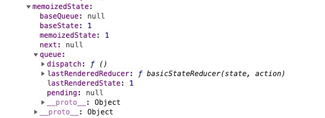

# Hooks的数据结构和更新流程

任何高层次的抽象设计落在实处都是对于数据结构和算法的设计。

在分析`Hooks`的实现之前，有必要先来了解一下`Hooks`的数据结构。

> 这里的`Hooks`指的是上一篇文章中提到`StateHooks`，在源码中称为`Hooks`


## 1. Hook的数据结构

前面我们提到过吗，`Hooks`是出现可以将复杂的`state`切分成多个简单的`state`，`Hooks`和`FunctionComponent`是相互独立的，所以每个`Hook`中需要维护自己的`state`。

看一下`Hook`的数据结构：

```javascript
type Update<S, A> = {|
  lane: Lane,
  action: A,
  eagerReducer: ((S, A) => S) | null,
  eagerState: S | null,
  next: Update<S, A>,
  priority?: ReactPriorityLevel,
|};

type UpdateQueue<S, A> = {|
  pending: Update<S, A> | null,
  dispatch: (A => mixed) | null,
  lastRenderedReducer: ((S, A) => S) | null,
  lastRenderedState: S | null,
|};

export type Hook = {|
  memoizedState: any,
  baseState: any,
  baseQueue: Update<any, any> | null,
  queue: UpdateQueue<any, any> | null,
  next: Hook | null,
|};
```

> 一眼看过去，结构体中有一些对于React使用者来说非常熟悉的单词：`action、reducer和dispatch`，这些都是`Redux`中的概念。`Redux`的作者`Dan`在加入`React`研发团队之后，将`Redux`优秀的设计思想也加入了`Hooks`的设计中。
>
> **可以将每个Hook看成是一个简化的Redux**，这也是后面为什么一会`useReducer`为例来分析`Hook`的更新流程

上面代码中包含三个数据结构，下面分别解释一下三个结构体中的字段：

1. `Update`结构体，**描述当前`Hook`的一次状态变化**，可以类比`ClassComponent`中的`Update`。

   - lane：状态变化的优先级（轨道）
   - action：状态变化的载体，在`useState`中`action`表示的就是最新的`state`值。
   - eagerReducer：尝试优化当前`Update`时调用的`reducer`，后面会详细讲解
   - eagerState：调用eagerReducer之后生成的state，也是和优化有关，后面详细讲解
   - next：连接下一个`Update`
   - priority：预留字段，暂时没有使用

   

2. `UpdateQueue`结构体，描述`Hook`的待更新队列

   - pending：本次更新新增的`Update`，**单向环状链表**
   - dispatch：更新的触发器
   - lastRenderedReducer：当前Hook上次挂载时注册的`reducer`
   - lastRenderedState：当前`Hook`上次更新时计算出的`state`

   

3. `Hook`结构体

   - memoizedState：当前`Hook`对应的`state`
   - baseState：待更新队列执行前的基本状态，`Update`相互依赖时发挥作用
   - baseQueue：上次更新中遗留的未执行`Update`，也是一个**单选环状链表**
   - queue: `Hook`对应的更新队列
   - next：连接下一个`Hook`


## 2. FunctionComponent 与 Hooks

对应`ClassComponent`来说，`state`可以持久化保存在每个实例对象中。然而`FunctionComponent`是没有实例的，那么`Hooks`产生的状态在`FunctionComponent`中如何保存呢？

**在`FunctionComponent`中，`Hooks`产生的状态是以临时变量的形式存在**，每个`Hook函数`在运行之后都会返回对应的状态值，`FunctionComponent`中可以用任意的变量来保存这个值。


也就是说，`Hook`产生的`state`在`FunctionComponent`中保存的时候是没有特殊标志的，那么如何能保证状态和Hook能够一一对应呢？

**`FunctionComponent`使用`Hooks方法`的调用顺序不变来保证状态和`Hook`能够一一对应起来**，组件中挂载的Hooks会以**链表的形式**保存在对应的`Fiber`节点中，在`memoizedState`这个属性上，然后**每次组件渲染的时候会遍历整个链表，依次获取每个Hook，计算出最新的state保存在`FunctionComponent`的临时变量中**。




这个依靠调用顺序来保证一一对应的机制明显是不够可靠的，所以在用法上`Hook方法`有一些限制，不能使用在条件语句中，不能使用在useEffect中等。总结起来就是：**在`FunctionComponent`函数体执行的时候，所有的`Hook方法`都必须要执行，一旦有某个方法不执行，就会报错。**

