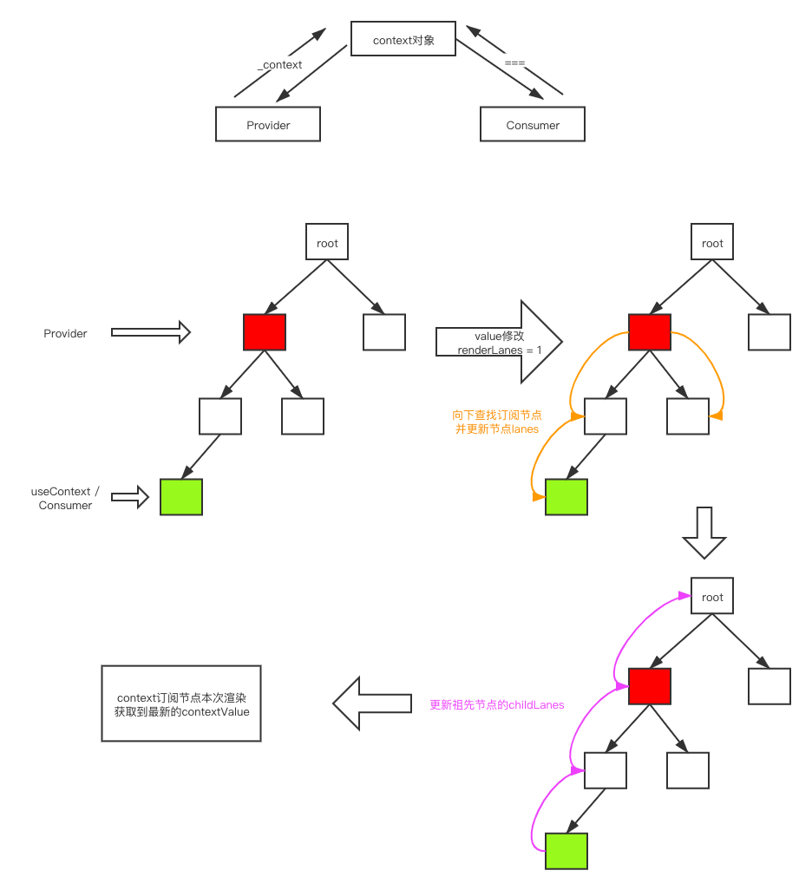

# 结合源码分析Context的实现

`Context`是`React`提供的一种**组件共享数据**的解决方案。避免数据通过`props`一层层往下传递的繁琐操作。

**当`Context`中保存的值发生变化的时候，所有依赖这个`Context`的组件都会更新。**

那么Context内部是如何实现的呢？下面我们就结合源码来详细分析Context的实现

> 这里我们只会分析新版的`Context`，老版的`Context`会直接跳过


## 1. Context相关的数据结构

React提供了`createContext` API来创建`Context`对象

> 对应的方法可以看[这里](https://github.com/careyke/react/blob/765e89b908206fe62feb10240604db224f38de7d/packages/react/src/ReactContext.js#L14)

```javascript
export function createContext<T>(
  defaultValue: T,
  calculateChangedBits: ?(a: T, b: T) => number,
): ReactContext<T> {
  if (calculateChangedBits === undefined) {
    calculateChangedBits = null;
  } else {
  }

  const context: ReactContext<T> = {
    $$typeof: REACT_CONTEXT_TYPE,
    _calculateChangedBits: calculateChangedBits,
    _currentValue: defaultValue,
    
    // 这里是为了并发渲染预留的字段，暂时不需要了解
    _currentValue2: defaultValue,
    _threadCount: 0,
    
    // These are circular
    Provider: (null: any),
    Consumer: (null: any),
  };

  context.Provider = {
    $$typeof: REACT_PROVIDER_TYPE,
    _context: context,
  };

  if (__DEV__) {
    // ...省略
  } else {
    context.Consumer = context;
  }

  return context;
}
```

上面代码中有几个细节需要注意一下：

1. `Provider`对象中可以通过`_context`属性获取`context`对象，`Consumer`本身就是`context`对象
2. 创建`context`对象的时候，预留了一个参数`calculateChangedBits`，这个方法可以**让开发者自己来判断context的值是否发生变化**。（暂时还没有开放出来）


> `context`对象中有两个字段用来保存值。其中`_currentValue`用来保存主渲染器的值，`_currentValue2`用来保存副渲染器的值。
>
> 这个涉及到同时使用多个渲染器的问题，暂时不需要了解，我们只看主渲染器
>
> （React未来的发展路径）


## 2. Provider

在使用`context`的时候，通常是使用`context`提供的两个组件`Provider`和`Consumer`来实现数据的共享。

这里的设计模式和发布-订阅的模型很类似。

- **`Provider`类似于发布者**。负责对比数据有没有发生变化，如果发生变化则需要通知对应的订阅者。
- **`Consumer`类似于订阅者**。表示当前这个组件订阅对应context的值，如果context的值发生变化，组件需要更新。


这里我们先来看看在`beginWork`阶段中，对于`Provider`类型的节点是如何处理的。

> 对应的代码可以看[这里](https://github.com/careyke/react/blob/765e89b908206fe62feb10240604db224f38de7d/packages/react-reconciler/src/ReactFiberBeginWork.new.js#L2756)

```javascript
function updateContextProvider(
  current: Fiber | null,
  workInProgress: Fiber,
  renderLanes: Lanes,
) {
  // Provider对象
  const providerType: ReactProviderType<any> = workInProgress.type;
  // 获取context对象
  const context: ReactContext<any> = providerType._context;

  const newProps = workInProgress.pendingProps;
  const oldProps = workInProgress.memoizedProps;

  const newValue = newProps.value;

  // 更新context的值，并且记录context的嵌套层级。
  // 开发时期使用
  pushProvider(workInProgress, newValue);

  if (oldProps !== null) {
    // update阶段
    const oldValue = oldProps.value;
    // 判断context的值是否发生改变
    const changedBits = calculateChangedBits(context, newValue, oldValue);
    if (changedBits === 0) {
      // 没有改变
      if (
        oldProps.children === newProps.children &&
        !hasLegacyContextChanged() // 旧版的Context，不考虑
      ) {
        // 如果children是相同的，可以直接进入优化处理
        return bailoutOnAlreadyFinishedWork(
          current,
          workInProgress,
          renderLanes,
        );
      }
    } else {
      // 如果context发生变化，需要向下遍历寻找对应的Consumer，打上更新标记
      propagateContextChange(workInProgress, context, changedBits, renderLanes);
    }
  }

  // 根据子ReactElement生成对应的Fiber节点
  const newChildren = newProps.children;
  reconcileChildren(current, workInProgress, newChildren, renderLanes);
  return workInProgress.child;
}
```

从上面代码中可以看出，对于`Provider`类型的节点的处理分成两个阶段：

1. **mount阶段**：直接根据`子ReactElement`来生成对应的`Fiber`节点

2. **update阶段**：判断`context`的值是否发生变化

   - **如果值没有发生变化，而且`children`也没有发生变化**，会进入优化处理，复用`current Fiber Tree`中的节点

     > 在`render`阶段的文章中介绍过：
     >
     > 这里对比`children`使用的是**全等`===`**，如果执行了`render`函数，生成的`children`必然是一个新对象
     >
     > 可以看看`babel`转换之后的`React`代码，线上[试试](https://www.babeljs.cn/repl#?browsers=&build=&builtIns=false&spec=false&loose=false&code_lz=JYWwDg9gTgLgBAJQKYEMDG8BmUIjgcilQ3wG4AoctAGxQGc64ARJECOJADxiQDsATRsnQwAdAGFckXnxgBvcgEg0EXnRhQArhmgAKMDjB0AlArjm4iuprBIo-wyYoW4AX3LnFRAXd2mPLnBEMJpQvHAAPPzAAG4AfBF0YCi8CQD0SSnp0fEB5u6uQA&debug=false&forceAllTransforms=false&shippedProposals=false&circleciRepo=&evaluate=false&fileSize=false&timeTravel=false&sourceType=module&lineWrap=true&presets=es2015%2Creact&prettier=false&targets=&version=7.6.2&externalPlugins=)

   - **如果值发生了变化**，则需要**向下遍历**寻找当前`context`的订阅者，打上更新标记，本次一起更新。

下面我们重点来分析`update`阶段的实现代码。


### 2.1 更新context的值

更新context的值发生在`pushProvider`方法中

```javascript
export function pushProvider<T>(providerFiber: Fiber, nextValue: T): void {
  const context: ReactContext<T> = providerFiber.type._context;

  if (isPrimaryRenderer) {
    // 主渲染器，考虑到并发渲染
    // 这里只考虑主渲染器
    
    
    push(valueCursor, context._currentValue, providerFiber);

    context._currentValue = nextValue; // 赋值
  } else {
    push(valueCursor, context._currentValue2, providerFiber);

    context._currentValue2 = nextValue;
  }
}
```

其中`push`方法用来记录`Provider`的嵌套堆栈，暂时没看出其具体作用，感觉是用在开发阶段，方便调试。


### 2.2 对应context的值是否发生变化

获取到最新的context值之后，需要判断该值是否发生变化。对应的代码在`calculateChangedBits`方法中

```javascript
export function calculateChangedBits<T>(
  context: ReactContext<T>,
  newValue: T,
  oldValue: T,
) {
  if (is(oldValue, newValue)) {
    // 没有发生改变
    return 0;
  } else {
    // 调用自定义的判断方法
    const changedBits =
      typeof context._calculateChangedBits === 'function'
        ? context._calculateChangedBits(oldValue, newValue)
        : MAX_SIGNED_31_BIT_INT;

    return changedBits | 0;
  }
}
```

这个方法返回 0 则表示context前后的值没有变化。其中对比值的方法使用的是 `Object.is` API。

这里还有一个细节就是创建`context`时传入的判断方法会在这里执行，由开发者来判断当前的`context`值是否发生变化。**前提条件是`is(oldValue, newValue) === false`**


### 2.3 向下遍历寻找context的订阅者

这个过程发生在`propagateContextChange`方法中

```javascript
export function propagateContextChange(
  workInProgress: Fiber,
  context: ReactContext<mixed>,
  changedBits: number,
  renderLanes: Lanes,
): void {
  let fiber = workInProgress.child;
  if (fiber !== null) {
    // Set the return pointer of the child to the work-in-progress fiber.
    fiber.return = workInProgress;
  }
  while (fiber !== null) {
    let nextFiber;

    // 获取节点上context依赖链表
    const list = fiber.dependencies;
    if (list !== null) {
      nextFiber = fiber.child;

      let dependency = list.firstContext;
      while (dependency !== null) {
        // 遍历依赖链表
        if (
          dependency.context === context &&
          (dependency.observedBits & changedBits) !== 0
        ) {
          // 找到匹配项，增加更新标记

          if (fiber.tag === ClassComponent) {
            // Schedule a force update on the work-in-progress.
            const update = createUpdate(
              NoTimestamp,
              pickArbitraryLane(renderLanes),
            );
            update.tag = ForceUpdate;
            enqueueUpdate(fiber, update);
          }
          // 确保本次更新能够重新渲染这个节点
          fiber.lanes = mergeLanes(fiber.lanes, renderLanes);
          const alternate = fiber.alternate;
          if (alternate !== null) {
            alternate.lanes = mergeLanes(alternate.lanes, renderLanes);
          }
          // 给整个parentPath所有的节点都加上本次更新的标记
          scheduleWorkOnParentPath(fiber.return, renderLanes);

          // 也需要给依赖链表打上更新标记，后面会用这个属性来判断是否组件需要更新
          list.lanes = mergeLanes(list.lanes, renderLanes);
          break;
        }
        dependency = dependency.next;
      }
    } else if (fiber.tag === ContextProvider) {
      // 对于Provider类型节点的处理
      nextFiber = fiber.type === workInProgress.type ? null : fiber.child;
    } else if (
      enableSuspenseServerRenderer &&
      fiber.tag === DehydratedFragment
    ) {
      // ...省略 服务端渲染
    } else {
      nextFiber = fiber.child;
    }

    // 遍历后代子树中的节点，深度优先遍历
    if (nextFiber !== null) {
      // Set the return pointer of the child to the work-in-progress fiber.
      nextFiber.return = fiber;
    } else {
      // No child. Traverse to next sibling.
      nextFiber = fiber;
      while (nextFiber !== null) {
        if (nextFiber === workInProgress) {
          // We're back to the root of this subtree. Exit.
          nextFiber = null;
          break;
        }
        const sibling = nextFiber.sibling;
        if (sibling !== null) {
          // Set the return pointer of the sibling to the work-in-progress fiber.
          sibling.return = nextFiber.return;
          nextFiber = sibling;
          break;
        }
        // No more siblings. Traverse up.
        nextFiber = nextFiber.return;
      }
    }
    fiber = nextFiber;
  }
}
```

代码中的逻辑还是很清晰的，主要做了以下两个事情：

1. 向下遍历子树，找到当前context的订阅者。**也就是`context`中的`Consumer`节点或者是利用`useContext`使用该`context`的节点**，后面会详细介绍。

2. 给满足条件的节点打上更新的标记，也就是给节点增加`renderLanes`，本次一起更新。


> 注意：
>
> 上面代码中有关与`Provider`类型节点的处理需要注意一下。context的依赖遵从的是**就近原则**。


这里有一个细节，在给满足条件的节点增加更新标记的时候。由于context是跨层级更新的，所以需要更新**节点对应所有祖先节点的`childLanes`**。

对应的方法是`scheduleWorkOnParentPath`，**向上遍历**祖先节点

```javascript
export function scheduleWorkOnParentPath(
  parent: Fiber | null,
  renderLanes: Lanes,
) {
  // Update the child lanes of all the ancestors, including the alternates.
  let node = parent;
  while (node !== null) {
    const alternate = node.alternate;
    if (!isSubsetOfLanes(node.childLanes, renderLanes)) {
      node.childLanes = mergeLanes(node.childLanes, renderLanes);
      if (alternate !== null) {
        alternate.childLanes = mergeLanes(alternate.childLanes, renderLanes);
      }
    } else if (
      alternate !== null &&
      !isSubsetOfLanes(alternate.childLanes, renderLanes)
    ) {
      alternate.childLanes = mergeLanes(alternate.childLanes, renderLanes);
    } else {
      break;
    }
    node = node.return;
  }
}
```


> **注意：**
>
> 整个遍历寻找的过程感觉是个比较耗时的过程，既要向下遍历，又需要向上遍历。**层级跨度越大，遍历的过程就越耗时。**
>
> `React-Redux`就是使用`context`的方案来管理更新的，性能需要考量！（感觉有隐患）


## 3. Consumer

前面讲到当context的值发生变化的时候，会向下查找寻找对应的订阅者。那么订阅者有什么特征呢？

从上面寻找的代码中我们可以看到，**订阅者对应的`Fiber`中有一个`dependencies`属性，用来保存当前组件所依赖的context。**

`dependencies`属性在组件渲染的时候会赋值。


下面来看一下`Comsumer`类型的节点是如何处理。

```javascript
function updateContextConsumer(
  current: Fiber | null,
  workInProgress: Fiber,
  renderLanes: Lanes,
) {
  let context: ReactContext<any> = workInProgress.type;
  
  const newProps = workInProgress.pendingProps;
  const render = newProps.children;

  // 读取context之前的准备工作
  prepareToReadContext(workInProgress, renderLanes);
  // 读取context的值，并且更新依赖链表
  const newValue = readContext(context, newProps.unstable_observedBits);
  let newChildren;
  if (__DEV__) {
  } else {
    newChildren = render(newValue);
  }

  workInProgress.flags |= PerformedWork;
  reconcileChildren(current, workInProgress, newChildren, renderLanes);
  return workInProgress.child;
}
```


### 3.1 读取context之前的准备工作

这个过程对应的方法是`prepareToReadContext`

```javascript
export function prepareToReadContext(
  workInProgress: Fiber,
  renderLanes: Lanes,
): void {
  currentlyRenderingFiber = workInProgress;
  lastContextDependency = null;
  lastContextWithAllBitsObserved = null;

  const dependencies = workInProgress.dependencies;
  if (dependencies !== null) {
    const firstContext = dependencies.firstContext;
    if (firstContext !== null) {
      if (includesSomeLane(dependencies.lanes, renderLanes)) {
				// 修改didReceiveUpdate的值，表示该组件需要更新
        markWorkInProgressReceivedUpdate();
      }
      // 清空数据，后面会重置
      dependencies.firstContext = null; 
    }
  }
}
```

准备工作做了两个事情：

1. 清空依赖链表，后面读取context值的时候会重新赋值
2. 如果依赖链表中的context有更新，需要修改`didReceiveUpdate`的值。这个值在`beginWork`中会用到，通常是`FunctionComponent`

> `FunctionComponent`在渲染的时候也会执行这个方法，可以看[updateFunctionComponent](https://github.com/careyke/react/blob/a22834e3f44f2a361a378ed36b4543a09da49116/packages/react-reconciler/src/ReactFiberBeginWork.new.js#L700)


### 3.2 读取context的值并更新依赖链表

这个过程发生在`readContext`方法中

```javascript
export function readContext<T>(
  context: ReactContext<T>,
  observedBits: void | number | boolean, // 这个值暂时没有传，是以后的功能吧
): T {
  if (lastContextWithAllBitsObserved === context) {
    // Nothing to do. We already observe everything in this context.
  } else if (observedBits === false || observedBits === 0) {
    // Do not observe any updates.
  } else {
    let resolvedObservedBits; // Avoid deopting on observable arguments or heterogeneous types.
    if (
      typeof observedBits !== 'number' ||
      observedBits === MAX_SIGNED_31_BIT_INT
    ) {
      // Observe all updates.
      lastContextWithAllBitsObserved = ((context: any): ReactContext<mixed>);
      resolvedObservedBits = MAX_SIGNED_31_BIT_INT;
    } else {
      resolvedObservedBits = observedBits;
    }

    const contextItem = {
      context: ((context: any): ReactContext<mixed>),
      observedBits: resolvedObservedBits,
      next: null,
    };

    if (lastContextDependency === null) {
      lastContextDependency = contextItem;
      currentlyRenderingFiber.dependencies = {
        lanes: NoLanes, // 重置更新标记（优先级）
        firstContext: contextItem,
        responders: null,
      };
    } else {
      // 链表结构，使用useContext时，一个组件可能会依赖多个context
      lastContextDependency = lastContextDependency.next = contextItem;
    }
  }
  return isPrimaryRenderer ? context._currentValue : context._currentValue2;
}
```

这里代码的逻辑还是很清晰的。我们重点看一下`dependencies`的数据结构。


#### 3.2.1 dependencies和contextItem的数据结构

dependencies：

```javascript
{
  lanes: NoLanes, // 依赖的context的更新优先级，是否需要更新的标识
  firstContext: contextItem, // 依赖的contextItem，链表结构
  responders: null,
};
```

contextItem：

```javascript
{
	context: ((context: any): ReactContext<mixed>), // 依赖的context对象
  observedBits: resolvedObservedBits,
  next: null,
};
```


## 4. useContext

对于`Consumer`类型的节点来说，其依赖链表中只有一个context对象。

而对于`FunctionComponent`来说，可以**使用`useContext`依赖多个不同的`context`对象。**

**调用`useContext`时，实际上调用的就是上面的`readContext`方法**


## 5. context的更新流程图


