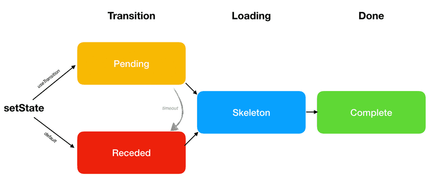

# 结合源码分析useTransition

在Concurrent模式中，React提供了一个新的API — useTransition。具有以下功能

1. 延迟更新 — **降低更新的优先级**
2. 配合`Suspense`**解决因为组件挂起而导致用户交互内容隐藏的问题**

常见的使用场景是在切换页面的时候，但是下一页的数据还没有加载好，切换过去会出现空白页或者`loading`状态，这种交互是不友好的。这种情况下，用户更希望的时候在当前页面停留一会儿，然后等下一页的数据加载好之后再切换过去。

`useTransition`通常会配合`Suspense`一起使用，用来解决`Suspense`使用中遇到的问题。具体是什么问题以及如何解决的，我们后面再来分析，这里我们先来分析一下`useTransition`的实现。


## 1. useTransition的源码实现

### 1.1 mount阶段

内部调用的方法是`mountTransition`

```js
function mountTransition(): [(() => void) => void, boolean] {
  const [isPending, setPending] = mountState(false);
  const start = startTransition.bind(null, setPending);
  const hook = mountWorkInProgressHook();
  hook.memoizedState = start;
  return [start, isPending];
}
```

这个hook内部调用了一次`useState`，创建了一个`state`用来**标识当前过渡的状态**。该hook中创建了一个start方法并且抛出，用户可以调用该方法开启更新的过渡。

这里有一个细节：`start`方法会保存在`hook.memoizedState`，所以这个方法是保持不变的。

下面看一下`startTransition`方法内部的逻辑

```js
function startTransition(setPending, callback) {
  const priorityLevel = getCurrentPriorityLevel();
  if (decoupleUpdatePriorityFromScheduler) {
    // ... 省略 当前版本始终是false
  } else {
    runWithPriority(
      priorityLevel < UserBlockingPriority
        ? UserBlockingPriority
        : priorityLevel,
      () => {
        // 当前优先级不小于UserBlockingPriority
        setPending(true);
      },
    );

    runWithPriority(
      priorityLevel > NormalPriority ? NormalPriority : priorityLevel,
      () => {
        // 当前优先级不大于NormalPriority
        const prevTransition = ReactCurrentBatchConfig.transition;
        ReactCurrentBatchConfig.transition = 1;
        try {
          setPending(false);
          callback();
        } finally {
          ReactCurrentBatchConfig.transition = prevTransition;
        }
      },
    );
  }
}
```

这个方法的逻辑也比较清晰：

1. 以**不小于`UserBlockingPriority`的优先级**更新过渡的状态，开启过渡
2. 以**不大于`NormalPriority`的优先级**执行传入的更新，更新完成之后关闭过渡

在创建`Update`对象的时候，会**根据当前优先级的上下文来给`Update`分配对应的`lane`**。这里`setPending(false)`和`callback()`中创建的更新优先级是一样的，而且是同步创建的，所以**只会触发一次更新**


前面我们讲过，`useTransition`其中一个功能是用来**延迟更新**，但是这里`callback`中创建的更新对应的优先级是`NormalPriority`，在React应用中，默认的更新优先级就是`NormalPriority`，所以使用这个优先级来延迟更新的效果不会很好。

那么React是如何来解决这个问题的呢？

看一下`requestUpdateLane`方法

> 这个方法前面有讲过，这里只截取了一部分和transition相关的逻辑

```js
export function requestUpdateLane(fiber: Fiber): Lane {
  // Special cases
  const mode = fiber.mode;
  if ((mode & BlockingMode) === NoMode) {
    return (SyncLane: Lane);
  } else if ((mode & ConcurrentMode) === NoMode) {
    return getCurrentPriorityLevel() === ImmediateSchedulerPriority
      ? (SyncLane: Lane)
      : (SyncBatchedLane: Lane);
  } else if (
    !deferRenderPhaseUpdateToNextBatch &&
    (executionContext & RenderContext) !== NoContext &&
    workInProgressRootRenderLanes !== NoLanes
  ) {
    return pickArbitraryLane(workInProgressRootRenderLanes);
  }

  if (currentEventWipLanes === NoLanes) {
    currentEventWipLanes = workInProgressRootIncludedLanes;
  }

  // 获取 ReactCurrentBatchConfig.transition
  const isTransition = requestCurrentTransition() !== NoTransition;
  if (isTransition) {
    // 当前版本下currentEventPendingLanes始终为0
    if (currentEventPendingLanes !== NoLanes) {
      currentEventPendingLanes =
        mostRecentlyUpdatedRoot !== null
          ? mostRecentlyUpdatedRoot.pendingLanes
          : NoLanes;
    }
    return findTransitionLane(currentEventWipLanes, currentEventPendingLanes);
  }
  // ... 省略
}


// 获取TransitionLane
export function findTransitionLane(wipLanes: Lanes, pendingLanes: Lanes): Lane {
  let lane = pickArbitraryLane(TransitionLanes & ~pendingLanes);
  if (lane === NoLane) {
    lane = pickArbitraryLane(TransitionLanes & ~wipLanes);
    if (lane === NoLane) {
      lane = pickArbitraryLane(TransitionLanes);
    }
  }
  return lane;
}
```

上面方法中可以看到，在获取`Update`对应的`lane`时，对于在过渡阶段中创建的`Update`有特殊的处理。`requestCurrentTransition`方法的返回值就是前面`startTransition`方法中设置的 `ReactCurrentBatchConfig.transition` 的值。

所以在过渡阶段调度的更新，对应的优先级是`TransitionPriority`，从而实现了延迟更新的目的。


### 1.2 update阶段

update阶段对应的方法是`updateTransition`

```js
function updateTransition(): [(() => void) => void, boolean] {
  const [isPending] = updateState(false);
  const hook = updateWorkInProgressHook();
  const start = hook.memoizedState;
  return [start, isPending];
}
```

`updateTransition`方法中返回的`start`方法**重用**了`mount`阶段创建的start方法。没有什么特殊的逻辑


### 1.3 总结

通过对`useTransition`源码的分析，我们可以得出这么一个结论：

**`useTransition`本身的功能就是通过降低更新的优先级，达到延迟更新的目的。**


## 2. useTransition 和 Suspense

在上一篇文章中我们分析了`Suspense`的实现原理和怎么解决传统模式下React应用中的一些痛点。

但是`Suspense`模式本身也会带来一个问题：

**在请求没有完成的时候，会回退到`fallbackChildren`**。在`mount`阶段的时候这种交互是可以接受的，但是在`update`阶段，这种回退的交互是不友好的

`useTransition`配合`Suspense`使用刚好就可以解决这个问题，也就是我们开篇介绍的`useTransition`的第二个功能。


### 2.1 Suspense组件树更新时经历的三个阶段

在分析具体的实现之前，我们先结合一个例子来分析一下优化的思路

> 我们切换页签的例子来分析，对应的demo可以看[这里](https://codesandbox.io/s/usetransition-switchtab-7xgxi?file=/src/App.js)

#### 2.1.1 默认情况下

默认情况下，当请求更新时Suspense组件树会经历以下三个阶段：

1. **Receded**: 最外层`Suspense`对应的请求没有完成，回退到渲染`fallbackChildren`
2. **Skeleton**: 嵌套的Suspense对应的请求陆续完成，`Suspense`陆续渲染对应的`primaryChildren`
3. **Complete**: 所有的Suspense都渲染对应的`primaryChildren`，新页面渲染完成

> 区别 Receded 和 Skeleton 阶段：
>
> Receded感觉是面向用户”后退“了一步，页面从完整页面到降级页面；Skeleton感觉是面向用户”前进“了一步，慢慢渲染成更多内容

对于用户来说Receded阶段的交互是不友好的，用户能够接受在旧页面显示`pending`状态，但是无法接受页面直接回退到空白。

所以优化的思路就是**将原来的Receded阶段替换成Pending阶段，当新页面中必要的数据完成之后再来更新页面，进入Skeleton阶段**


#### 2.1.2 useTransition优化处理

加入`useTransition`优化处理之后，当请求更新时Suspense组件树会经历以下三个阶段：

1. **Pending**: 停留在当前页面，等待新页面必要数据返回，不会退
2. **Skeleton**: 嵌套的Suspense对应的请求陆续完成，`Suspense`陆续渲染对应的`primaryChildren`
3. **Complete**: 所有的Suspense都渲染对应的`primaryChildren`，新页面渲染完成

也就是我们上面提到的期望的优化方式


借用官方文档中的一张图来表示这个优化过程：



> 注意：
>
> 上面图对应的React版本比较老，在当前版本中React将其中的`timeout`处理去掉了。
>
> 目前官方文档中对于`useTransition`的描述和例子对应的都是比较老的React版本，当前版本对useTransition的功能有了一些更新


### 2.2 优化的源码实现

上面我们说到`useTransition`配合`Suspense`可以将`Receded`阶段优化成`Pending`阶段。但是我们在分析useTransition源码的时候，其本质的功能就是通过降低更新的优先级延迟更新。如果没有特殊处理的话，并不能达到期望的优化效果。

那么源码中是如何实现的呢？

实现的关键是在`finishConcurrentRender`方法中

```js
function finishConcurrentRender(root, exitStatus, lanes) {
  switch (exitStatus) {
    // ...省略
    case RootSuspendedWithDelay: {
      markRootSuspended(root, lanes);

      if (includesOnlyTransitions(lanes)) {
        // 本次更新试一次过渡更新
        // 本次更新取消，不进入commit阶段
        break;
      }

      if (!shouldForceFlushFallbacksInDEV()) {
        // loading throttle处理
        const mostRecentEventTime = getMostRecentEventTime(root, lanes);
        const eventTimeMs = mostRecentEventTime;
        const timeElapsedMs = now() - eventTimeMs;
        const msUntilTimeout = jnd(timeElapsedMs) - timeElapsedMs;

        // Don't bother with a very short suspense time.
        if (msUntilTimeout > 10) {
          // Instead of committing the fallback immediately, wait for more data
          // to arrive.
          root.timeoutHandle = scheduleTimeout(
            commitRoot.bind(null, root),
            msUntilTimeout,
          );
          break;
        }
      }

      commitRoot(root);
      break;
    }
    // ...省略
  }
}
```

上一篇文章中我们分析Suspense的时候有提到：**在`update`阶段，当`Suspense`由`unsuspended`状态切换成`suspended`状态的时候，会给`workInProgressRootExitStatus`赋值`RootSuspendedWithDelay`。如果当前更新被`startTransition`包裹时，就会命中`includesOnlyTransitions(lanes)`，会抛弃掉当前更新，等`promise`完成之后再出发新的更新。**

如此就实现了期望中的优化，等数据加载完成之后再进去下一个页面。

这里有几个点需要**注意**一下：

1. 优化的过程可能发生在`Suspense`组件`update`阶段

2. 当命中`useTransition`优化的时候，会抛弃掉当前`render`阶段创建的`workInProgress tree`，下次更新时会从新创建

3. 当命中`useTransition`优化的时候，不会走commit阶段，也就是promise不能在commit阶段注册回调函数。前面分析Suspense时讲过，在`Concurrent`模式中，`promise`会在是`render`阶段注册一个回调函数，在当前优化命中的情况下，promise完成之后就是调用在这个回调函数来触发更新的。

   > 这种情况在分析Suspense时没有提到，这里补充一下


至此我们就分析完了`useTransition`的实现原理和对`Suspense`的优化实现。


## 3. 版本迭代

这里笔者还是想再强调一下，当前分析的React版本和官方文档中例子对应的React版本是有较大的差别的。其中对于`useTransition`的功能和实现就发生了比较大的变化。

在旧版中，useTransition有一个timeout的概念，当过渡期超过一段时间之后，如果promise还是没有完成，就会进入Receded阶段。