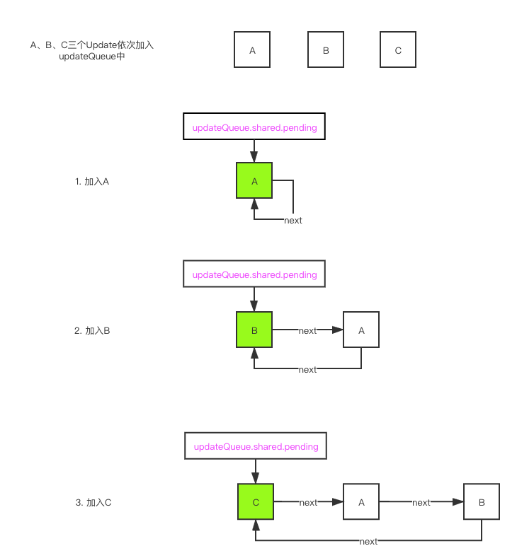

# 创建update

在前面的文章中，我们分别分析了`Scheduler`、`Reconciler`和`Renderer`各自的工作内容。接下来的几篇文章中，我们将详细的介绍整个`React`应用`update`时的详细过程。

**整个update的流程大致可以分成三个阶段**：

1. 创建update
2. 调度update
3. 执行update

这篇文章中我们主要分析`创建update`阶段

## 1. 状态变化

`React`应用中，产生更新的前提条件就是发生状态变化，`React`提供了几种发生状态变化的`API`：

1. `ReactDOM.render`
2. `this.setState`
3. `this.forceUpdate`
4. `useState`
5. `useReducer`

> `SSR`暂时不考虑

上面不同的方法使用的场景是不一样的，但是使用的是**同一套更新机制**，所以可以理解为这几种方法的**“输出”**是一样的。

每个方法内部都会创建一个**保存本次更新内容**的对象，叫做**`Update`**，然后在`render`阶段会根据`Update`来计算最新的`state`。

> 前面的文章中我们就提到过，`ReactDOM.render`初始化`React`应用和更新`React`应用流程是一样的，都会创建`Update`对象，然后再调度更新。

接下来笔者会以`ClassComponent`为例来分析整个`update`的过程，`FunctionComponent`的更新流程会在后面介绍`Hooks`的时候一起分析。

## 2. 创建Update对象

下面我们以`this.setState`的执行过程为例来分析创建`Update`对象的过程。

我们在定义`ClassComponent`的时候，通常都要继承`React.Component`或者`React.PureComponent`，`setState`方法就是在父类中定义的方法。

```javascript
function Component(props, context, updater) {
  this.props = props;
  this.context = context;
  this.refs = emptyObject;
  this.updater = updater || ReactNoopUpdateQueue;
}
Component.prototype.setState = function(partialState, callback) {
  this.updater.enqueueSetState(this, partialState, callback, 'setState');
};
Component.prototype.forceUpdate = function(callback) {
  this.updater.enqueueForceUpdate(this, callback, 'forceUpdate');
};
```

> 对应的源代码看[这里](https://github.com/careyke/react/blob/765e89b908206fe62feb10240604db224f38de7d/packages/react/src/ReactBaseClasses.js#L20)

我们可以看到，`Component`实例中保存了一个**更新器`updater`**，更新的创建过程是在`updater`中完成的。

`Component`中并没有给`updater`赋值，`ReactNoopUpdateQueue`可以理解为一个空值。真正给`updater`赋值发生在`beginWork`中，组件初始化的时候。

```javascript
function adoptClassInstance(workInProgress: Fiber, instance: any): void {
  // 更新器赋值
  instance.updater = classComponentUpdater;
  workInProgress.stateNode = instance;
  // 组件实例和fiber之间建立引用关系，方便更新的时候获取对应的fiber节点
  // findDOMNode也会使用到这个映射关系
  setInstance(instance, workInProgress);
}
```

> 对应的源代码可以看[这里](https://github.com/careyke/react/blob/765e89b908206fe62feb10240604db224f38de7d/packages/react-reconciler/src/ReactFiberClassComponent.new.js#L563)

### 2.1 enqueueSetState

`this.setState`方法内部调用的是`enqueueSetState`，对应的逻辑都是在这个方法完成的。

> 对应的源代码可以看[这里](https://github.com/careyke/react/blob/765e89b908206fe62feb10240604db224f38de7d/packages/react-reconciler/src/ReactFiberClassComponent.new.js#L195)

```javascript
enqueueSetState(inst, payload, callback) {
      // 通过实例和fiber之间的索引关系来获取对应的fiber
      // 这里获取到的不一定的current Fiber 有可能是workInProgress Fiber
    const fiber = getInstance(inst);
    const eventTime = requestEventTime();
      // 获取本次更新的优先级
    const lane = requestUpdateLane(fiber);

      // 创建Update
    const update = createUpdate(eventTime, lane);
    update.payload = payload;
    if (callback !== undefined && callback !== null) {
        update.callback = callback;
    }

      // 将当前更新加入Update链表
    enqueueUpdate(fiber, update);
      // 调度更新入口，发起一次调度
    scheduleUpdateOnFiber(fiber, lane, eventTime);
},
```

### 2.2 Update的数据结构（*）

直接看`createUpdate`方法

```javascript
export function createUpdate(eventTime: number, lane: Lane): Update<*> {
  const update: Update<*> = {
    eventTime,
    lane,
    tag: UpdateState,
    payload: null,
    callback: null,

    next: null,
  };
  return update;
}
```

> 对应的源代码可以看[这里](https://github.com/careyke/react/blob/765e89b908206fe62feb10240604db224f38de7d/packages/react-reconciler/src/ReactUpdateQueue.new.js#L184)

各个字段的含义：

- eventTime：表示`Update`创建的时间，通过`performance.now()`获取到的毫秒数
- lane：表示当前`Update`的执行优先级
- tag：表示`Update`的类型，包括`UpdateState | ReplaceState | ForceUpdate | CaptureUpdate`
- payload: 表示`Update`挂载的数据，也就是`this.setState`的第一个参数
- callback：表示`Update`的回调函数，也就是`this.setState`的第二个参数，会在commit阶段来处理
- next：指向下一个`Update`，形成一个链表

`Update`对象创建完成之后，会暂存在对应的`Fiber节点`中，然后在后面渲染组件的时候会去消费这些数据。

对于`ClassComponent`和`HostRoot`类型的节点来说，`Update`对象会保存在**`fiber.updateQueue`**中。

### 2.3 updateQueue的数据结构（*）

**在组件初始化的时候，会调用`initializeUpdateQueue`方法来初始化`updateQueue`**，从这个方法中可以大致看出`updateQueue`的基本结构

```javascript
export function initializeUpdateQueue<State>(fiber: Fiber): void {
  const queue: UpdateQueue<State> = {
    baseState: fiber.memoizedState,
    firstBaseUpdate: null,
    lastBaseUpdate: null,
    shared: {
      pending: null,
    },
    effects: null,
  };
  fiber.updateQueue = queue;
}
```

字段说明：

- baseState：表示更新之前的`state`，在执行`Update`的时候会基于`baseState`来计算更新之后的`state`

- **`firstBaseUpdate`和`lastBaseUpdate`**：表示本次更新之前`Fiber`节点中已经存在的`Update`。是一个链表，`firstBaseUpdate`表示第一个节点，`lastBaseUpdate`表示最后一个节点。
  
  > 这里之所以在本次更新产生之前`Fiber`节点中就存在`Update`，是**因为上一次执行`Update`链表的时候，有一些`Update`因为优先级低会被跳过执行**。

- `shared.pending`：本次更新产生的`Update`会以一个**单向环状链表**的形式保存在`shared.pending`中。在**执行`Update`的时候，这个环状链表会被剪开拼接在`lastBaseUpdate`后面。**
  
  > 后面分析执行过程的时候会详细讲解

- effects：用来收集本次执行的`Update`中，存在`callback`的`Update`，是一个数组。后面`commit阶段`需要使用

### 2.4 单向环状链表

`Update`创建完成之后，会调用`enqueueUpdate`方法保存到`Fiber节点`上

```javascript
export function enqueueUpdate<State>(fiber: Fiber, update: Update<State>) {
  const updateQueue = fiber.updateQueue;
  if (updateQueue === null) {
    return;
  }

  const sharedQueue: SharedQueue<State> = (updateQueue: any).shared;
  const pending = sharedQueue.pending;
  if (pending === null) {
    update.next = update;
  } else {
    update.next = pending.next;
    pending.next = update;
  }
  sharedQueue.pending = update;
}
```

> 对应的源代码可以看[这里](https://github.com/careyke/react/blob/765e89b908206fe62feb10240604db224f38de7d/packages/react-reconciler/src/ReactUpdateQueue.new.js#L198)

上面代码可以看出，本次更新产生的`Update`会以**单向环状链表**的形式保存在`sharedQueue.pending`中，其中**`sharedQueue.pending`表示的是最后一个加入的`Update`。**

> 什么情况下会一次更新产生多个`Update`？
> 
> 这里其实涉及到的是React内部**批量更新**的实现，后面有专门的章节来介绍。
> 
> 这里介绍一种常见会产生多个`Update`的更新
> 
> ```jsx
> onClick=()=>{
>     this.setState({a:1});
>     this.setState({b:2});
> }
> ```

图解单向环状链表的形成流程：



## 3. 调度更新

在创建完`Update`对象，并保存在`currentFiber`中之后，会调用`scheduleUpdateOnFiber`方法来发起一次更新调度。

**`scheduleUpdateOnFiber`方法是`调度update`节点的入口方法**，不管是哪种方式导致的状态变化，在完成`创建update阶段`之后，都会调用这个方法进入`调度update阶段`

下一节笔者将会来分析`调度update阶段`
