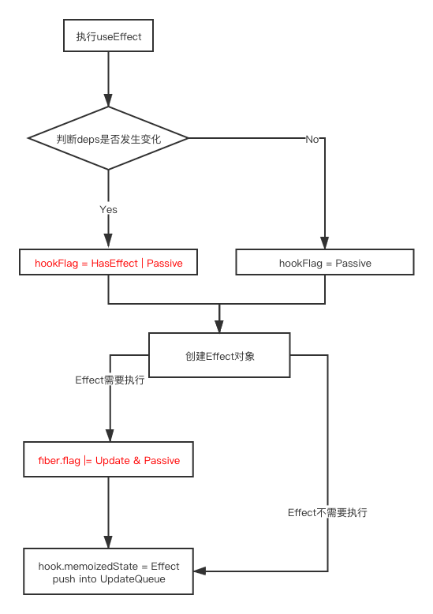

# Effects的数据结构和调用流程

前面分析了一些和状态有关的Hook，这篇文章中我们来分析一下和**副作用**相关的`Hook`。主要是`useEffect`和`useLayoutEffect`

## 1. Effect的数据结构

`useEffect`和`useLayoutEffect`是特殊的`Hook`，**除了会创建`Hook`对象之外还会创建一个`Effect`对象**。

`Effect`对象用来描述副作用的相关信息

```javascript
export type Effect = {|
  tag: HookFlags,
  create: () => (() => void) | void,
  destroy: (() => void) | void,
  deps: Array<mixed> | null,
  next: Effect,
|};
```

**解释一下各个属性的含义：**

1. tag：**表示当前`Effect`的状态和类型**，有三个值
   
   - HasEffect：表示当前`Effect`在本次更新之后需要执行，处于**激活态**
   - Layout：表示是`useLayoutEffect`产生的`Effect`
   - Passive：表示是`useEffect`产生的`Effect`

2. create：表示`Effect`的创建函数，副作用相关逻辑在这个函数中

3. destroy：表示`Effect`的销毁函数

4. deps：表示`Effect`的依赖项

5. next：指向下一个`Effect`，**单向环状链表**

下面我们以`useEffect`为例，结合源码来分析一下`Effect`的调用流程。

## 2. Effect的调用流程

### 2.1 mount阶段

对应的方法是`mountEffect`

```javascript
function mountEffect(
  create: () => (() => void) | void,
  deps: Array<mixed> | void | null,
): void {
  return mountEffectImpl(
    UpdateEffect | PassiveEffect, // fiber flags
    HookPassive, // effect tag
    create,
    deps,
  );
}

function mountEffectImpl(fiberFlags, hookFlags, create, deps): void {
  // 创建Hook对象
  const hook = mountWorkInProgressHook();
  const nextDeps = deps === undefined ? null : deps;
  currentlyRenderingFiber.flags |= fiberFlags;
    // 创建Effect
  hook.memoizedState = pushEffect(
    HookHasEffect | hookFlags,
    create,
    undefined,
    nextDeps,
  );
}
```

> 这里的`HookHasEffect`就是上面我们提到的`HasEffect`常量。

可以看到，**`useEffect`对应的`Hook`对象中，`memoizedState`存储的是`Effect`对象**

这里还有一个细节，**在执行`useEffect（useLayoutEffect）`的时候，会给Fiber节点打上对应的`flag`，因为`Effect`是在`commit`阶段才执行**。

#### 2.1.1 创建Effect对象

```javascript
function pushEffect(tag, create, destroy, deps) {
  const effect: Effect = {
    tag,
    create,
    destroy,
    deps,
    next: (null: any),
  };
  let componentUpdateQueue: null | FunctionComponentUpdateQueue = (currentlyRenderingFiber.updateQueue: any);
  if (componentUpdateQueue === null) {
    componentUpdateQueue = createFunctionComponentUpdateQueue();
    currentlyRenderingFiber.updateQueue = (componentUpdateQueue: any);
    componentUpdateQueue.lastEffect = effect.next = effect;
  } else {
    const lastEffect = componentUpdateQueue.lastEffect;
    if (lastEffect === null) {
      componentUpdateQueue.lastEffect = effect.next = effect;
    } else {
      const firstEffect = lastEffect.next;
      lastEffect.next = effect;
      effect.next = firstEffect;
      componentUpdateQueue.lastEffect = effect;
    }
  }
  return effect;
}
```

上面代码中可以看到，**`FunctionComponent`类型的`Fiber`节点中，`updateQueue`存放的是对应的`Effect`，而且是一个单向环状链表。**

`updateQueue`的数据结构：

```javascript
function createFunctionComponentUpdateQueue(): FunctionComponentUpdateQueue {
  return {
    lastEffect: null,
  };
}
```

### 2.2 update阶段

更新阶段对应的方法是`updateEffect`

```javascript
function updateEffect(
  create: () => (() => void) | void,
  deps: Array<mixed> | void | null,
): void {
  return updateEffectImpl(
    UpdateEffect | PassiveEffect,
    HookPassive, // 这里没有直接加上HookHasEffect，表示update节点effect不一定会触发
    create,
    deps,
  );
}

function updateEffectImpl(fiberFlags, hookFlags, create, deps): void {
  const hook = updateWorkInProgressHook();
  const nextDeps = deps === undefined ? null : deps;
  let destroy = undefined;

    // rerender阶段 currentHook有可能不存在
    // mount阶段的时候就进入rerender
  if (currentHook !== null) {
    // 考虑到rerender阶段的情况，所以需要从currentHook中获取
    const prevEffect = currentHook.memoizedState;
    destroy = prevEffect.destroy; // 销毁函数保存在currentFiber中
    if (nextDeps !== null) {
      const prevDeps = prevEffect.deps;
      // 对比依赖项
      if (areHookInputsEqual(nextDeps, prevDeps)) {
        // 非激活状态Effect
        // effect的create方法每次用的都是最新的,create方法没有闭包陷阱
        pushEffect(hookFlags, create, destroy, nextDeps);

        // 应该要改成下面，需要effect在Hook和updateQueue中状态保持一致
        // hook.memoizedState = pushEffect(hookFlags, create, destroy, nextDeps);

        return;
      }
    }
  }

  currentlyRenderingFiber.flags |= fiberFlags;
    // 激活态Effect
  hook.memoizedState = pushEffect(
    HookHasEffect | hookFlags, // 需要执行的Effect的tag
    create,
    destroy,
    nextDeps,
  );
}
```

代码中有两个细节需要注意一下：

1. 对于`rerender`阶段的兼容处理
2. 对于`Effect`状态的处理

#### 2.2.1 rerender阶段的兼容处理（*）

在`rerender`阶段中执行`useEffect`的时候，调用的方法也是`updateEffect`。**在`rerender`阶段中，由于`useEffect`之前执行过一次，`workInProgress Fiber`中对应的`Effect`很可能已经发生改变，尤其是`deps`。所以再次执行的时候需要使用`currentHook`中保存的`Effect`来对比。**

上面代码中有注释出来关键的代码。

举个例子：

```react
function App() {
  const [count, setCount] = useState(0);

  useEffect(() => {
    console.log("effect");
  }, [count]);

  if (count > 0) {
    setCount(0);
  }

  const handleClick = () => {
    setCount(2);
  };

  return (
    <div>
      <button onClick={handleClick}>button</button>
    </div>
  );
}
```

点击按钮`button`时，`useEffect`中的`create`函数不会执行。

但是第二次点击`button`时，`create`函数会执行。

预期应该是都不会执行。

**这里感觉是React代码中出现了一个`bug`**

产生的原因是：**当`deps`没有发生修改的时候，`React`只将新的`Effect`对象更新到了`updateQueue`，并没有更新到对应`Hook`中的`memoizedState`，会导致两边状态不对应。正常情况下并没有问题，因为两边的`deps`至少是相同的，但是`rerender`阶段的介入，可能会导致两边的`deps`不对应，从而出现例子中的异常**。

> （?）这里的逻辑应该不是故意为之吧，打算去提一个`issue`看看
> 
> 已经提了一个[issue](https://github.com/facebook/react/issues/20675)，官方也接收了这个bug
> 
> 官方的修复代码：
> 
> ```
> hook.memoizedState = pushEffect(hookFlags, create, destroy, nextDeps);
> ```

这里还有一个细节要提一下：**`updateQueue`中保存的`Effect`和对应组件中调用的`useEffect和useLayoutEffect`是一一对应的关系，个数和顺序都是相同的，副作用是否激活通过effect.tag来判断**。

所以在每次执行`render函数`的之前，需要清空`updateQueue`

> 对应的代码在`renderWithHooks`中

```javascript
export function renderWithHooks<Props, SecondArg>(
  current: Fiber | null,
  workInProgress: Fiber,
  Component: (p: Props, arg: SecondArg) => any,
  props: Props,
  secondArg: SecondArg,
  nextRenderLanes: Lanes,
): any {
  renderLanes = nextRenderLanes;
  currentlyRenderingFiber = workInProgress;

  // 清空状态
  workInProgress.memoizedState = null;
  workInProgress.updateQueue = null;
  workInProgress.lanes = NoLanes;

  // ...省略

  let children = Component(props, secondArg);

  if (didScheduleRenderPhaseUpdateDuringThisPass) {
    let numberOfReRenders: number = 0;
    do {
      didScheduleRenderPhaseUpdateDuringThisPass = false;
      numberOfReRenders += 1;

      // 清空状态
      currentHook = null;
      workInProgressHook = null;
      workInProgress.updateQueue = null; // 清空 rerender阶段从头开始重新生成

      // 切换处理器
      ReactCurrentDispatcher.current = __DEV__
        ? HooksDispatcherOnRerenderInDEV
        : HooksDispatcherOnRerender;

      children = Component(props, secondArg);
    } while (didScheduleRenderPhaseUpdateDuringThisPass);
  }

  // ...省略
  return children;
}
```

#### 2.2.2 更新Effect的状态

前面分析`Effect`数据结构的时候提到过，**`tag`属性既可以表示`Effect`的类型又可以表示`Effect`的状态**

`updateEffectImpl`方法中代码可以看出

1. 对于需要执行的`Effect`，`tag值`中**包含**`HookHasEffect`
2. 对于不需要执行的`Effect`，tag值中**不包含**`HookHasEffect`

在`commit`阶段执行`Effect`的时候，会将包含`HookHasEffect`的`Effect`挑选出来执行。

> 对应的代码在[`schedulePassiveEffects`](https://github.com/careyke/react/blob/765e89b908206fe62feb10240604db224f38de7d/packages/react-reconciler/src/ReactFiberCommitWork.new.js#L403)方法中

```javascript
function schedulePassiveEffects(finishedWork: Fiber) {
  const updateQueue: FunctionComponentUpdateQueue | null = (finishedWork.updateQueue: any);
  const lastEffect = updateQueue !== null ? updateQueue.lastEffect : null;
  if (lastEffect !== null) {
    const firstEffect = lastEffect.next;
    let effect = firstEffect;
    do {
      const {next, tag} = effect;
      if (
        (tag & HookPassive) !== NoHookEffect &&
        (tag & HookHasEffect) !== NoHookEffect // HookHasEffect这个flag用判断本次update是否需要执行该副作用
      ) {
        // 收集激活的Effect
        enqueuePendingPassiveHookEffectUnmount(finishedWork, effect);
        enqueuePendingPassiveHookEffectMount(finishedWork, effect);
      }
      effect = next;
    } while (effect !== firstEffect);
  }
}
```

#### 2.2.3 Effect更新流程图



### 2.3 执行Effect（useEffect）

**在执行`useEffect`的时候，如果当前`Effect`是激活态，会在对应的Fiber节点中打上`UpdateEffect | PassiveEffect`的`flag`。**

> 对应的代码都在上面

其中`PassiveEffect flag`是`useEffect`**独有的**，`useLayoutEffect`执行的时候只会打上`UpdateEffect flag`（后面会详细讲`useLayoutEffect`）

消费`PassiveEffect`的地方在`commitBeforeMutationEffects`方法中

```javascript
function commitBeforeMutationEffects() {
  while (nextEffect !== null) {
    const current = nextEffect.alternate;

    if ((flags & Passive) !== NoFlags) {
         // 尝试注册一个异步任务来执行useEffect对应的Effect
      if (!rootDoesHavePassiveEffects) {
        rootDoesHavePassiveEffects = true;
        scheduleCallback(NormalSchedulerPriority, () => {
          flushPassiveEffects();
          return null;
        });
      }
    }
    nextEffect = nextEffect.nextEffect;
  }
}
```

以上代码**表明`useEffect`对应的`Effect`是异步执行的**。

## 2.4 updateQueue总结

到目前为止我们已经介绍完了三种常用updateQueue的结构。下面来总结一下

| Fiber类型           | updateQueue结构                     |
| ----------------- | --------------------------------- |
| HostComponent     | Array。偶数索引表示更新属性的key，奇数索引表示更新属性的值 |
| ClassComponent    | Object。用来存储对应组件产生的`Update`        |
| FunctionComponent | Linked List。用来保存对应组件产生的`Effect`   |
