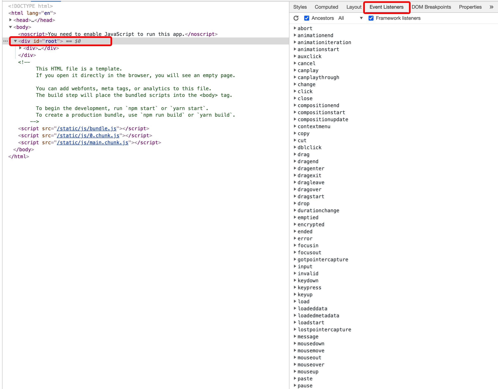
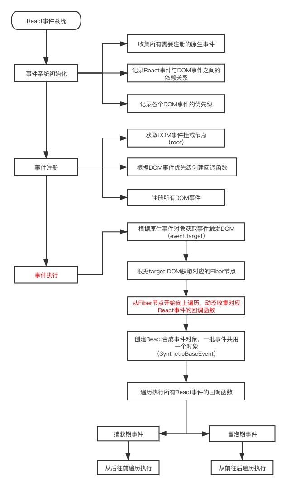

# 结合源码分析React事件系统

使用过的`React`的同学应该都或多或少听说过`React`内部在原生事件的基础上实现了一套自己的事件机制，这里我们称为**React事件系统**

## 1. 为什么要自己实现一套事件系统（*）

在分析React事件系统的实现原理之前，我们首先要知道`React`为什么要自己来实现一套事件系统。

1. 为了抹平各个浏览器之间事件系统的差异
2. 为了抹平各个平台之间事件系统的差异
3. 优化React应用的性能，减少内存消耗
4. React需要干预事件的分发，不同的事件优先级不一样
5. 自定义**高级事件**，降低使用的成本

`React`为了实现上面这些目标做出了以下**处理**：

1. 定义了统一的**合成事件对象**（`SyntheticEvent`），用来解决不同平台和浏览器之间的差异
2. 利用**事件委托**的机制来减少事件的绑定，减少内存消耗
3. 根据人机交互的研究结果，给不同的事件设定不同的**更新响应优先级**
4. 提供了插件机制，用来定义**React高级事件**。比如onChange事件

具体的实现会在后面代码分析中来详细讲解

### 1.1 事件委托

在以前开发原生`JS`应用的时候，对于列表来说我们通常是使用**事件委托**的方案将列表项的事件绑定在父级DOM节点上，然后利用**事件冒泡**的机制来响应每个列表项的事件。

事件委托有两个很明显的**优点**：

1. 减少事件的绑定数量，可以降低内存消耗
2. 动态增加的子节点，不需要重新绑定事件

React事件系统的实现就是使用了事件委托的方案，**将React应用中所有节点的事件都委托在`root`节点上（也就是应用挂载节点）。在`17.0.0`版本之前是委托在`document`节点上。**

> React为了兼容挂载在shadow DOM的情况，将事件挂载的节点由document修改成了root

因为React应用是一个多层级的应用，如果想要**像原生事件一样来使用`React`事件**，不另外增加学习成本，就需要实现自己的**事件捕获**和**事件冒泡**等一系列原生事件中常用的特性。这些特点的实现也会在后面代码分析中来详细分析。

## 2. React事件系统的实现

React事件系统的实现主要分成以下三个阶段：

1. 事件系统初始化

2. 事件注册

3. 事件执行

> 整个源码分析的过程中，笔者会以`click`事件为例来分析

### 2.1 事件系统初始化

**事件初始化阶段主要做了两个事情**：

1. 收集所有`React`事件对应的原生事件
2. 根据人机交互的研究成果给事件划分优先级

初始化阶段的入口文件是`DOMPluginEventSystem.js`

```javascript
SimpleEventPlugin.registerEvents(); // 普通事件插件

// 高级事件插件
EnterLeaveEventPlugin.registerEvents(); 
ChangeEventPlugin.registerEvents();
SelectEventPlugin.registerEvents();
BeforeInputEventPlugin.registerEvents();
```

在React事件系统中，内部实现了4个高级事件，**高级事件也是以原生事件为基础来实现的**。（具体的实现后面详细分析）

这里我们主要来看一下`SimpleEventPlugin`的`registerEvents`方法

> 对应的源代码可以看[这里](https://github.com/careyke/react/blob/765e89b908206fe62feb10240604db224f38de7d/packages/react-dom/src/events/DOMEventProperties.js#L216)

```javascript
export function registerSimpleEvents() {
  registerSimplePluginEventsAndSetTheirPriorities(
    discreteEventPairsForSimpleEventPlugin, // 常量
    DiscreteEvent,
  );
  registerSimplePluginEventsAndSetTheirPriorities(
    userBlockingPairsForSimpleEventPlugin, // 常量
    UserBlockingEvent,
  );
  registerSimplePluginEventsAndSetTheirPriorities(
    continuousPairsForSimpleEventPlugin, // 常量
    ContinuousEvent,
  );
  setEventPriorities(otherDiscreteEvents, DiscreteEvent);
}


function registerSimplePluginEventsAndSetTheirPriorities(
  eventTypes: Array<DOMEventName | string>,
  priority: EventPriority,
): void {
  for (let i = 0; i < eventTypes.length; i += 2) {
    const topEvent = ((eventTypes[i]: any): DOMEventName); // 原生事件名
    const event = ((eventTypes[i + 1]: any): string); // 驼峰的形式
    const capitalizedEvent = event[0].toUpperCase() + event.slice(1);
    const reactName = 'on' + capitalizedEvent; // React事件名
    // 记录原生事件对应的优先级
    eventPriorities.set(topEvent, priority);
    topLevelEventsToReactNames.set(topEvent, reactName);
    // 收集所有需要注册的原生事件
    registerTwoPhaseEvent(reactName, [topEvent]);
  }
}
```

上面代码可以看出：

React事件系统中，将事件按照优先级分成三类：

1. DiscreteEvent：离散事件，比如`click`
2. UserBlockingEvent：用户阻塞事件，比如`scroll`
3. ContinuousEvent：连续事件，无法被打断，比如`load`

> **事件对应的优先级存储在`eventPriorities`这个`Map`中。**

看一下`registerTwoPhaseEvent`方法

> 对应的代码可以看[这里](https://github.com/careyke/react/blob/765e89b908206fe62feb10240604db224f38de7d/packages/react-dom/src/events/EventRegistry.js#L35)

```javascript
export function registerTwoPhaseEvent(
  registrationName: string,
  dependencies: Array<DOMEventName>,
): void {
  registerDirectEvent(registrationName, dependencies);
  registerDirectEvent(registrationName + 'Capture', dependencies);
}

export function registerDirectEvent(
  registrationName: string,
  dependencies: Array<DOMEventName>,
) {
  registrationNameDependencies[registrationName] = dependencies;

  for (let i = 0; i < dependencies.length; i++) {
    allNativeEvents.add(dependencies[i]);
  }
}
```

上面代码中有两个重要的变量：

1. registrationNameDependencies：用来保存**React事件和依赖的原生事件之间的映射关系**
2. allNativeEvents：用来保存**所有需要注册的原生事件**，`Set`结构

### 2.2 事件注册

事件注册阶段主要做两个事情：

1. 选取事件绑定的元素
2. 根据事件的优先级注册不同的回调函数

#### 2.2.1 选取事件绑定的元素

在初始化阶段收集好所有依赖的原生事件之后，大部分的事件都会绑定在`root`节点上。

事件注册的入口方法是`listenToAllSupportedEvents`

> 这个方法会在React应用初始化的时候调用，可以看[createRootImpl](https://github.com/careyke/react/blob/765e89b908206fe62feb10240604db224f38de7d/packages/react-dom/src/client/ReactDOMRoot.js#L117)方法

```javascript
export function listenToAllSupportedEvents(rootContainerElement: EventTarget) {
  if (!(rootContainerElement: any)[listeningMarker]) {
    (rootContainerElement: any)[listeningMarker] = true;
    allNativeEvents.forEach(domEventName => {
      if (domEventName !== 'selectionchange') {
        if (!nonDelegatedEvents.has(domEventName)) {
          // 冒泡期事件 
          // nonDelegatedEvents中的事件不能绑定在冒泡期
          listenToNativeEvent(domEventName, false, rootContainerElement);
        }
        // 捕获期事件
        listenToNativeEvent(domEventName, true, rootContainerElement);
      }
    });
    const ownerDocument =
      (rootContainerElement: any).nodeType === DOCUMENT_NODE
        ? rootContainerElement
        : (rootContainerElement: any).ownerDocument;
    if (ownerDocument !== null) {
      if (!(ownerDocument: any)[listeningMarker]) {
        (ownerDocument: any)[listeningMarker] = true;
        // selectionchange事件需要绑定在document节点上
        listenToNativeEvent('selectionchange', false, ownerDocument);
      }
    }
  }
}

export function listenToNativeEvent(
  domEventName: DOMEventName,
  isCapturePhaseListener: boolean,
  target: EventTarget,
): void {
  let eventSystemFlags = 0;
  if (isCapturePhaseListener) {
    eventSystemFlags |= IS_CAPTURE_PHASE;
  }
  addTrappedEventListener(
    target,
    domEventName,
    eventSystemFlags,
    isCapturePhaseListener,
  );
}
```

这里有一个特例，**`selectionchange`事件需要绑定在`document`元素上。**

#### 2.2.2 根据优先级注册不同的回调函数

看一下`addTrappedEventListener`方法

```javascript
function addTrappedEventListener(
  targetContainer: EventTarget,
  domEventName: DOMEventName,
  eventSystemFlags: EventSystemFlags,
  isCapturePhaseListener: boolean,
  isDeferredListenerForLegacyFBSupport?: boolean,
) {
  // 根据优先级创建回调函数
  let listener = createEventListenerWrapperWithPriority(
    targetContainer,
    domEventName,
    eventSystemFlags,
  );
  let isPassiveListener = undefined;
  // 处理passive option
  if (passiveBrowserEventsSupported) {
    if (
      domEventName === 'touchstart' ||
      domEventName === 'touchmove' ||
      domEventName === 'wheel'
    ) {
      isPassiveListener = true;
    }
  }

  targetContainer =
    enableLegacyFBSupport && isDeferredListenerForLegacyFBSupport
      ? (targetContainer: any).ownerDocument
      : targetContainer;

  let unsubscribeListener;
  // 绑定事件
  if (isCapturePhaseListener) {
    if (isPassiveListener !== undefined) {
      unsubscribeListener = addEventCaptureListenerWithPassiveFlag(
        targetContainer,
        domEventName,
        listener,
        isPassiveListener,
      );
    } else {
      unsubscribeListener = addEventCaptureListener(
        targetContainer,
        domEventName,
        listener,
      );
    }
  } else {
    if (isPassiveListener !== undefined) {
      unsubscribeListener = addEventBubbleListenerWithPassiveFlag(
        targetContainer,
        domEventName,
        listener,
        isPassiveListener,
      );
    } else {
      unsubscribeListener = addEventBubbleListener(
        targetContainer,
        domEventName,
        listener,
      );
    }
  }
}
```

这个方法中主要做两个事情：

1. 根据优先级创建回调函数——`createEventListenerWrapperWithPriority`
2. 调用`DOM API`来绑定事件

##### 2.2.2.1 createEventListenerWrapperWithPriority

这个方法是整个注册阶段最重要的一个方法

> 对应的源代码可以看[这里](https://github.com/careyke/react/blob/765e89b908206fe62feb10240604db224f38de7d/packages/react-dom/src/events/ReactDOMEventListener.js#L93)

```javascript
export function createEventListenerWrapperWithPriority(
  targetContainer: EventTarget,
  domEventName: DOMEventName,
  eventSystemFlags: EventSystemFlags,
): Function {
  // 事件系统初始化的时候，有给每个事件分配优先级
  const eventPriority = getEventPriorityForPluginSystem(domEventName);
  let listenerWrapper;
  switch (eventPriority) {
    case DiscreteEvent:
      listenerWrapper = dispatchDiscreteEvent;
      break;
    case UserBlockingEvent:
      listenerWrapper = dispatchUserBlockingUpdate;
      break;
    case ContinuousEvent:
    default:
      listenerWrapper = dispatchEvent;
      break;
  }
  return listenerWrapper.bind(
    null,
    domEventName,
    eventSystemFlags,
    targetContainer,
  );
}
```

这个方法中根据每个事件的优先级创建了不同的回调函数。

> **补充**
> 
> **回调函数的优先级决定了在内部触发更新时，对应的`Update`的优先级**，不同类型的事件触发的更新优先级不一样

`dispatchDiscreteEvent`和`dispatchUserBlockingUpdate`函数中最终调用的都是`dispatchEvent`方法。`dispatchDiscreteEvent`和`dispatchUserBlockingUpdate`中设置了Scheduler中的优先级上下文。

```javascript
runWithPriority(
    UserBlockingPriority,
    dispatchEvent.bind(
        null,
        domEventName,
        eventSystemFlags,
        container,
        nativeEvent,
    ),
);
```

`dispatchDiscreteEvent`和`dispatchUserBlockingUpdate`这两个方法设置的**优先级上下文**都是一样的，其中不同的地方在与React内部对于离散事件增加了很多额外的处理。

> 感觉没有必要展开来说
> 
> 1. 增加了对于是否处于事件内部的处理
> 2. 在React执行上下文中增加了离散事件对应的上下文的值

#### 2.2.3 总结

在事件注册的过程中，**会预先在root节点中绑定几乎所有的原生事件**



### 2.3 事件执行

当所有类型的原生事件都注册完成之后，**React利用事件委托的机制在原生事件的回调函数中来处理React应用中每个节点的点击事件**。

这里涉及到两个**关键点**：

1. React应用中的节点都是动态生成的，无法事先判断每个节点中事件的处理逻辑。所以需要**在某些节点中绑定React事件和其对应的处理逻辑。委托事件触发的时候动态收集对应的React事件和处理逻辑**。

2. **React事件系统需要和原生的事件系统保持一致**，所以需要实现自己的事件捕获和事件冒泡。

事件执行的入口函数是`dispatchEvent`

> 对应的源代码可以看[这里](https://github.com/careyke/react/blob/765e89b908206fe62feb10240604db224f38de7d/packages/react-dom/src/events/ReactDOMEventListener.js#L181)

事件执行的过程主要分成以下几个阶段：

1. **获取触发React事件元素对应的Fiber节点**
2. **收集捕获或者冒泡事件队列**
3. **创建合成事件对象**
4. **依次触发队列中的回调函数**

#### 2.3.1 获取触发React事件元素对应的Fiber节点

这个过程发生在`attemptToDispatchEvent`方法中

```javascript
export function attemptToDispatchEvent(
  domEventName: DOMEventName,
  eventSystemFlags: EventSystemFlags,
  targetContainer: EventTarget,
  nativeEvent: AnyNativeEvent,
): null | Container | SuspenseInstance {
  const nativeEventTarget = getEventTarget(nativeEvent);
  // 获取点击的DOM节点对应的最近的类型为HostComponnet或者HostRoot的fiber节点
  let targetInst = getClosestInstanceFromNode(nativeEventTarget);

  if (targetInst !== null) {
    const nearestMounted = getNearestMountedFiber(targetInst);
    if (nearestMounted === null) {
      targetInst = null;
    } else {
      const tag = nearestMounted.tag;
      if (tag === SuspenseComponent) {
        const instance = getSuspenseInstanceFromFiber(nearestMounted);
        if (instance !== null) {
          return instance;
        }
        targetInst = null;
      } else if (tag === HostRoot) {
        const root: FiberRoot = nearestMounted.stateNode;
        if (root.hydrate) {
          return getContainerFromFiber(nearestMounted);
        }
        targetInst = null;
      } else if (nearestMounted !== targetInst) {
        targetInst = null;
      }
    }
  }
  dispatchEventForPluginEventSystem(
    domEventName,
    eventSystemFlags,
    nativeEvent,
    targetInst,
    targetContainer,
  );
  return null;
}
```

获取Fiber节点的方式主要是**根据原生事件对象中的`target`属性获取触发节点的DOM对象，然后根据DOM对象来获取对应的`Fiber`节点。**

根据`DOM`对象来获取`Fiber`对象发生在`getClosestInstanceFromNode`方法中

```javascript
export function getClosestInstanceFromNode(targetNode: Node): null | Fiber {
  let targetInst = (targetNode: any)[internalInstanceKey];
  if (targetInst) {
    return targetInst;
  }
  // ...省略 一些其他的特殊情况处理
}
```

可以看到，在**创建真实DOM节点的时候会在每个DOM对象中引用对应的Fiber节点**

#### 2.3.2 收集执行事件队列

收集和执行事件队列的入口函数是`dispatchEventsForPlugins`

> 对应的源代码可以看[这里](https://github.com/careyke/react/blob/765e89b908206fe62feb10240604db224f38de7d/packages/react-dom/src/events/DOMPluginEventSystem.js#L273)

```javascript
function dispatchEventsForPlugins(
  domEventName: DOMEventName,
  eventSystemFlags: EventSystemFlags,
  nativeEvent: AnyNativeEvent,
  targetInst: null | Fiber,
  targetContainer: EventTarget,
): void {
  const nativeEventTarget = getEventTarget(nativeEvent);
  const dispatchQueue: DispatchQueue = []; // 执行队列
  // 提取符合条件的回调函数
  extractEvents(
    dispatchQueue,
    domEventName,
    targetInst,
    nativeEvent,
    nativeEventTarget,
    eventSystemFlags,
    targetContainer,
  );
  // 依次执行回调函数
  processDispatchQueue(dispatchQueue, eventSystemFlags);
}
```

其中收集执行事件队列的入口函数是`extractEvents`

```javascript
function extractEvents(
  dispatchQueue: DispatchQueue,
  domEventName: DOMEventName,
  targetInst: null | Fiber,
  nativeEvent: AnyNativeEvent,
  nativeEventTarget: null | EventTarget,
  eventSystemFlags: EventSystemFlags,
  targetContainer: EventTarget,
) {
  SimpleEventPlugin.extractEvents(
    dispatchQueue,
    domEventName,
    targetInst,
    nativeEvent,
    nativeEventTarget,
    eventSystemFlags,
    targetContainer,
  );
  const shouldProcessPolyfillPlugins =
    (eventSystemFlags & SHOULD_NOT_PROCESS_POLYFILL_EVENT_PLUGINS) === 0;
  if (shouldProcessPolyfillPlugins) {
    EnterLeaveEventPlugin.extractEvents(
      dispatchQueue,
      domEventName,
      targetInst,
      nativeEvent,
      nativeEventTarget,
      eventSystemFlags,
      targetContainer,
    );
    ChangeEventPlugin.extractEvents(
      dispatchQueue,
      domEventName,
      targetInst,
      nativeEvent,
      nativeEventTarget,
      eventSystemFlags,
      targetContainer,
    );
    SelectEventPlugin.extractEvents(
      dispatchQueue,
      domEventName,
      targetInst,
      nativeEvent,
      nativeEventTarget,
      eventSystemFlags,
      targetContainer,
    );
    BeforeInputEventPlugin.extractEvents(
      dispatchQueue,
      domEventName,
      targetInst,
      nativeEvent,
      nativeEventTarget,
      eventSystemFlags,
      targetContainer,
    );
  }
}
```

从上面这个函数可以看出，**每个插件都会暴露出两个方法**：

1. extractEvents：添加符合条件的回调函数到执行队列中
2. registerEvents：添加插件依赖的原生事件

这里我们主要看一下`SimpleEventPlugin.extractEvents`

```javascript
function extractEvents(
  dispatchQueue: DispatchQueue,
  domEventName: DOMEventName,
  targetInst: null | Fiber,
  nativeEvent: AnyNativeEvent,
  nativeEventTarget: null | EventTarget,
  eventSystemFlags: EventSystemFlags,
  targetContainer: EventTarget,
): void {
  const reactName = topLevelEventsToReactNames.get(domEventName);
  if (reactName === undefined) {
    return;
  }
  let SyntheticEventCtor = SyntheticEvent;
  let reactEventType: string = domEventName;

    // ... 省略

  const inCapturePhase = (eventSystemFlags & IS_CAPTURE_PHASE) !== 0;
  if (
    enableCreateEventHandleAPI &&
    eventSystemFlags & IS_EVENT_HANDLE_NON_MANAGED_NODE
  ) {
    // ... 省略
  } else {
    // 处理无法冒泡的事件
    const accumulateTargetOnly =
      !inCapturePhase &&
      domEventName === 'scroll';

    // 向上遍历收集React事件回调函数
    const listeners = accumulateSinglePhaseListeners(
      targetInst,
      reactName,
      nativeEvent.type,
      inCapturePhase,
      accumulateTargetOnly,
      nativeEvent,
    );
    if (listeners.length > 0) {
      // 一批事件共用一个React事件对象
      const event = new SyntheticEventCtor(
        reactName,
        reactEventType,
        null,
        nativeEvent,
        nativeEventTarget,
      );
      dispatchQueue.push({event, listeners});
    }
  }
}
```

这里有一个细节需要注意一下：**事件触发的时候，由于事件捕获或者冒泡而一起触发的事件称为同一批事件（类型相同)，会共用同一个合成事件对象**。捕获期和冒泡期是分开的，因为原生是两个事件

> **这里之所以能够共用同一个合成事件对象，是因为每个回调函数的事件对象基本都是一样的，除了`currentTarget`属性不同，共用同一个对象可以节省重复创建的成本**

**向上遍历**收集事件的方法是`accumulateSinglePhaseListeners`

```javascript
export function accumulateSinglePhaseListeners(
  targetFiber: Fiber | null,
  reactName: string | null,
  nativeEventType: string,
  inCapturePhase: boolean,
  accumulateTargetOnly: boolean,
  nativeEvent: AnyNativeEvent,
): Array<DispatchListener> {
  const captureName = reactName !== null ? reactName + 'Capture' : null;
  const reactEventName = inCapturePhase ? captureName : reactName;
  let listeners: Array<DispatchListener> = [];

  let instance = targetFiber;
  let lastHostComponent = null;

  while (instance !== null) {
    const {stateNode, tag} = instance;
    if (tag === HostComponent && stateNode !== null) {
      lastHostComponent = stateNode;

      // ...省略

      if (reactEventName !== null) {
        // 从Props中获取React事件的回调函数
        const listener = getListener(instance, reactEventName);
        if (listener != null) {
          listeners.push(
            createDispatchListener(instance, listener, lastHostComponent),
          );
        }
      }
    }
    // ...省略
    if (accumulateTargetOnly) {
      break;
    }
    instance = instance.return;
  }
  return listeners;
}
```

这里需要注意一下`listeners`保存的数据结构，后续执行的时候需要用到：

```javascript
{
  instance: // 当前回调函数对应的Fiber节点
  listener： // React事件回调函数
  currentTarget： // 当前回调函数中事件对象中的currentTarget属性，添加事件监听的DOM
}
```

#### 2.3.3 创建合成事件对象

创建`React`合成事件对象的方法是`createSyntheticEvent`

```javascript
function createSyntheticEvent(Interface: EventInterfaceType) {
  function SyntheticBaseEvent(
    reactName: string | null,
    reactEventType: string,
    targetInst: Fiber,
    nativeEvent: {[propName: string]: mixed},
    nativeEventTarget: null | EventTarget,
  ) {
    this._reactName = reactName;
    this._targetInst = targetInst;
    this.type = reactEventType;
    this.nativeEvent = nativeEvent;
    this.target = nativeEventTarget;
    this.currentTarget = null;

    for (const propName in Interface) {
      if (!Interface.hasOwnProperty(propName)) {
        continue;
      }
      const normalize = Interface[propName];
      if (normalize) {
        this[propName] = normalize(nativeEvent);
      } else {
        this[propName] = nativeEvent[propName];
      }
    }

    const defaultPrevented =
      nativeEvent.defaultPrevented != null
        ? nativeEvent.defaultPrevented
        : nativeEvent.returnValue === false;
    if (defaultPrevented) {
      this.isDefaultPrevented = functionThatReturnsTrue;
    } else {
      this.isDefaultPrevented = functionThatReturnsFalse;
    }
    this.isPropagationStopped = functionThatReturnsFalse;
    return this;
  }

  Object.assign(SyntheticBaseEvent.prototype, {
    preventDefault: function() { 
      this.defaultPrevented = true;
      const event = this.nativeEvent;
      if (!event) {
        return;
      }

      if (event.preventDefault) {
        event.preventDefault();
      } else if (typeof event.returnValue !== 'unknown') {
        event.returnValue = false;
      }
      this.isDefaultPrevented = functionThatReturnsTrue;
    },

    stopPropagation: function() {
      const event = this.nativeEvent;
      if (!event) {
        return;
      }

      if (event.stopPropagation) {
        event.stopPropagation();
      } else if (typeof event.cancelBubble !== 'unknown') {
        event.cancelBubble = true;
      }
            // 判断当前执行队列是否有回调函数中执行了stopPropagation方法
      this.isPropagationStopped = functionThatReturnsTrue;
    },
    persist: function() {
    },
    isPersistent: functionThatReturnsTrue,
  });
  return SyntheticBaseEvent;
}
```

上面方法主要是**根据不同的事件类型构造不同的合成事件对象构造函数**。这里主要分析的是React事件系统中对于**阻止事件冒泡和事件默认行为**的实现。

两者实现的思路基本是一致的，这里我们以阻止事件冒泡的实现来分析一下。

**阻止事件冒泡的实现分成两个部分**：

1. 阻止原生事件冒泡：直接使用原生事件对象的`stopPropagation`方法即可。

2. 阻止`React`事件冒泡：需要在合成事件对象中实现一个`stopPropagation`方法，当该方法被调用的时候，会在`SyntheticEvent`中记录一个状态判断是否需要阻止后面的回调函数执行。

> **这里是同一批方法共用一个合成事件对象的另一个原因，方便判断**

#### 2.3.4 执行队列中的回调函数

执行队列中回调函数的入口方法是`processDispatchQueue`

> 对应的源代码可以看[这里](https://github.com/careyke/react/blob/765e89b908206fe62feb10240604db224f38de7d/packages/react-dom/src/events/DOMPluginEventSystem.js#L259)

```javascript
export function processDispatchQueue(
  dispatchQueue: DispatchQueue,
  eventSystemFlags: EventSystemFlags,
): void {
  const inCapturePhase = (eventSystemFlags & IS_CAPTURE_PHASE) !== 0;
  for (let i = 0; i < dispatchQueue.length; i++) {
    const {event, listeners} = dispatchQueue[i];
    processDispatchQueueItemsInOrder(event, listeners, inCapturePhase);
  }
  rethrowCaughtError();
}

function processDispatchQueueItemsInOrder(
  event: ReactSyntheticEvent,
  dispatchListeners: Array<DispatchListener>,
  inCapturePhase: boolean,
): void {
  let previousInstance;
  if (inCapturePhase) {
    // 捕获期事件 从后往前遍历
    for (let i = dispatchListeners.length - 1; i >= 0; i--) {
      const {instance, currentTarget, listener} = dispatchListeners[i];
      // React事件中捕获期事件也可以阻止冒泡 向下阻止
      if (instance !== previousInstance && event.isPropagationStopped()) {
        return;
      }
      // 这里的currentTarget指的是React事件对象中的currentTarget
      executeDispatch(event, listener, currentTarget);
      previousInstance = instance;
    }
  } else {
    // 冒泡期事件 从前往后遍历
    for (let i = 0; i < dispatchListeners.length; i++) {
      const {instance, currentTarget, listener} = dispatchListeners[i];
      if (instance !== previousInstance && event.isPropagationStopped()) {
        return;
      }
      executeDispatch(event, listener, currentTarget);
      previousInstance = instance;
    }
  }
}
```

这里有**两个细节**需要分析一下：

1. 捕获期的`React`事件会在对应的捕获期原生事件触发时才收集，然后执行；冒泡期的也是一样。所以**冒泡和捕获期的React事件回调函数一般不在同一个队列中**。
   
   > 高级事件除外

2. **React事件中，捕获期的事件也是可以阻止冒泡的，阻止向下冒泡。**

执行回调函数的方法是`executeDispatch`

```javascript
function executeDispatch(
  event: ReactSyntheticEvent,
  listener: Function,
  currentTarget: EventTarget,
): void {
  const type = event.type || 'unknown-event';
  event.currentTarget = currentTarget;
  // 内部会执行回调函数
  invokeGuardedCallbackAndCatchFirstError(type, listener, undefined, event);
  event.currentTarget = null; // 执行完成之后需要清空 因为对象共用
}
```

这里需要提一下对于合成事件对象的处理，一个回调函数执行完成之后需要清空`currentTarget`属性

### 2.4 React事件系统执行流程



## 3. 高级事件

（期待）

## 4. 总结

整个React事件系统实现的原理总结为一下几点：

1. 利用**事件委托**机制，将React应用的所有事件交给React事件系统来处理

2. 构建`React`合成事件对象，抹平多平台多浏览器之间的差异，也能较少内存消耗

3. 在原生事件回调函数中**动态向上遍历**获取需要执行的React事件队列，实现自己的事件捕获和冒泡。
