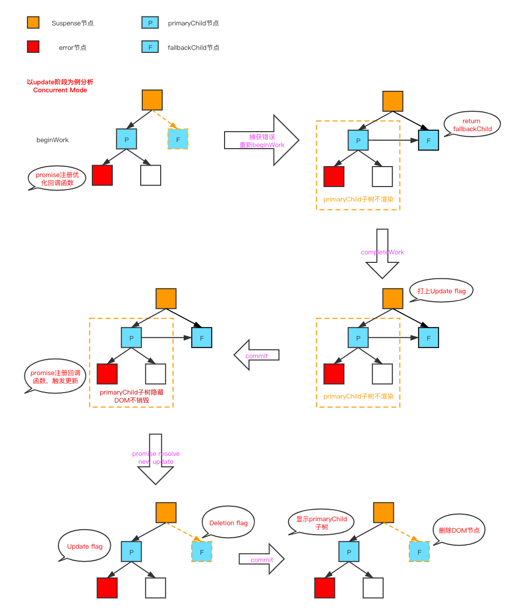

# 结合React源码分析Suspense的实现原理

前面的文章中我们提到过，React为了实现**快速响应**分别在`CPU`和`I/O`两个方面进行了优化。

1. CPU方面 - React提出了Fiber架构，实现了时间切片和优先级调度。具体的实现可以看前面的文章
2. I/O方面 - React实现`Suspense`以及配套的`hooks`，用来解决I/O方面的瓶颈。

这篇文章我们就详细地来介绍一下Suspense的实现原理。


## 1. I/O瓶颈

对于前端来说，I/O的瓶颈主要体现在网络请求的延迟，这个问题前端是没有办法直接来解决的。React团队从另外一个角度来优化这问题，将**人机交互研究的结果整合到真实的UI**中，在网络延迟客观存在的情况下**尽可能的让用户减少对网络延迟的感知**。

`Suspense`组件的实现是React解决I/O瓶颈重要的一步。

熟悉React开发的小伙伴应该都知道，传统的方式在React应用中发起网络请求一般会遇到下面两个问题：

1. **请求“瀑布”（waterfall）**：就是本应该并行发出的请求，由于组件的嵌套关系导致串行发出
2. **请求“竞速”（race condition）**：在某些情况下先发出的请求后响应，会导致页面数据更新出错

这两个问题在传统的方法里面虽然是可以解决的，但是解决起来相对比较麻烦，而且可能会造成其他的问题。

`Suspense`组件就可以完美的解决上面所说的两个问题。`Suspense`是React为了**将I/O请求和视图渲染更好的结合在一起**提出的一种解决方案，并不会导致数据获取和视图渲染之间会耦合在前一起。Suspense详细的定义可以看官方的[文档](https://zh-hans.reactjs.org/docs/concurrent-mode-suspense.html)

下面我们就来解析一下`Suspense`的源码实现以及它如何来解决上面提到的两个问题。


> Suspense除了以上两个优点之外，还可以去除掉传统模式中的React请求导致的大量**样板代码**


## 2. Suspense组件的渲染流程

尝试过使用`Suspense`的小伙伴应该知道，在官方给出的例子中，使用Suspense之前需要修改一下**和发起请求相关**的代码。类似于下面

```js
export const wrapPromise = (promise: Promise<unknown>) => {
  let status = "pending";
  let result: unknown;
  const suspender = promise.then(
    (r) => {
      status = "success";
      result = r;
    },
    (e) => {
      status = "error";
      result = e;
    }
  );
  return {
    read() {
      switch (status) {
        case "pending":
          throw suspender;
        case "success":
          return result;
        case "error":
          throw result;
      }
    },
  };
};
```

我们可以使用`wrapPromise`来包裹发起请求的`promise`，来体验`Suspense`的功能。

> 笔者在分析Suspense相关的源代码时，使用的就是这种方式

从上面代码中可以看出，`wrapPromise`最大的功能就是：**当`promise`处于`pending`状态的时候抛出错误，而且这个错误对象就是`promise`本身**。

也就是说，React内部可以捕获到这个错误，然后来控制对应的`Suspense`组件渲染`primaryChildren`还是`fallbackChildren`。

> 这里我们将Suspense组件的子节点分成两类：
>
> 1. **fallbackChildren** : Suspense组件处于suspended状态时渲染的子节点
> 2. **primaryChildren** : Suspense组件处于unsuspended状态时渲染的子节点


### 2.1 updateSuspenseComponent方法

首先我们来看一下`beginWork`阶段`Suspense Fiber`对应的处理方法`updateSuspenseComponent`

> 对应的源代码可以看[这里](https://github.com/careyke/react/blob/120fc3afe1ff33a10134e175090f4c6240b6cb4b/packages/react-reconciler/src/ReactFiberBeginWork.new.js#L1609)

```js
function updateSuspenseComponent(current, workInProgress, renderLanes) {
  const nextProps = workInProgress.pendingProps;
  let suspenseContext: SuspenseContext = suspenseStackCursor.current;
  let showFallback = false;
  // 判断是否渲染fallbackChildren
  const didSuspend = (workInProgress.flags & DidCapture) !== NoFlags;

  if (
    didSuspend ||
    shouldRemainOnFallback(
      suspenseContext,
      current,
      workInProgress,
      renderLanes,
    )
  ) {
    showFallback = true;
    workInProgress.flags &= ~DidCapture; // DidCapture在这里被消耗掉了
  } else {
    if (
      current === null ||
      (current.memoizedState: null | SuspenseState) !== null
    ) {
      /**
       * 这里表明当前Suspense是mount阶段，
       * 或者当前正处于suspended状态
       */
      if (
        nextProps.fallback !== undefined &&
        nextProps.unstable_avoidThisFallback !== true
      ) {
        suspenseContext = addSubtreeSuspenseContext(
          suspenseContext,
          InvisibleParentSuspenseContext,
        );
      }
    }
  }

  suspenseContext = setDefaultShallowSuspenseContext(suspenseContext);
	// 储存一个suspenseContext，在completeWork节点消费并弹出
  pushSuspenseContext(workInProgress, suspenseContext);

  if (current === null) {
    // mount阶段
    const nextPrimaryChildren = nextProps.children;
    const nextFallbackChildren = nextProps.fallback;
    if (showFallback) {
      const fallbackFragment = mountSuspenseFallbackChildren(
        workInProgress,
        nextPrimaryChildren,
        nextFallbackChildren,
        renderLanes,
      );
      const primaryChildFragment: Fiber = (workInProgress.child: any);
      primaryChildFragment.memoizedState = mountSuspenseOffscreenState(
        renderLanes,
      );
      workInProgress.memoizedState = SUSPENDED_MARKER;
      return fallbackFragment;
    } else if (typeof nextProps.unstable_expectedLoadTime === 'number') {
      // ...省略
    } else {
      return mountSuspensePrimaryChildren(
        workInProgress,
        nextPrimaryChildren,
        renderLanes,
      );
    }
  } else {
    // update阶段
    const prevState: null | SuspenseState = current.memoizedState;
    if (prevState !== null) {
      // 当前的状态是suspended
      if (showFallback) {
        const nextFallbackChildren = nextProps.fallback;
        const nextPrimaryChildren = nextProps.children;
        const fallbackChildFragment = updateSuspenseFallbackChildren(
          current,
          workInProgress,
          nextPrimaryChildren,
          nextFallbackChildren,
          renderLanes,
        );
        const primaryChildFragment: Fiber = (workInProgress.child: any);
        const prevOffscreenState: OffscreenState | null = (current.child: any)
          .memoizedState;
        primaryChildFragment.memoizedState =
          prevOffscreenState === null
            ? mountSuspenseOffscreenState(renderLanes)
            : updateSuspenseOffscreenState(prevOffscreenState, renderLanes);
        primaryChildFragment.childLanes = getRemainingWorkInPrimaryTree(
          current,
          renderLanes,
        );
        /**
         * 表示当前渲染的是fallback节点
         * 打上标记，completeWork中会消费这个数据
        */
        workInProgress.memoizedState = SUSPENDED_MARKER;
        return fallbackChildFragment;
      } else {
        const nextPrimaryChildren = nextProps.children;
        const primaryChildFragment = updateSuspensePrimaryChildren(
          current,
          workInProgress,
          nextPrimaryChildren,
          renderLanes,
        );
        workInProgress.memoizedState = null; 
        return primaryChildFragment;
      }
    } else {
      // 当前的状态是unsuspended
      if (showFallback) {
        // Timed out.
        const nextFallbackChildren = nextProps.fallback;
        const nextPrimaryChildren = nextProps.children;
        const fallbackChildFragment = updateSuspenseFallbackChildren(
          current,
          workInProgress,
          nextPrimaryChildren,
          nextFallbackChildren,
          renderLanes,
        );
        const primaryChildFragment: Fiber = (workInProgress.child: any);
        const prevOffscreenState: OffscreenState | null = (current.child: any)
          .memoizedState;
        primaryChildFragment.memoizedState =
          prevOffscreenState === null
            ? mountSuspenseOffscreenState(renderLanes)
            : updateSuspenseOffscreenState(prevOffscreenState, renderLanes);
        primaryChildFragment.childLanes = getRemainingWorkInPrimaryTree(
          current,
          renderLanes,
        );
        workInProgress.memoizedState = SUSPENDED_MARKER;
        return fallbackChildFragment;
      } else {
        const nextPrimaryChildren = nextProps.children;
        const primaryChildFragment = updateSuspensePrimaryChildren(
          current,
          workInProgress,
          nextPrimaryChildren,
          renderLanes,
        );
        workInProgress.memoizedState = null;
        return primaryChildFragment;
      }
    }
  }
}
```

这个方法乍一看比较复杂，但是可以将它分成几个部分来看：

1. **判断本次渲染是否是suspended状态**，渲染对应的`fallbackChildren`
2. 根据本次渲染中**`Suspense`的渲染阶段和状态**来选择不同的处理逻辑：
   1. mount阶段
   2. update阶段
      - `Suspense`组件当前处于`suspended`状态
      - `Suspense`组件当前处于`unsuspended`状态


对应的，我们可以将Suspense组件的渲染流程分成以下**三个阶段**：

1. mount阶段 : unsuspended -> suspended
2. update阶段 : suspended -> unsuspended
3. update阶段 : unsuspended -> suspended


### 2.2 mount阶段 : unsuspended -> suspended

#### 2.2.1 尝试渲染primaryChildren

第一个执行`updateSuspenseComponent`方法时，`Suspense`默认处于`unsuspended`状态，会渲染`primaryChildren`，执行的方法是`mountSuspensePrimaryChildren`

> 对应的源代码可以看[这里](https://github.com/careyke/react/blob/120fc3afe1ff33a10134e175090f4c6240b6cb4b/packages/react-reconciler/src/ReactFiberBeginWork.new.js#L1920)

```js
function mountSuspensePrimaryChildren(
  workInProgress,
  primaryChildren,
  renderLanes,
) {
  const mode = workInProgress.mode;
  const primaryChildProps: OffscreenProps = {
    mode: 'visible',
    children: primaryChildren,
  };
  // 创建了一个离屏节点Offscreent
  const primaryChildFragment = createFiberFromOffscreen(
    primaryChildProps,
    mode,
    renderLanes,
    null,
  );
  primaryChildFragment.return = workInProgress;
  workInProgress.child = primaryChildFragment;
  return primaryChildFragment;
}
```

可以看到`Suspense`的`primaryChildren`会被一个`Offscreen`节点包裹，来控制节点的显示和隐藏。

我们来看一下`Offscreen Fiber`对应的处理方法`updateOffscreenComponent`

> 对应的源代码可以看[这里](https://github.com/careyke/react/blob/120fc3afe1ff33a10134e175090f4c6240b6cb4b/packages/react-reconciler/src/ReactFiberBeginWork.new.js#L566)

```js
function updateOffscreenComponent(
  current: Fiber | null,
  workInProgress: Fiber,
  renderLanes: Lanes,
) {
  const nextProps: OffscreenProps = workInProgress.pendingProps;
  const nextChildren = nextProps.children;

  const prevState: OffscreenState | null =
    current !== null ? current.memoizedState : null;

  if (
    nextProps.mode === 'hidden' ||
    nextProps.mode === 'unstable-defer-without-hiding'
  ) {
    // ...省略  Suspense运行的过程中并不会走到这个分支，暂时可以不关注
  } else {
    let subtreeRenderLanes;
    if (prevState !== null) {
      // 上一次隐藏没有渲染，对应的lanes没有消费，所以需要和本次更新的lanes合并使用
      subtreeRenderLanes = mergeLanes(prevState.baseLanes, renderLanes);
      // 上一次隐藏，这一次不隐藏 清除判断变量
      workInProgress.memoizedState = null;
    } else {
      // 上一次不隐藏 这一次也不隐藏
      subtreeRenderLanes = renderLanes;
    }
    pushRenderLanes(workInProgress, subtreeRenderLanes);
  }

  reconcileChildren(current, workInProgress, nextChildren, renderLanes);
  return workInProgress.child;
}
```

可以看到，在`updateOffscreenComponent`方法中只是做了一些变量和优先级的处理，然后就会调用`reconcileChildren`继续渲染子节点，也就是我们说的`primaryChildren`。

也就是说**渲染的时候会首先尝试渲染`primaryChildren`，然后在渲染`primaryChildren`的过程中，如果某个节点数据请求没有回来，`promise`处于`pending`状态，则会抛出错误**。

> `Suspense`内部，网络请求不需要在`useEffect`或者`componentDidMount`阶段来发起，渲染阶段就可以发起，提前了网络请求发起的时机。
>
> 可以看看官网的例子


#### 2.2.2 捕获promise错误

在`renderRootConcurrent`和`renderRootSync`方法中都使用了`try...catch`用来捕获`render`阶段发生的异常。

这里以`renderRootConcurrent`为例来解析

```js
do {
    try {
        workLoopConcurrent();
        break;
    } catch (thrownValue) {
        handleError(root, thrownValue);
    }
} while (true);
```

捕获到错误之后会执行`handleError`方法

```js
function handleError(root, thrownValue): void {
  do {
    let erroredWork = workInProgress; // 获取抛出错误的那个workInProgress fiber节点
    try {
      // ...省略
  		
      throwException(
        root,
        erroredWork.return,
        erroredWork,
        thrownValue,
        workInProgressRootRenderLanes,
      );
      completeUnitOfWork(erroredWork);
    } catch (yetAnotherThrownValue) {
      // ...省略
    }
    return;
  } while (true);
}
```

这个方法中主要做了两个操作：

1. 调用`throwException`方法来处理错误
2. **调用`completeUnitOfWork`表示当前节点已经是叶子节点，需要进入`“归”`过程**。因为当前节点对应的组件在执行的时候抛出错误，所以不会产生子节点。


##### 2.2.2.1 throwException-处理错误

> 对应的源代码可以看[这里](https://github.com/careyke/react/blob/2fe415284a961fcb6c1ed0a65b43e55f4aec3f72/packages/react-reconciler/src/ReactFiberThrow.new.js#L186)

```js
function throwException(
  root: FiberRoot,
  returnFiber: Fiber,
  sourceFiber: Fiber,
  value: mixed,
  rootRenderLanes: Lanes,
) {
  sourceFiber.flags |= Incomplete; // 表示当前节点并没有正常完成
  sourceFiber.firstEffect = sourceFiber.lastEffect = null;

  if (
    value !== null &&
    typeof value === 'object' &&
    typeof value.then === 'function'
  ) {
    // 错误对象是一个promise对象
    const wakeable: Wakeable = (value: any);

    if ((sourceFiber.mode & BlockingMode) === NoMode) {
      // legacy模式
      const currentSource = sourceFiber.alternate;
      if (currentSource) {
        sourceFiber.updateQueue = currentSource.updateQueue;
        sourceFiber.memoizedState = currentSource.memoizedState;
        sourceFiber.lanes = currentSource.lanes;
      } else {
        sourceFiber.updateQueue = null;
        sourceFiber.memoizedState = null;
      }
    }

    const hasInvisibleParentBoundary = hasSuspenseContext(
      suspenseStackCursor.current,
      (InvisibleParentSuspenseContext: SuspenseContext),
    );

    let workInProgress = returnFiber;
    // 向上寻找最近的Suspense节点
    do {
      if (
        workInProgress.tag === SuspenseComponent &&
        shouldCaptureSuspense(workInProgress, hasInvisibleParentBoundary)
      ) {
        // suspenseFiber节点的updateQueue用来保存后代节点中抛出的promise error
        const wakeables: Set<Wakeable> = (workInProgress.updateQueue: any);
        if (wakeables === null) {
          const updateQueue = (new Set(): any);
          updateQueue.add(wakeable);
          workInProgress.updateQueue = updateQueue;
        } else {
          wakeables.add(wakeable);
        }

        if ((workInProgress.mode & BlockingMode) === NoMode) {
          /**
           * legacy模式下
           * 直接在这里给Suspense Fiber加上DidCapture flag
           */
          workInProgress.flags |= DidCapture;
          sourceFiber.flags |= ForceUpdateForLegacySuspense;
          /**
           * legacy模式下，sourceFiber去掉Incomplete和生命周期相关的flag 
           * 也就是抛出异常的时候不触发生命周期
           */
          sourceFiber.flags &= ~(LifecycleEffectMask | Incomplete);

          if (sourceFiber.tag === ClassComponent) {
            const currentSourceFiber = sourceFiber.alternate;
            if (currentSourceFiber === null) {
              sourceFiber.tag = IncompleteClassComponent;
            } else {
              const update = createUpdate(NoTimestamp, SyncLane);
              update.tag = ForceUpdate;
              enqueueUpdate(sourceFiber, update);
            }
          }
          sourceFiber.lanes = mergeLanes(sourceFiber.lanes, SyncLane);
          return;
        }
				// 非legacy模式下的处理
       
        // 对promise完成之后触发的更新进行优化处理
        attachPingListener(root, wakeable, rootRenderLanes);

        workInProgress.flags |= ShouldCapture; // 非legacy模式下 增加的是ShouldCapture flag
        workInProgress.lanes = rootRenderLanes;

        return;
      }
      workInProgress = workInProgress.return;
    } while (workInProgress !== null);
  }

  // ...省略 其他类型的error的处理
}
```

这个方法是React用来处理应用内部抛出的错误，包括非`promise`类型的错误。

这里我们主要关注的是对于`promise`类型错误的处理，主要做了以下几个事情：

1. **向上寻找最近的`Suspense Fiber`节点**
2. 将`promise`对象保存在对应的`Suspense Fiber`节点中，保存在`updateQueue`中，这里`updateQueue`是一个**`Set`**数据结构
3. 给`Suspense Fiber`增加`flag`。其中`legacy`模式下增加的是`DidCapture flag`，`非legacy`模式增加的是`ShouldCapture flag`
4. 在`非legacy`模式下，通过`then`方法给当前`promise`增加回调函数，用来**对`promise`完成之后触发的更新进行优化处理**。（后面专门来讲`Suspense`中做的优化）

这里有一个细节需要注意一下，在寻找错误处理边界的时候，除了判断节点的类型之外还执行了`shouldCaptureSuspense`方法

```js
export function shouldCaptureSuspense(
  workInProgress: Fiber,
  hasInvisibleParent: boolean,
): boolean {
  const nextState: SuspenseState | null = workInProgress.memoizedState;
  if (nextState !== null) {
    // ...省略
    return false;
  }
  const props = workInProgress.memoizedProps;
  
  if (props.fallback === undefined) {
    return false;
  }
  // 常规的边界，需要捕获
  if (props.unstable_avoidThisFallback !== true) {
    return true;
  }
  
  if (hasInvisibleParent) {
    return false;
  }
  
  return true;
}
```

这个方法主要是用来**判断当前`Suspense`是否符合捕获当前`promise`的条件**。这里感觉有一些`Suspense`实验性功能相关的代码，暂时不需要去了解。

这里我们主要来分析一下第一个判断条件，这个条件乍一看在update阶段有很大的几率能够满足，但是实际上调试的时候，都会直接跳过。这是为什么呢？

这里我们需要回头看一下`updateSuspenseComponent`中的处理逻辑，针对不同的阶段，有一个通用的处理逻辑：

1. **当Suspense的状态是`unsuspended`时，会执行`suspenseWorkInProgress.memoizedState = null`**
2. **当Suspense的状态是`suspended`时，会执行`suspenseWorkInProgress.memoizedState = SUSPENDED_MARKER`**

这里实际上就是**在`suspenseWorkInProgress`中增加一个标记用来判断本次更新中`Suspense`处于什么状态**。

而且**每次应用更新的时候，执行到`Suspense`节点时默认的状态都是`unsuspended`，所以会清空`memoizedState`**，上面所说的第一个条件会一直不满足。


##### 2.2.2.2 completeUnitOfWork-进入“归”阶段

至此React内部收集到了`promise`错误并找到了对应的`Suspense`边界，而且还做了一些特殊的标记，接下来就需要想办法**向上回溯到`Suspense`组件然后重新执行`beginWork`来渲染`fallbackChildren`**。

这个向上回溯的过程和`render`阶段的`"归"过程`是一致的，所以调用`completeUnitOfWork`

```js
function completeUnitOfWork(unitOfWork: Fiber): void {
  let completedWork = unitOfWork;
  do {
    const current = completedWork.alternate;
    const returnFiber = completedWork.return;

    if ((completedWork.flags & Incomplete) === NoFlags) {
      // ...省略 这里的处理过程在前面讲“归”过程的时候介绍过
      // legacy模式去掉了Incomplete 会走这里
    } else {
      // 非legacy模式下  不执行对应节点的completeWork方法
      // 当前节点没有完成时
      const next = unwindWork(completedWork, subtreeRenderLanes);
      if (next !== null) {
        // 带有ShouldCapture的Suspense组件会走到这里
        // 触发重新执行beginWork
        next.flags &= HostEffectMask;
        workInProgress = next;
        return;
      }

      if (returnFiber !== null) {
        // 给父节点标记未完成
        // 一直标记到Suspense节点
        returnFiber.firstEffect = returnFiber.lastEffect = null;
        returnFiber.flags |= Incomplete;
      }
    }

    const siblingFiber = completedWork.sibling;
    if (siblingFiber !== null) {
      // 有兄弟节点，继续执行兄弟节点的beginWork
      workInProgress = siblingFiber;
      return;
    }
    // 否则，执行父节点的completeWork
    completedWork = returnFiber;
    workInProgress = completedWork;
  } while (completedWork !== null);

  if (workInProgressRootExitStatus === RootIncomplete) {
    workInProgressRootExitStatus = RootCompleted;
  }
}
```

在`unwindWork`这个方法中，我们需要关注的是对于`Suspense`类型节点的处理，其他类型的节点几乎都是返回`null`

> 对应的源代码可以看[这里](https://github.com/careyke/react/blob/2fe415284a961fcb6c1ed0a65b43e55f4aec3f72/packages/react-reconciler/src/ReactFiberUnwindWork.new.js#L47)

```js
function unwindWork(workInProgress: Fiber, renderLanes: Lanes) {
  switch (workInProgress.tag) {
    // ...省略
    case SuspenseComponent: {
      popSuspenseContext(workInProgress);
      const flags = workInProgress.flags;
      if (flags & ShouldCapture) {
        // 对于需要捕获promise的Suspense
        // 去掉ShouldCapture 加上DidCapture
        workInProgress.flags = (flags & ~ShouldCapture) | DidCapture;
        return workInProgress;
      }
      return null;
    }
    // ...省略
    default:
      return null;
  }
}
```

对于捕获`promise`的`Suspense`节点，会返回`suspenseWorkInProgress`，从而会重新执行这个节点的`beginWork`阶段。

在`completeUnitOfWork`中做了**两个重要的操作**：

1. **对于捕获`promise`错误的`Suspense`节点，重新开始执行其`beginWork`阶段，使其渲染`fallbackChildren`**
2. 抛出`promise`错误的节点不会影响其他子树执行`beginWork`，所以其他子树中也可以在`beginWork`阶段**并发**发出网络请求，并不需要等到上层组件请求完成之后再来请求，可以解决传统React应用中的**请求“瀑布”（waterfall）**问题。


#### 2.2.3 渲染fallbackChildren

在Suspense捕获到后代组件抛出的promise错误的时候，会重新执行`beginWork`阶段。再回过头看`updateSuspenseComponent`方法

1. 判断是否渲染`fallbackChildren`

   ```js
   let showFallback = false;
   // 判断是否渲染fallbackChildren
   const didSuspend = (workInProgress.flags & DidCapture) !== NoFlags;
   
   if (
       didSuspend ||
       shouldRemainOnFallback(
           suspenseContext,
           current,
           workInProgress,
           renderLanes,
       )
   ) {
       showFallback = true;
       workInProgress.flags &= ~DidCapture; // DidCapture在这里被消耗掉了
   } else {
       // ...省略
   }
   ```

   此时`workInProgress`中包含了`DidCapture flag`，所以需要渲染`fallbackChildren`。

   这里有一个细节需要**注意一下**：

   当`showFallback`为`true`的时候，会消耗掉`DidCapture flag`，所以每次React应用更新的时候，第一次执行`updateSuspenseComponent`方法时`suspenseWorkInProgress`是没有`DidCapture flag`的，所以会尝试渲染primaryChildren，然后在渲染子节点的过程中，如果抛出`promise`错误，会给`suspenseWorkInProgress`加上`DidCapture flag`，所以再次执行`updateSuspenseComponent`时会渲染`fallbackChildren`。

   > 这里之所以将流程介绍这么详细，其实就想说明一点：**`suspenseFiber`自身没有办法判断本次更新需要渲染哪个children，需要由后代节点来判断，所以每次更新的时候会尝试执行`primaryChildren`，然后如果判断是`suspended`状态，会重新执行`beginWork`来重新渲染`fallbackChildren`节点**
   >
   > 这里通过`memoizedState`是无法判断处于哪一个状态的


2. mount阶段渲染fallbackChildren

   ```js
   if (showFallback) {
       const fallbackFragment = mountSuspenseFallbackChildren(
           workInProgress,
           nextPrimaryChildren,
           nextFallbackChildren,
           renderLanes,
       );
       const primaryChildFragment: Fiber = (workInProgress.child: any);
     	// suspended状态时，suspenseFiber和primaryChildFragmentFiber都会加上标记
       primaryChildFragment.memoizedState = mountSuspenseOffscreenState(
           renderLanes,
       );
       workInProgress.memoizedState = SUSPENDED_MARKER;
       return fallbackFragment;
   }
   ```

   我们先看一下`mountSuspenseFallbackChildren`方法，主要是生成`fallbackChildFragment`

   > 对应的源代码可以看[这里](https://github.com/careyke/react/blob/032ddcd7acb9f53c8ab3f547025d6f49984cbe6a/packages/react-reconciler/src/ReactFiberBeginWork.new.js#L1944)

   ```js
   function mountSuspenseFallbackChildren(
     workInProgress,
     primaryChildren,
     fallbackChildren,
     renderLanes,
   ) {
     const mode = workInProgress.mode;
     const progressedPrimaryFragment: Fiber | null = workInProgress.child;
   
     const primaryChildProps: OffscreenProps = {
       mode: 'hidden',
       children: primaryChildren,
     };
   
     let primaryChildFragment;
     let fallbackChildFragment;
     if ((mode & BlockingMode) === NoMode && progressedPrimaryFragment !== null) {
       // legacy模式
       // 重用了之前Offscreen fiber
       primaryChildFragment = progressedPrimaryFragment;
       primaryChildFragment.childLanes = NoLanes;
       primaryChildFragment.pendingProps = primaryChildProps;
   
       fallbackChildFragment = createFiberFromFragment(
         fallbackChildren,
         mode,
         renderLanes,
         null,
       );
     } else {
       // 非legacy模式
       // 重新创建Offscreen fiber，并没有重用之前的
       primaryChildFragment = createFiberFromOffscreen(
         primaryChildProps,
         mode,
         NoLanes,
         null,
       );
       // fallbackChildren 被包裹在一个Fragment中
       fallbackChildFragment = createFiberFromFragment(
         fallbackChildren,
         mode,
         renderLanes,
         null,
       );
     }
   
     primaryChildFragment.return = workInProgress;
     fallbackChildFragment.return = workInProgress;
     primaryChildFragment.sibling = fallbackChildFragment;
     // 这里渲染fallbackChildren的时候，仍然会存在离屏节点
     workInProgress.child = primaryChildFragment;
     return fallbackChildFragment;
   }
   ```

   这个方法中有几个细节需要注意一下：

   1. `fallbackChildren`被包裹在`Fragment`节点中
   
   2. `legacy`模式下，之前创建的`primaryChildren`对应的`fiber`节点并不会销毁；但是在`非legacy`模式下会**销毁**，重新创建一个`Offscreen`节点
   
      > 这里没有想通为什么要这么做
   
   
   
   在生成了`fallbackChildFragment`之后，`suspenseFiber`本次执行`beginWork`返回的节点是`fallbackChildFragment`，**因为`Offscreen fiber`是`suspenseFiber`的第一个子节点，而这里返回的是第二个节点，所以本次更新`render`阶段不会执行`Offscreen fiber`的`beginWork`**，也就是说mount阶段并不会渲染出`primaryChildren`对应的真实节点。
   
   
   
   这里一个细节需要注意：**当`Suspense`处于`suspended`状态的时候，除了给`suspenseWorkInProgress`加上`memoizedState`标记之外，还会在`OffScreenFiber`也加上`memoizedState`标记**
   
   这些标记在后面都会用上


#### 2.2.4 completeWork

`beginWork`阶段执行完成之后，进入`completeWork`阶段

> 对应的源代码可以看[这里](https://github.com/careyke/react/blob/032ddcd7acb9f53c8ab3f547025d6f49984cbe6a/packages/react-reconciler/src/ReactFiberCompleteWork.new.js#L819)

```js
function completeWork(
  current: Fiber | null,
  workInProgress: Fiber,
  renderLanes: Lanes,
): Fiber | null {
  const newProps = workInProgress.pendingProps;

  switch (workInProgress.tag) {
    // ...省略其他case
    case SuspenseComponent: {
      popSuspenseContext(workInProgress);
      const nextState: null | SuspenseState = workInProgress.memoizedState;

      if ((workInProgress.flags & DidCapture) !== NoFlags) {
        // legacy模式下，触发Suspense重新执行beginWork会走这里
        workInProgress.lanes = renderLanes;
        return workInProgress;
      }

      const nextDidTimeout = nextState !== null; // 本次更新中当前Suspense是否是suspended状态
      let prevDidTimeout = false; // 上次更新中当前Suspense是否是suspended状态
      if (current === null) {
        if (workInProgress.memoizedProps.fallback !== undefined) {
          popHydrationState(workInProgress);
        }
      } else {
        const prevState: null | SuspenseState = current.memoizedState;
        prevDidTimeout = prevState !== null;
      }

      if (nextDidTimeout && !prevDidTimeout) {
        // unsuspended -> suspended
        if ((workInProgress.mode & BlockingMode) !== NoMode) {
          // 非legacy模式
          const hasInvisibleChildContext =
            current === null &&
            workInProgress.memoizedProps.unstable_avoidThisFallback !== true;
          if (
            hasInvisibleChildContext ||
            hasSuspenseContext(
              suspenseStackCursor.current,
              (InvisibleParentSuspenseContext: SuspenseContext),
            )
          ) {
            /**
             * 1. 第一次渲染
             * 2. 在hidden状态的Offsreen节点内部渲染，也就是在invisibleSuspenseContext中
             */
            renderDidSuspend();
          } else {
            /**
             * 在update阶段，Suspense由unsuspended变成suspended状态
             * 为了防止loading闪烁，配合pingSuspendedRoot做了一些优化
             */
            renderDidSuspendDelayIfPossible();
          }
        }
      }
      if (supportsMutation) {
        // 这个地方并不能直接修改成 (nextDidTimeout !== prevDidTimeout)
        // 因为有可能出现前后状态都是suspended，但是promise不一致的场景
        // 如果修改的话，这种场景会导致新的promise没有绑定then来更新状态，导致更新出错
        if (nextDidTimeout || prevDidTimeout) {
          workInProgress.flags |= Update;
        }
      }
      return null;
    }
  }
}
```

前面在捕获`promise`那段有讲过，`legacy`模式下节点不会走`unwindWork`来触发重新执行`beginWork`，而是直接在执行`completeWork`时返回`suspenseWorkInProgress`来触发重新执行。（上面代码中有提供注释）

这里我们现在需要关注的是会给`suspenseWorkInProgress`加上一个`Update flag`，会在`commit-mutation`阶段来处理


#### 2.2.5 commit阶段-给promise注册回调函数

commit阶段的执行流程这里就不多讲，可以看看前面的文章。这里我们主要来关注一下对于`Suspense`节点的处理

看一下`commitWork`方法

```js
function commitWork(current: Fiber | null, finishedWork: Fiber): void {
  switch (finishedWork.tag) {
    // ...省略
    case SuspenseComponent: {
      commitSuspenseComponent(finishedWork);
      attachSuspenseRetryListeners(finishedWork);
      return;
    }
    // ...省略
  }
}
```

针对Suspense节点，这里会执行两个方法。这里我们先来分析一下`attachSuspenseRetryListeners`。`commitSuspenseComponent`后面再来分析

> 对应的源代码可以看[这里](https://github.com/careyke/react/blob/032ddcd7acb9f53c8ab3f547025d6f49984cbe6a/packages/react-reconciler/src/ReactFiberCommitWork.new.js#L1805)

```js
function attachSuspenseRetryListeners(finishedWork: Fiber) {
  const wakeables: Set<Wakeable> | null = (finishedWork.updateQueue: any);
  if (wakeables !== null) {
    // updateQueue不为空
    // 所以当Suspense处于unsuspended状态的时候，updateQueue为null，不会执行
    finishedWork.updateQueue = null; // 清空updateQueue
    let retryCache = finishedWork.stateNode;
    if (retryCache === null) {
      retryCache = finishedWork.stateNode = new PossiblyWeakSet();
    }
    /**
     * 收集未完成的promise
     * 保存在Suspense fiber的stateNode中
     */
    wakeables.forEach(wakeable => {
      // Memoize using the boundary fiber to prevent redundant listeners.
      let retry = resolveRetryWakeable.bind(null, finishedWork, wakeable);
      if (!retryCache.has(wakeable)) {
        retryCache.add(wakeable);
        wakeable.then(retry, retry);
      }
    });
  }
}

export function resolveRetryWakeable(boundaryFiber: Fiber, wakeable: Wakeable) {
  let retryLane = NoLane; // Default
  let retryCache: WeakSet<Wakeable> | Set<Wakeable> | null;
  if (enableSuspenseServerRenderer) {
    switch (boundaryFiber.tag) {
      case SuspenseComponent:
        retryCache = boundaryFiber.stateNode;
        const suspenseState: null | SuspenseState = boundaryFiber.memoizedState;
        if (suspenseState !== null) {
          retryLane = suspenseState.retryLane;
        }
        break;
      case SuspenseListComponent:
        retryCache = boundaryFiber.stateNode;
        break;
    }
  } else {
    retryCache = boundaryFiber.stateNode;
  }

  if (retryCache !== null) {
    retryCache.delete(wakeable);
  }
  retryTimedOutBoundary(boundaryFiber, retryLane);
}

function retryTimedOutBoundary(boundaryFiber: Fiber, retryLane: Lane) {
  if (retryLane === NoLane) {
    // 获取本次更新的轨道lane
    retryLane = requestRetryLane(boundaryFiber);
  }
  const eventTime = requestEventTime();
  const root = markUpdateLaneFromFiberToRoot(boundaryFiber, retryLane);
  if (root !== null) {
    // 触发一次重新渲染
    markRootUpdated(root, retryLane, eventTime);
    ensureRootIsScheduled(root, eventTime);
    schedulePendingInteractions(root, retryLane);
  }
}
```

可以看到这个方法中会给捕获的`promise`注册回调函数，以便在请求完成之后触发一次更新。

这里有一个点注意一下：**`RetryLane`对应的优先级比较低，低于默认更新的优先级**

```js
const RetryLanes: Lanes = /*                            */ 0b0000011110000000000000000000000;
```


### 2.3 update阶段 : suspended -> unsuspended

当promise完成之后，会触发一个更新，渲染对应的`primaryChildren`。

**整个渲染流程大体上和mount阶段是一样的，最大的差别是`Suspense`后代组件没有`promise`错误抛出，不需要重新执行`beginWork`阶段**

我们主要看一下`updateSuspenseComponent`方法中`update`阶段如何渲染`primaryChildren`

```js
// update阶段
const prevState: null | SuspenseState = current.memoizedState;
if (prevState !== null) {
    // 当前的状态是suspended
    if (showFallback) {
        // ...省略
    } else {
      	// 渲染primaryChildren
        const nextPrimaryChildren = nextProps.children;
        const primaryChildFragment = updateSuspensePrimaryChildren(
            current,
            workInProgress,
            nextPrimaryChildren,
            renderLanes,
        );
      	// 清空标记
        workInProgress.memoizedState = null;
        return primaryChildFragment;
    }
}
```

update阶段渲染`primaryChildren`时，会执行`updateSuspensePrimaryChildren`方法

```js
function updateSuspensePrimaryChildren(
  current,
  workInProgress,
  primaryChildren,
  renderLanes,
) {
  const currentPrimaryChildFragment: Fiber = (current.child: any);
  const currentFallbackChildFragment: Fiber | null =
    currentPrimaryChildFragment.sibling;

  // 复用原来的Offscreen fiber
  const primaryChildFragment = createWorkInProgressOffscreenFiber(
    currentPrimaryChildFragment,
    {
      mode: 'visible',
      children: primaryChildren,
    },
  );
  if ((workInProgress.mode & BlockingMode) === NoMode) {
    primaryChildFragment.lanes = renderLanes;
  }
  primaryChildFragment.return = workInProgress;
  // 删除fallback节点
  primaryChildFragment.sibling = null;
  if (currentFallbackChildFragment !== null) {
    currentFallbackChildFragment.nextEffect = null;
    currentFallbackChildFragment.flags = Deletion;
    workInProgress.firstEffect = workInProgress.lastEffect = currentFallbackChildFragment;
  }

  workInProgress.child = primaryChildFragment;
  return primaryChildFragment;
}
```

这个方法中有两个关键点：

1. 会**复用**之前的`Offscreen fiber`节点
2. 会**删除**`fallbackChildFragment`节点

然后会调用`updateOffscreenComponent`来渲染`Offscreen`的子节点，也就是`primaryChildren`。这个方法前面有分析过，这里有一个点想提一下

```js
if (prevState !== null) {
    subtreeRenderLanes = mergeLanes(prevState.baseLanes, renderLanes);
    // 运行到这里说明不需要隐藏，需要清空判断变量
    workInProgress.memoizedState = null;
}
```

这里会清空`Offscreen fiber`中的`memoizedState`。

也就是说**在`unsuspended`状态的时候，`suspenseFiber`和`offscreenFiber`中关于`suspended`状态的标记都会去掉。**


其他的流程和`mount`阶段一样，执行完commit阶段之后就会将primaryChildren渲染出来


### 2.4 update阶段 : unsuspended -> suspended

当数据请求条件发生变化，需要重新发起请求的时候，本次更新中`Suspense`又能捕获到子代节点的`promise`错误，所以节点的状态会从`unsuspended`变成`suspended`。

这个流程和`mount`阶段的流程大致上是一样的，但是其中有一个很大的不同点：**在update阶段，当状态由`unsuspended`变成`suspended`时，并不会销毁`primaryChildren`对应的DOM节点，而是隐藏。对应的`fiber`子树也不会销毁**

> mount阶段中虽然初始尝试渲染`primaryChildren`，但是在render阶段就报错重新渲染，所以对应的DOM节点并没有渲染出来


#### 2.4.1 不销毁primaryChildren对应的Fiber节点

这个阶段在`updateSuspenseComponent`中的处理逻辑

```js
// update阶段
const prevState: null | SuspenseState = current.memoizedState;
if (prevState !== null) {
    // 当前的状态是suspended
    // ...省略
} else {
    // 当前的状态是unsuspended
    if (showFallback) {
        const nextFallbackChildren = nextProps.fallback;
        const nextPrimaryChildren = nextProps.children;
        const fallbackChildFragment = updateSuspenseFallbackChildren(
            current,
            workInProgress,
            nextPrimaryChildren,
            nextFallbackChildren,
            renderLanes,
        );
        const primaryChildFragment: Fiber = (workInProgress.child: any);
        const prevOffscreenState: OffscreenState | null = (current.child: any)
            .memoizedState;
        primaryChildFragment.memoizedState =
            prevOffscreenState === null ?
            mountSuspenseOffscreenState(renderLanes) :
            updateSuspenseOffscreenState(prevOffscreenState, renderLanes);
        primaryChildFragment.childLanes = getRemainingWorkInPrimaryTree(
            current,
            renderLanes,
        );
        workInProgress.memoizedState = SUSPENDED_MARKER;
        return fallbackChildFragment;
    } else {
        // ...省略
    }
}
```

`update`阶段生成`fallbackChildFragment`调用的方法是`updateSuspenseFallbackChildren`

> 对应的源代码可以看[这里](https://github.com/careyke/react/blob/032ddcd7acb9f53c8ab3f547025d6f49984cbe6a/packages/react-reconciler/src/ReactFiberBeginWork.new.js#L2053)

```js
function updateSuspenseFallbackChildren(
  current,
  workInProgress,
  primaryChildren,
  fallbackChildren,
  renderLanes,
) {
  const mode = workInProgress.mode;
  const currentPrimaryChildFragment: Fiber = (current.child: any);
  const currentFallbackChildFragment: Fiber | null =
    currentPrimaryChildFragment.sibling;

  const primaryChildProps: OffscreenProps = {
    mode: 'hidden',
    children: primaryChildren,
  };

  let primaryChildFragment;
  if (
    (mode & BlockingMode) === NoMode &&
    workInProgress.child !== currentPrimaryChildFragment
  ) {
    // legacy
    // 重用之前的Offscreen Fiber节点
    const progressedPrimaryFragment: Fiber = (workInProgress.child: any);
    primaryChildFragment = progressedPrimaryFragment;
    primaryChildFragment.childLanes = NoLanes;
    primaryChildFragment.pendingProps = primaryChildProps;

    const progressedLastEffect = primaryChildFragment.lastEffect;
    if (progressedLastEffect !== null) {
      workInProgress.firstEffect = primaryChildFragment.firstEffect;
      workInProgress.lastEffect = progressedLastEffect;
      progressedLastEffect.nextEffect = null;
    } else {
      workInProgress.firstEffect = workInProgress.lastEffect = null;
    }
  } else {
    // update阶段，克隆了之前的Offscreen Fiber节点
    primaryChildFragment = createWorkInProgressOffscreenFiber(
      currentPrimaryChildFragment,
      primaryChildProps,
    );
  }
  let fallbackChildFragment;
  if (currentFallbackChildFragment !== null) {
    fallbackChildFragment = createWorkInProgress(
      currentFallbackChildFragment,
      fallbackChildren,
    );
  } else {
    fallbackChildFragment = createFiberFromFragment(
      fallbackChildren,
      mode,
      renderLanes,
      null,
    );
    // 重新创建
    fallbackChildFragment.flags |= Placement;
  }

  fallbackChildFragment.return = workInProgress;
  primaryChildFragment.return = workInProgress;
  primaryChildFragment.sibling = fallbackChildFragment;
  workInProgress.child = primaryChildFragment;

  return fallbackChildFragment;
}
```

这个方法中并没有销毁`primaryChildren`对应的`Fiber`节点，也就意味着对应的真实`DOM`节点也不会被销毁掉。

但是`suspended`状态下并不会展示`primaryChildren`，所以就只有一个可能，**这些`DOM`节点被隐藏了**。


#### 2.4.2 隐藏primaryChildren对应的真实DOM

在前面分析过，在`completeWork`中会给`SuspenseFiber`增加一个`Update flag`。在`commit`阶段会对该节点进行更新

```js
function commitWork(current: Fiber | null, finishedWork: Fiber): void {
  switch (finishedWork.tag) {
    // ...省略
    case SuspenseComponent: {
      commitSuspenseComponent(finishedWork);
      attachSuspenseRetryListeners(finishedWork);
      return;
    }
    // ...省略
  }
}
```

`attachSuspenseRetryListeners`方法我们之前讲过是用来给`promise`注册回调函数更新应用的。

`commitSuspenseComponent`方法就是用来隐藏`primaryChildren`对应的真实`DOM`。

> 对应的源代码可以看[这里](https://github.com/careyke/react/blob/032ddcd7acb9f53c8ab3f547025d6f49984cbe6a/packages/react-reconciler/src/ReactFiberCommitWork.new.js#L1728)

```js
function commitSuspenseComponent(finishedWork: Fiber) {
  const newState: SuspenseState | null = finishedWork.memoizedState;
  if (newState !== null) {
    markCommitTimeOfFallback(); // 记录上一次展示fallbackChildren的时间，loading节流
    if (supportsMutation) {
      const primaryChildParent: Fiber = (finishedWork.child: any);
      /**
       * 在update阶段，当Suspense状态变化的时候（变成suspended），并不会销毁Offscreen Fiber的子节点
       * 而是在这里手动隐藏或者重现真实子元素
       */
      hideOrUnhideAllChildren(primaryChildParent, true);
    }
  }
}

function hideOrUnhideAllChildren(finishedWork, isHidden) {
  if (supportsMutation) {
    let node: Fiber = finishedWork;
    while (true) {
      if (node.tag === HostComponent) {
        const instance = node.stateNode;
        if (isHidden) {
          hideInstance(instance);
        } else {
          // 这里取得是最新的props，并不是直接显示元素
          // 可以避免 本身就是要隐藏，反而被显示 的场景出现
          unhideInstance(node.stateNode, node.memoizedProps);
        }
      } else if (node.tag === HostText) {
        const instance = node.stateNode;
        if (isHidden) {
          hideTextInstance(instance);
        } else {
          unhideTextInstance(instance, node.memoizedProps);
        }
      } else if (
        (node.tag === OffscreenComponent ||
          node.tag === LegacyHiddenComponent) &&
        (node.memoizedState: OffscreenState) !== null &&
        node !== finishedWork
      ) {
      } else if (node.child !== null) {
        node.child.return = node;
        node = node.child;
        continue;
      }

      if (node === finishedWork) {
        return;
      }
      while (node.sibling === null) {
        if (node.return === null || node.return === finishedWork) {
          return;
        }
        node = node.return;
      }
      node.sibling.return = node.return;
      node = node.sibling;
    }
  }
}
```

隐藏的逻辑一目了然~。**只在每个子树的最上层节点做隐藏操作**

上面方法中只在suspended状态的时候隐藏DOM节点，但是在何时重现呢？


#### 2.4.3 重现隐藏的DOM节点

在`update`阶段，当状态由`suspended`转化成`unsuspended`时，在`completeWork`中，对于`OffscreenFiber`有这么一段处理

```js
function completeWork(
  current: Fiber | null,
  workInProgress: Fiber,
  renderLanes: Lanes,
): Fiber | null {
  const newProps = workInProgress.pendingProps;

  switch (workInProgress.tag) {
    // ...省略其他case
    case OffscreenComponent:
    case LegacyHiddenComponent: {
      popRenderLanes(workInProgress);
      if (current !== null) {
        const nextState: OffscreenState | null = workInProgress.memoizedState;
        const prevState: OffscreenState | null = current.memoizedState;

        const prevIsHidden = prevState !== null;
        const nextIsHidden = nextState !== null;
        if (
          prevIsHidden !== nextIsHidden &&
          newProps.mode !== 'unstable-defer-without-hiding'
        ) {
          workInProgress.flags |= Update; // Offscreen中的内容显示出来
        }
      }
      return null;
    }
  }
}
```

当`Suspense`状态由`suspended`转化成`unsuspended`时，会给`OffscreenFiber`添加`Update flag`

> **注意：**
>
> **当`Suspense`状态由`unsuspended`转化成`suspended`时，并不会执行`Offscreen Fiber`的`completeWork`方法，在`beginWork`阶段规避掉了**

然后在`commit`阶段来处理`Update flag`

```js
function commitWork(current: Fiber | null, finishedWork: Fiber): void {
  switch (finishedWork.tag) {
    // ...省略
    case OffscreenComponent:
    case LegacyHiddenComponent: {
      /**
       * 这里重新显示之前隐藏的DOM节点
       */
      const newState: OffscreenState | null = finishedWork.memoizedState;
      const isHidden = newState !== null;
      hideOrUnhideAllChildren(finishedWork, isHidden);
      return;
    }
    // ...省略
  }
}
```

显示`OffscreenFiber`下面的子节点。

> **补充**：
>
> **OffscreenComponent感觉可以单独使用，用来实现keep-alive的功能，但是暂时React还没有将API提供出来**


### 2.5 总结（*）

至此整个Suspense组件的渲染流程就已经分析完了，其中有一些重要的点需要总结一下：

1. **`Suspense`组件本身是没有办法直接判断当前处于什么状态的，默认是`unsuspended`，所以应用每次更新的时候，`Suspense`都会先尝试渲染`primaryChildren`，当渲染过程抛出`promise`错误的时候，才会回退到渲染`fallbackChildren`**。
2. **当本次渲染Suspense是suspended状态时，`Suspense`子树中节点的`beginWork和completeWork`阶段会执行多次**。但是在`Concurrent`模式下，有时间切片，所以性能上可以接受。
3. **`primaryChildren`对应的真实DOM节点被渲染出来之后，`Suspense`再次变成`suspended`时，对应的DOM节点不会销毁而是隐藏**


### 2.6 Suspense的实现流程图




## 3. Suspense组件的优化处理 - 结合demo食用

在分析Suspense组件的优化处理之前，我们先来考虑**两个场景**：

1. 前面的分析中我们可以知道，`Suspense`渲染`fallbackChildren`是在`render`阶段来处理。如果**在`render`阶段还没有结束的时候，`promise`就已经完成**，那么是否可以考虑重新执行render阶段，直接渲染`primaryChildren`呢？这样做可以有效减少更新的次数。
2. 在实际的应用中，有很多的请求响应会比较快，如果页面出现很多**一闪而过的loading状态**，对于用户来说是不好的体验。所以是否可以给`loading`状态做一个**节流**处理，**延时展示loading状态，对应响应比较快的请求，可以优化掉其中的`loading`状态**。

`Suspense`组件中对于这两个场景做了一些优化处理，提高应用的性能和用户体验。


### 3.1 render阶段promise完成 - 重新执行render阶段

前面我们在分析捕获`promise`错误的时候，提到了在`非legacy`模式下，会给`promise`注册回调函数。

也就是说，在`非legacy`模式中，promise会调用两次`then`注册两个回调函数，其中**在`render`阶段注册的回调函数就是用来优化这种场景的**。

> **为什么只能在非legacy模式下优化呢？**
>
> 因为在legacy模式下，render阶段是同步执行的，所以就算是注册了回调函数也无法在render阶段执行。反之在`concurrent`模式下，因为有时间切片的缘故，所以回调函数是可以在render阶段执行的。

下面我们来分析一下优化的具体实现

在`attachPingListener`方法中，会给promise注册`pingSuspendedRoot`回调函数，我们直接来看看这个方法

> 对应的源代码可以看[这里](https://github.com/careyke/react/blob/032ddcd7acb9f53c8ab3f547025d6f49984cbe6a/packages/react-reconciler/src/ReactFiberWorkLoop.new.js#L2948)

```js
export function pingSuspendedRoot(
  root: FiberRoot,
  wakeable: Wakeable,
  pingedLanes: Lanes,
) {
  const pingCache = root.pingCache;
  if (pingCache !== null) {
    pingCache.delete(wakeable);
  }

  const eventTime = requestEventTime();
  markRootPinged(root, pingedLanes, eventTime);

  if (
    workInProgressRoot === root &&
    isSubsetOfLanes(workInProgressRootRenderLanes, pingedLanes)
  ) {
    // render阶段触发
    // workInProgressRootRenderLanes在render阶段执行完成之后会重置
    if (
      workInProgressRootExitStatus === RootSuspendedWithDelay ||
      (workInProgressRootExitStatus === RootSuspended &&
        includesOnlyRetries(workInProgressRootRenderLanes) &&
        now() - globalMostRecentFallbackTime < FALLBACK_THROTTLE_MS)
    ) {
      // 只能在应用update阶段才满足
      // 重新执行render阶段
      prepareFreshStack(root, NoLanes);
    } else {
      workInProgressRootPingedLanes = mergeLanes(
        workInProgressRootPingedLanes,
        pingedLanes,
      );
    }
  }
  ensureRootIsScheduled(root, eventTime);
  schedulePendingInteractions(root, pingedLanes);
}
```

上面代码中我们可以看到，**重新执行render阶段**的条件是比较苛刻的

1. **必须在`render`阶段调用这个回调函数**。因为`workInProgressRootRenderLanes`在`render`阶段的末尾会重置为0。

2. `workInProgressRootExitStatus === RootSuspendedWithDelay ` 或者 

   `(`

   `workInProgressRootExitStatus === RootSuspended `

   `&& includesOnlyRetries(workInProgressRootRenderLanes) `

   `&& now() - globalMostRecentFallbackTime < FALLBACK_THROTTLE_MS`

   `)`

判断条件中列出了两种满足条件的场景，`workInProgressRootExitStatus`分别是`RootSuspendedWithDelay`和`RootSuspended`。

那么这两个值是在何时赋值的呢？我们先来看看`Suspense`组件的`completeWork`方法，其中有这么一段代码

```js
if (nextDidTimeout && !prevDidTimeout) {
  	// 本次状态是suspended 上次是unsuspended
    if ((workInProgress.mode & BlockingMode) !== NoMode) {
        // 非legacy模式
        const hasInvisibleChildContext =
            current === null &&
            workInProgress.memoizedProps.unstable_avoidThisFallback !== true;
        if (
            hasInvisibleChildContext ||
          	// 在beginWork阶段会push InvisibleParentSuspenseContext
            hasSuspenseContext(
                suspenseStackCursor.current,
                (InvisibleParentSuspenseContext: SuspenseContext), 
            )
        ) {
            /**
             * 1. 第一次渲染
             * 2. 上层有Suspense组件当前处于suspended状态
             */
            renderDidSuspend();
        } else {
            /**
             * 在update阶段，Suspense由unsuspended变成suspended状态
             */
            renderDidSuspendDelayIfPossible();
        }
    }
}
```

本次渲染中，**当`Suspense`由`unsuspended`变成`suspended`状态的时**（前提条件）：

1. **当前`Suspense`第一次渲染** 或者 **上层的`Suspense`组件处于`suspended -> unsuspended `状态**，这种情况下会设置`workInProgressRootExitStatus = RootSuspended`
2. **在`update`阶段，当`Suspense`组件由`unsuspended`变成`suspended`状态时**，会设置`workInProgressRootExitStatus = RootSuspendedWithDelay`


所以**满足优化条件的两种场景**分别是：

1. 场景一：

   - `workInProgressRootExitStatus === RootSuspendedWithDelay `表示本次更新是在update阶段，Suspense组件由unsuspeded变成suspended状态
   - 对应的`promise`请求在`render`阶段就完成

   > 对应的demo可以看[这里](https://github.com/careyke/hello-react-code/blob/master/src/suspense/SuspenseOptimizationRootSuspendedWithDelay.tsx)

2. 场景二：

   - `workInProgressRootExitStatus = RootSuspended`：本次更新中存在Suspense变成suspended状态，去除场景一的情况
   - **本次更新是promise完成触发的更新（应用处于update阶段）**，对应的是`includesOnlyRetries(workInProgressRootRenderLanes)`
   - 对应的`promise`请求在`render`阶段就完成
   - **当前`loading`状态在节流时间间隔内，可以被优化掉**。这里不在设置在节流时间间隔内，则表示`render`阶段已经执行了很长时间，无法接受重新执行一遍之后再进入`commit`阶段

   > 对应的demo可以看[这里](https://github.com/careyke/hello-react-code/blob/master/src/suspense/SuspenseOptimizationRootSuspended.tsx)

> **补充**
>
> **上面两种优化的场景只会在应用`update`阶段才会发生**


### 3.2 延时展示loading状态 - loading节流

loading节流主要是为了避免短时间内快速展示多个loading状态，如果其中有些promise响应速度很快，会导致出现一闪而过的`loading`状态，体验会比较差。

相较于前面的优化发生在render阶段，**loading节流发生在render阶段结束之后，commit阶段开始之前。**

在`concurrent`模式中，render执行完成之后，会根据`workInProgressRootExitStatus`的状态来以不同的方式进入commit阶段。

> 对应的源代码可以看[这里](https://github.com/careyke/react/blob/032ddcd7acb9f53c8ab3f547025d6f49984cbe6a/packages/react-reconciler/src/ReactFiberWorkLoop.new.js#L891)

```js
function finishConcurrentRender(root, exitStatus, lanes) {
  switch (exitStatus) {
    // ...省略
    case RootSuspended: {
      markRootSuspended(root, lanes);// 这个方法里面会去除掉lanes中每个lane的过期时间

      if (includesOnlyRetries(lanes)) {
        /**
         * loading节流显示
         */
        const msUntilTimeout =
          globalMostRecentFallbackTime + FALLBACK_THROTTLE_MS - now();
        // Don't bother with a very short suspense time.
        if (msUntilTimeout > 10) {
          // 相邻两次loading的时间间隔太短，交互优化，loading节流
          const nextLanes = getNextLanes(root, NoLanes);
          if (nextLanes !== NoLanes) {
            // There's additional work on this root.
            break;
          }
          const suspendedLanes = root.suspendedLanes;
          if (!isSubsetOfLanes(suspendedLanes, lanes)) {
            const eventTime = requestEventTime();
            markRootPinged(root, suspendedLanes, eventTime);
            break;
          }
					// 延时处理
          root.timeoutHandle = scheduleTimeout(
            commitRoot.bind(null, root),
            msUntilTimeout,
          );
          break;
        }
      }
      // The work expired. Commit immediately.
      commitRoot(root);
      break;
    }
    case RootSuspendedWithDelay: {
      // ... 也是节流处理
    }
    // ...省略
  }
}
```

这里我们主要来分析一下`RootSuspended`状态的节流处理。

优化的前提条件：**本次更新只是promise完成之后触发的更新**。

> `retryLanes`对应的优先级比较低，如果本次更新中有高优的更新，那么就无法延迟执行`commit`阶段，会降低用户的体验。


`globalMostRecentFallbackTime`表示当前应用中的是最近一次渲染`fallbackChildren`的时间，在`commitSuspenseComponent`方法中会记录这个时间。

如果在节流时间间隔内触发loading状态，会延时执行`commit`阶段。


**如果在延时时间内，promise已经完成，触发了更新，会清除之前延时的`commitRoot`，从而可以优化掉`loading`状态，直接渲染`primaryChildren`。**

对应的逻辑在`prepareFreshStack`方法中

```js
function prepareFreshStack(root: FiberRoot, lanes: Lanes) {
  root.finishedWork = null;
  root.finishedLanes = NoLanes;

  const timeoutHandle = root.timeoutHandle;
  if (timeoutHandle !== noTimeout) {
    /**
     * 下一次渲染开始的时候，先清空之前暂存的延时commitRoot
     */
    root.timeoutHandle = noTimeout;
    cancelTimeout(timeoutHandle);
  }
	// 这个方法之前的文章讲过，暂时省略...
}
```

> loading节流的demo可以看[这里](https://github.com/careyke/hello-react-code/blob/master/src/suspense/SuspenseLoadingThrottle.tsx)


### 3.3 总结

这两种优化方案都**只能用在`concurrent`模式**中，都可以解决**一闪而过的loading**

1. 第一种方案是在render阶段来解决
2. 第二种方案是在render阶段结束之后，commit阶段开始之前来解决

这里有两个点需要注意一下：

1. **这两种优化方案只会发生在应用`update`阶段**，上面判断条件分析可知
2. 在第一种方案中，promise在`commit`阶段注册的回调函数会触发一次新的更新，但是对于页面来说并没有什么影响。


## 4. Suspense如何解决race condition

> 假设现在有两个请求，分别是promiseA、promiseB，开始使用的是promiseA，点击按钮之后使用promiseB。
>
> 我们在promiseA没有返回之前点击按钮。promiseB先返回，promiseA后返回

传统的模式下之所以会出现`race condition`的问题，是因为一般都是**开发者在请求回来之后手动触发一次更新**，所以最后回来的请求对应的数据会渲染在页面上，导致数据错误。


然后**在Suspense中，并不会出现这个问题，因为开发者不需要主动触发更新，而且组件和当前使用的`promise`有一个 绑定 的关系**。按钮点击之后，此时组件中使用的是promiseB，promiseA完成之后只会触发一次更新，但是并不能影响组件的数据。

