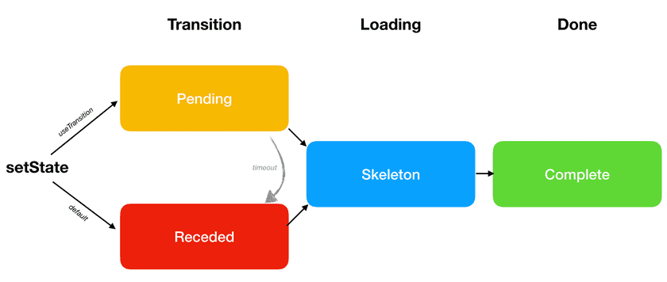
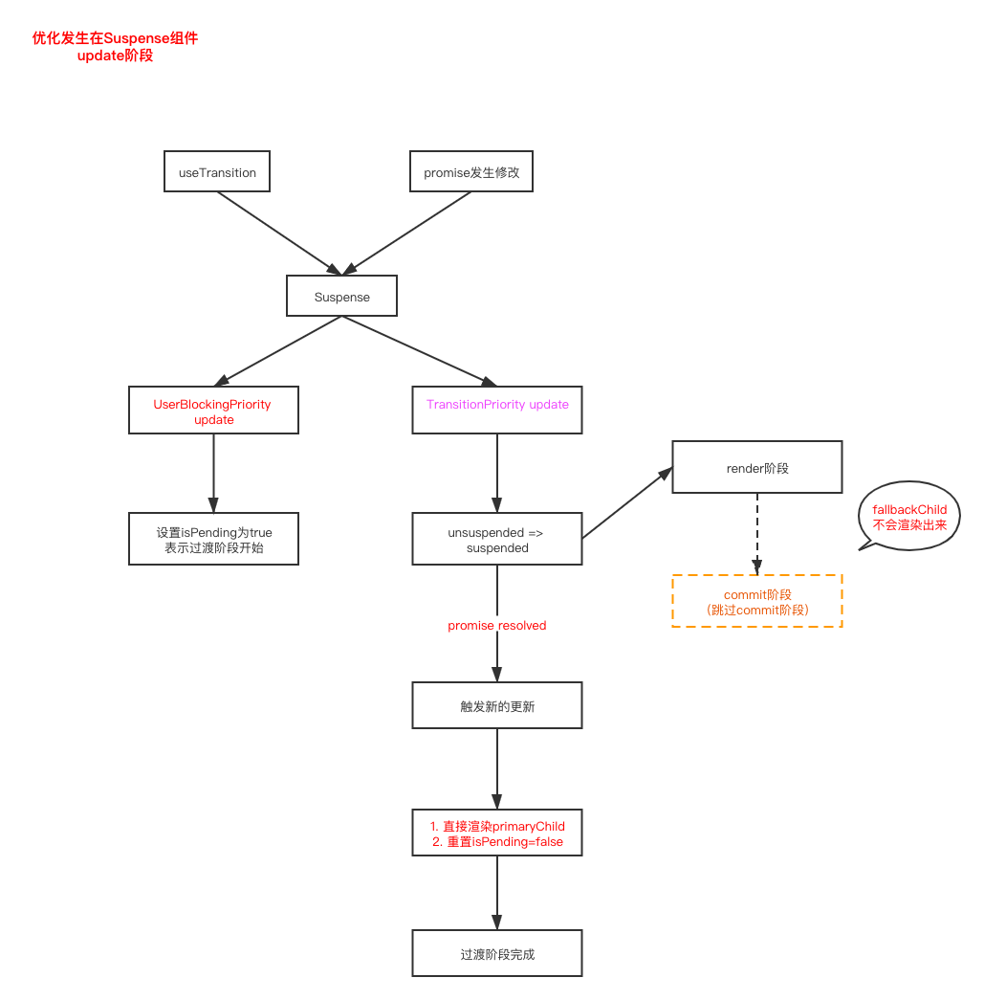

# 结合源码分析useTransition

在Concurrent模式中，React提供了一个新的API — useTransition。具有以下功能

1. 延迟更新 — **降低更新的优先级**
2. 配合`Suspense`**解决因为组件挂起而导致用户交互内容隐藏的问题**

常见的使用场景是在切换页面的时候，但是下一页的数据还没有加载好，切换过去会出现空白页或者`loading`状态，这种交互是不友好的。这种情况下，用户更希望的时候在当前页面停留一会儿，然后等下一页的数据加载好之后再切换过去。

`useTransition`通常会配合`Suspense`一起使用，用来解决`Suspense`使用中遇到的问题。具体是什么问题以及如何解决的，我们后面再来分析，这里我们先来分析一下`useTransition`的实现。


## 1. useTransition的源码实现

### 1.1 mount阶段

内部调用的方法是`mountTransition`

```js
function mountTransition(): [(() => void) => void, boolean] {
  const [isPending, setPending] = mountState(false);
  const start = startTransition.bind(null, setPending);
  const hook = mountWorkInProgressHook();
  hook.memoizedState = start;
  return [start, isPending];
}
```

这个hook内部调用了一次`useState`，创建了一个`state`用来**标识当前过渡的状态**。该hook中创建了一个start方法并且抛出，用户可以调用该方法开启更新的过渡。

这里有一个细节：**`start`方法会保存在`hook.memoizedState`，update阶段直接从memoizedState中获取，所以这个方法是保持不变的**

下面看一下`startTransition`方法内部的逻辑

```js
function startTransition(setPending, callback) {
  const priorityLevel = getCurrentPriorityLevel();
  if (decoupleUpdatePriorityFromScheduler) {
    // ... 省略 当前版本始终是false
  } else {
    runWithPriority(
      priorityLevel < UserBlockingPriority
        ? UserBlockingPriority
        : priorityLevel,
      () => {
        // 当前优先级不小于UserBlockingPriority
        setPending(true);
      },
    );

    runWithPriority(
      priorityLevel > NormalPriority ? NormalPriority : priorityLevel,
      () => {
        // 当前优先级不大于NormalPriority
        const prevTransition = ReactCurrentBatchConfig.transition;
        ReactCurrentBatchConfig.transition = 1;
        try {
          setPending(false);
          callback();
        } finally {
          ReactCurrentBatchConfig.transition = prevTransition;
        }
      },
    );
  }
}
```

这个方法的逻辑也比较清晰：

1. 以**不小于`UserBlockingPriority`的优先级**更新过渡的状态，开启过渡
2. 以**不大于`NormalPriority`的优先级**执行传入的更新，更新完成之后关闭过渡

在创建`Update`对象的时候，会**根据当前优先级的上下文来给`Update`分配对应的`lane`**。这里`setPending(false)`和`callback()`中创建的`Update`优先级是一样的，而且是同步创建的，所以**只会触发一次更新**


前面我们讲过，`useTransition`其中一个功能是用来**延迟更新**，但是这里`callback`中创建的更新对应的优先级是`NormalPriority`，在React应用中，默认的更新优先级就是`NormalPriority`，所以使用这个优先级来延迟更新的效果不会很好。

那么React是如何来解决这个问题的呢？

看一下`requestUpdateLane`方法

> 这个方法前面有讲过，这里只截取了一部分和transition相关的逻辑

```js
export function requestUpdateLane(fiber: Fiber): Lane {
  // Special cases
  const mode = fiber.mode;
  if ((mode & BlockingMode) === NoMode) {
    return (SyncLane: Lane);
  } else if ((mode & ConcurrentMode) === NoMode) {
    return getCurrentPriorityLevel() === ImmediateSchedulerPriority
      ? (SyncLane: Lane)
      : (SyncBatchedLane: Lane);
  } else if (
    !deferRenderPhaseUpdateToNextBatch &&
    (executionContext & RenderContext) !== NoContext &&
    workInProgressRootRenderLanes !== NoLanes
  ) {
    return pickArbitraryLane(workInProgressRootRenderLanes);
  }

  if (currentEventWipLanes === NoLanes) {
    currentEventWipLanes = workInProgressRootIncludedLanes;
  }

  // 获取 ReactCurrentBatchConfig.transition
  const isTransition = requestCurrentTransition() !== NoTransition;
  if (isTransition) {
    // 当前版本下currentEventPendingLanes始终为0
    if (currentEventPendingLanes !== NoLanes) {
      currentEventPendingLanes =
        mostRecentlyUpdatedRoot !== null
          ? mostRecentlyUpdatedRoot.pendingLanes
          : NoLanes;
    }
    return findTransitionLane(currentEventWipLanes, currentEventPendingLanes);
  }
  // ... 省略
}


// 获取TransitionLane
export function findTransitionLane(wipLanes: Lanes, pendingLanes: Lanes): Lane {
  let lane = pickArbitraryLane(TransitionLanes & ~pendingLanes);
  if (lane === NoLane) {
    lane = pickArbitraryLane(TransitionLanes & ~wipLanes);
    if (lane === NoLane) {
      lane = pickArbitraryLane(TransitionLanes);
    }
  }
  return lane;
}
```

上面方法中可以看到，在获取`Update`对应的`lane`时，对于在过渡阶段中创建的`Update`有特殊的处理。**`requestCurrentTransition`方法的返回值就是前面`startTransition`方法中设置的 `ReactCurrentBatchConfig.transition` 的值**。

所以在过渡阶段调度的更新，对应的优先级是`TransitionPriority`，从而实现了延迟更新的目的。


### 1.2 update阶段

update阶段对应的方法是`updateTransition`

```js
function updateTransition(): [(() => void) => void, boolean] {
  const [isPending] = updateState(false);
  const hook = updateWorkInProgressHook();
  const start = hook.memoizedState;
  return [start, isPending];
}
```

`updateTransition`方法中返回的`start`方法**重用**了`mount`阶段创建的start方法。没有什么特殊的逻辑


### 1.3 总结

通过对`useTransition`源码的分析，我们可以得出这么一个结论：

**`useTransition`本身的功能就是通过降低更新的优先级，达到延迟更新的目的。**


## 2. useTransition 和 Suspense

在上一篇文章中我们分析了`Suspense`的实现原理和怎么解决传统模式下React应用中的一些痛点。

但是`Suspense`模式本身也会带来一个问题：

**在请求没有完成的时候，会回退到`fallbackChildren`**。在`mount`阶段的时候这种交互是可以接受的，但是在`update`阶段，这种回退的交互是不友好的

`useTransition`配合`Suspense`使用刚好就可以解决这个问题，也就是我们开篇介绍的`useTransition`的第二个功能。


### 2.1 Suspense组件树更新时经历的三个阶段

在分析具体的实现之前，我们先结合一个例子来分析一下优化的思路

> 我们以切换页签的例子来分析，对应的demo可以看[这里](https://codesandbox.io/s/usetransition-switchtab-7xgxi?file=/src/App.js)

#### 2.1.1 默认情况下

默认情况下，当请求更新时Suspense组件树会经历以下三个阶段：

1. **Receded**: 最外层`Suspense`对应的请求没有完成，回退到渲染`fallbackChildren`
2. **Skeleton**: 嵌套的Suspense对应的请求陆续完成，`Suspense`陆续渲染对应的`primaryChildren`
3. **Complete**: 所有的Suspense都渲染对应的`primaryChildren`，新页面渲染完成

> 区别 Receded 和 Skeleton 阶段：
>
> **Receded感觉是面向用户”后退“了一步，页面从完整页面到降级页面；Skeleton感觉是面向用户”前进“了一步，慢慢渲染成更多内容**

对于用户来说Receded阶段的交互是不友好的，用户能够接受在旧页面显示`pending`状态，但是无法接受页面直接回退到空白。

所以优化的思路就是**将原来的Receded阶段替换成Pending阶段，当新页面中必要的数据完成之后再来更新页面，进入Skeleton阶段**


#### 2.1.2 useTransition优化处理

加入`useTransition`优化处理之后，当请求更新时Suspense组件树会经历以下三个阶段：

1. **Pending**: 停留在当前页面，等待新页面必要数据返回，不回退
2. **Skeleton**: 嵌套的Suspense对应的请求陆续完成，`Suspense`陆续渲染对应的`primaryChildren`
3. **Complete**: 所有的Suspense都渲染对应的`primaryChildren`，新页面渲染完成

也就是我们上面提到的期望的优化方式


借用官方文档中的一张图来表示这个优化过程：



> **注意：**
>
> 上面图对应的React版本比较老，在当前版本中React将其中的`timeout`处理去掉了。
>
> 目前官方文档中对于`useTransition`的描述和例子对应的都是比较老的React版本，当前版本对useTransition的功能有了一些更新


### 2.2 优化的源码实现

上面我们说到`useTransition`配合`Suspense`可以将`Receded`阶段优化成`Pending`阶段。但是我们在分析useTransition源码的时候，其本质的功能就是通过降低更新的优先级延迟更新。如果没有特殊处理的话，并不能达到期望的优化效果。

那么源码中是如何实现的呢？

实现的关键是在`finishConcurrentRender`方法中

```js
function finishConcurrentRender(root, exitStatus, lanes) {
  switch (exitStatus) {
    // ...省略
    case RootSuspendedWithDelay: {
      markRootSuspended(root, lanes);

      if (includesOnlyTransitions(lanes)) {
        // 本次更新是一次过渡更新
        // 本次更新取消，不进入commit阶段
        break;
      }

      if (!shouldForceFlushFallbacksInDEV()) {
        // loading throttle处理
        const mostRecentEventTime = getMostRecentEventTime(root, lanes);
        const eventTimeMs = mostRecentEventTime;
        const timeElapsedMs = now() - eventTimeMs;
        const msUntilTimeout = jnd(timeElapsedMs) - timeElapsedMs;

        // Don't bother with a very short suspense time.
        if (msUntilTimeout > 10) {
          // Instead of committing the fallback immediately, wait for more data
          // to arrive.
          root.timeoutHandle = scheduleTimeout(
            commitRoot.bind(null, root),
            msUntilTimeout,
          );
          break;
        }
      }

      commitRoot(root);
      break;
    }
    // ...省略
  }
}
```

上一篇文章中我们分析Suspense的时候有提到：**在`update`阶段，当`Suspense`由`unsuspended`状态切换成`suspended`状态的时候，会给`workInProgressRootExitStatus`赋值`RootSuspendedWithDelay`。如果当前更新被`startTransition`包裹时，就会命中`includesOnlyTransitions(lanes)`，会抛弃掉当前更新，等`promise`完成之后再触发新的更新。**

如此就实现了期望中的优化，等数据加载完成之后再进去下一个页面。

这里有几个点需要**注意**一下：

1. **优化的过程只可能发生在`Suspense`组件`update`阶段，状态由unsuspended变成suspended**

2. 当命中`useTransition`优化的时候，会抛弃掉当前`render`阶段创建的`workInProgress tree`，下次更新时会重新创建

   > 对这源码分析：
   >
   > `workInProgressRoot`会被重置

3. **当命中`useTransition`优化的时候，不会走commit阶段，也就是promise不能在commit阶段注册回调函数**。前面分析Suspense时讲过，在`Concurrent`模式中，`promise`会在是`render`阶段注册一个回调函数，**在当前优化命中的情况下，promise完成之后就是调用这个回调函数来触发更新的**。

   > 这种情况在分析Suspense时没有提到，这里补充一下


至此我们就分析完了`useTransition`的实现原理和对`Suspense`的优化实现。


#### 2.2.1 suspendedLanes 和 pingedLanes （***）

我们先来看一下`performConcurrentWorkOnRoot`方法

```js
function performConcurrentWorkOnRoot(root) {
  // ...省略

  // Determine the next expiration time to work on, using the fields stored
  // on the root.
  let lanes = getNextLanes(
    root,
    root === workInProgressRoot ? workInProgressRootRenderLanes : NoLanes,
  );
  if (lanes === NoLanes) {
    // Defensive coding. This is never expected to happen.
    return null;
  }

  let exitStatus = renderRootConcurrent(root, lanes);

  if (
    includesSomeLane(
      workInProgressRootIncludedLanes,
      workInProgressRootUpdatedLanes,
    )
  ) {
    // ...省略
  } else if (exitStatus !== RootIncomplete) {
    // ...省略
    
    const finishedWork: Fiber = (root.current.alternate: any);
    root.finishedWork = finishedWork;
    root.finishedLanes = lanes;
    finishConcurrentRender(root, exitStatus, lanes);
  }

  ensureRootIsScheduled(root, now());
  if (root.callbackNode === originalCallbackNode) {
    // The task node scheduled for this root is the same one that's
    // currently executed. Need to return a continuation.
    return performConcurrentWorkOnRoot.bind(null, root);
  }
  return null;
}
```

结合上面优化的代码，这里不禁会产生一个疑问：**在`finishConcurrentRender`方法执行之后，虽然没有执行`commitRoot`，但是后面又执行了一次`ensureRootIsScheduled`方法，为什么这里不会继续触发更新呢？**

这里其实就是`suspendedLanes`和`pingedLanes`在发挥作用

##### 2.2.1.1 suspendedLanes

我们先来看一下添加`suspendedLanes`的方法`markRootSuspended`

> 对应的源代码可以看[这里](https://github.com/careyke/react/blob/a22834e3f44f2a361a378ed36b4543a09da49116/packages/react-reconciler/src/ReactFiberWorkLoop.new.js#L1010)

```js
function markRootSuspended(root, suspendedLanes) {
  suspendedLanes = removeLanes(suspendedLanes, workInProgressRootPingedLanes);
  suspendedLanes = removeLanes(suspendedLanes, workInProgressRootUpdatedLanes);
  markRootSuspended_dontCallThisOneDirectly(root, suspendedLanes);
}

export function markRootSuspended(root: FiberRoot, suspendedLanes: Lanes) {
  root.suspendedLanes |= suspendedLanes;
  root.pingedLanes &= ~suspendedLanes;

  // The suspended lanes are no longer CPU-bound. Clear their expiration times.
  /**
   * 这个将suspendedLanes中每个lane对应的过期时间去掉了
	 * 表示suspendedLanes中的lanes不会自动调度执行，需要借助于pingedLanes来执行
	 * 所以不需要过期时间
   */
  const expirationTimes = root.expirationTimes;
  let lanes = suspendedLanes;
  while (lanes > 0) {
    const index = pickArbitraryLaneIndex(lanes);
    const lane = 1 << index;

    expirationTimes[index] = NoTimestamp;

    lanes &= ~lane;
  }
}
```

这个方法中一个重要的操作就是将`suspendedLanes`中lane对应的过期时间去掉，也就是不会因为过期而强制被执行。

这里理解起来似乎有点困难，我们来看一下调度更新时获取当前最高优先级的方法`getNextLanes`

> 对应的源代码可以看[这里](https://github.com/careyke/react/blob/a22834e3f44f2a361a378ed36b4543a09da49116/packages/react-reconciler/src/ReactFiberLane.js#L249)

```js
export function getNextLanes(root: FiberRoot, wipLanes: Lanes): Lanes {
  // Early bailout if there's no pending work left.
  const pendingLanes = root.pendingLanes;
  if (pendingLanes === NoLanes) {
    return_highestLanePriority = NoLanePriority;
    return NoLanes;
  }

  let nextLanes = NoLanes;
  let nextLanePriority = NoLanePriority;

  const expiredLanes = root.expiredLanes;
  const suspendedLanes = root.suspendedLanes;
  const pingedLanes = root.pingedLanes;

  // Check if any work has expired.
  if (expiredLanes !== NoLanes) {
    nextLanes = expiredLanes;
    nextLanePriority = return_highestLanePriority = SyncLanePriority;
  } else {
    // Do not work on any idle work until all the non-idle work has finished,
    // even if the work is suspended.
    const nonIdlePendingLanes = pendingLanes & NonIdleLanes;
    if (nonIdlePendingLanes !== NoLanes) {
      const nonIdleUnblockedLanes = nonIdlePendingLanes & ~suspendedLanes;
      if (nonIdleUnblockedLanes !== NoLanes) {
        // 先处理非suspended的任务
        nextLanes = getHighestPriorityLanes(nonIdleUnblockedLanes);
        nextLanePriority = return_highestLanePriority;
      } else {
        // suspendedLanes中的任务 只能通过pingedLanes来调度
        const nonIdlePingedLanes = nonIdlePendingLanes & pingedLanes;
        if (nonIdlePingedLanes !== NoLanes) {
          nextLanes = getHighestPriorityLanes(nonIdlePingedLanes);
          nextLanePriority = return_highestLanePriority;
        }
      }
    } else {
      // The only remaining work is Idle.
      // ...省略
    }
  }

  if (nextLanes === NoLanes) {
    // This should only be reachable if we're suspended
    // TODO: Consider warning in this path if a fallback timer is not scheduled.
    return NoLanes;
  }

  // ...省略

  return nextLanes;
}
```

上面代码中可以看到，在获取下一次更新的优先级时，会跳过suspendedLanes中包含的lane。也就是说**suspendedLanes对应的lanes默认是不会执行的，除非标记成pingedLanes**

也就是说，**pingedLanes是动态构建用来执行suspendedlanes对应的更新的**

**suspendedLanes和pingedLanes会在commit执行时进行销毁**，可以看[markRootFinished](https://github.com/careyke/react/blob/a22834e3f44f2a361a378ed36b4543a09da49116/packages/react-reconciler/src/ReactFiberLane.js#L762) 方法，也就是说suspendedLanes和pingedLanes只在当前render阶段产生作用


##### 2.2.1.2 pingedLanes

设置pingedLanes的方法`markRootPinged`

> 对应的方法可以看[这里](https://github.com/careyke/react/blob/a22834e3f44f2a361a378ed36b4543a09da49116/packages/react-reconciler/src/ReactFiberLane.js#L733)

```js
export function markRootPinged(
  root: FiberRoot,
  pingedLanes: Lanes,
  eventTime: number,
) {
  root.pingedLanes |= root.suspendedLanes & pingedLanes;
}
```

上面代码中可以看到，pingedLanes和suspendedLanes是紧密关联在一起的，**pingedLanes是suspendedLanes的子集**。

suspendedLanes中的lanes需要依赖pingedLanes才能够被调度执行。


##### 2.2.1.3 总结

1. **suspendedLanes对应的lanes在优先级调度的时候会被跳过，而且每个lane对应的过期时间也被销毁，所以默认suspendedLanes中包含的更新不会被调度执行**

2. **pingedLanes是suspendedLanes的子集，pingedLanes中包含的lanes会被调度执行，优先级小于`pendingLanes & ~suspendedLanes`。如果suspendedLanes中某些lanes需要调度执行，必须先将这个lanes合并到pingedLanes中**
3. suspendedLanes是pendingLanes的子集，pingedLanes是suspendedLanes的子集

也就是说，**suspendedLanes是用来标记当前pendingLanes中某些lanes为暂停状态，不参与优先级调度。pingedLanes用来尝试恢复suspendedLanes中某些lanes的调度执行**。


#### 2.2.2 结合suspendedLanes和pingedLanes来详细分析优化代码的实现

前面我们提过，单纯的跳过`commitRoot`执行并不能起到优化的作用，在`performConcurrentWorkOnRoot`中会重新调度一次更新。所以在

`finishConcurrentRender`方法中调用了`markRootSuspended`方法，将当前lanes合并到suspendedLanes中，所以**在`ensureRootIsScheduled`方法中调度时会跳过suspendedLanes**

```js
function ensureRootIsScheduled(root: FiberRoot, currentTime: number) {
  const existingCallbackNode = root.callbackNode;

  // Check if any lanes are being starved by other work. If so, mark them as
  // expired so we know to work on those next.
  // 给当前更新标记过期时间，如果过期了，当前更新被中断会将当前更新保存在expiredLane中，会后面消费
  markStarvedLanesAsExpired(root, currentTime);

  // Determine the next lanes to work on, and their priority.
  const nextLanes = getNextLanes(
    root,
    root === workInProgressRoot ? workInProgressRootRenderLanes : NoLanes,
  );
  // This returns the priority level computed during the `getNextLanes` call.
  const newCallbackPriority = returnNextLanesPriority();

  if (nextLanes === NoLanes) {
    if (existingCallbackNode !== null) {
      // 会走到这里
      // 情况状态
      cancelCallback(existingCallbackNode);
      root.callbackNode = null;
      root.callbackPriority = NoLanePriority;
    }
    return;
  }
  
  // ...省略
}
```

上述代码中，重置了`root.callbackNode`，所以不会调度一次新的更新。


**那么当promise完成之后又是如何更新的呢？**

前面我们提过，当命中`useTransition`优化的时候，不会走commit阶段，所以promise只在render阶段注册了一个回调函数`pingSuspendedRoot`，由这个方法来触发更新

```js
export function pingSuspendedRoot(
  root: FiberRoot,
  wakeable: Wakeable,
  pingedLanes: Lanes,
) {
  const pingCache = root.pingCache;
  if (pingCache !== null) {
    // The wakeable resolved, so we no longer need to memoize, because it will
    // never be thrown again.
    pingCache.delete(wakeable);
  }

  const eventTime = requestEventTime();
  // add pingedLanes
  markRootPinged(root, pingedLanes, eventTime);

  if (
    workInProgressRoot === root &&
    isSubsetOfLanes(workInProgressRootRenderLanes, pingedLanes)
  ) {
    // 这种请你情况不会命中
    // 不是在render阶段 workInProgressRoot === null
    if (
      workInProgressRootExitStatus === RootSuspendedWithDelay ||
      (workInProgressRootExitStatus === RootSuspended &&
        includesOnlyRetries(workInProgressRootRenderLanes) &&
        now() - globalMostRecentFallbackTime < FALLBACK_THROTTLE_MS)
    ) {
      // Restart from the root.
      /**
       * 1. 在update阶段，Suspense由primary变成suspended的时候。
       * 2. 在retry过程中，在loading节流限制时间之内触发了 Suspense loading 
       */
      prepareFreshStack(root, NoLanes);
    } else {
      // Even though we can't restart right now, we might get an
      // opportunity later. So we mark this render as having a ping.
      workInProgressRootPingedLanes = mergeLanes(
        workInProgressRootPingedLanes,
        pingedLanes,
      );
    }
  }
  
  ensureRootIsScheduled(root, eventTime);
  schedulePendingInteractions(root, pingedLanes);
}
```

上面代码中可以看到，这里**动态合并了之前的renderLanes到pingedLanes中**，然后开启了调度器。所以**本次可以开启一次新的更新直接渲染promise完成之后的内容，完美的跳过了Suspense组件的Receded阶段**

至此，useTransition优化Suspense的实现原理就分析完了。


### 2.3 useTransition优化Suspense的实现流程




## 3. 版本迭代

这里笔者还是想再强调一下，当前分析的React版本和官方文档中例子对应的React版本是有较大的差别的。其中对于`useTransition`的功能和实现就发生了比较大的变化。

### 3.1 旧版 useTransition

在旧版中，`useTransition`有一个**`timeout`**的概念，给当前过渡阶段设置了一个最大时间

> 这个的旧版指的是当前官方文档中例子对应的React版本，对应的实验版本号是`0.0.0-experimental-5faf377df`

- 没有过期时，`Suspense`对应的`promise`完成时就会退出过渡阶段
- 当超出过期时间时，不管`promise`有没有完成，都会退出过渡阶段。这时可能会回退到`Receded`阶段

> 旧版本的demo可以看[这里](https://codesandbox.io/s/old-usetransition-3sdul?file=/src/App.js)，可以调整`timeoutMs`的数值来验证

> 官方文章中有一个功能是”使用 `<Suspense>` 包裹惰性功能“，这个功能实际上利用的就是旧版的`useTransition`有`timeout`这个特性


### 3.2 新版 useTransition

在新版中，`useTransition`中删除了`timeout`的概念，所以**必须要等到`Suspense`对应的`promise`完成之后才会退出过渡阶段。**


这里我们看两个useTransition优化多Suspense嵌套的例子

1. switchTab，对应的demo看[这里](https://codesandbox.io/s/usetransition-switchtab-7xgxi?file=/src/App.js)

   ```js
   const User = ({ resource }) => {
     const user = resource.user.read();
     return <h1>{user}</h1>;
   };
   const Age = ({ resource }) => {
     const user = resource.age.read();
     return <div>{user}</div>;
   };
   
   const Home = () => {
     return <h1>Home Page</h1>;
   };
   const Detail = ({ resource }) => {
     return (
       <div>
         <User resource={resource}></User>
         <Suspense fallback={<div>Loading age ...</div>}>
           <Age resource={resource} />
         </Suspense>
       </div>
     );
   };
   
   const SwitchTab = () => {
     const [resource, setResource] = useState(() => fetchData());
     const [startTransition, isPending] = React.unstable_useTransition();
     const [tabId, setTabId] = useState(0);
   
     const handleClick = () => {
       startTransition(() => {
         setResource(fetchDataSecond());
         setTabId(1);
       });
     };
   
     return (
       <div>
         <button onClick={handleClick} disabled={isPending}>
           {isPending ? "loading..." : "switch"}
         </button>
         <Suspense fallback={<div>Loading app ...</div>}>
           {tabId === 0 ? <Home /> : <Detail resource={resource} />}
         </Suspense>
       </div>
     );
   };
   ```

   这里点击按钮的时候，**等待user数据加载完成之后才会切换到下一个页面，但是并不会等待`age`数据也加载完成**。

   因为`age`对应的`Suspense`组件是**新创建**的，处于`mount`状态，所以达不到`useTransition`优化的条件。


2. switchApi，对应的demo可以看[这里](https://codesandbox.io/s/usetransition-switchapi-ficp5?file=/src/wrapPromise.js:0-497)

   ```js
   const User = ({ resource }) => {
     const user = resource.user.read();
     return <h1>{user}</h1>;
   };
   const Age = ({ resource }) => {
     const user = resource.age.read();
     return <div>{user}</div>;
   };
   
   const SwitchTab = () => {
     const [resource, setResource] = useState(() => fetchData());
     const [startTransition, isPending] = React.unstable_useTransition();
   
     const handleClick = () => {
       startTransition(() => {
         setResource(fetchDataSecond());
       });
     };
   
     return (
       <div>
         <button onClick={handleClick} disabled={isPending}>
           {isPending ? "loading..." : "switch"}
         </button>
         <Suspense fallback={<div>Loading user ...</div>}>
           <User resource={resource}></User>
           <Suspense fallback={<div>Loading age ...</div>}>
             <Age resource={resource} />
           </Suspense>
         </Suspense>
       </div>
     );
   };
   ```

   这个例子中，点击按钮之后会**等待`Suspense`子树中所有的`promise`完成之后才会退出过渡阶段**

   按照前面`useTransition`优化的流程分析下来可知，其中一个`promise`完成之后仍然会命中`useTransition`优化。


在多个Suspense嵌套时，useTransition优化之后，有些场景下过渡的时间长，有些场景下过渡的时间短。当我们了解useTransition优化Suspense的原理之后，就可以准确判断过渡的时间长短，可以更好的使用`Suspense`和`useTransition`


## 4. 总结

1. useTransition本身的功能就是降低更新的优先级，达到延迟更新的目的
2. useTransition之所以能够优化Suspense组件，是因为`Suspense`组件内部对于`useTransition`做了一些特殊处理
3. 目前useTransition仍然是一个实验功能，可能在以后的版本中仍会发生较大修改

