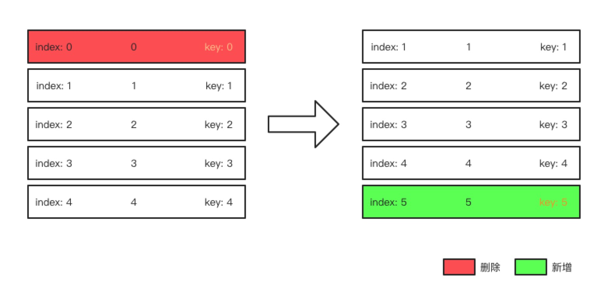
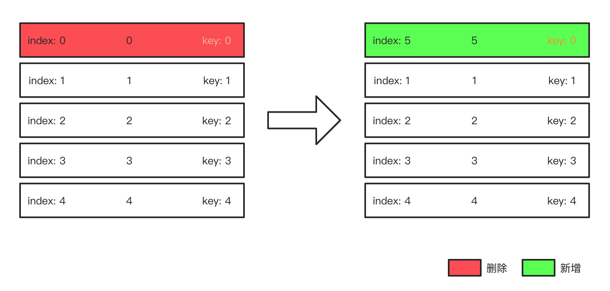
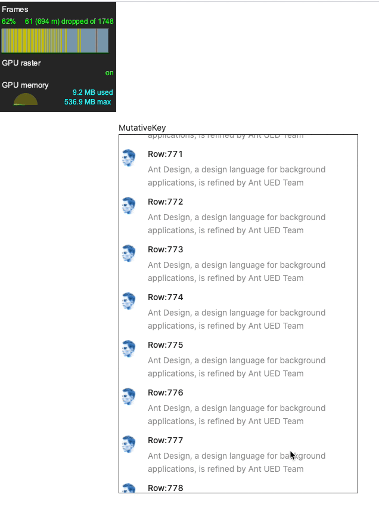
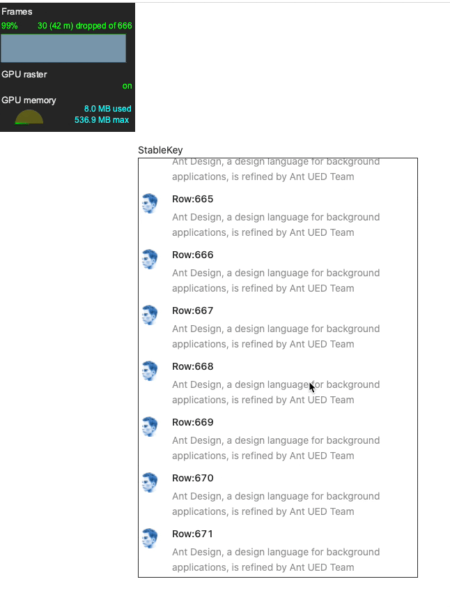

# 结合React源码谈谈虚拟列表的实现和优化思路

在实际的开发中，我们常常会遇到大数据渲染卡顿的问题。这个问题需要从以下两个方面来优化：

1. 渲染层：采用**虚拟列表**的方式来渲染，也就是每次只渲染**可视区域**和**buffer区域**的节点，大量减少渲染的节点数量，优化的效果十分明显。
2. 网络层：数据分页请求

综合上面两个方面的优化，通常会有以下两种方案。

1. **滚动加载（懒加载）**：滚动最后一个节点的时候会卡住，直到下一页的数据回来之后才能继续滚动。
2. **无限滚动**：初始就为所有的节点空出位置，可以直接滚动到最后一条数据，在滚动的过程中根据索引来判断请求哪一页的数据。

在实现上来说，滚动加载实现起来相对简单一些。但是从体验来说无限滚动更加流畅。所以笔者更加倾向于使用无限滚动的方案。

无论是滚动加载还是无限滚动，无非是获取数据的时机不一样。优化的核心还是需要虚拟列表的支撑，下面我们就来讲解一下虚拟列表的实现思路和优化方案。


## 1. 虚拟列表的实现思路

虚拟列表实现的**关键目标**是：

1. 获取当前需要渲染节点片段的头尾索引
2. 计算每个渲染节点的位置

要达成上面的关键目标，我们需要有以下**前提条件**：

1. 可视窗口的尺寸
2. 节点的总数量
3. 节点的尺寸
4. 滚动的距离
5. buffer的个数

通过上面的前提条件，我们就可以计算出前面关键目标中所需要的数据。


其中**节点的尺寸有稳定和不稳定**两种，可以将虚拟列表分成**稳定的虚拟列表**和**不稳定的虚拟列表**。

1. **稳定**的虚拟列表计算的过程比较简单，可以参考代码 [**VirtualizedComponent.tsx**](https://github.com/careyke/react-virtualized-core/blob/main/src/core/VirtualizedComponent.tsx)
2. **不稳定**的虚拟列表计算的过程比较复杂，笔者参考了 [`react-window`](https://github.com/bvaughn/react-window) 中的实现，可以参考代码 [**VariableSizeVirtualizedComponent.tsx**](https://github.com/careyke/react-virtualized-core/blob/main/src/core/VariableSizeVirtualizedComponent.tsx)

具体的实现步骤笔者在这里就不详细描述了，大家可以参考`react-window`的源码或者这篇文章：[再谈前端虚拟列表的实现](https://zhuanlan.zhihu.com/p/34585166)，作者写得非常好。

这里笔者主要是想详细讲解一下在 `react-window` 之上的进一步的优化方案。


## 2. 虚拟列表的优化方案 - key值优化

在算法层面，`react-window`中的实现已经优化到了极致。笔者优化的角度是**对于`key`值的优化**。

在React中，`key`对于列表中的元素来说非常重要，其决定了对应的真实DOM节点是创建、销毁、更新还是移动，对于性能的影响比较大。

在`react-window`中，每个节点默认的`key`是对应的索引。那么在滚动的过程中，必然会有真实DOM节点的新建和销毁操作。在比较复杂的列表或者性能一般的机器中，快速滚动的时候**白屏**还是比较严重的。

### 2.1 key值优化

`key`值优化的思路就是 **新增的节点尽可能的重用之前销毁节点的key值，其他节点的key值保持不变**。这样就可以尽量减少真实`DOM`节点的销毁和重建，取而代之的是代价更小的更新操作。

要实现key值优化的前提条件就是**列表子节点需要使用绝对定位，将节点的索引顺序和真实的渲染位置顺序区分开来。**

1. **`react-window`中的`key`变化**

   

2. **`key`值优化**

   

如上图所示：**根据`key`值来确定节点在列表中的顺序，根据`index`来确定`DOM`节点的偏移量从而确定展示顺序。**


### 2.2 代码实现

笔者将这部分`key`值的处理封装成了一个自定义的`hook`，可自行取用~

```typescript
interface KeyIndexConfig {
  lastKeyIndexMap: Map<number, number>; // 缓存每个item的index与key之间的映射关系
  maxKeyIndex: number; // 当前用到的最大的keyIndex
  recycledKeyIndex: number[]; // 回收的keyIndex, 需要后进先出
  // lastReleaseKeyIndex: LastReleaseKeyIndexConfig; // 上个快照到当前快照释放的keyIndex
}

export interface RenderIndexConfig {
  renderStartIndex: number;
  renderEndIndex: number;
}

type GetItemKeyIndex = (index: number) => number;

export const useKeyIndex = (
  renderStartIndex: number,
  renderEndIndex: number
) => {
  const keyIndexRef = useRef<KeyIndexConfig>({
    lastKeyIndexMap: new Map<number, number>(),
    maxKeyIndex: 0,
    recycledKeyIndex: [],
  });
  const lastRenderedIndexRef = useRef<RenderIndexConfig>({
    renderStartIndex: -1,
    renderEndIndex: -1,
  });

  const getItemKeyIndex = useMemo<GetItemKeyIndex>(() => {
    const {
      renderStartIndex: lastRenderStartIndex,
      renderEndIndex: lastRenderEndIndex,
    } = lastRenderedIndexRef.current;

    lastRenderedIndexRef.current = {
      renderStartIndex,
      renderEndIndex,
    };
    if (
      renderStartIndex > lastRenderEndIndex ||
      renderEndIndex < lastRenderStartIndex
    ) {
      keyIndexRef.current = {
        lastKeyIndexMap: new Map<number, number>(),
        maxKeyIndex: renderEndIndex - renderStartIndex + 1,
        recycledKeyIndex: [],
      };
    }
    // 下面两种是互斥行为
    if (renderStartIndex > lastRenderStartIndex) {
      // 回收上面销毁的节点
      const { lastKeyIndexMap, recycledKeyIndex } = keyIndexRef.current;
      for (let i = lastRenderStartIndex; i < renderStartIndex; i++) {
        const lastKeyIndex = lastKeyIndexMap.get(i) as number;
        recycledKeyIndex.push(lastKeyIndex);
      }
    }
    if (renderEndIndex < lastRenderEndIndex) {
      // 收回下面销毁的节点
      const { lastKeyIndexMap, recycledKeyIndex } = keyIndexRef.current;
      for (let i = renderEndIndex + 1; i <= lastRenderEndIndex; i++) {
        const lastKeyIndex = lastKeyIndexMap.get(i) as number;
        recycledKeyIndex.push(lastKeyIndex);
      }
    }
    const newKeyIndexMap = new Map<number, number>();
    return (index: number) => {
      const {
        lastKeyIndexMap,
        recycledKeyIndex,
        maxKeyIndex,
      } = keyIndexRef.current;
      const lastKeyIndex = lastKeyIndexMap.get(index);
      let keyIndex: number = index - renderStartIndex;
      if (lastKeyIndex != null) {
        // 没有变化的节点，复用之前的key
        keyIndex = lastKeyIndex;
      } else if (lastKeyIndexMap.size > 0) {
        if (recycledKeyIndex.length > 0) {
          // 复用销毁节点的key，销毁key后进先出
          keyIndex = recycledKeyIndex.pop() as number;
        } else {
          // 销毁key用完之后，新增一个key
          keyIndex = maxKeyIndex;
          keyIndexRef.current.maxKeyIndex++;
        }
      }
      newKeyIndexMap.set(index, keyIndex);
      if (index === renderEndIndex) {
        // console.log(newKeyIndexMap, recycledKeyIndex);
        keyIndexRef.current.lastKeyIndexMap = newKeyIndexMap;
      }
      return keyIndex;
    };
  }, [renderStartIndex, renderEndIndex]);
  return { getItemKeyIndex };
};
```


### 2.3 优化效果比较

> 以垂直方向的列表为例，渲染3000个节点

#### 2.3.1 稳定的虚拟列表

##### 2.3.1.1 react-window FixedSizeList

1. 正常情况

   

2. chrome 6x slowdown

   

##### 2.3.1.2 key优化之后的列表

1. 正常情况

   

2. chrome 6x slowdown

   

上面对比可以看到，在一般情况下，`react-window`和`key优化`之后列表性能表现上差不多；但是降低浏览器的性能之后，`key优化`之后的列表在表现上比`react-window`的列表更好。


> **由于笔者只实现了虚拟列表的核心功能，在功能上并没有`react-window`那么全，所以有可能因为react-window增加了附加功能才导致性能受损，不能证明是key值的原因。**
>
> 所以笔者去掉了自己组件中`key优化`的相关代码，采用和`react-window`中一样的方式获取key值，来比较两者的性能


##### 2.3.1.3 去掉key优化的列表

1. 正常情况

   

2. chrome 6x slowdown

   

可以看出，去掉key优化之后的列表，在降低浏览器的性能之后，快速滚动时仍然会出现大面积的白屏。


## 3. 总结

整体优化的思路主要是围绕着`key`值来进行的，相对是比较简单的。笔者在第一家公司的时候接触到了`Ag-grid`，其内部的优化思路大概就是这种方式。

笔者写的源代码可以看[这里](https://github.com/careyke/react-virtualized-core)

参考文章：

1. [再谈前端虚拟列表的实现](https://zhuanlan.zhihu.com/p/34585166)

