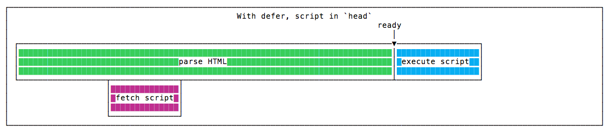
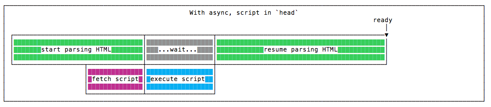

## script标签的defer和async属性的区别
普通的通过script标签引入的外部js文件，其**下载和执行和dom的解析是同步执行的，所以会阻塞dom的解析**。所以一旦**js文件比较大，或者网络情况不理想的时候，会出现较长时间的白屏**。虽然可以通过将`script`标签放在文档的底部来解决y一部分的白屏现象，但是一些复杂的场景这种方案效果不好。

所以HTML5提出了defer和async来异步下载js文件的方案，来优化由于js下载而出现白屏的情况。

### defer
```html
<script src="./index.js" type="text/javascript" defer>
```
当script标签设置了 `defer=true` 的时候，js文件的下载和dom的生成是并行的过程，也就是说**js文件的下载不会阻塞dom树的生成，而且js文件的执行会在dom树构建完之后顺序执行，所有defer的js文件执行完后才能之后才触发`DOMContentLoaded`事件**。



### async
```html
<script src="./index.js" type="text/javascript" async>
```
- js文件并行下载，下载过程不会阻塞dom树的构建
- js文件下载完成之后立即执行，没有顺序，谁快谁先执行
- js的执行过程是同步的，有可能会阻塞dom树的构建。async的js文件和`DOMContentLoaded`事件没有关系，当dom解析完成之后就会触发`DOMContentLoaded`事件，不管此时async的js有没有执行完成。



### defer vs async
1. 都只对外部的js文件有效，内联的js代码无效。
2. js的下载过程都是并行的，defer的js文件在dom解析完之后顺序执行，async的js文件下载完成之后立刻执行，没有顺序。
3. 同时设定defer和async属性的时候，效果和async相同。


## 参考
1. [async、defer与DOMContentLoaded的执行先后关系](https://blog.csdn.net/zyj0209/article/details/79698430)
2. [浅谈script标签的defer和async](https://segmentfault.com/a/1190000006778717)
3. [Script 标记的 defer 和 async 属性说明](https://beginor.github.io/2019/01/25/script-defer-async.html)

