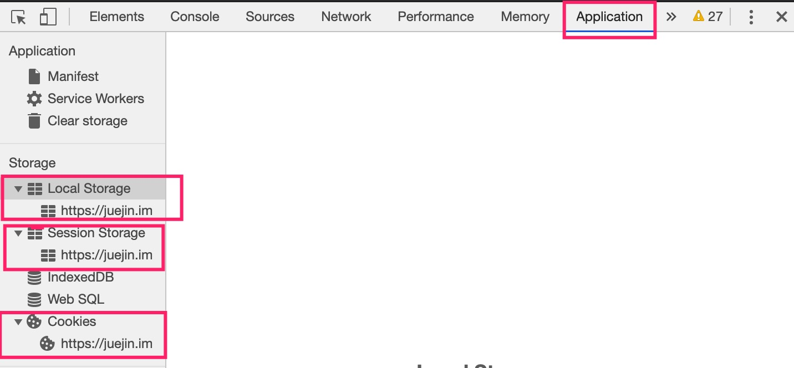

# cookie VS sessionStorage VS localStorage
这三者都是浏览器提供的**前端本地存储**的方式。打开chrome devTool可以看到它们具体存放的数据。

**相同点**：
1. 都是前端本地存储的方式
2. 获取存储的值时，都受**同源策略**的影响。即两个不同源的页面，不能相互访问对方存储的值。图中可以看到，**存储数据的时候都是以源（协议，域名和端口）为key值存储的**

下面主要探索三种存储方式的区别

## 比较三者之间的区别
### 1.生命周期
- cookie: 可以设置失效时间。如果没有设置的话，**默认是浏览器关闭就会失效**
- sessionStorage: 仅在当前页面会话下有效，刷新页面依旧存在，**当前页面关闭或者浏览器关闭的时候销毁**
- localStorage: **持久化存储**，除非是手动删除，否则一直存在

### 2.存储空间大小
- cookie: 4KB左右
- sessionStorage和localStorage: 5MB左右

### 3.http请求中
- cookie: 每次http请求中，会将cookie放在请求头带过去。如果cookie存储数据过多可能会有性能问题
- localStorage和sessionStorage: 仅存在在浏览器中，不参与http通讯

### 4.应用场景
- cookie: 基本都是用在**前后端通信**中，用来保存用户的登录状态和登录信息
- sessionStorage: sesstionStorage用来存储一些临时的信息，防止刷新浏览器之后丢失。**不同浏览器页面中的sessionStorage是独立的，即使展示的页面是同源的。**
- lcoalStorage: **不同浏览器页面中的lcoalStorage是共用的**。所以可以用来跨浏览器页面传输数据。前提是同源的页面，否则访问不到数据

### 参考文章
1. [cookie、localStorage和sessionStorage 三者之间的区别以及存储、获取、删除等使用方式](https://juejin.im/post/5a191c47f265da43111fe859)