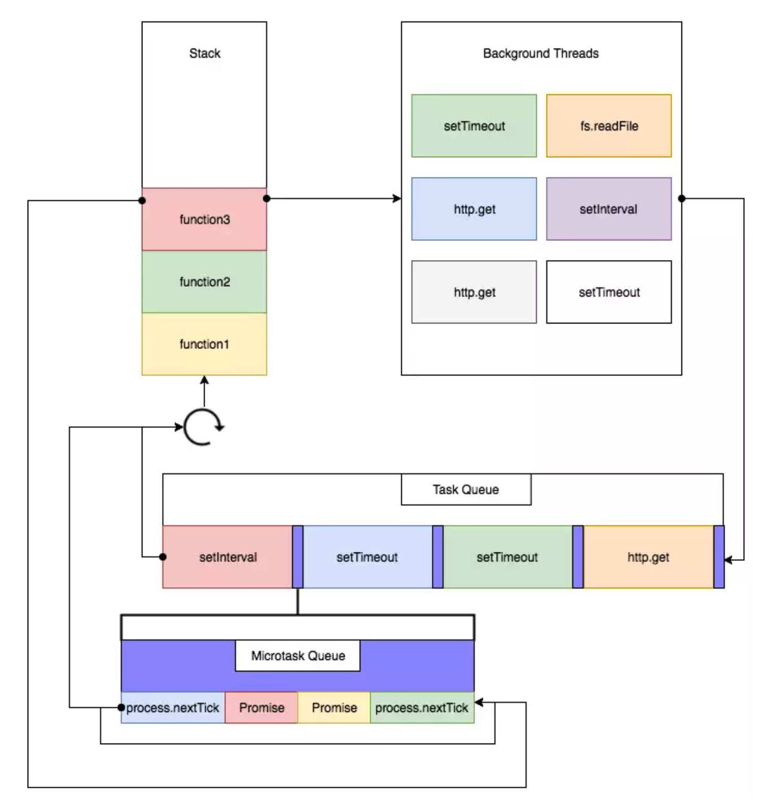
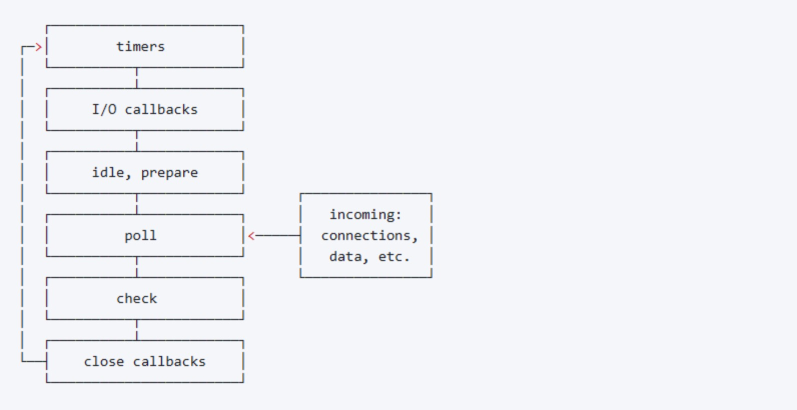

# JS中的异步实现和EventLoop
JS是一门**单线程、非阻塞**的脚本语言。
- **单线程指的是，只有一个主线程来执行所有的js代码**；
- **非阻塞指的就是异步任务不会阻塞同步任务的执行，而是会先挂起，等待条件满足之间再执行**。

JS程序中，代码可以分成两个部分：**同步代码和异步代码。同步代码指的是现在就要执行的代码；异步代码指的是现在不执行，将来条件满足之后再执行的代码。**


## 1.JS引擎和JS宿主环境
JS引擎并不是独立运行的，需要运行在宿主环境中。
- **JS引擎负责的是对于js代码块的解析和运行**。可以理解为一个只知道执行js代码的机器人
- **JS宿主环境负责JS代码块的调度，异步代码的实现正是由宿主环境调度来完成的**。常见的宿主环境有浏览器、Node


## 2.事件循环（event loop）
js代码之所以能够异步执行，是因为宿主环境中提供了**事件循环机制**来调度js代码块。**不管是浏览器还是Node环境，内部都提供了事件循环的机制来调度js代码，但是两者事件循环的实现细节是不同的。**

### 2.1 event loop伪代码实现
```js
var eventQueue=[]; //事件队列
var event;

while(true){
  //开始一个新的tick
  
  if(eventQueue.length>0){
    event = eventQueue.shift();
    try{
      event();
    }catch(e){
      reportError(e);
    }
  }
}
```
这个伪代码主要是帮助理解事件循环机制的中心思想，就是**宿主环境将js代码分成多个代码块存放在事件（任务）队列中（提供API的形式），然后循环去执行事件队列中的代码块，直到清空事件队列。**


### 2.2 宏任务队列和微任务队列

JS引擎执行到异步任务的时候，会将异步任务暂时挂起。这里的**挂起指的是将异步任务的回调函数暂存在某个地方**。

**宿主环境中提供了宏任务队列和微任务队列来存放这些回调函数。**也就是说，异步任务分为宏任务和微任务

#### 2.2.1 宏任务（Task）
1. script(整体代码)
2. setTimeout
3. setInterval
4. setImmediate(node环境独有，浏览器中只有IE支持)
5. requestAnimationFrame(浏览器独有)
6. I/O
7. UI rendering(浏览器独有)
8. postMessage
9. MessageChannel

#### 2.2.2 微任务(Job)
1. Promise.then
2. MutationObserver
3. process.nextTick(node独有)

注意：**这里说的宏任务和微任务指的都是相关API的回调函数部分，并不是API整体。**


### 2.3 浏览器中的eventLoop

直接看图：



#### 2.3.1 浏览器中eventLoop的代码执行流程
1. 开始一个新的tick，首先会从宏任务队列中取出**头部任务**放到执行栈中，开始执行同步代码。
2. 执行同步代码的过程中，可能会遇到遇到异步任务。如果是宏任务，则根据它的规则推到宏任务队列中；如果是微任务，则推到微任务队列中。
3. 同步代码执行完之后，开始执行微任务队列。如果微任务队列不为空，则依次取出其中的微任务，放到执行栈中执行。**执行微任务的过程中，如果遇到其他的微任务，仍然会添加到微任务队列中，也就是说会在这个tick执行完**（可能会造成无限循环，一直到不了下一阶段）。
4. **当所有的微任务执行完成之后，判断是否需要UI渲染**，如果需要则执行一次UI渲染，如果不需要则执行下一个步骤。
5. 检查是否存在 Web worker 任务，如果有，则对其进行处理
6. 当前tick完成，回到步骤1，开始下一个tick，直到宏任务队列被清空

#### 2.3.2 看一个例子，根据上面流程分析结果
```js
console.log(1);
setTimeout(function() {
    console.log(2);
}, 0);
new Promise(function(resolve) {
    console.log(3);
    resolve(Date.now());
}).then(function() {
    console.log(4);
});
console.log(5);
setTimeout(function() {
    new Promise(function(resolve) {
        console.log(6);
        resolve(Date.now());
    }).then(function() {
        console.log(7);
    });
}, 0);

//依次输出：
//1 3 5 4 2 6 7
```


### 2.4 Node环境中的eventLoop

Node环境中的事件循环和浏览器中的事件循环是完全不同的。
- 在浏览器环境中，可以认为只存在**一个宏任务队列和一个微任务队列**。事件循环的过程分析相对比较简单

  > 实际上浏览器中也是存在多个宏任务队列和微任务队列的：
  >
  > - 在实现上，宏任务队列分成**消息队列**和**延时队列** —— [浏览器工作原理和实践](https://time.geekbang.org/column/article/134456)
  >
  > - 每个宏任务中存在一个微任务队列

- 在Node环境中，存在**多个宏任务队列和多个微任务队列**。整个调度的过程相对比较复杂。

node中的**事件循环机制的实现是在libuv层完成的**，libuv是一个基于事件驱动的跨平台抽象层，封装了不同操作系统一些底层特性，对外提供统一的API

#### 2.4.1 Node中事件循环的6个阶段
node中，将事件循环的过程分成6个阶段。按照执行的顺序依次是：



##### 2.4.1.1 各个阶段的任务：
1. timers: 这个阶段执行**Timers Queue**中的回调函数。其中Timers Queue中存放的是setTimeout和setInterval的回调函数。
2. I/O callbacks: 这个阶段**处理上一轮中没有执行的回调**。除了close回调，timers回调和setImmediate回调
3. idle, prepare: 这个阶段仅内部使用，不分析
4. poll: 这个阶段会获取新的I/O事件，适当的条件下node将阻塞在这个阶段。（**最重要的阶段**）
5. check: 这个阶段执行setImmediate的回调函数，存放在**Check Queue**中 
6. close callbacks: 这个阶段执行socket的close事件的回调函数，存放在**Close Queue**中

##### 2.4.1.2 详细分析各个阶段的操作规则
1. timers阶段：对应一个宏任务队列Timers Queue，这个队列用来保存setTimeout和setInterval的回调函数，这个阶段会执行Timer Queue中保存的回调函数。这个阶段实际上是由poll阶段控制的。
2. I/O callbacks阶段：**执行上一轮循环中没有被执行的回调函数**（这些回调函数指的是残留在**Poll Queue**中的回调函数）。不包括timers的callback、close的callback和setImmediate的callback
3. idle,prepare阶段：这个阶段内部使用，不做分析
4. **poll阶段**：这个阶段对应的**宏任务队列是Poll Queue，这个队列用来保存除了timer，close和setImmediate之外的异步回调函数（主要是I/O callback）**。poll阶段主要功能是：
   - 处理Poll Queue中的回调函数
   - 如果有timers callback,则回到timers阶段执行这些callback
   - **当eventLoop进入poll阶段并且Timers Queue中没有可执行的回调函数**
     - **如果Poll Queue非空**，event loop会同步执行Poll Queue里面的回调函数，直到queue为空或者达到系统设置的阈值
     - **如果Poll Queue为空**
       - **如果Check Queue中存在回调函数**，eventLoop结束poll阶段，进入check阶段执行Check Queue中的回调函数
       - **如果Check Queue为空**，event loop将阻塞在这个阶段，等待callback被添加到队列并且立即执行。
   - **当event loop进入poll阶段而且Timer Queue不为空的时候。如果Poll Queue为空的话**，eventLoop会**按照循环的顺序**进去timers阶段，执行Timer Queue中的回调函数。（如果Poll Queue和Timer Queue都不为空的时候，应该会向执行Poll Queue）

5. check阶段：这个阶段对应的宏任务队列是**Check Queue**，存储的是setImmediate的callback。如果Check Queue不为空，则执行其中的回调函数

6. close callbacks阶段：这个阶段对应的是**Close Queue**。如果一个 socket 或者事件处理函数突然关闭/中断(比如：socket.destroy()),则这个阶段就会发生 close 的回调执行。否则他会通过 process.nextTick() 发出

#### 2.4.3 Node中的宏任务队列和微任务队列
从上面的分析中可以看出，Node环境中存在**4个宏任务队列**，分别是：
1. Timers Queue
2. Poll Queue
3. Chech Queue
4. Close Queue

Node中还存在**两个微任务队列：**
1. 微任务队列(micro Queue)：普通的微任务队列。
2. nextTick Queue：**这个微任务队列会在普通的微任务队列之前执行**。（优先级高）


#### 2.4.4 Node中eventlop的详细执行过程
当主程序的同步代码执行完之后，eventLoop开始启动，然后按照循环顺序开始执行
1. 首先是进入timers阶段，先判断Timers Queue是否为空，**如果不为空，则取出一个任务开始执行，执行完成之后，会先执行nextTick Queue，然后再执行micro Queue，微任务执行完成之后继续重复这一步**，直到Timers Queue被清空，则进入下一个阶段
2. 其他的阶段的执行规则在上面都有介绍。和timers阶段一样的是，**每当执行完一个宏任务的时候，都会去执行nextTick Queue和micro Queue微任务队列中的任务**
3. evenloop按照这6个阶段一直循环下去，如果没有任何宏任务，会阻塞在poll阶段

**注意**：
**上面描述的执行过程是node v11之后的版本，包括v11。在node v11之前的版本中，微任务是在每个阶段结束之后，在下一个阶段开始之前执行的。v11开始修改成和浏览器的eventLoop相似的机制，每执行完一个宏任务，都会执行完所有的微任务**

```js
setTimeout(()=>{
    console.log('timer1')
    Promise.resolve().then(function() {
        console.log('promise1')
    })
}, 0)
setTimeout(()=>{
    console.log('timer2')
    Promise.resolve().then(function() {
        console.log('promise2')
    })
}, 0)

//对于v11之前的版本
// timer1 -> timer2 -> promise1 -> promise2

//对于v11及之后的版本
// timer1 -> promise1 -> timer2 -> promise2
```


#### 2.4.5 setTimeout vs setImmediate
##### 2.4.5.1 分析之前，首先要明白
1. 不管在浏览器还是node环境中，**setTimeout和setInterval中的延时，指的是在一段时间之后将对应的回调函数添加到对于的任务队列中，而不是一段时间之后直接执行**。也就是说这个时间是不准确的，如果之前有比较耗时的任务阻塞住eventLoop，那么就会比设定的延时更久才能执行。

   > 这里实际上**对于setTimeout这类的延时异步任务，是直接放在延时队列中。每次执行完宏任务之后会检验延时队列中是否有到期的任务，有的话就执行**。

2. setTimeout(fn,0)中直观表示是不延时立马加入任务队列。但是其实**0延时是不存在的，系统内部会定义一个最小延时时间，大约是1ms**。所以setTimeout(fn,0) = setTimeout(fn,1)

```js
setTimeout(()=>{console.log('2')},1);
setTimeout(()=>{console.log('1')},0)

// 2 -> 1

setTimeout(()=>{console.log('2')},2);
setTimeout(()=>{console.log('1')},1)

// 1 -> 2
```

##### 2.4.5.2 开始分析setTimeout和setImmediate的执行顺序
这两个方法的回调函数的**执行顺序取决于当前的eventLoop上下文**

1.**如果它们是在异步I/O callback之外调用的，它们回调函数的执行顺序是不确定的**

```js
setTimeout(function timeout () {
  console.log('timeout');
},0);

setImmediate(function immediate () {
  console.log('immediate');
});
```
上述代码的执行顺序是不确定的，因为setTimeout在timers阶段执行，setImmediate在check阶段执行。两者的顺序取决于机器的性能。**setTimeout(fn,0)实际就是setTimeout(fn,1)，系统在进入eventLoop也是需要时间的**
- **如果进入eventLoop耗费的时间大于1ms**，则进入timers阶段的时候，Timers Queue已经有任务，直接执行即可。此时setTimeout先执行
- **如果进入eventLoop耗费的时间小于1ms**，则进入timers阶段的时候，Timers Queue为空。继续进入下一个阶段，直到check阶段中执行setImmediate。此时setImmediate先执行

2.**如果它们是在异步I/O callback内部调用的，它们回调函数的执行顺序是确定的，setImmediate始终会优先执行**

```js
const fs = require('fs')
fs.readFile(__filename, () => {
    setTimeout(() => {
        console.log('timeout');
    }, 0)
    setImmediate(() => {
        console.log('immediate')
    })
})
// immediate -> timeout
```
**因为I/O callback是在poll阶段执行的**，当Poll Queue执行完成之后，因为有timers callback和setImmediate，所以不会阻塞在这个阶段。**存在timers callback，所以会循环到timers阶段去执行回调函数，循环的过程中会先经过check阶段，所以会先执行setImmediate**


## 参考文章

1. [简单-Node.js Event Loop 的理解 Timers，process.nextTick()](https://www.jianshu.com/p/d6a47421a3e2)
2. [浏览器与Node的事件循环(Event Loop)有何区别?](https://juejin.im/post/5c337ae06fb9a049bc4cd218#heading-13)
3. [理解event loop（浏览器环境与nodejs环境）](https://imweb.io/topic/5b148768d4c96b9b1b4c4ea1)
4. [带你彻底弄懂Event Loop](https://juejin.im/post/5b8f76675188255c7c653811#heading-7)


