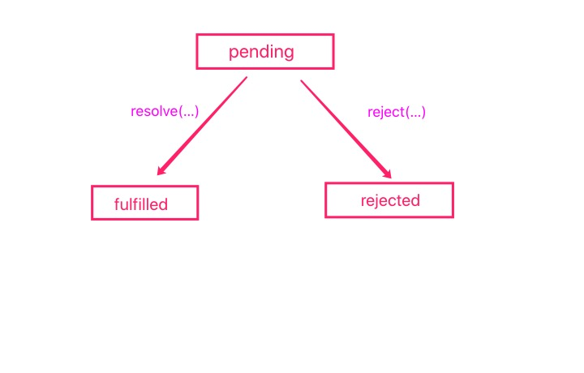

# 深入理解Promise以及手动实现一个Promise

## 1.Promise的特点

**Promise这种异步方案是没有完全摆脱回调函数的，它只是提供了一个可信任的Promsie机制来解决回调函数方案带来的问题**。其实Promise方案中异步代码的调用还是通过回调函数来完成的，只是回调函数的控制权在Promise手中，不会有第三方控制回调函数带来的信任问题。

### 1.1 Promise的三种状态和一个决议值

Promise实例有三种状态，分别是：

1. pending —— Promise实例的初始状态
2. fulfilled —— Promise内部的异步任务成功的状态，对应的方法是resolve(...)
3. rejected —— Promise 内部异步任务异常的状态，对应的方法是reject(...)

```js
var p = new Promise(function(resolve,reject){
	resolve();
})
```

Promise内部状态可以调用resolve和reject方法来改变：



Promise状态转换是==不可逆==的，一旦由pending状态变成了其他状态，就不能再切换了。


**Promise内部还保存了当前状态对应的一个值，这个值是用来当做参数传递给对应的回调函数的，叫做==决议值==（你不知道的JS）**。这个值通常是异步任务成功的返回值或者失败抛出的异常对象。

这个值通常是通过resolve或者reject方法存储在Promise实例对象中，而后传给回调函数使用。

### 1.2 Promise的回调函数

Promise中异步任务的回调函数是通过 `then(...)` 方法注册的。

```js
var p = new Promise(function(resolve, reject){
	resolve(23);
})
p.then((data)=>{
	console.log(data); // 23
})
```

Promise中回调函数的特点：

1. ==异步调用== —— 通过then方法注册的回调函数是异步执行的，存在在微任务队列中。**设计成微任务既可以保证不阻塞主程序，又可以确保函数调用的实时性（这个tick一定会执行完）**。
2. ==返回值穿透== —— **then中回调函数的返回值会存储在then方法内部创建的Promise实例中当做决议值，会被下一个then中的回调函数使用**。

```js
var p = new Promise(function(resolve, reject){
	resolve(23);
})
p.then((data)=>{
	console.log(data); // 23
	return 34;
}).then((data)=>{
	console.log(data); //34
	return 45;
})
```

### 1.3 Promise的链式调用

Promise提供链式调用的方式来串联执行多个异步任务，解决了回调地狱的问题。

```js
function readFile(name){
	return new Promise(function(resolve,reject){
		fs.readFile(name, (err, data)=>{
			if(err) reject(err);
			resolve(data);
		})
	})
}

readFile('1.json').then((data)=>{
	...
	return readFile('2.json');
}).then((data)=>{
	...
	return readFile('3.json');
})
```

==Promise能够链式调用的原因==是：

1. then方法返回一个Promise实例，也就是说then方法内部会创建一个新的Promise实例
2. then方法中的回调函数有**返回值穿透**的特点

==then内部创建的Promise实例的状态变化规则==：

1. 当**前一个Promise是fulfilled的时候**，执行then中的成功回调函数

   - 如果正常执行没有报错，则内部Promise状态是fulfilled，将返回值作为promise的决议值

   - 如果执行过程中报错，则内部Promise状态是rejected，将错误对象作为决议值

2. 当**前一个Promise是rejected状态的时候**，执行then中失败的回调
   - 当then中**没有注册失败回调**的时候，内部会调用一个默认的失败回调函数，将之前的异常抛给下一个then方法。内部Promise状态是rejected
   - 当then**注册了失败回调函数**的时候，会捕获之前的异常对象，调用失败回调函数。后面的过程和调用成功回调函数一样

### 1.4 Promise的异常处理

**Promise内部执行抛错的时候，在外面是无法捕获这个错误的。**

**（==猜测==）因为异常在Promise内部就已经被捕获了，从而将Promise的状态切换成rejected，然后异常对象存放在 promise 中，调用失败回调函数将异常对象暴露给使用者。**

```js
var p = new Promise(function(resolve,reject){
  a = b+1; // a,b 都没有定义，会抛错
  resolve(a);
})
console.log('ok'); 
// ok 后面代码正常执行，并没有因为抛错中断执行

try{
  var p = new Promise(function(resolve,reject){
  	a = b+1; // a,b 都没有定义，会抛错
  	resolve(a);
	});
}catch(e){
  console.log(e);  //不执行这句代码，说明try中没有捕获错误
}
```

**Promise内部的异常是有==感染性==和==冒泡性==的**，当这个异常没有被捕获的时候，它会导致链式调用中后续的Promise都变成rejected状态，而且异常对象会一直向后传递，直到被失败回调函数捕获住。

Promise提供了两种方式来捕获内部的异常（实际是一种）：

1. then(...)方法的第二个参数用来注册失败回调函数
2. 使用catch方法（catch方法内部就是使用then实现的）

```js
// bad
promise
  .then(function(data) {
    // success
  }, function(err) {
    // error
  });

// good
promise
  .then(function(data) { //cb
    // success
  })
  .catch(function(err) {
    // error
  });
```

第二种方式比第一种更好。因为第二种方式中 catch 还能捕获前面then中抛出的错误。

**因为Promsie内部的异常具有冒泡的特性，所以只需要在链式调用的最后一个环节添加一个catch方法即可。它可以捕获之前没有被捕获的异常。**

### 1.5 处理resolve([promise])

==在Promise p1的执行函数中调用resolve方法的时候，当传入的参数是一个Promise对象 p2 的时候，此时p1的状态由p2的状态决定，p2是什么状态p1就是什么状态，p2的决议值是什么p1的决议值就是什么。==（所有都成功，才能真正成功）

```js
var p = new Promise(function(resolve,reject){
	setTimeout(()=>{
    resolve(new Promise(function(resolve, reject){
      setTimeout(()=>{
        resolve(123)
      },5000)
    }));
  },1000)
})
p.then((data)=>{
  console.log(data) // 大约5s之后输出 123
})
```

==then(...)方法中回调函数的返回值是Promise对象 p1 的时候，和resolve([promise])的处理方式是一样的。then内部创建的promise对象p2的状态和决议值取决于 p1。==

```js
var p = new Promise(function(resolve,reject){
  resolve(123);
})
p.then(()=>{
  return new Promise(function(resolve,reject){
    setTimeout(()=>{
      resolve(456);
    },5000)
  })
}).then((data)=>{
  console.log(data); // 大约5s之后输出 456
})
```

==但是在Promise执行函数中，无论给reject(...)方法传什么参数，失败回调函数中得到的就是什么参数。哪怕传入的是Promise对象，得到的也是一个Promise对象。==（一个失败直接失败）

```js
var p = new Promise(function(resolve,reject){
  reject(new Promise(function(resolve, reject){
    setTimeout(()=>{
      resolve(123)
    },5000)
  }));
})
p.catch((err)=>{
  console.log(err);  //Promise {<pending>} 直接将Promise对象传递
})
```

## 2. 手动实现一个Promise

Promise是根据[Promises/A+](https://www.ituring.com.cn/article/66566)规范实现的。这里我们根据A+规范和上面分析的Promise的特点，自己手动实现一个Promise类

### 2.1 实现Promise构造函数

1. 构造函数接收一个函数作为参数，这个函数接收两个函数resolve和reject作为参数，并且会立即执行。
2. Promise实例内部存在以下属性：
   - Promise的状态
   - Promise的决议值（成功的值或者失败的原因）
   - Promise成功或失败对应的回调函数
3. 执行过程出现任何异常，都会导致Promise失败
4. 当resolve接收的参数是Promise对象时候，参考上面的分析进行特殊处理
5. Promise状态修改不可逆
6. Promise回调函数需要异步调用

```js
const Pending = 'pending';
const Fulfilled = 'fulfilled';
const Rejected = 'rejected';

function MyPromise(stateManager) {
  const context = this;
  context.state = Pending;
  context.value = undefined; //成功值
  context.reason = undefined; //失败值
  context.fulfillCallback = [];
  context.rejectCallback = [];

  function reject(reason) {
    if (context.state !== Pending) return;
    context.state = Rejected;
    context.reason = reason;
    context.rejectCallback.forEach((callback) => {
      setTimeout(() => {
        callback(reason);
      }, 0)
    });
  }

  function resolve(value) {
    if (context.state !== Pending) return;
    if (value instanceof MyPromise) {
      value.then(resolve, reject); // 内部Promise通过调用外部promsie的修改方法来决定外部Promsie的状态
    } else {
      context.state = Fulfilled;
      context.value = value;
      context.fulfillCallback.forEach((callback) => {
        setTimeout(() => {
          callback(value);
        }, 0)
      })
    }
  }

  try {
    stateManager(resolve, reject);
  } catch (err) {
    reject(err);
  }
}
```

### 2.2 实现Promise.prototype.then方法

1. then函数接受两个函数参数，分别作为当前Promsie的成功和失败回调。**不传或者不是函数类型**的话使用内部默认值
2. 链式调用 —— then方法返回一个新的Promise对象。Promise的状态和决议值由回调函数决定，参看上面分析。
3. then中回调函数返回Promise对象时，需要额外处理，参考上面分析。(规范中还涉及到thenable对象的处理，thenable对象很少出现，我们这边不特殊处理)

```js
MyPromise.prototype.then = function (onResolve, onReject) {
  if (typeof onResolve !== 'function') {
    onResolve = value => value;
  }
  if (typeof onReject !== 'function') {
    onReject = reason => { throw reason } //上一步的异常冒泡到下一个阶段
  }

  const context = this;

  //处理回调函数的返回值对象promise状态的影响
  const resolvePromise = (returnValue, resolve, reject) => {
    if (returnValue instanceof MyPromise) {
      returnValue.then(resolve, reject);
    } else {
      resolve(returnValue);
    }
  }

  return new MyPromise(function (resolve, reject) {
    if (context.state === Pending) {
      // 暂存回调函数
      context.fulfillCallback.push((value) => {
        setTimeout(() => {
          try {
            const returnValue = onResolve(value);
            resolvePromise(returnValue, resolve, reject);
          } catch (error) {
            reject(error);
          }
        }, 0)
      });
      context.rejectCallback.push((reason) => {
        setTimeout(() => {
          try {
            const returnValue = onReject(reason);
            resolvePromise(returnValue, resolve, reject);
          } catch (error) {
            reject(error);
          }
        }, 0)
      })
    } else if (context.state === Fulfilled) {
      // 直接塞进任务队列
      setTimeout(() => {
        try {
          const returnValue = onResolve(context.value);
          resolvePromise(returnValue, resolve, reject);
        } catch (error) {
          reject(error);
        }
      }, 0)
    } else {
      setTimeout(() => {
        try {
          const returnValue = onReject(context.reason);
          resolvePromise(returnValue, resolve, reject);
        } catch (error) {
          reject(error);
        }
      }, 0)
    }
  });
}
```

### 2.3 实现Promise.prototype.catch()和Promise.prototye.finally()

catch内部是使用then方法来实现的。

```js
MyPromise.prototype.catch = function(onReject){
  return this.then(undefined, onReject);
}
```

==finally方法的特点==：ES2018增加

1. 无论前面Promise的最终状态是fulfilled还是rejected，都会执行finally中的回调函数，**finally中的回调函数不接受参数**
2. **finally方法不会影响前面promise中的决议值传递到后面then中注册的回调函数中，除非finally内部报错，会替换掉之前的异常**
   - 与`Promise.resolve(2).then(() => {}, () => {})` （resolved的结果为`undefined`）不同，`Promise.resolve(2).finally(() => {})` resolved的结果为 `2`
   - `Promise.reject(3).then(() => {}, () => {})` (resolved 的结果为`undefined`), `Promise.reject(3).finally(() => {})` rejected 的结果为 `3`。finally不会捕获错误
3. finally方法返回一个新的Promise对象

```js
MyPromise.prototype.finally = function(cb){
  return this.then((value)=>{
    cb();
    return value;
  },(reason)=>{
    cb();
    throw reason;
  })
}
```

测试：

```js
var p = new MyPromise(function(resolve,reject){
  resolve(123)
})
p.finally(()=>{
  console.log('finally');
}).then((data)=>{
  console.log(data);
})
// 输出：finally  123

var p = new MyPromise(function(resolve,reject){
  reject(123)
})
p.finally(()=>{
  console.log('finally');
}).catch((err)=>{
  console.log(err);
})
// 输出：finally 123

p.finally(()=>{
  console.log('finally');
  throw 456;
}).catch((err)=>{
  console.log(err);
})
// 输出：finally 456
```


### 2.4 实现Promise.resolve()和Promise.reject()静态方法

**Promise.resolve(...) **

1. 这个方法的返回值是一个Promise对象

2. 参数有三种类型

   - Promise对象 —— 直接返回这个promise对象

   - thenable对象 —— **返回一个Promise对象，会执行thenable对象中的then方法，设置Promise的状态和决议值**。

     ```js
     // thenable对象
     let thenable = {
       then: function(resolve, reject) {
         resolve(42);
       }
     };
     ```

     

   - 普通值 —— 返回值一个**fulfilled**状态的Promise对象，并且这个普通值就是当前Promise的决议值

```js
MyPromise.resolve = function(value){
  if(value instanceof MyPromise){
    return value;
  }
  return new MyPromise((resolve, reject)=>{
    if(value && value.then && typeof value.then === 'function'){
      value.then(resolve,reject); //then方法内部调用resolve和reject来决定Promise的状态
    }else{
      resolve(value);
    }
  })
}
```

**Promise.reject(...)**

1. 返回一个状态为 ==rejected== 的Promise对象
2. 无论传进去什么参数，都会直接作为Promise对象的决议值。不做多余的处理

```js
MyPromise.reject = function(reason){
  return new MyPromise((resolve,reject)=>{
    reject(reason);
  })
}
```

### 2.5 实现Promise.all() 和 Promise.race() 方法

**Promise.all()**：全部成功才能成功

1. 这个方法用于将多个promise对象合并成一个promise对象
2. 接收一个数组作为参数，里面每一个子项都是Promise对象；如果不是，先用Promise.resolve()转化成Promise对象。（可以不是数组，但是要有 Iterator 接口，内部使用for..of）
3. **参数中所有Promise都成功，返回的Promise才能成功，决议值是参数中Promise决议值按顺序组成的数组；如果其中一个失败，返回的Promise直接失败，决议值就是那个异常对象。**

```js
MyPromise.all = function(promiseArr){
  // 简单处理，就当数组处理
  return new MyPromise(function(resolve,reject){
    const value = [];
    const len = promiseArr.length;
    for(let p of promiseArr){
      MyPromise.resolve(p).then((v)=>{
        value.push(v);
        if(value.length === len){
          resolve(value);
        }
      },(reason)=>{
        reject(reason);
        //这里不能使用break，异步执行的
      })
    }
  });
}

```

**Promise.race(...)**：类似于赛跑

1. 参数和all(...)方法一样
2. **参数Promise中，哪个先完成，返回的Promise状态和它保持一致，决议值也保持一致。**

```js
MyPromise.race = function(promiseArr){
  return new MyPromise(function(resolve, reject){
    for(let p of promiseArr){
      MyPromise.resolve(p).then((value)=>{
        resolve(value);
      },(reason)=>{
        reject(reason);
      })
    }
  })
}
```

### 2.6 实现Promise.allSettled() 和 Promise.any()

**Promise.allSettled()**：判断所有的Promise是否都完成，all 和 race 都无法办到，ES2020引入

1. 参数和all(...)方法是一样的
2. **allSettled()方法返回一个新的Promise对象，等参数中所有的Promise都完成之后，这个Promise才完成，而且状态只会是fulfilled。和参数Promise的成功还是失败无关，只看是否完成。**
3. **新Promise的决议值是一个对象数组** `[{status,reason/value}]`，数组中每一个对象和参数Promise一一对应。fulfilled状态的Promise对应value属性，rejected状态的Promsie对应reason属性

```js
MyPromise.allSettled = function(promiseArr){
  return new MyPromise(function(resolve, reject){
    const result = [];
    const len = promiseArr.length;
    for(let p of promiseArr){
      MyPromise.resolve(p).then((value)=>{
        result.push({status:Fulfilled, value: value});
        if(result.length === len){
          resolve(result);
        }
      },(reason)=>{
        result.push({status:Rejected, reason: reason});
        if(result.length === len){
          resolve(result);
        }
      })
    }
  });
}
```

**Promise.any()**：==和all()方法恰好相反==。一个成功就成功，所有失败即失败。处于提案状态

1. 参数和all()方法一致

```js
MyPromise.any = function(promiseArr){
  return new MyPromise(function(resolve, reject){
    const result = [];
    const len = promiseArr.length;
    for(let p of promiseArr){
      MyPromise.resolve(p).then((value)=>{
        resolve(value);
      },(reason)=>{
        result.push(reason);
        if(len === result.length){
          reject(result);
        }
      })
    }
  })
}
```