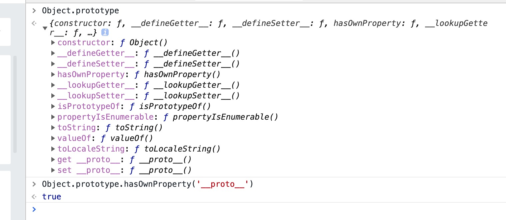
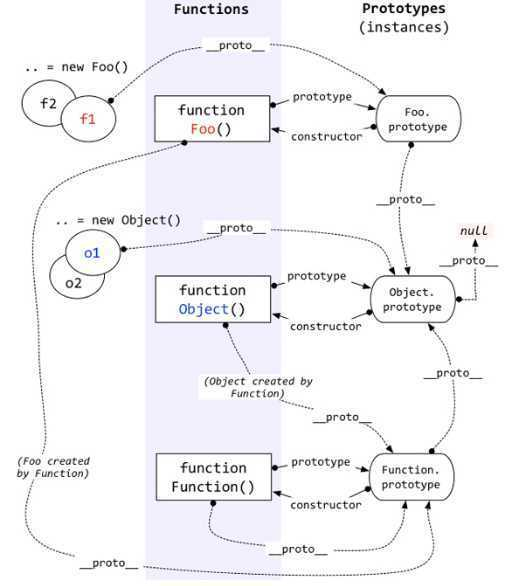
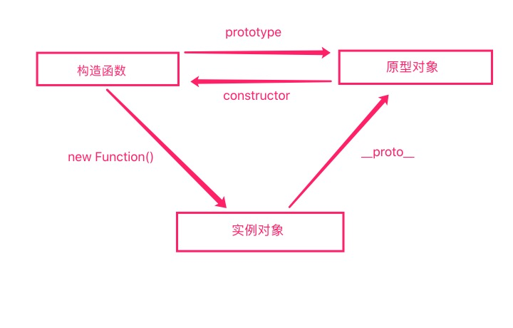

# 原型和原型链是什么？
**原型和原型链是js模拟类的关键特性。**

## 1.原型和原型对象
### 1.1 原型对象
**每一个函数都一个prototype属性，它表示的是这个函数的原型对象。当使用new操作符来调用这个函数的时候（其实也就是实例化这个类），对应的实例会关联这个原型对象，可以访问原型对象中的属性。这个原型对象就是这个实例的原型**

**默认情况下，构造函数的原型对象中有一个constructor属性指向对应的构造函数**。但是实际运用中常常手动修改构造函数的prototype属性，但是**忽略了constructor的指向**，会造成关联丢失。

```js
function Foo(){}
Foo.prototype = {
  a:23
}
let obj1 = new Foo();
let obj2 = new Foo();

console.log(obj1.a); //23
console.log(obj2.a); //23
```

### 1.2 原型
**js中每一个对象在创建的时候，都会将它与另一个对象（或者null）相关联，这个对象就叫做它的原型。对象可以从它的原型中获取属性。**

对象中的**内置属性[[prototype]]**指向的就是它的原型。

#### 1.2.1 获取原型的方法
1. 通过______proto______属性
```js
function Foo(){}
var obj = {a:2}
Foo.prototype = obj;
var obj = new Foo();
obj.__proto__ === Foo.prototype; //true
```

2. 使用Object.getPrototypeOf()方法
```js
function Foo(){}
var obj = {a:2}
Foo.prototype = obj;
var obj = new Foo();
Object.getPrototypeOf(obj) === Foo.prototype; //true
```

#### 1.2.2 设置原型的方法
1. 使用new操作符实例化一个类，这个实例对象的原型就是该构造函数的原型对象
```js
function Foo(){}
var obj = {a:2}
Foo.prototype = obj;
var obj = new Foo();
obj.a // 2
Object.getPrototypeOf(obj) === Foo.prototype; //true
```

2. Object.create(______proto______)
```js
var obj = {
     a:2
}
var o = Object.create(obj,{b:{value:3,writable:true}});
o.__proto__ === obj; //true
o.a; // 2
```

3. Object.setPrototypeOf(obj,______proto______)
```js
var obj = {
     a:2
}
var o = {
     b:3
}
Object.setPrototypeOf(o,obj);
o.__proto__ === obj; //true
o.a; // 2
```

4. 给______proto______属性赋值修改，但是这个属性有兼容性问题
```js
var obj = {
     a:2
}
var o = {
     b:3
}
o.__proto__ = obj;
o.__proto__ === obj; //true
o.a; // 2
```

注意：
**对象的______proto______属性并不是存放在对象上的属性，而是对象原型链上的属性**，具体是**Object.prototype对象上的getter和setter属性**。


#### 1.2.3 原型对于属性赋值操作的屏蔽现象
以下面这个赋值操作为例：
```js
obj.a = 1;
```
- **如果obj对象中存在a属性**，直接给该属性赋值即可。不需要再查找原型链，即会屏蔽掉原型链上的a属性。
```js
var obj = {
    a:0
}
obj.a = 1;
obj // {a:1}
```

- **如果a不直接存在在obj对象中，**那么就会按照obj的原型链往上找。如果**原型链上也没有**，则a会直接添加在obj对象中。
- **如果obj中不存在a属性，但是原型链上存在**。
  - 如果原型链上的a属性**没有被标记为只读**（writable:false），则会直接**在obj中增加一个a属性并赋值**。它是屏蔽属性。（**大部分场景**）
  ```js
  var proto = {a:10}
  var obj = {}
  obj.__proto__ = proto;
  obj.a = 2;
  obj; //{a:2}
  proto; //{a:10}
  ```

  - 如果原型链上的a属性**被标记为只读**，那么**无法修改已有属性，而且也无法在obj中创建屏蔽属性**。严格模式下会报错。
  ```js
  var proto = {a:10}
  Object.defineProperty(proto,'a',{writable:false})
  var obj = {}
  obj.__proto__ = proto;
  obj.a = 2;
  obj // {}
  proto // {a:10}
  ```

  - **如果原型链上存在的是a属性的setter**，那就一定会调用这个setter。**不会在obj中创建屏蔽属性a，也不会修改原型链中a的setter**。
  ```js
  var proto={
    set a(v){
      console.log(v);
    }
  }
  var obj = {}
  obj.__proto__ = proto;
  obj.a = 2; // 2
  obj;  //{}
  proto;  //{}
  ```

总结：
**给对象属性赋值的操作，大部分的情况下都是直接在当前对象上进行。但是在一些特殊的场景下，并不会在当前对象上操作，但是都不会修改原型链上的属性。**

## 2. 原型链
**原型链是通过对象的[[prototype]]属性连接在一起的一种链式结构，直到某个对象的原型为null为止。**对象a有原型b，b也有原型c，以此类推就形成一个原型链。

**通常来说，原型链中的最后一个对象都是Object.prototype，Object.prototype的原型为null。**

### 2.1 实例对象、Function和Object之间的原型链结构



### 2.2 实例对象、原型对象和构造函数之间的关系



### 2.3 原型链的应用
1. for..in 遍历对象的时候，除了遍历对象本身之外，还会遍历对象原型链上的属性
2. in操作符判断属性是否在对象上的时候，也会搜索对象的原型链


