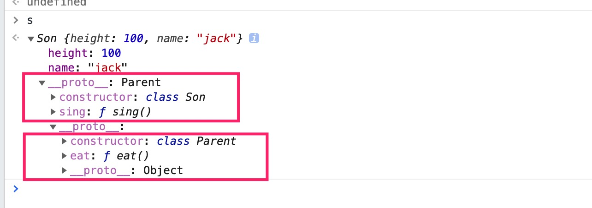
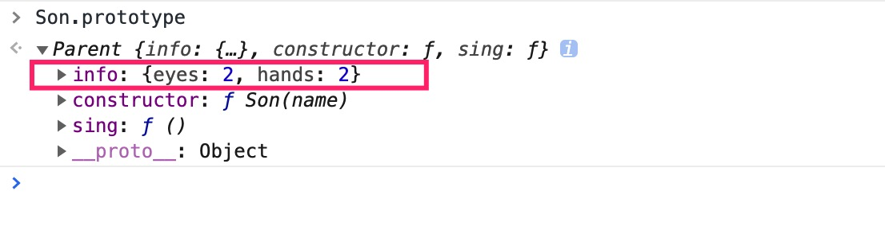
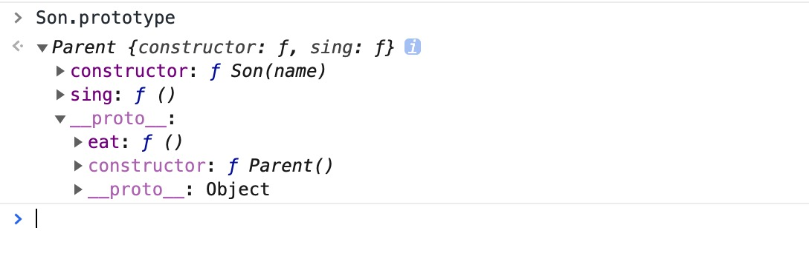

## 对比js中的继承方案
### 1.继承的本质分析
```js
class Parent{
  constructor(height){
    this.height = height;
  }
  eat(){
    console.log('eat something');
  }
}

class Son extends Parent{
  constructor(height,name){
    super(height); // super调用父类构造函数只能使用this之前调用
    this.name = name;
  }
  sing(){
   console.log('sing a song');
  }
}

var s = new Son(100,'jack');
s // {height:100,name:'jack'}
s.eat();  // 'eat something'
s.sing(); // 'sing a song'
```
代码中可以看到，子类继承父类，就可以拥有父类的属性和方法。传统的面向对象的语言Java中，继承意味着有**复制**的操作，将父类的属性和方法复制到实例中。

但是**在js中，并不存在复制的操作（获得实例属性是复制操作），而是将复制变成了关联，这就要依赖于原型链来实现了。**也就是说实例本身是没有对应类和父类的方法的，是通过原型链才能调用这些方法。
1. 成员属性复制
2. 成员方法关联




总结：
**继承的本质其实就是将类中的成员方法放在对应的原型对象中，然后使用原型链将子类和父类的原型对象关联起来，从而使实例对象可以访问到对应类和父类中的成员方法**。


### 2.类的继承方案的演变

**继承的关键就是子类的实例对象中，要能获取到：**

1. 父类的成员属性
2. 父类的成员方法

#### 2.1 原型链继承
```js
function Parent(){
  this.info={
    eyes:2,
    hands:2
  }
}
Parent.prototype.eat=function(){
  console.log('eat something');
}

function Son(name){
  this.name = name;
}
Son.prototype.sing=function(){
  console.log('sing a song');
}
Son.prototype = new Parent();

var s1 = new Son('jack');
var s2 = new Son('mary');

s1.eat() //'eat something'
s2.eat() //'eat something'
s1.info //{eyes:2,hands:2}
s2.info //{eyes:2,hands:2}

s1.info.hands = 1;
s2.info.hands // 1  相互影响

s1.constructor === Son  //false
s1.constructor === Parent //true
```
优点：
1. 利用原型链可以访问父类中的成员方法和属性

缺点：
1. 将父类中的成员属性放在原型链中，也就是所有实例共用一份，那么**当是引用类型的时候，一个实例修改了会影响到其他实例**。（普通类型不会，原型对于赋值操作的屏蔽特性）
2. 实例的**constructor指向错误**，指向的是Parent


#### 2.2 借助构造函数继承

```js
function Parent(){
  this.info={
    eyes:2,
    hands:2
  }
}
Parent.prototype.eat=function(){
  console.log('eat something');
}

function Son(name){
  Parent.call(this);
  this.name = name;
}
Son.prototype.sing=function(){
  console.log('sing a song');
}

var s1 = new Son('jack');
var s2 = new Son('mary');

s1.eat()  // error

s1.info.hands = 1
s2.info.hands // 2

s1.constructor === Son  //true
```
优点：
1. **父类中的实例属性在每个实例中都存在一份，互相不影响**
2. **constructor指向正确**

缺点：
1. **无法使用父类中的成员方法**，也就是说原型链没有关联上。要想使用父类中的方法，只能定义在构造函数中，通过this复制过来使用


#### 2.3 组合继承

将上面两种方式组合起来实现
```js
function Parent(){
  this.info={
    eyes:2,
    hands:2
  }
}
Parent.prototype.eat=function(){
  console.log('eat something');
}

function Son(name){
  Parent.call(this);
  this.name = name;
}
Son.prototype = new Parent();
Son.prototype.constructor = Son;
Son.prototype.sing=function(){
  console.log('sing a song');
}

var s1 = new Son('jack');
var s2 = new Son('mary');

s1.eat() //'eat something'
s2.eat() //'eat something'
s1.info //{eyes:2,hands:2}
s2.info //{eyes:2,hands:2}

s1.info.hands = 1;
s2.info.hands // 2  互不影响

s1.constructor === Son  //true
```
咋一看这种方式是完美的，综合了上面两种方式的优点，而且解决了缺点。

但是实际上并没有那么完美，可以将Son.prototype打印出来看看



图中**这个info属性是不应该存在Son.prototype中的，属于不需要的属性。这也是使用new操作修改原型带来的弊端。**

缺点：
1. **需要调用两次父类的构造方法**
2. **子类的原型（__proto__）中会有多余的不需要的信息**


#### 2.4 组合寄生式继承 —— 完美

```js
function Parent(){
  this.info={
    eyes:2,
    hands:2
  }
}
Parent.prototype.eat=function(){
  console.log('eat something');
}

function Son(name){
  Parent.call(this);
  this.name = name;
}
Son.prototype = Object.create(Parent.prototype);
Son.prototype.constructor = Son;

Son.prototype.sing=function(){
  console.log('sing a song');
}

var s1 = new Son('jack');
var s2 = new Son('mary');

s1.eat() //'eat something'
s2.eat() //'eat something'
s1.info //{eyes:2,hands:2}
s2.info //{eyes:2,hands:2}

s1.info.hands = 1;
s2.info.hands // 2  互不影响

s1.constructor === Son  //true
```
打印Son.prototype




### 3.super关键字的实现
源代码：
```js
class Parent{
  constructor(height){
    this.height = height;
  }
  static a = 23
  eat(){
    console.log('eat something');
  }
}

class Son extends Parent{
  constructor(height,name){
    super(height); // super调用父类构造函数只能在使用this之前调用
    this.name = name;
  }
  sing(){
   console.log('sing a song');
  }
}
```

babel转化之后的代码：
```js
"use strict";

function _typeof(obj) {
  "@babel/helpers - typeof";
  if (typeof Symbol === "function" && typeof Symbol.iterator === "symbol") {
    _typeof = function _typeof(obj) {
      return typeof obj;
    };
  } else {
    _typeof = function _typeof(obj) {
      return obj &&
        typeof Symbol === "function" &&
        obj.constructor === Symbol &&
        obj !== Symbol.prototype
        ? "symbol"
        : typeof obj;
    };
  }
  return _typeof(obj);
}

function _possibleConstructorReturn(self, call) {
  if (call && (_typeof(call) === "object" || typeof call === "function")) {
    return call;
  }
  return _assertThisInitialized(self);
}

function _assertThisInitialized(self) {
  // 确保super方法在构造函数的最前面调用
  if (self === void 0) {
    throw new ReferenceError(
      "this hasn't been initialised - super() hasn't been called"
    );
  }
  return self;
}

function _getPrototypeOf(o) {
  _getPrototypeOf = Object.setPrototypeOf
    ? Object.getPrototypeOf
    : function _getPrototypeOf(o) {
        return o.__proto__ || Object.getPrototypeOf(o);
      };
  return _getPrototypeOf(o);
}

// 组合寄生式继承
function _inherits(subClass, superClass) {
  if (typeof superClass !== "function" && superClass !== null) {
    throw new TypeError("Super expression must either be null or a function");
  }
  subClass.prototype = Object.create(superClass && superClass.prototype, {
    constructor: { value: subClass, writable: true, configurable: true },
  });
  // 这里设置Son对象的原型为Parent Son.__proto__ = Parent
  if (superClass) _setPrototypeOf(subClass, superClass);
}

function _setPrototypeOf(o, p) {
  _setPrototypeOf =
    Object.setPrototypeOf ||
    function _setPrototypeOf(o, p) {
      o.__proto__ = p;
      return o;
    };
  return _setPrototypeOf(o, p);
}

function _instanceof(left, right) {
  if (
    right != null &&
    typeof Symbol !== "undefined" &&
    right[Symbol.hasInstance]
  ) {
    return !!right[Symbol.hasInstance](left);
  } else {
    return left instanceof right;
  }
}

function _classCallCheck(instance, Constructor) {
  if (!_instanceof(instance, Constructor)) {
    throw new TypeError("Cannot call a class as a function");
  }
}

function _defineProperties(target, props) {
  for (var i = 0; i < props.length; i++) {
    var descriptor = props[i];
    descriptor.enumerable = descriptor.enumerable || false;
    descriptor.configurable = true;
    if ("value" in descriptor) descriptor.writable = true;
    Object.defineProperty(target, descriptor.key, descriptor);
  }
}

function _createClass(Constructor, protoProps, staticProps) {
  if (protoProps) _defineProperties(Constructor.prototype, protoProps);
  if (staticProps) _defineProperties(Constructor, staticProps);
  return Constructor;
}

function _defineProperty(obj, key, value) {
  if (key in obj) {
    Object.defineProperty(obj, key, {
      value: value,
      enumerable: true,
      configurable: true,
      writable: true,
    });
  } else {
    obj[key] = value;
  }
  return obj;
}

var Parent =
/*#__PURE__*/
function () {
  function Parent(height) {
    _classCallCheck(this, Parent);

    this.height = height;
  }

  _createClass(Parent, [{
    key: "eat",
    value: function eat() {
      console.log('eat something');
    }
  }]);

  return Parent;
}();

_defineProperty(Parent, "a", 23);

var Son =
/*#__PURE__*/
function (_Parent) {
  _inherits(Son, _Parent);

  function Son(height, name) {
    var _this;

    _classCallCheck(this, Son);

    _this = _possibleConstructorReturn(this, _getPrototypeOf(Son).call(this, height)); // super调用父类构造函数只能在使用this之前调用

    _this.name = name;
    return _this;
  }

  _createClass(Son, [{
    key: "sing",
    value: function sing() {
      console.log('sing a song');
    }
  }]);

  return Son;
}(Parent);
```
上面代码可以看出，super方法的实现有两个步骤：

1. 设置 `Son.__proto__ = Parent`

   > 这里说明了一个很重要的点：
   >
   > **通过Son对象可以访问Parent中的静态属性**

2. 调用Parent的构造函数继承父类的实例属性

