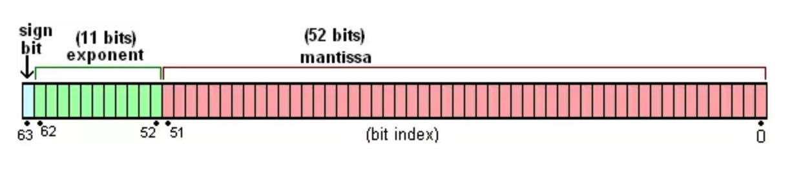

## js中有哪些数据类型
在最新的js规范中，js中基本的数据类型一共有8种：**7种基本类型和1中引用类型**

js是一种弱类型语言，变量的类型都是运行时动态赋予的，也就是说**变量是没有类型的，所有的类型都是对于值来说的。**

### 基本类型
基本类型的数据是值类型的，也就说数据是存储在**栈内存**中的，对于基本类型的比较都是**直接比较基本类型的值**。

基本类型的种类：
1. null
2. undefined
3. string
4. number
5. boolean
6. symbol（es6新增）
7. bigint（提案阶段）

### 引用类型
js中的引用类型就只有object，但是可以细分成：Date, Array, Function, Math等等。

引用类型的数据储存的位置和基本类型是有区别：**引用类型的数据可以分成指针和真实数据，指针指向真实数据所在的位置。指针存放在栈内存中，真实数据存放在堆内存中**。因为引用类型的数据结构比较复杂，占用的空间比较大，而栈内存比较小，所以不适合存放引用类型的真实数据。

### 1.null
null类型表示的是**空值**，null类型只有一个值，就是null，null既是类型也是值。

null是js中的一个关键字，而不是标识符，不可以当做变量来使用。

#### null是不是一个对象？
之所以有这个疑问是因为
```js
typeof null; //"object"
```
但是实际上这个是js存在的一个历史遗留bug，修复它会带来更多的bug。可以使用复合条件来准确检测null类型
```js
let t = null;
console.log(!t && (typeof null === "object")); //true
```

### 2.undefined
undefined类型表示的是**没有值**，undefined类型也只有一个值，就是undefined。

**undefined和null含义上有区别的**
- undefined 指的是从未赋值
- null 指的是曾赋过值，但是现在没有值

**undefined是一个标识符而不是关键字，所以 undefined 是可以被当做变量来使用的，是可以重新赋值的，但是是一种很糟糕的用法**。

**undefined是内置的标识符，它的值为undefined**。可以通过void操作符来得到该值，所以在某些情况下需要使用undefined值的时候，可以用void操作符获取。

```js
void 0 // undefined
```

### 3.string
string是一个基本类型，表现上和字符数组很像，有length，indexOf等等属性和方法。但是实际上**string并不是数组，只是类数组**

#### string类型对应的原生函数String()
原生函数的作用：
1. **类型转化**。直接使用String()可以将一个非字符串强制转化成一个字符串
```js
let a = 33;
console.log(String(a)); // "33"
```

2. **获取string类型的封装对象（装箱）**。使用new关键调用String(),可以得到对应的封装对象。事实上，length, indexOf这些属性都是绑定在封装对象上的。
```js
let a = 'xyz';
console.log(a.length); // 3
//实际上这个a.length中包含一个装箱的操作
let b = new String(a);
console.log(b.length);
b = null; //用了之后销毁
```

#### string的不可变性
string的不可变性是相对于数组来说的，指的是**字符串的成员方法不会修改原始的字符串，而是会重新创建一个新的字符串。**

### 4.number
number表示js中的数字类型，包含整数和带小数的十进制的数。js中的数字类型使用的是**IEEE754标准，采用双精度64位浮点格式**来表示数字。


**js中是不存在真正意义上的整数的，整数指的是没有小数的十进制数**。42.0就是一个整数。

**js中很大的数值会自动转化成科学计数法，实际用起来是个大坑。**
```js
9007199254740991123456 
// 9.007199254740991e+21
```

#### 4.1 number类型对应的原生函数Number()
Number()的是作用和String的作用是一样的
1. 类型转化
2. 装箱

#### 4.2 number的范围
常量 | 值 | 说明  
------- | ------- | -------  
Number.MAX_VALUE | 1.798e+308 | number类型的最大值  
Number.MIN_VALUE | 5e-324 | number类型的最小值  
Number.MAX_SAFE_INTEGER | 2^53 - 1 | number类型**整数**的最大值
Number.MIN_SAFE_INTEGER | -(2^53 - 1) | number类型**整数**的最小值

js中number类型的数据占用的是4个字节，也就是32位二进制位。所以**对于位运算来说，数字的安全范围会缩小到(-2)^31 ~ 2^31-1**，因为对于位运算来说，超过32位的数字会忽略。 

> **为什么负数会比正数多一个？**
>
> 以一个字节整数为例来分析，00000000表示的是十进制的0，但是10000000理论上表示的也是十进制的0。这样就会导致一定的空间浪费，所以将10000000用来表示最小的负数-128


#### 4.3 number类型中特殊的值

1. NaN：如果数学运算的操作数不是数字类型，就会返回一个NaN。**NaN表示一个无效数值，它不等于任何数值，包括本身。NaN是js中唯一一个不等于自身的值**
```js
let a = 2/'b';
console.log(a); // NaN
Number.isNaN(a); //true, 不要使用window.isNaN(),有缺陷
a === a; // false
Object.is(a,a); // true
```

2. Infinity: 如果数学运算的结果超出number的范围，就会返回+Infinity或者-Infinity。
```js
1/0; // +Infinity
-1/0; // -Infinity
```

3. +0和-0：和常规的数学思维不一样，js中存在两个零值，+0和-0。比如在某一些场景中，需要符号来表示方向，所以-0和0在这种场景下是有区别的。
```js
+0 === -0 ;// true
+0 == -0; // true
Object.is(+0,-0); //false 这个方法会区别符号
```

#### 4.4 window.isNaN和Number.isNaN
这两个方法都是用来判断一个值是不是NaN，但是使用window.isNaN是有缺陷的，不是number类型的值也会返回true。
```js
let a = NaN;
let b = 12;
let c = 'wo';

window.isNaN(a); //true
window.isNaN(b); //false
window.isNaN(c); //true 很有问题

Number.isNaN(a); //true
Number.isNaN(b); //false
Number.isNaN(c); //false 没有问题
```
es6之前的polyfill:
```js
if(!Number.isNaN){
  Number.isNaN = function(n){
    return typeof n === number && window.isNaN(n);
  }
}

//或者更简单的用法
if(!Number.isNaN){
  Number.isNaN = function(n){
    return n !== n;
  }
}
```

#### 4.5 为什么0.1 + 0.2 !== 0.3
因为js是采用双精度浮点数来表示数值，所以有一些数字无法做到完全精确表示。所以就会产生一定的偏差。
```js
0.1 + 0.2  // 0.30000000000000004 不是0.3
```
但是这种精度误差在js上是可以接受的，**在比较很小的值的大小的时候，可以考虑将误差范围考虑进去**。这个精度值是 2^-52，保存在Number.EPSILON中。
```js
// 在误差范围内，比较0.1+0.2 和 0.3
function equal(a,b){
  return Math.abs(a-b) < Number.EPSILON;
}

equal(0.1+0.2,0.3);  // true
```

> 详细的原因可以看[这里](https://segmentfault.com/a/1190000012175422)

### 5.bigint

**由于number类型能表示的数字范围有限，超出范围的值可能会失去精度，出现异常的值**。
```js
Number.MAX_SAFE_INTEGER // 9007199254740991
Number.MAX_SAFE_INTEGER + 10 //9007199254741000
Number.MAX_SAFE_INTEGER + 1 === Number.MAX_SAFE_INTEGER + 2 // true
```
所以为了解决这些问题，在最新的js提案中，提出了bigint这种类型来表示大于2^53-1的整数。**bigint类型可以表示任意大的整数**

#### 5.1 bigint的创建形式
1. 字面量方法：普通的数字后面加一个n就是bigint类型的数字
```js
let n = 10n;
typeof n; //bigint
```

2. 使用对应的原生函数：BigInt(),BigInt()的作用和Number()是一样的
```js
let n = 10;
let m = BigInt(n); //10n
```

#### 5.2 bigint使用起来需要注意的点
1. **bigint类型的数据不能和number类型的数据做数学运算，但是可以比较大小，中间有一个隐式转化的过程**
```js
20n/10n  //2n
20n/2  //Uncaught TypeError: Cannot mix BigInt and other types, use explicit conversions
20n < 30 //true
20n === 20 //false 类型不同
20n == 20 //true
```

2. 除一元加号(+)运算符外，所有算术运算符都可用于bigint
```js
10n + 20n;    // → 30n
10n - 20n;    // → -10n
+10n;         // → TypeError: Cannot convert a BigInt value to a number
-10n;         // → -10n
10n * 20n;    // → 200n
20n / 10n;    // → 2n
23n % 10n;    // → 3n
10n ** 3n;    // → 1000n
const x = 10n;
++x;          // → 11n
--x;          // → 9n
```

3. 对于bigint类型的数据，不能使用Math对象中的方法
4. bigint和number之间相互转化的时候可能会丢失精度，所以建议是超出number范围之后再使用bigint


### 6.boolean
js中使用boolean类型来表示逻辑上的真假。boolean类型只有两个值：true 和 false

#### boolean对应的原生函数Boolean()
1. 强制类型转化
2. 装箱

### 7.symbol
symbol类型是es6新增的基本类型，用来表示一个**唯一**的数据，这个数据只与本身相等。

#### 7.1 symbol数据的创建
**创建symbol类型的数据只有一种方式，使用Symbol来创建。**

**Symbol()方法和其他原生函数不同的是，这个函数不能使用new来操作，也就是说Symbol()不能做为构造函数使用。**

#### 7.2 使用场景
symbol常用来设置对象中独一无二的属性名。常见的有[Symbol.hasInstance], [Symbol.iterator]等

当其他对象使用instanceof运算符，判断是否为该对象的实例时，会调用[Symbol.hasInstance]方法。比如，foo instanceof Foo在语言内部，实际调用的是Foo[Symbol.hasInstance] (foo)。

### 8.object
js中object是一个很大的课题，放在下一节单独来讲。

### 参考
1. [JS最新基本数据类型：BigInt](https://juejin.im/post/5d3f8402f265da039e129574)
2. [MDN](https://developer.mozilla.org/zh-CN/docs/Web/JavaScript/Reference/Global_Objects/BigInt)


