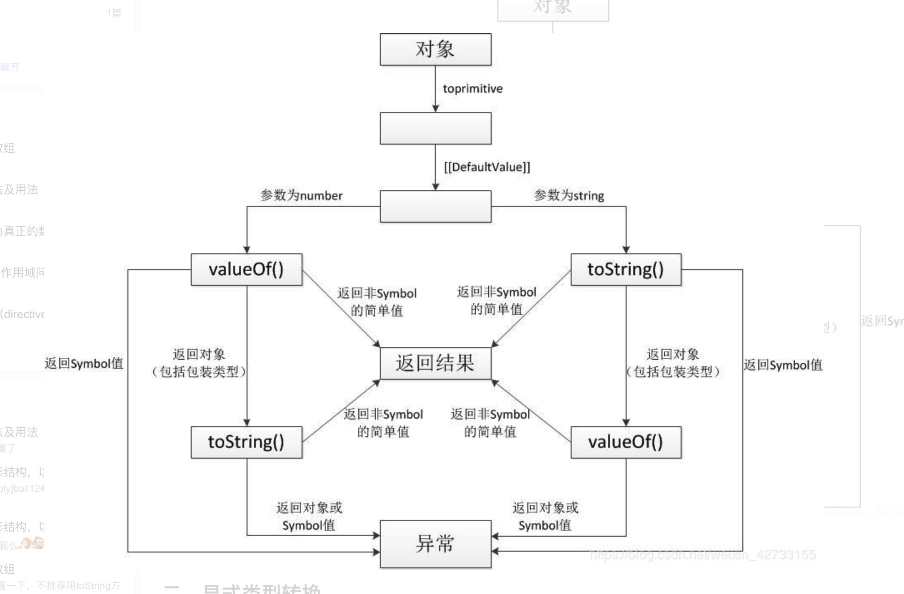

# JS类型转换
类型转换指的是将一个值从某一个类型变成另一个类型的过程。

类型转换分成**隐式转换**和**显式转换**。但是显示转换和隐式转换是一个认为定义的概念

## 1.抽象操作
js标准中定义了一些**抽象操作**（内部使用的操作）和**转换规则**用来处理类型转化。主要介绍ToString, ToNumber, ToBoolean, Toprimitive

### 1.1 ToPrimitive
用来处理**对象类型**到**基本类型**之间的转化。

#### 1.1.1 Symbol.toPrimitive
Symbol.toPrimitive是一个内置的symbol值，用来作为对象的函数值属性，**当一个对象转化成一个基本类型的时候，会调用这个函数。**

Symbol.toPrimitive对应的值的形式是：function(hint){}。
- hint参数表示转换的期望类型，取值有string, number, default

#### 1.1.2 ToPrimitive操作的规则
对于**基本类型来说，直接返回原来的值**。
对于**对象类型**来说：
1. 如果对象中**存在Symbol.toPrimitive**方法，就直接执行该方法。
2. 如果对象中没有定义这个方法，会默认去调用内置的**[[DefaultValue]] (hint)**方法
  - 如果传入的hint是string，就执行toString()方法，如果返回值是基本类型就直接返回；如果没有toString()方法或者toString()返回的不是基本类型，就继续执行valueOf()方法
    - 如果valueOf()返回的是基本类型，就直接放回。否则就抛出错误。
  - 如果传入的hint值是number，就会先执行valueOf()方法，如果返回值是基本类型就直接返回；如果没有valueOf()方法或者valueOf()返回的不是基本类型，就继续执行toString()方法
    - 如果toString()返回的是基本类型，就直接放回。否则就抛出错误。
  - 当hint的值是default的时候，对于普通对象，默认用hint为number的规则执行。对于Date类型的对象，则使用hint为string的规则执行。

看图说话：


#### 1.1.3 如何确定hint
虽然[Symbol.toPrimitive] (hint)和[[DefaultValue]] (hint)方法都有hint这个参数，但是使用者并不能直接调用这两个方法，所以**hint参数的取值并不是使用者主动传进去的，而是js引擎根据运算场景来判断当前hint取哪个值**。

可以使用Symbol.toPrimitive来证明这一点
```js
var obj={
  [Symbol.toPrimitive]:function(hint){
    console.log('hint is '+hint);
  }
}

alert(obj) //hint is string  alert只能接受string类型的参数

+ obj //hint is number 一元运算符+会将非number转化成number

obj + '' //hint is default  这里obj无论转换成string还是number，都可以参与计算
```  

#### 1.1.4 验证ToPrimitive的规则
```js
// 1.有Symbol.toPrimitive时
var obj={
  [Symbol.toPrimitive]:function(hint){
    return 'ok';
  },
  valueOf:function(){
    return 1;
  }
}
+obj //NaN
obj + '' //ok

// 2.当hint为string
var obj={
  valueOf:function(){
    return 1;
  },
  toString:function(){
    return '123';
  },
}
alert(obj); // 1
obj + ''; // 123
+obj //1

//3.当valueOf返回值不是基本类型
var obj={
  valueOf:function(){
    return {};
  },
  toString:function(){
    return '123';
  },
}
+obj //123
alert(obj) //123

//4.返回值是对象类型或者symbol类型报错
var obj={
  valueOf:function(){
    return {};
  },
  toString:function(){
    return Symbol(12);
  },
}
+obj //Uncaught TypeError
obj + '' //Uncaught TypeError
```  

### 1.2 ToString
用来处理非字符串到字符串之间的转化。

#### 1.2.1 ToString的规则
args type | result 
------- | ------- 
null | 'null' 
undefined | 'undefined'
boolean | true -> 'true',false -> 'false'
number | 通用规则，对于极大值和极小值要注意，会转化成**科学计数法** 
object | 1.**先使用ToPrimitive转成基本类型**。2.**然后将基本类型转化成string**

对于普通对象，本身没有toString和valueOf方法，转化成字符串的时候会先调用原型链上的toString的方法，返回[object Object]

如果对象本身实现了toString方法，转化成字符串的时候会调用这个方法。


### 1.3 ToNumber
用来处理非数字类型到数字类型之间的转化。

#### 1.3.1 ToNumber的规则
args type | result 
------- | ------- 
null | 0 
undefined | NaN
boolean | true -> 1,false -> 0
string | 使用Number()强制转换成number，转换失败返回NaN
symbol | Uncaught TypeError
object | 1.**先使用ToPrimitive转成基本类型**。2.**然后将基本类型转化成number**

### 1.4 ToBoolean
用来处理非数字类型到数字类型之间的转化。

#### 1.4.1 ToBoolean的规则
args type | result 
------- | ------- 
null | false 
undefined | false
number | +0,-0,NaN为false,其余都是true
string | ''为false，其余都是true
symbol | true
object | true

#### 1.4.2 假值 vs 真值
**所有的数据不是真值就是假值。**

假值：
1. null
2. undefined
3. false
4. ''
5. NaN, +0, -0

真值：假值除外的值都是真值


## 2.显式类型转换
显示类型转换是指代码中明确写出来的转换。

**通过调用每个类型的内置构造函数，可以强制转化成相应的类型。**比如String(), Number()
```js
String(123) //'123'

Number('123') //123

Boolean(123) //true

Symbol(123) //symbol类型的值

BigInt('123') //123n

Object(123) //Number {123}
```  
除了每个类型对应的原生构造函数之后，还有其他的强制类型转化的方式

### 2.1 显式转换成string类型的方法
1. 调用toString()方法
```js
(1).toString()  //'1' 其中包含一个隐式的装箱
(true).toString() //'true'
```  

### 2.2 显式转换成number类型的方法
1. 一元运算符+
```js
 + '123' //123
 + '123b' //NaN
 + {a:1} //NaN
```  

2. 使用parseInt()和parseFloat(),将字符串转化成数字
```js
parseInt('123') //123
parseInt('123ff') // 123
parseInt('123.44') //123
```  

3. 使用~~操作符，但是**只取整数部分**
```js
~~('123')  //123
~~('1.99')  //1
```  

#### 2.2.1 parseInt() VS Number()
1. parseInt()可以转换**非纯数字**字符串，但是Number只能转换**纯数字**字符串
```js
parseInt('12.45') //12
Number('12.45') //NaN
```  

2. **parseInt()是针对字符串的方法，如果要强行传非字符串的参数进去，函数内部会先将参数转换成string，然后才开始解析**。而且可能会产生意想不到的结果。
```js
parseInt(1/0,19); //18
因为会先转换成string，所以变成
parseInt('Infinity',19);
这个字符i刚好是19进制里面最后一个字母，所以相当于
parseInt('I',19); //18
```  

### 2.3 显式转换成boolean的方法
1. 一元运算符 ! ，但是会包含一个取反的过程中
```js
!1 //false
!'' //true
```  

2. 一元运算符 !!
```js
!!1  //true
!!'' //false
```  

## 3.隐式类型转换
在某些特殊的场景中，在运算符的背后，包含一些隐式的类型转换。

### 3.1 隐式转换成string
**如果二元操作符 + 的左右操作数（转换成基本类型）中有一个是字符串，那么就进行字符串拼接操作。否则就是进行数字加法操作。**
```js
1 + ''  //'1'
'' + {} //'[object Object]'
```  

#### 3.1.1 为什么{}+[]和[]+{}的结果不一样？
```js
{} + []  //0

[] + {}  //'[object Object]'
``` 
分析：
- 如果{}在前面，那么会被认为是**区块语句**，而不是空对象。所以{} + []变成了 +[],从而得到0
- 如果{}在后面，那么会被认为是**空对象**，执行+操作，从而得到'[object Object]'


### 3.2 布尔值隐式转化成number
当+运算符两边的操作数没有字符串的时候，就会进行数字加法操作。两边的基本类型的数据会先转化成number
```js
true + true // 2
true + false // 1
```  

### 3.2 隐式转换成boolean值
在条件判断语句中，随处可见隐式准换成boolean类型的例子。
```js
if(1){console.log('true')}  //1 -> true

1 ? 2 : 3  //1 -> true

while(1){}  // 1->true

1 && 2 // 1->true

0 || 1 // 0 -> false
```  
这里重点讲一下逻辑运算符&&, ||

#### 3.2.1 逻辑运算符 && 和 || 
1. **逻辑运算符返回的是不一定是boolean值，而是两个操作数中的一个**。
2. 对于&&，**只要左边操作数是假值**，就不需要计算右边的值了，直接返回左边操作数；**如果左边是真值**，则返回右边操作数
3. 对于||，**只要左边操作数是真值**，就不需要计算右边的值了，直接返回左边操作数；**如果左边是假值**，则返回右边操作数

```js
11 && 22  // 22

11 || 22  // 11

0 && 1 //0
1 && 0 //1

1 || 23 // 1
1 || 0 //1
0 || 1 //1
```  

### 3.3 Symbol类的转换
1. Symbol类型不能转化成number类型
```js
+Symbol(1)  //Uncaught TypeError
Number(Symbol(1)) //Uncaught TypeError
```  

2. Symbol类型**可以显式转换成string，但是不能隐式转换成string**
```js
String(Symbol(1))  // 'Symbol(1)'
Symbol(1)+''  //Uncaught TypeError
```  

3. Symbol类型可以转换成boolean，都是true


## 4.装箱和拆箱
1. 装箱指的是基本类型转化成对象类型的过程。
```js
var a = '123';
a.length //3
这里就有一个隐式装箱的过程，因为a是字符串，是没有属性的。所以这里会先将a转换成相应的封装对象
然后通过这个对象调用length属性
```  

2. 拆箱指的是对象类型转换成基本类型的过程，也就是ToPrimitive操作。
```js
[] + 2  //'2'
这里hint是default，[]会先调用valueOf，再调用toString(),得到''
```  

## 参考文章
1. [深入理解Javascript中Object类型的转换](https://zhuanlan.zhihu.com/p/29730094)
2. [JavaScript 对象转换到基本类型值算法 ToPrimitive](https://juejin.im/post/5a695ec16fb9a01ca10b195b)
3. [js显式类型转换、隐式类型转换及相关==操作符的总结（一）](https://blog.csdn.net/weixin_42733155/article/details/85879624)


