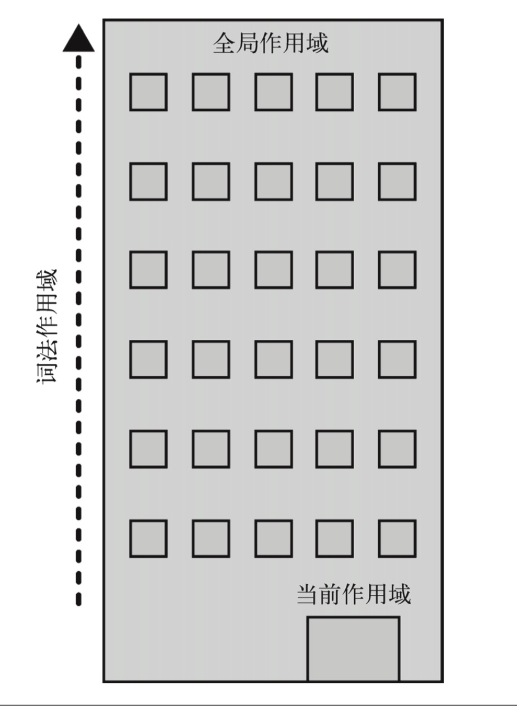

## 编译器、JS引擎和作用域之间有什么关系？
事实上，js也是一门**编译语言**，**js代码在执行之前也需要先通过编译，变成可执行的代码之后才能被JS引擎执行。**

在js代码执行的过程中，离不开编译器、JS引擎和作用域的作用。

### 1.编译器
编译器负责对js代码进行编译，变成可执行的代码结构。

整个编译的过程大概可以分成三个阶段：**词法分析、语法分析和代码生成**。

#### 1.1 词法分析(Lexing)
词法分析的过程主要是**将代码字符串分解成有意义的代码块**，这些代码块被称为是**词法单元（Token）**。比如代码
```js
var a = 2;
```
这行代码经过词法分析之后会变成：var、a、=、2、;这些词法单元。

**在这个过程中，还会创建一个词法作用域，用来存放当前作用域中定义的变量和函数以及一个指向上层作用域的指针。也就是说变量的定义在词法分析的时候就完成了，词法作用域是在编译期就产生的，而且是通过静态分析产生的。**

> **补充说明！！！**：
>
> 这里所说的创建词法作用域其实是不准确的，词法作用域是一个抽象的概念，具体是实现是通过创建执行上下文来实现的。后面两篇文章中有详细分析
>
> 这里的词法作用域可以理解成一个抽象概念


#### 1.2 语法分析(Parsing)

这个过程主要是将词法分析产生的**词法单元流(数组)**转换成一个由元素逐级嵌套所组成的代表了**程序语法结构的树**。这个树就是**抽象语法树（AST）**。

#### 1.3 代码生成
将AST转化成可执行代码的过程就是代码生成的过程。

### 2.JS引擎
**JS引擎负责的是js代码的编译和执行。不负责js代码的调度，js代码的调度过程是由其宿主环境完成的。**（事件调度）

#### 2.1 引擎查找变量的方式
引擎在执行代码的时候，会去作用域中查找对应的变量。引擎查找变量的方式有两种：**LHS和RHS**。
1. LHS（左查询）：表示的是赋值操作中，对于**=号左边变量的查询**
2. RHS（右查询）：**非左查询的变量用的就是右查询**。

#### 2.2 查询的异常情况
1. 对于RHS，如果没有找到某个变量，引擎就会抛ReferenceError异常。
2. 对于LHS，在**非严格模式**下，如果LHS没有查找到某个变量，在**全局作用域**中就会创建一个该变量，并且返回给引擎使用。但是在严格模式下，这种情况也会抛出`ReferenceError`异常。

```js
function foo(){
  a=1;
}
foo();
window.a //1

//严格模式
function foo(){
  "use strict";
  a=1;
}
foo(); //ReferenceError
```

这也是js被人诟病的一种经典情况。

### 3.作用域和作用域链
**在js中，作用域定义了一套引擎如何根据标识符名称来查找变量的规则**。

js中的作用域分为**词法作用域**和**动态作用域**。动态作用域使用起来有很大的弊端，所以不推荐使用。现在所说的作用域，基本上都是词法作用域。

词法作用域是在编译器词法分析期间生成的，**存放了标识符和变量地址之间的映射关系**。

#### 3.1 作用域链
在实际的代码中，多个作用域之间通常是嵌套在一起使用的。当在某个作用域中没有找到某个变量的时候，引擎会继续查找上层的作用域。由此可见，**作用域中除了存储变量和函数声明之外，还存储了一个指向上层作用域的指针。**

作用域链关系图：

就像是坐电梯一样，如果在当前层找不到，就去上层找，一直找到顶层。

#### 3.2 作用域查找规则
**引擎从当前的执行作用域开始查找变量，如果找不到， 就向上一级继续查找。当抵达最外层的全局作用域时，无论找到还是没找到，查找过程都 会停止。**


### 4. 编译器、引擎和作用域之间的合作细节
以下面这段代码为例分析：
```js
var a = 2;
```
这段代码看起来简单，但是其中却包含了两个操作，一个是var a，第二个是 a=2。
1. 首先是**编译器在编译代码的时候遇到var a，编译器就问作用域是否已经存在一个相同名称的变量在当前作用域中**，如果存在则直接**忽略**这个声明(**对于var; let会报错**)，如果是**函数声明则覆盖**；如果不存在的话，它会在当前作用域中命名一个a变量。
2. 然后当编译完成之后，引擎执行该代码。也就是说**引擎会执行a =2，引擎会先问当前作用域中是否存在一个标识为a的变量**，如果存在就直接使用这个变量，并且赋值为2；否则就继续向上层作用域查找，直到找到最外层作用域为止。

总结：**变量的赋值操作会执行两个动作，首先编译器会在当前作用域中声明一个变量(如果之前没有声明过)，然后在运行时JS引擎会在作用域中查找该变量，如果能够找到就会对它赋值。**

从中可以看出，**变量提升的根本原因就是由于在代码执行之前，编译器就已经将所有的变量在当前作用域中定义好了，而且var定义的变量初始化为undefined,所以才可以在变量声明语句之前访问当前变量**。至于let为什么不能访问，那是因为有暂时性死区，后面有专门文章解释

```js
console.log(a); //undefined
var a = 2;
//类比于
var a = undefined;
console.log(a);
a = 2;

//let 
console.log(b); //ReferenceError: Cannot access 'b' before initialization
let b = 2;
```


