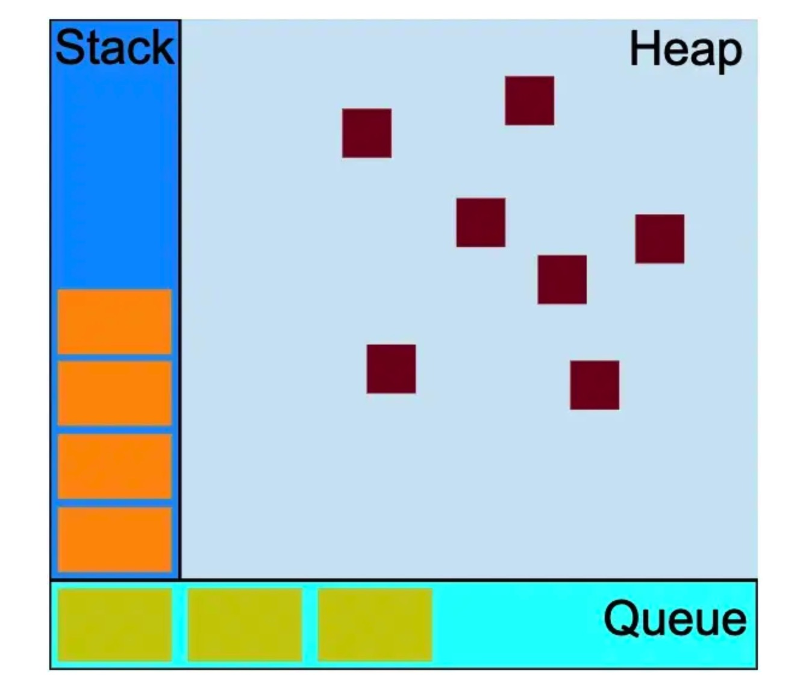
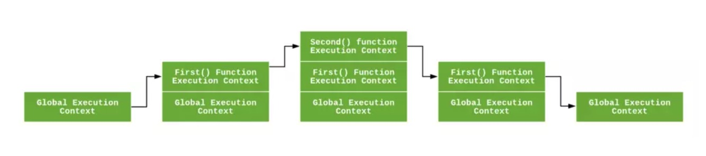
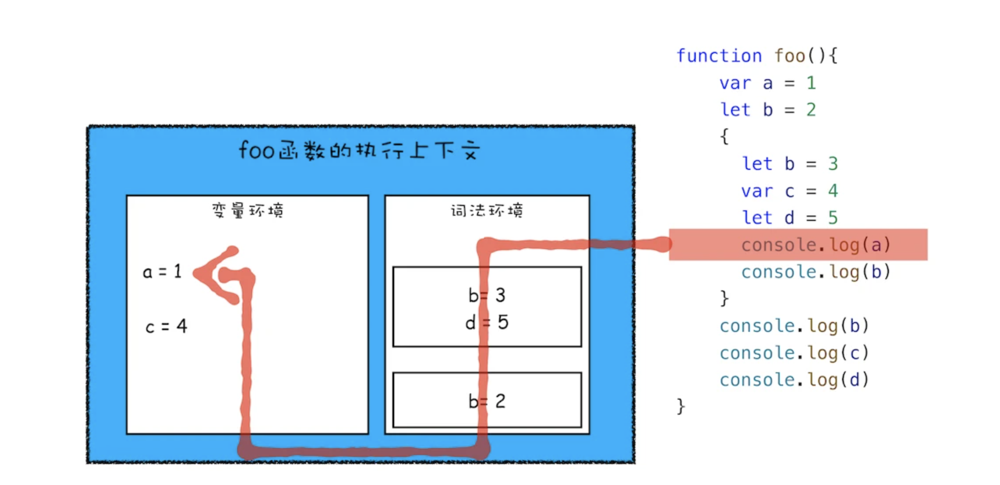
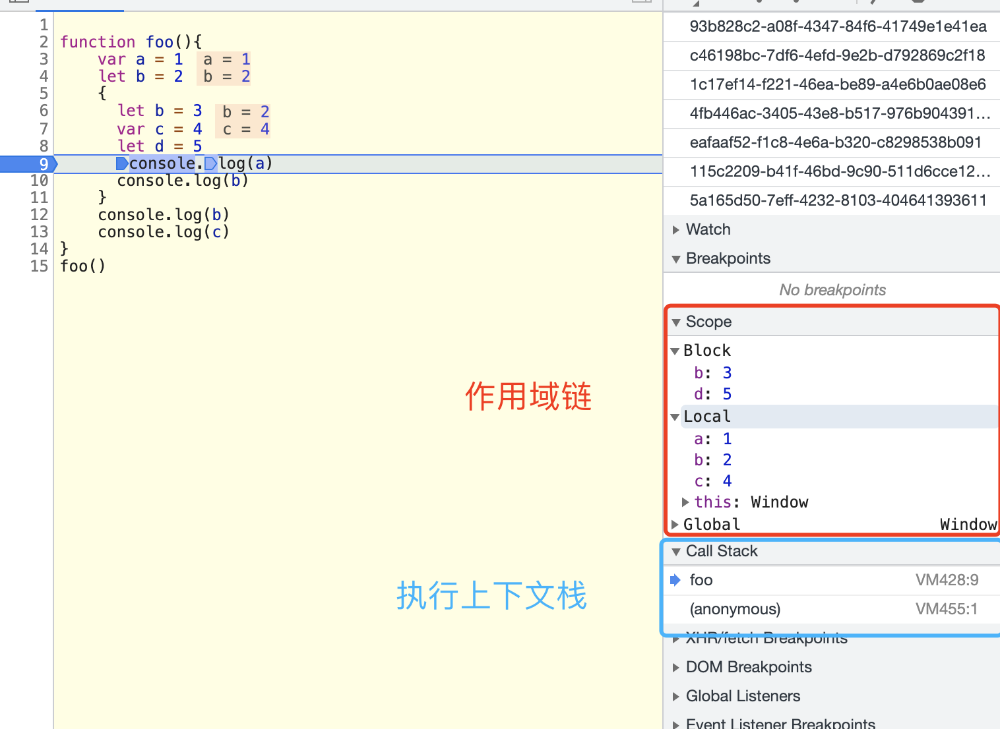

# 执行栈和执行上下文
前面一篇文章中我们分析了词法作用域和作用域链，**如果说词法作用域和作用域链是对代码执行规范的抽象，那么执行上下文就是对这个规范的具体实现**。

一段代码的执行会经过两个阶段：

1. 编译阶段：编译器会先对其进行编译，编译执行会生成**执行上下文**和**可执行代码**
2. 执行阶段：JS引擎根据执行上下文来运行可执行代码

> 编译器是JS引擎的一部分，这里是为了好理解才分开

**执行上下文就是执行一段JS代码的运行环境**


## 1. 执行上下文的种类
在JS中存在三种执行上下文：
1. **全局执行上下文**：任何不在函数内的代码，都是在全局执行上下文环境中执行的。全局上下文中会创建一个window(浏览器)对象，并且使this指定这个对象。**一个程序中只有一个全局执行上下文对象，而且会一直存在，直到窗口关闭。**
2. **eval函数执行上下文**：执行eval代码的时候也会动态生成一个执行上下文，类似于函数执行上下文，但是eval不推荐使用。
3. **function函数执行上下文**

JS引擎执行函数之前，先需要对这个函数进行编译，创建对应的执行上下文对象。


## 2.执行栈
执行栈又称“调用栈”，**用来存储代码执行过程中创建的所有执行上下文对象**。是一种“先进后出（LIFO）”的栈结构。

之前说过，**基本类型的数据存储在栈内存中，这里的栈就是指的执行栈。执行上下文中的基本类型变量就是存储在执行栈中。对象类型的变量存储在堆内存中。**

这里的queue指的是事件队列，会在event loop中讲解。

### 2.1 执行上下文在执行栈中如何存储
1. 当js引擎开始执行代码的时候，首先会创建一个全局执行上下文，并且压入执行栈中。
2. 每当执行一个函数调用之前，js引擎会为当前函数创建一个新的执行上下文，压入执行栈中。
3. js引擎会**执行位于栈顶的执行上下文所对应的函数或者全局代码，当这部分代码执行完之后，这个执行上下文从栈中弹出销毁**，然后继续执行下一个位于栈顶的执行上下文对应的代码，如此循环，直到代码执行完。

> **注意**：
> 全局执行上下文并不会在程序执行完成之后销毁，而是在浏览器窗口关闭的时候销毁。

看图理解：


```js
let a = 'Hello World!';

function first() {
  console.log('Inside first function');
  second();
  console.log('Again inside first function');
}

function second() {
  console.log('Inside second function');
}

first();
console.log('Inside Global Execution Context');
```


## 3. 执行上下文的组成

**执行上下文的组成**：

1. **this值**
2. **词法环境**
3. **变量环境**

用代码类比为：
```js
ExecutionContext={
  ThisBound: <this value>,
  LexicalEnvironment: {...},
  VariableEnvironment: {...}
}
```


### 3.1 this绑定
**全局执行上下文中，this指向window（浏览器），在函数执行上下文中，this指向的值取决于函数如何被调用。**

this绑定是一个大的课题，这里暂时不展开讲，后面会有文章单独来讲。

**由于this是跟随的执行上下文生成的，而执行上下文也是代码执行之前动态生成的，所以也就可以证明this绑定也是动态绑定的。**


### 3.2 词法环境

词法环境是一个持有**标识符-变量映射关系**的结构。**标识符**指的是变量或者函数的名字，**变量**指的是基本类型数据或者实际对象的引用。

**词法环境中记录的是执行上下文中使用 `let/const` 定义的变量和函数**

#### 3.2.1 词法环境的组成
1. 环境记录器**`EnvironmentRecord`**：**存储变量和函数声明的实际位置**。
2. 外部环境引用**`outer`**：指向**父级词法环境的指针（作用域链的实现基础）**，说明它可以访问父级词法环境

环境记录器也有两种类型：

1. 声明式环境记录器：存储变量、函数和参数。**函数执行上下文中，使用的就是声明式环境记录器**
2. 对象环境记录器：定义出现在**全局上下文**中的变量和函数的关系。**全局执行上下文中，使用的是对象环境记录器。**

**在函数执行上下文中，环境记录器还会存储一个传递给函数的`arguments`对象**


#### 3.2.2 词法环境的种类

词法环境有两种类型：

1. 全局词法环境：在全局执行上下文中，**没有外部环境引用的词法环境**，外部环境引用是null。环境记录器中存储的是全局对象window（浏览器）。
2. 函数词法环境：在函数执行上下文中，**函数中定义的变量和内部函数声明都存储在词法记录器中，外部环境引用包括此函数的外部作用域**。


#### 3.2.3 环境记录器的数据结构

在词法环境中，环境记录器是一个栈的数据结构。**栈底对应的是保存函数作用域信息的对象，当执行到一个块作用域时，会将保存块作用域信息的对象推到栈顶，当代码块执行完成之后，该作用域的信息对象会从栈顶弹出**。

> 环境记录器是一个栈的数据结构 —— 这里是笔者的猜测，这个栈结构不一定是环境记录器，但是不影响理解


#### 3.2.4 词法环境的抽象伪代码表示
```js
// 全局执行上下文
GlobalExecutionContext={
  LexicalEnvironment: {
    EnvironmentRecord:{
      type:'Object',
      ...//标识符-变量映射关系
    },
    outer：<null>
  }
}

FunctionExecutionContext={
  LexicalEnvironment: {
    EnvironmentRecord: {
      type:'Declarative',
      ... //标识符-变量映射关系
    },
    outer: <Global or outer scope reference>
  }
}
```


### 3.3 变量环境

**变量环境也是一个词法环境，它有着上面词法环境拥有的所有属性。**

在ES6中，变量环境和词法环境唯一的不同在于分工不同：**变量环境只用来存储使用var定义的变量**。

> 执行上下文中之所以要区分变量环境和词法环境，就是为了向下兼容，支持var和function关键字的**变量提升**特性


### 3.4 执行上下文的抽象代码结构
```js
let a = 20;
const b = 30;
var c;

function multiply(e, f) {
 var g = 20;
 return e * f * g;
}

c = multiply(20, 30);
```
这段代码的执行上下文如下：
```js
GlobalExecutionContext={
  ThisBound:<Global Object>,
  LexicalEnvironment: {
    EnvironmentRecord:{
      a: < uninitialized >,
      b: < uninitialized >,  //未初始化
      multiply: <function>
    },
    outer:<null>
  },
  VariableEnvironment:{
    EnvironmentRecord:{
      c: undefined  // 已经初始化
    },
    outer: <null>
  }
}

FunctionExecutionContext={
  ThisBound：<Global Object>,
  LexicalEnvironment: {
    EnvironmentRecord:{
      Arguments: {0: 20, 1: 30, length: 2}
    },
    outer:<GlobalLexicalEnvironment>
  },
  VariableEnvironment:{
    EnvironmentRecord:{
      e:undefined,
      f:undefined, //形参变量是使用var定义的
      g:undefined
    },
    outer: <GlobalVariableEnvironment>
  }
}
```
总结一些关键点：
2. **执行上下文中的词法环境和变量环境可以看做是对于词法作用域的具体实现**，块级作用域没有独立的执行上下文，其内部的信息对象属于词法环境的一个部分。**对于var变量来说，不存在块级作用域，对应变量环境中的环境记录器也没有多层级**。
2. **执行上下文中词法环境和变量环境中都有一个指向外层执行上下文的指针`outer`，是作用域链的具体实现**。
3. let、const定义的变量，在代码执行之前**没有进行初始化操作，只是声明了这个变量**，所以在初始化之前无法访问（暂时性死区）。
4. var定义的变量，在**代码执行之前经过了声明和初始化的过程（创建执行上下文的时候）**，所以在书写上可以先访问后声明，也就是常说的**变量声明提前**。


### 3.5 执行上下文中变量的查找顺序

变量的查找顺序：

1. 查找当前执行上下文的词法环境，从栈顶开始查找
2. 查找当前执行上下文的变量环境
3. 查找父级执行上下文，重复整个过程，直到找到对应的变量或者查找顶层执行上下文

如下图所示：




## 4. 执行上下文的调试技巧

可以借助Chrome开发者工具来分析代码的执行上下文和作用域链

```js
function foo(){
    var a = 1
    let b = 2
    {
      let b = 3
      var c = 4
      let d = 5
      console.log(a)
      console.log(b)
    }
    console.log(b) 
    console.log(c)
}   
foo()
```

对应的调试情况：



> 注意：
>
> 这里Scope中的作用域并不完全等同于词法作用域，有些作用域中含有this。但是在层级结构上和和词法作用域基本是一致的


## 参考文章

1. [浏览器工作原理与实践-李兵老师](https://time.geekbang.org/column/article/127495)
2. [理解 JavaScript 中的执行上下文和执行栈](https://juejin.im/post/5ba32171f265da0ab719a6d7#heading-4)
3. [解密 JavaScript 执行上下文](https://juejin.im/post/5cda8c8051882569223af63d)

