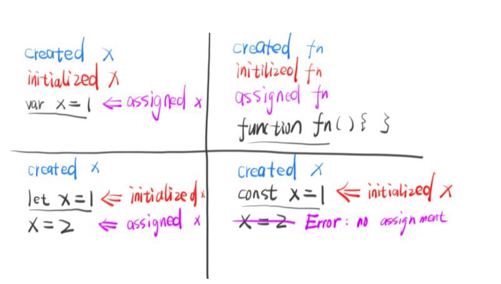

## 变量声明提升的原理是什么？
### 1.变量声明提升现象
```js
//例子一
console.log(a); // undefined
var a = 2;

//例子二
a = 2;
var a;
console.log(a); // 2

//例子三
foo(); // 'ok'
function foo(){
  console.log('ok');
}
```
例子中可知，如果按照常规的理解，代码是一行一行顺序往下执行的，变量在没有声明之前是不可以访问的。

但是例子中表明，**在变量声明之前是可以访问和赋值变量的，这就是变量提升的现象。**


### 2.变量提升现象产生的条件

并不是所有的变量定义都会产生声明提前的情况。
```js
console.log(a); // ReferenceError: Cannot access 'a' before initialization
let a = 2;

console.log(b); // ReferenceError: Cannot access 'a' before initialization
const b = 23;
```
由此可见，**使用let和const定义变量的时候，变量看起来是没有发生声明提升的情况的。但是let和const定义的变量真的没有声明提升吗？**

**使用var定义变量和函数声明的时候，会发生声明提升的情况。**

> 函数声明指的就是使用function来定义函数


### 3.变量声明提升的原理

之前的文章中其实已经提到了，**在js代码编译的时候，js引擎会创建对应的执行上下文，然后将变量和函数声明（创建create）完成之后存放在对应的词法环境或者变量环境中**。然后在代码执行的时候，需要用到某个变量，就根据标识符去执行上下文中寻找该变量进行操作。

也就是说**所有的变量和函数的声明操作在代码执行之前就已经完成并且保存在对应的执行上下文中了，代码执行的时候就可以直接访问。看起来就像是将所有的声明语句都提升到了当前作用域的最前面**。

而且**对于用 var 定义的变量和函数声明，在声明的过程中，同时也进行的初始化操作，变量初始化成了undefined，函数变量初始化成了这个函数本身。**


### 4.let定义的变量真的没有声明提升吗？
这个问题在很长一段时间里我都认为是正确的，但是笔者现在认为另一种思路才是正确的。也就是说**let定义的变量也是存在声明提升的**。
1. 证据一：**变量提升的原因是因为编译器在编译期间就已经声明了所有的变量和函数声明，当然let定义的变量也会被扫描进去，所以也就会提前声明**。
2. 证据二：
```js
var x = 'global';
{
    console.log(x); // ReferenceError: Cannot access 'x' before initialization
    let x = 'inner';
}
如果块作用域中x没有声明提升，也就是说当前块作用域中没有x这个变量，
那应该向上查找的得到外面这x变量的值，也就是'global'
但是结果仍然是报错，也就是说当前块作用域中是有x这个变量的，只是不能访问。
```

#### 4.1 变量定义过程的重新理解
变量定义的过程：
1. **变量创建（声明）**：create，指的是在内存中为变量开辟一个空间
2. **变量初始化**：initialize
3. **变量赋值**：assign

**变量经过初始化之后才能被使用，否则会报错。**

##### 4.1.1 对于var定义的变量来说
```js
var a = 2;

可以拆分成
var a;
a = 2;

但是实际上是：
var a; //create
a = undefined; //initialize

a = 2; //assign
```
由此可知，**对于var定义的变量来说，变量提升指的是变量的创建和初始化过程都被提升了**，所以才可以出现提升之后的现象。

##### 4.1.2 对于let定义的变量来说
变量的提升也是存在的，只是**let变量提升的是变量的创建，变量的初始化过程没有提升，所以才会出现暂时性死区，无法在声明语句之前访问变量**。
```js
let a = 2;

可以拆分成：
let a; //create
a = 2; //initialize 

let b ;

可以拆分成：
let b; //create
b = undefined; //initialize  初始化过程没有被提升
```
所以说，**暂时性死区出现的根本原因是变量只经过的创建，还没有初始化，所以无法访问变量**。

##### 4.1.3 对于const定义的变量来说
**因为const定义的变量是不可以修改的，所以const定义的变量只有create和initialize的过程，没有assign过程。**

也就是说const定义的变量只能初始化的时候赋值，不会有其他的赋值操作。

一张图来解释这几种现象：



### 5.声明提升的优先级

变量声明和函数声明都可以提升，当两者同时存在的时候，函数声明提升的优先级更高。

#### 5.1  函数声明提升 > 变量声明提升

先来看一个例子：

```js
console.log(add);
function add (){
  console.log('add');
}

var add = 123;

console.log(add);

// [Function]
// 123
```

上面的例子中，如果函数声明提升和变量声明提升的优先级是一样的，也就是说后面声明的会覆盖前面声明的，这种情况下输出的结果应该是：

```js
// undefined
// 123
```

所以说，函数的声明提升优先级要大于变量声明提升。

其中的原理在之前的文章中有介绍过，JS引擎在编译代码的时候，对于变量声明和函数声明的处理规则是不一样的：

**假设变量或函数的标识符是A**

- 对于**变量声明 A **来说，如果当前执行上下文的变量环境中已经存在了标识符A，那么JS引擎会直接**忽略**这个变量声明，不会执行声明和初始化操作。
- 对于**函数声明 A **来说，如果当前执行上下文的变量环境中已经存在了标识符A，那么JS引擎会**覆盖**之前的声明，重新执行声明和初始化操作。

所以说不管函数声明在代码中的位置如何，它的声明提升的优先级要大于变量声明提升。


#### 5.2 块作用域和函数声明
- 在ES6之前，js的规范规定不能在块中定义函数声明，那时候还不还没有块作用域。但是浏览器并没有遵守这个规定，可以在块中定义函数声明。
- 但是在es6之后，**js规范规定的是可以在块作用域中声明函数，作用类似于let**，只能在当前作用域使用。

```js
console.log(foo);  //undefined
if(true){
  function foo(){
    console.log('ok');
  }
}
foo();  //'ok'
```
但是从代码的运行结果可以看出，js浏览器为了兼容以前的旧代码，在实现上还是和js规范有很大的出入。
1. 允许在块级作用域内声明函数
2. **块作用域内的函数声明类似于var，会将函数名变量foo提升到当前作用域前面，变量提升也和var相似，提升创建和初始化成undefined的过程。**

> 注意：
>
> **这里提升的函数名变量，并非函数声明**。这也是为什么`console.log(foo);`输出的是`undefined`的原因。
>
> 等同于以下代码：
>
> ```js
> console.log(foo);  //undefined
> if(true){
>   var foo = function(){
>     console.log('ok');
>   }
> }
> foo();  //'ok'
> ```
>
> 严格模式下，只提升到`if块作用域`中。
>
> ```js
> 'use strict';
> console.log(foo);  //Uncaught ReferenceError: foo is not defined
> if(true){
>   function foo(){
>     console.log('ok');
>   }
> }
> foo();  //'ok'
> ```

不同的浏览器对于块中定义函数声明的处理方式是不一样的，很有可能会有**兼容性的问题**。所以很不推荐在块中定义函数声明。而且**目前也没有哪个场景，非要把函数声明在块中**，所以凡是定义在块中的函数声明，都是可以替换掉的，而且会更好。


### 参考文章

1. [我用了两个月的时间才理解 let](https://zhuanlan.zhihu.com/p/28140450)（很有启发）
2. [if语句内的function声明会不会被提前？](https://segmentfault.com/q/1010000005337550)


