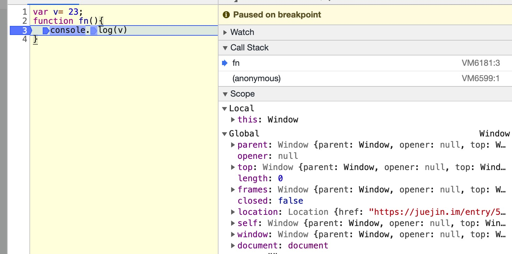
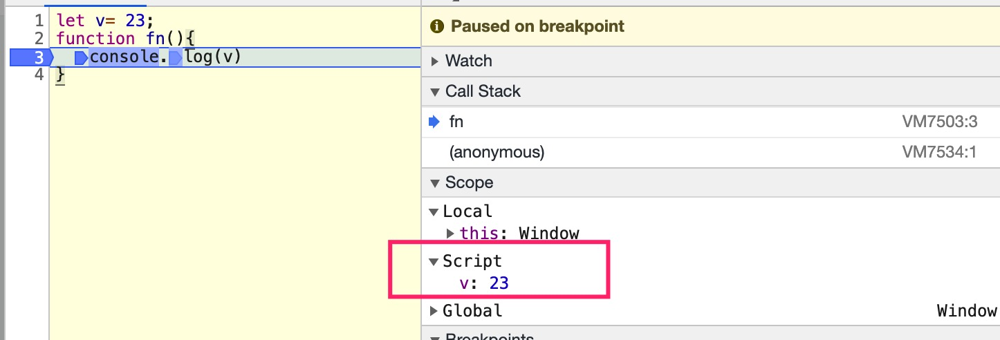

## 定义变量的方式有哪些？有什么区别？
js中定义变量的方式有三种：
1. var关键字：es6之前只有这种方式
2. let关键字：es6新增
3. const关键字：es新增，定义不变的变量

注意是讨论它们之间的区别，主要从一下几个方面开讨论：
1. 是否有变量提升
2. 是否可以在声明语句前使用
3. 是否可以重复声明
4. 是否形成块作用域
5. **全局声明的变量是否是全局对象window（浏览器）中属性**

### 变量重复声明的规则
编译器在编译代码的时候，当扫描到一个变量A的时候，会判断当前词法作用域中是否已经有A这个变量
- 如果没有就会新创建一个变量，命名为A。
- 如果已经存在一个同名的变量A1
  - 如果**A1是使用let定义的变量，那么就会直接报错（SyntaxError）**
  - 如果A1是var定义的变量，
    - **如果A是let定义的变量，也会报错（SyntaxError）**
    - **如果A是var定义的变量，就会直接将A忽略**
    - **如果A是函数声明，则会直接覆盖A1**
  - 如果A1是函数声明，A的表现和上面一样的
- const定义的变量和let的表现在重复声明上是一样的

```js
let a = 1;
let a = 3; // error
var a = 2; // error
function a(){}  // error

var b = 1;
var b = 3;  // 3
let b = 2;  // error
function b(){} //不报错

function c(){}
var c = 1; // 声明忽略
let c = 2; //error
function c(){let d = 23} // 覆盖
```  


### 1.var关键字
#### 1.1 var定义的变量存在变量提升，而且将变量创建和变量初始化一起提升
```js
console.log(a); //undefined
var a = 2;
```  

#### 1.2 var变量可以在声明语句之前访问
因为变量提升的时候，将变量初始化的过程也提升了，变量经过了初始化之后是可以访问的。

#### 1.3 var可以重复声明变量
从变量重复声明的规则中可知，var是可以声明重复变量的，但是也有一些限制：
1. **var只能重复声明使用var定义的变量或者函数声明**

```js
var a = 23;
var a = 34; //声明忽略，赋值正常
console.log(a);  //34

function b(){}
var b;
typeof b;  //function 

let c = 2;
var c; // SyntaxError
```  

#### 1.4 var不能形成块作用域
```js
var a = 1;
if(true){
  var a = 2;
}
console.log(a); //2
```  
如果形成了块作用域，那么{}内部的是变量a是不会影响外面的。所以这里没有形成块作用域。

#### 1.5 var声明的全局变量是全局对象中的一个属性
```js
var v = 23;
function fn(){
  console.log(v);
  console.log(window.v);
}
foo();
// 23
// 23
```  
打断点观察执行上下文：

可以看到在全局执行上下文的词法环境中，并没有v这个变量。而在window对象中有v这个属性。

实际上在**全局变量**中，
- **var定义的全局变量和全局函数声明都属于对象性环境记录（object environment record），会挂载在全局执行上下文中的window对象中作为一个属性，浏览器并不会为它单独创建一个词法环境。**
- **let或const创建的全局变量属于声明性环境记录（Declarative Environment Records），会在全局执行上下文的词法环境中为这些变量单独创建一个词法环境来存储，并且可以通过词法环境链来访问它们。**


### 2.let关键字
#### 2.1 let变量存在变量提升，但是提升的只有变量创建这一步，初始化并没有提前
具体的分析已经在“变量提升”相关文章里面谈过。let定义的变量也是无法逃过编译器扫描的。

#### 2.2 let变量不能在声明语句之前使用
因为let变量的提升中，并没有提升变量初始化的环节，所以在初始化之前是不可以访问的，这也就是常说的“**暂时性死区**”。
```js
function foo(){
  a = 2;
  let a = 1;
}
foo()  //ReferenceError: Cannot access 'a' before initialization
```  

#### 2.3 let不可以声明重复变量
let关键字不能重复声明已有的变量，无论该变量是var变量还是函数声明
```js
var a = 1;
let a = 2; //error

function b(){}
let b = 3; //error, Identifier 'b' has already been declared
```  

#### 2.4 let可以形成块作用域
```js
var a = 1;
if(true){
  let a = 2;
}
console.log(a); //1
```  
{}形成了独立的块作用域，不会修改外面a的值，所以输出是1.

#### 2.5 let声明的全局变量不是全局对象中的属性
```js
let v = 23;
function fn(){
  console.log(v);
  console.log(window.v);
}
foo();
// 23
// undefined
```
打断点看执行上下文：
  
可以看出，**在全局执行上下文中，为let定义的全局变量单独创建了一个词法环境，内部函数在执行的时候可以通过词法环境链来访问到这些变量。**


### 3.const关键字
const关键字的表现基本上和let是一致的
- 存在变量提升，也只提升变量创建的过程
- 不能在声明语句之前使用
- 不能重复定义
- 可以形成块作用域
- 声明的全局变量不是全局对象中的属性

和let不同的点在于，const是用来定义**常量**的，也就是说变量一旦经过初始化之后是不可以修改的。具体的原因是**因为const变量没有变量赋值的操作，只能在初始化的时候赋值。如果在声明语句中没有初始化赋值，就会报错（ let 则是默认初始化为undefined）**
```js
const a = 2;
a = 3; //TypeError: Assignment to constant variable

const b; //SyntaxError: Missing initializer in const declaration
```  


## 参考文章
1. [关于 const 和 let 声明的变量不在 window 上](https://github.com/Advanced-Frontend/Daily-Interview-Question/issues/30)


