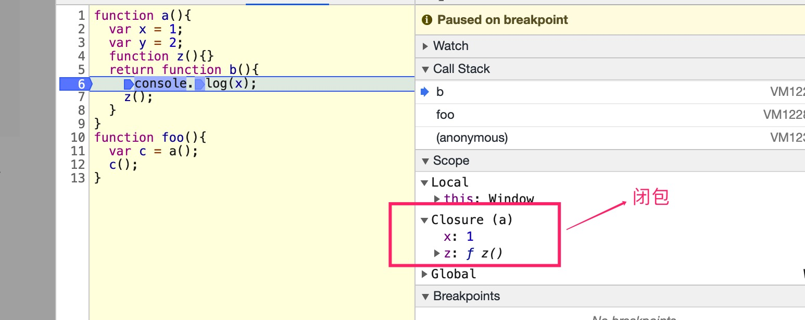

## 闭包是什么？有什么作用？
### 1.闭包的现象
先看一段代码：
```js
function foo(){
  var a=2;
  return function fun(){
    console.log(a);
  }
}
var b = foo();
b(); //2
```
在代码中，执行完foo()之后，**foo()函数执行上下文中的变量应该是会完全销毁的。但是事实上，当fun()函数执行的时候，还是可以拿到foo执行上下文中的a变量**，这种现象就是产生了闭包的现象。


### 2.闭包的定义

在《你不知道的JS》中，对**闭包的定义**是：

> **当函数可以记住并访问所在的词法作用域，即使函数是在当前词法作用域之外执行，这时就产生了闭包**。
>
> **闭包指的就是函数对这个被记住的词法作用域的引用**

目前来说，这个定义我认为是最标准的，也是最好理解的。

其实**从技术的角度看，所有的函数都会产生闭包**
```js
function foo() { 
  var a = 2;
  function bar() { 
    console.log( a ); // 2
  }
  bar(); 
}
foo();
```
根据词法作用域的定义，bar函数一定可以访问foo函数的词法作用域中的变量，也就是说bar函数可以引用foo的词法作用域，这也是满足闭包的定义的。

**和传统的闭包不同的是，bar函数并没有在外面来执行，而且直接在内部调用，调用之后对应的执行上下文就销毁了，对应的闭包也会销毁了，所以感受不到闭包的特征**。


### 3.闭包和执行上下文

```js
function a(){
  var x = 1;
  var y = 2;
  function z(){}
  return function b(){
    console.log(x);
    z();
  }
}
function foo(){
  var c = a();
  c();
}
foo();
```
执行上面的代码，打断点调试：


结合调试面板，来分析是闭包的**实现原理**：

1. 当函数a执行完成返回b的时候，会对b函数执行一个**预分析过程（并不是编译过程）**，分析函数b的词法作用域中使用到了函数a中的哪些变量，**这些变量的集合就是函数a的闭包**。当函数a的执行上下文从执行栈中弹出的时候，闭包这些变量不做GC，保存在内存中。
2. **在创建函数b的执行上下文的时候，会引用 函数a的闭包 建立关联**，后续执行的时候就可以通过作用域链来查找变量。


这里还有几个关键点需要说明一下：

1. 闭包中保存的并不会整个函数a的执行上下文信息，从上图执行栈中可以看出，**函数a执行完成之后，对应的执行上下文就已经从栈中弹出销毁了**。**闭包中保存的是在函数b中用到的变量的集合**。（按需保存）
2. 根据词法作用域和作用域链的特性，**闭包中的变量只能在被关联的函数中访问到**。


### 4.闭包的作用和缺陷

#### 4.1 使用闭包可以做到，从函数外面访问或者使用函数的内部变量
```js
function foo(){
  var a = 1;
  return function add(b){
    return a+b;
  }
}
var add = foo();
add(3);  //4
```
js模块化中大量使用闭包，正是因为闭包有这样的作用。可以**用创建的函数作用域的形式来隔离每个模块，模块使用闭包的方式暴露出公共的API，用来访问当前模块中的私有内容。**（IIFE）


#### 4.2 闭包的缺陷

**由于闭包使得本来应该销毁的变量暂时没有销毁，一直保存在内存中。所以使用闭包会导致内存消耗比较大，而且使用不小心的话会造成内存泄漏**。

所以在使用闭包的时候一定要小心，注意闭包的销毁时间。

**当引用闭包的函数销毁时，闭包中的资源也会销毁**。

所以在使用上尽可能在局部变量中引用闭包，这样造成内存泄漏的风险会小一些


### 参考文章

1. [浏览器工作原理和实践-李兵](https://time.geekbang.org/column/article/127495)


