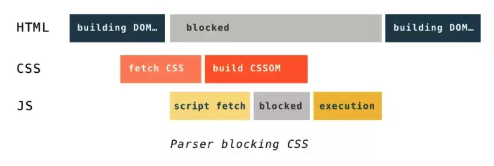

# 从URL到页面输出中间经历了哪些过程？

要做前端的性能优化，首先要弄清楚从输出url到页面输出这中间经历了哪些过程，然后针对每一个过程进行适当的优化。

## 1. 经历的过程

1. 请求DNS服务，对请求的域名进行解析，解析成IP的形式

2. 在传输层创建TCP连接，三次握手

3. 向请求地址发起GET请求

4. 服务器接收到请求之后返回响应报文

5. 浏览器拿到响应报文之后开始渲染页面，第一次请求一般返回的是一个html文件

   1. 浏览器解析html的响应报文，网络传输的都是字节数据，所以需要解析装换，最终生成一颗DOM Tree

   ```js
   Bytes -> Characters -> Tokens -> Nodes -> DOM
   ```

   2. 在解析DOM的过程中，如果遇到`link`标签，就会请求CSS文件，然后也进行解析，最终生成一颗CSSOM Tree

   ```js
   Bytes -> Characters -> Tokens -> Nodes -> CSSOM
   ```

   3. 在解析DOM的过程中，如果遇到`<script>`标签，会判断是否存在defer或async属性
      - 如果存在，会并行下载js文件，defer类型的js会在html解析完成之后顺序执行；async类型的js文件会在下载完之后立即执行
      - 如果不存在，则会**阻塞渲染流程（CSSOM和DOM）**，等js文件下载执行都完成之后，再开始后面的渲染流程
   4. 在这个过程中遇到媒体文件就会**并行**去下载文件
   5. DOM树和CSSOM树在渲染完成之后，会将两者合并成一颗Render Tree（layout tree），每个节点包含了元素的布局和样式信息
   6. 渲染引擎根据Render Tree中的节点信息，计算每个节点的大小和在当前图层的位置
   7. 根据节点的位置绘制Render Tree，计算页面像素信息
   8. 然后将图层的信息交给GPU，GPU会将各个图层进行合层处理（**composite**），显示在屏幕上


## 2. （*）解释一些结论

### 2.1 正常情况下，CSSOM Tree的构建不阻塞DOM Tree的构建，但是会阻塞Render Tree的合成

这是浏览器的一种优化手段，因为CSSOM Tree和DOM Tree的构建过程是相互独立的，所以可以并行执行。但是Render Tree和合成需要CSSOM Tree的参与，所以会阻塞。

### 2.2 CSSOM Tree的构建会阻塞js文件的执行

在js文件之前的css文件的加载和执行会阻塞js文件的执行，因为**js脚本的作用就是用来修改DOM Tree和CSSOM Tree，所以在执行js文件之前需要获取到之前的css文件生成的完整的CSSOM Tree。**

但是普通的js文件的下载和执行是会阻塞DOM Tree的解析的，所以就导致了一个现象，如果浏览器尚未完成CSSOM的下载和构建，而我们却想在此时运行脚本，那么浏览器将延迟脚本执行和DOM构建，直至其完成CSSOM的下载和构建。也就是说，**一旦有js文件的参与，CSSOM的构建是有可能会阻塞DOM的构建的，造成这种现象的原因是CSSOM的构建会阻塞js文件的执行**



### 2.3 页面并不是等完整的Render Tree构建完成之后再开始第一次渲染的

以前的时候，我都是认为浏览器需要等到页面完整的Render Tree构建完成之后，才会开始绘制整个页面。但是在html中又必须要把script标签放到body的最下面，以此来避免js阻塞页面。开始一直想不通为什么将script标签放在body的下面可以优化js文件的阻塞影响，因为觉得反正都是在Render Tree构建之后才会开始绘制，所以放哪里感觉都是一样的。

后面查资料才知道，浏览器在渲染页面的时候，并不是等待完整的Render Tree构建完成之后才开始绘制，因为这种方式是非常低效的，而且会导致很长一段时间的白屏。

在浏览器的eventLoop中，每次事件循环之后就会执行一次UI Render。**而在html parser的过程中，解析到了某个js脚本，但是这个脚本被CSS阻塞住了或者是还没有下载完成**，则会中断当前的解析Task，继续执行eventLoop的流程，此时就会执行一次UI Render，将当前的DOM Tree和CSSOM Tree合成一颗Render Tree，渲染出当前的页面.

所以整个浏览器的渲染过程，可以理解为是一个边解析边渲染的过程。


## 参考文章

1. [知己知彼——解锁浏览器背后的运行机制](https://juejin.im/book/5b936540f265da0a9624b04b/section/5bac3a4df265da0aa81c043c)
2. [输入 URL 到页面渲染的整个流程](https://juejin.im/book/5bdc715fe51d454e755f75ef/section/5bdc73e05188251719353031)
3. [从URL输入到页面展现到底发生什么？](https://juejin.im/post/5c7646f26fb9a049fd108380#heading-12)
4. [对浏览器首次渲染时间点的探究](https://juejin.im/post/5cbfc852f265da035378df3d)
5. [再谈 load 与 DOMContentLoaded](https://juejin.im/post/5b2a508ae51d4558de5bd5d1)
6. [css加载会造成阻塞吗？](https://juejin.im/post/5b88ddca6fb9a019c7717096)

